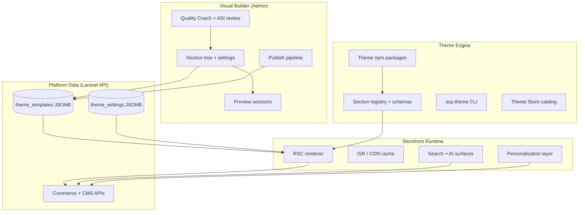

# ADR-017: Three-System Storefront Architecture

**Date:** 2026-07-12  
**Status:** Accepted  
**Deciders:** Stephen Musyoka Makola  
**Volume Reference:** Volume 6 — Theme Engine; Volume 4 — Design System

## Context

Traditional commerce platforms often merge **live storefront rendering**, **merchant visual editing**, and **theme framework** into one codebase. That coupling slows iteration: editor changes risk live-store regressions; theme updates require redeploying customer-facing runtime; performance tuning fights with builder features.

SCP's vision treats the storefront as a **living digital salesperson** — intelligent, fast, and independently evolvable. That requires explicit separation of concerns at the platform level.

## Decision

**Split SCP storefront presentation into three independent systems:**

| System | Responsibility | Runtime | Deploy cadence |
|--------|----------------|---------|----------------|
| **Storefront Runtime** | Customer-facing pages, search, checkout shell, AI widgets, personalization, performance | Next.js edge + origin | Weekly+ (perf-critical) |
| **Visual Builder** | Merchant drag-and-drop editing, preview, publish, quality coach, ASI suggestions UI | Next.js admin module | Bi-weekly |
| **Theme Engine** | Theme packages, section/block schemas, SDK, marketplace, portability mapping | npm packages + validation CI | Per theme release |

### Boundaries

**Rules:**

1. **Visual Builder never executes on the customer request path** — it writes draft/publish artifacts only.
2. **Theme Engine never calls Commerce business logic directly** — only via Storefront API contracts.
3. **Storefront Runtime never embeds admin/editor code** — lazy-loads AI and interactive sections within budget.
4. **Publish is atomic** — draft → live promotion with CDN purge; live traffic never reads half-written JSON.
5. **Theme package updates** flow through validation CI before merchants can install.

## Alternatives Considered

| Alternative | Pros | Cons | Why Rejected |
|-------------|------|------|--------------|
| Monolithic storefront + editor | Simpler Phase 1 | Coupling blocks ASI, perf, and marketplace scale | Violates long-term leapfrog vision |
| Headless-only (no visual builder) | Clean API | Nigerian SMEs need no-code customization | Market requirement |
| Theme Engine inside Runtime repo | Fewer repos | Theme marketplace and versioning blur | Developer ecosystem needs isolation |
| Visual Builder generates React code | Maximum flexibility | XSS, review nightmare, breaks portability | JSON schema + RSC is safer |

## Consequences

### Positive

- Optimize Runtime for LCP/INP without touching editor UX
- Ship Visual Builder features without customer-facing deploy risk
- Theme developers publish independently via Theme Store
- ASI can propose layout changes in Builder; Runtime applies only after merchant accept
- Clear ownership for security reviews (Runtime CSP vs Builder auth)

### Negative

- Three codebases to coordinate (Runtime app, Builder module, theme packages)
- Publish pipeline and preview protocol must stay in sync across systems
- Integration tests span admin → API → runtime render

### Neutral

- Shared design tokens (`@scp/design-tokens`) consumed by all three
- Shared section type IDs defined in Theme Engine registry

## Compliance Notes

- Customer PII processed in Runtime follows NDPA; Builder audit logs who published changes
- AI suggestions in Builder require merchant approval before live (ADR-019 ASI)

## References

- [Volume 6 Ch. 12 — Storefront Engine Eight Layers](../../06-theme-engine/12-storefront-engine-eight-layers.md)
- [Volume 6 Ch. 13 — Runtime, Builder & Theme Separation](../../06-theme-engine/13-runtime-visual-builder-separation.md)
- ADR-003, ADR-012, ADR-019
