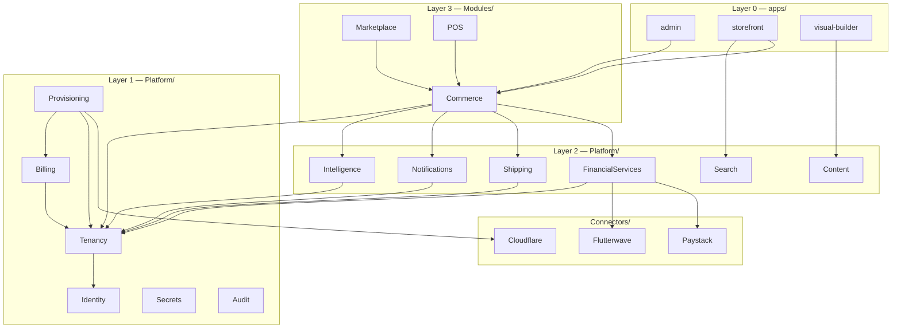

# Implementation Knowledge Graph

**Document ID:** SCP-META-KG-001  
**Version:** 1.0.0  
**Status:** ✅ Active  
**Purpose:** Dependency map for Cursor and engineers — read before cross-package work.

---

## 1. Platform Stack (Top-Down)



---

## 2. Commerce Internal Contexts

Inside `Modules/Commerce/` (Phase 1 — not separate installables):

```text
Catalog → Inventory → Cart → Checkout → Orders
                ↓              ↓
           Customers    FinancialServices (Platform)
                ↓              ↓
           Promotions      Notifications (Platform)
                ↓
            Shipping (Platform service + Connectors)
```

**Checkout** orchestrates Cart, Orders, FSL — owns no aggregate except optional session cache.

---

## 3. Event Flow (Critical Paths)

```text
TenantCreated (Tenancy)
    → Billing, Provisioning, Analytics

TenantProvisioned (Provisioning)
    → Commerce (seed), Intelligence (workspace), Themes

ProductCreated (Commerce/Catalog)
    → Search, Analytics, Intelligence

OrderPlaced (Commerce/Orders)
    → FSL, Inventory, Notifications, Webhooks, Analytics

OrderPaid (FSL)
    → Orders, Billing, Notifications, Webhooks, Integrations

CartAbandoned (Commerce/Cart)
    → Notifications, Intelligence
```

Full matrix: [Vol 3 Ch. 03 §6.3](../03-architecture/03-bounded-contexts-and-modules.md)

---

## 4. Package Dependency Table

| Package | Requires | Consumed by |
|---------|----------|-------------|
| `Platform/Kernel` | — | Everything |
| `Platform/Identity` | Kernel | Tenancy, all apps |
| `Platform/Tenancy` | Identity | All products/services |
| `Platform/Billing` | Tenancy | Provisioning, Commerce |
| `Platform/Provisioning` | Tenancy, Billing | All products (on enable) |
| `Platform/Secrets` | Kernel | Connectors, FSL |
| `Platform/FinancialServices` | Tenancy, Secrets | Commerce, Marketplace |
| `Platform/Notifications` | Tenancy | All products |
| `Platform/Intelligence` | Tenancy | Commerce, apps, AI/* |
| `Platform/Shipping` | Tenancy | Commerce |
| `Platform/Search` | Tenancy | Commerce, storefront |
| `Modules/Commerce` | Tenancy, Billing, FSL, Notifications | Marketplace, POS |
| `Modules/Marketplace` | Commerce, FSL | — |
| `Connectors/Paystack` | FSL contract | FSL only |
| `AI/CatalogAgent` | Intelligence | Commerce |

---

## 5. Documentation Dependency (What to Read First)

| Implementing… | Read first |
|---------------|------------|
| Identity login | ADR-006, Vol 3 Ch. 06, `Platform/Identity/docs/` |
| Product CRUD | Vol 5 Ch. 01, `Modules/Commerce/docs/` |
| Paystack checkout | ADR-004, ADR-019, Vol 5 Ch. 16–17, `Connectors/Paystack/docs/` |
| Storefront homepage | ADR-017, Vol 4 Ch. 13–14, Vol 6 Ch. 12 |
| Merchant onboarding | ADR-021, Vol 16 Ch. 09, `AI/OnboardingAgent/docs/` |
| Custom domain | ADR-022, Vol 16 Ch. 07, `Platform/Provisioning/docs/` |
| Plugin hook | Vol 12 Ch. 07, ADR-023 |

---

## 6. Phase 1 Critical Path

```text
Repository + CI
    → Identity
    → Tenancy + RLS
    → Billing
    → Provisioning (TPE)
    → FinancialServices + Paystack connector
    → Commerce (Catalog → Cart → Checkout → Orders)
    → apps/storefront + apps/admin
    → Notifications (email)
    → Launch gate (Vol 21 Ch. 12)
```

---

## 7. Maintenance

When adding a package:

1. Add row to §4 dependency table
2. Update mermaid in §1 if new layer crossing
3. Add "Read first" row in §5
4. Update [Platform OS Ch. 13](../03-architecture/13-platform-os-architecture.md) if new installable

---

## References

- [Platform OS Architecture](../03-architecture/13-platform-os-architecture.md)
- [Vol 21 Implementation Overview](../21-implementation-playbooks/01-implementation-overview.md)
