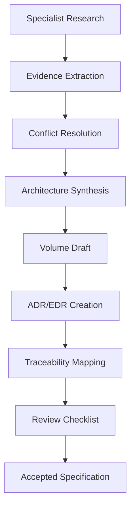

# SCP Research and Synthesis Program

**Document ID:** SCP-META-RESEARCH-001  
**Version:** 1.0.0  
**Status:** Active  
**Owner:** Sapphital Learning Company  
**Lead Architect:** Stephen Musyoka Makola  

---

## Purpose

The SAPPHITAL Commerce Platform (SCP) is being documented as an enterprise Commerce Operating System, not as a simple eCommerce application. This research program defines how evidence, specialist analysis, architectural decisions, module specifications, and implementation guidance are converted into the official engineering specification.

The goal is to produce a living engineering booklet that can eventually grow beyond 10,000 pages without becoming inconsistent, repetitive, or unreviewable.

---

## Core Commitment

Every major recommendation must be based on evidence and engineering reasoning.

SCP documentation must answer:

1. What problem are we solving?
2. Who experiences this problem?
3. How do successful platforms solve similar problems today?
4. What alternatives were considered?
5. Why is this choice right for SCP?
6. What are the tradeoffs?
7. What are the security, performance, cost, and operational implications?
8. How does the decision scale from 10 merchants to 100,000 merchants?
9. What acceptance criteria prove the design is complete?
10. What ADR records the decision?

No volume should rely on generic claims such as "best practice" without explaining the context and evidence.

---

## Platform Identity

SCP is defined as:

> An AI-native, multi-tenant, enterprise Commerce Operating System that enables merchants, marketplaces, institutions, and enterprises to operate digital commerce across storefronts, marketplaces, POS, mobile apps, AI agents, APIs, and integrated business systems.

This means SCP includes:

- SaaS eCommerce
- Multi-vendor marketplace
- CMS and page builder
- Theme engine
- Storefront builder
- POS
- Inventory and warehouse operations
- CRM and customer engagement
- Marketing automation
- Accounting and ERP integrations
- AI agents
- Developer platform
- API marketplace
- Mobile applications
- Analytics and business intelligence

Commerce is the core engine, but the long-term platform is broader than an online store.

---

## Specialist Research Tracks

The research program is divided into 20 specialist tracks. Each track produces source material that is synthesized into official volumes.

| Track | Specialist Area | Primary Volumes |
|-------|-----------------|-----------------|
| 01 | Market research and competitive positioning | Volume 2 |
| 02 | System architecture | Volume 3 |
| 03 | Commerce core engine | Volume 5 |
| 04 | Design system and UX | Volume 4 |
| 05 | Theme engine and storefront extensibility | Volume 6 |
| 06 | AI platform and agents | Volume 9 |
| 07 | Security and compliance | Volume 11 |
| 08 | Infrastructure, DevOps, and operations | Volumes 10, 14 |
| 09 | Developer platform, APIs, SDKs, webhooks | Volume 12 |
| 10 | Multi-tenancy, billing, plans, entitlements | Volume 7 and SaaS sections |
| 11 | Marketplace, vendors, commissions, payouts | Volume 8 |
| 12 | CMS, page builder, education commerce | Volume 7 |
| 13 | Payments, taxes, shipping, fulfillment | Volume 5 |
| 14 | Database, analytics, and reporting | Database and analytics sections |
| 15 | Testing, QA, and engineering standards | Volume 13 |
| 16 | Mobile, POS, and omnichannel | Future roadmap and commerce volumes |
| 17 | Automation, integrations, CRM, ERP, marketing | Developer and enterprise volumes |
| 18 | User journeys and onboarding | Volumes 1, 4, 5, 8, 12 |
| 19 | Documentation architecture and governance | Volume 0 |
| 20 | International standards, legal, privacy | Volumes 11, 14 |

---

## Evidence Standards

Research findings are classified by confidence level.

| Level | Name | Definition | Use |
|-------|------|------------|-----|
| E1 | Primary source | Official product docs, standards documents, legal/regulatory sources, engineering blogs from vendor | Can justify ADRs directly |
| E2 | Strong secondary source | Reputable analyst reports, conference talks, technical deep dives, benchmarks with methodology | Can support ADRs with caveats |
| E3 | Industry observation | Repeated patterns across successful products, practitioner experience, public product behavior | Useful for UX/product reasoning |
| E4 | Hypothesis | Plausible but not yet validated for SCP | Must be marked as assumption |

Every research-backed recommendation should include source URLs where possible.

When a statement cannot be verified, it must be marked as:

```text
Assumption: [statement]
Validation needed: [how to validate]
```

---

## Synthesis Workflow

Specialist outputs do not automatically become official documentation. They pass through a synthesis pipeline.



### 1. Evidence Extraction

Extract facts, product behavior, public benchmarks, standards, and cited sources.

### 2. Conflict Resolution

Different sources may recommend different patterns. Conflicts are resolved by asking:

- Which pattern best serves SCP's target users?
- Which pattern is simplest for the starting team?
- Which pattern scales without architectural rewrite?
- Which pattern minimizes security risk?
- Which pattern has the best operational cost profile?

### 3. Architecture Synthesis

Convert findings into SCP-specific guidance. Do not copy competitors blindly.

### 4. Volume Draft

Write the official Markdown volume using the standard page templates.

### 5. ADR/EDR Creation

Any decision that affects technology, module boundaries, data ownership, security, deployment, or extensibility requires an ADR.

### 6. Traceability Mapping

Map decisions back to:

- Product requirements (PRD)
- Functional requirements (FR)
- Non-functional requirements (NFR)
- Architecture decisions (ADR)
- Standards and compliance requirements

### 7. Review Checklist

Every completed chapter must pass the quality gate defined below.

---

## Documentation Quality Gate

Each official chapter must include, where applicable:

- Purpose
- Scope
- Out of scope
- User/business value
- Architecture impact
- Data ownership
- Business rules
- UI surfaces
- API surfaces
- Events
- Background jobs
- Security considerations
- Performance targets
- Observability requirements
- Test strategy
- Accessibility requirements
- Tenant isolation rules
- Operational implications
- Risks and tradeoffs
- Acceptance criteria
- Sources and references
- Related ADRs

If a section does not apply, it should explicitly say:

```text
Not applicable because [reason].
```

---

## Standard Module Template

Every business module must follow this structure:

```markdown
# Module: [Name]

## Document Control
## Purpose
## Scope
## Out of Scope
## User Personas
## Business Capabilities
## Domain Ownership
## Entities and Value Objects
## Aggregate Roots
## Business Rules
## State Machines
## User Journeys
## Admin Views
## Merchant Views
## Customer Views
## Vendor Views
## Mobile/POS Views
## JavaScript/Frontend Behavior
## API Contracts
## Domain Events
## Background Jobs
## Data Model
## Permissions and Authorization
## Tenant Isolation
## Security Threat Model
## Performance Requirements
## Caching Strategy
## Observability
## AI Opportunities
## Extension Points
## Testing Strategy
## Failure Modes
## Acceptance Criteria
## ADRs
## Sources
```

---

## Official Volume Map

The specification will expand beyond the initial 15 volumes into a larger enterprise set.

| Volume | Title | Purpose |
|--------|-------|---------|
| 00 | Governance, Principles, ADRs | Controls the documentation program |
| 01 | Vision and Product Strategy | Defines why SCP exists |
| 02 | Market Research and Technology Strategy | Evidence base and competitive analysis |
| 03 | System Architecture | Platform blueprint and architectural rules |
| 04 | SAPPHITAL Design System | UI/UX, tokens, components, accessibility |
| 05 | Commerce Core Engine | Products, cart, checkout, orders, inventory |
| 06 | Theme Engine | Storefront customization and theme marketplace |
| 07 | CMS and Page Builder | Pages, content, SEO, education commerce |
| 08 | Marketplace | Vendors, commissions, payouts, disputes |
| 09 | AI Platform | Agents, RAG, model gateway, safety, cost controls |
| 10 | Infrastructure and DevOps | Deployment, cloud, CI/CD, scaling |
| 11 | Security and Compliance | Threat models, controls, audits, standards |
| 12 | Developer Platform | APIs, SDKs, webhooks, plugins, CLI |
| 13 | Testing and Quality Engineering | Test strategy, CI gates, release quality |
| 14 | Operations and Reliability | Observability, incidents, runbooks, SLOs |
| 15 | Future Roadmap | POS, mobile, ERP, global expansion, 2030 vision |
| 16 | SaaS and Multi-Tenancy | Plans, billing, entitlements, tenant lifecycle |
| 17 | Database and Data Architecture | Schema, indexing, RLS, analytics, BI |
| 18 | Mobile and POS | React Native, POS, offline architecture |
| 19 | Automation and Integrations | Workflows, CRM, ERP, WhatsApp, marketing |
| 20 | Legal and Enterprise Readiness | NDPA, contracts, SLAs, certifications |
| 21 | Implementation Playbooks | Step-by-step build sequence and checklists |

The Docusaurus sidebar includes all 21 volumes.

---

## ADR and EDR Policy

SCP uses both ADRs and EDRs.

| Record Type | Purpose |
|-------------|---------|
| ADR | Architecture Decision Record for technical architecture |
| EDR | Engineering Decision Record for implementation standards, process, tooling, and team workflow |

Use ADRs for:

- Framework selection
- Database strategy
- Multi-tenancy model
- API style
- Event architecture
- Service extraction
- Security architecture
- Theme/plugin runtime

Use EDRs for:

- Folder structure
- Coding standards
- Testing rules
- Documentation conventions
- CI/CD quality gates
- Review policies

---

## Research Backlog

Initial research questions:

1. What makes Shopify's merchant onboarding effective, and what should SCP improve?
2. Which African payment providers should be first-class platform modules?
3. Should SCP expose REST first, GraphQL first, or both?
4. What is the right tenant isolation model for Phase 1 and enterprise tiers?
5. How should themes be sandboxed while supporting premium experiences?
6. What AI agent permissions are safe in commerce workflows?
7. Which data model supports products, digital goods, services, and courses without overfitting?
8. Which compliance obligations apply in Kenya, Africa-wide expansion, the EU, and the US?
9. What metrics prove merchant success beyond GMV?
10. What architecture supports a one-developer start and a fifty-engineer future?

---

## Immediate Next Synthesis Steps

1. Consolidate specialist research into **Volume 2: Market Research and Technology Strategy**.
2. Produce **Volume 3: System Architecture** with C4 diagrams and hard architectural rules.
3. Expand **Volume 4: SAPPHITAL Design System** beyond principles into tokens, components, and governance.
4. Rework the volume sidebar to include the expanded 20-volume enterprise map.
5. Create page templates for modules, ADRs, EDRs, user journeys, APIs, and data models.

---

## Non-Negotiable Rule

The documentation must remain useful to builders.

If a chapter sounds impressive but does not help an engineer, designer, product manager, security reviewer, or operator make a better decision, it must be rewritten.
