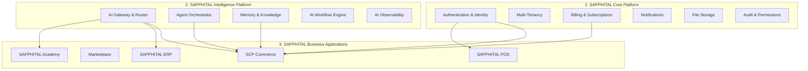

# Chapter 01: Mission & Vision

## Mission

**Empower every African business to compete globally through intelligent commerce.**

Sapphital Learning Company builds the SAPPHITAL Commerce Platform as **the commerce infrastructure for Africa** — not an "African Shopify." We solve African business problems: M-Pesa in Nairobi, bank transfer in Lagos, mobile money in Kampala, EFT in Johannesburg. Merchants receive local payments, sell through mobile money, operate across markets, handle local taxes, integrate regional logistics, and automate with AI — from one platform.

## Vision (10-Year Horizon)

> **SAPPHITAL Commerce becomes the Commerce Operating System for Africa — the infrastructure layer merchants, marketplaces, and developers build on — and a credible global alternative for emerging markets.**

By 2036, SCP will serve:

- **100,000+ active merchants** across Africa and emerging markets
- **Multiple sales channels** per merchant: online, mobile, POS, social, marketplace
- **An AI agent layer** that handles sales, support, inventory, and marketing autonomously
- **A theme and plugin ecosystem** where third-party developers build and sell extensions
- **A developer platform** with APIs, SDKs, and webhooks rivaling Shopify's partner ecosystem

## Strategic Positioning

SCP is **not marketed as "African Shopify."** It is **commerce infrastructure for Africa** — architecturally distinct from cloning a Western SaaS storefront. World-class influences inform quality; African market reality defines the product:

**The biggest differentiator:** We do not say "We support Stripe." We say **"We support Africa."**

Built in 2026 from zero with:

| Influence | What We Take |
|-----------|-------------|
| **Shopify** | Merchant experience, theme system, app ecosystem, checkout excellence |
| **Stripe** | Developer experience, API design, dashboard clarity, documentation quality |
| **Amazon** | Search, recommendations, marketplace mechanics, fulfillment logic |
| **Linear** | Admin UX minimalism, keyboard workflows, performance feel |
| **Apple** | Storefront design quality, whitespace, product storytelling |
| **Cloudflare** | Edge performance, security, global infrastructure |
| **OpenAI** | AI-native architecture, agent capabilities, multi-model support |

## What SCP Is

| SCP Is | SCP Is Not |
|--------|------------|
| Commerce infrastructure / OS for Africa | "African Shopify" feature parity chase |
| A multi-tenant SaaS platform | A single-store WordPress plugin |
| An AI-native commerce OS with Financial Services Layer | A traditional eCommerce script with payments hardcoded in checkout |
| A platform with extensible themes and plugins | A fixed-template website builder |
| API-first with multiple client surfaces | A monolithic admin + storefront app |
| Built for Africa, architected for global | An Africa-only niche product |
| A modular monolith with **Platform OS packages** | Premature microservices complexity |

## Platform vs. Product

SCP Commerce is one **business product** installed on the **SAPPHITAL Platform OS** — not a monolithic app with scattered domain folders. The platform separates **Kernel**, **Platform Services**, **Business Products**, **Connectors**, **Extensions**, **AI Skills**, and **Themes** into independently versioned packages (ADR-023). Commerce is **Office on Windows**; Identity and Billing are the kernel.

SCP is also one application on three SAPPHITAL platform layers:

**Long-term vision:** Africa's first **AI Business Operating System** — Intelligence built once, reused across every SAPPHITAL product.

## Core Value Propositions

### For Merchants

1. **Launch in minutes, not weeks** — AI-assisted store setup, product import, and theme selection
2. **Sell everywhere** — Online store, WhatsApp, Instagram, mobile app, POS from one dashboard
3. **Get paid the African way** — Mobile money first (M-Pesa, MTN MoMo, Airtel Money), bank transfer, EFT, wallets, then cards; smart gateway routing; offline cash and bank deposit
4. **AI that works for you** — Product descriptions, customer support, inventory forecasting, marketing campaigns
5. **Professional storefronts** — Agency-quality, vertically curated themes without hiring a developer

### For Customers

1. **Fast, beautiful shopping** — Sub-2-second page loads, mobile-first design
2. **Intelligent search** — Natural-language product discovery (“laptop for coding under ₦1,500,000” in Nigeria; localized to KES in Kenya)
3. **Trusted checkout** — Familiar local payment methods, order tracking, easy returns
4. **AI shopping assistant** — 24/7 help finding products, comparing options, tracking orders

### For Developers & Partners

1. **Comprehensive APIs** — REST, GraphQL, webhooks, SDKs
2. **Theme SDK** — Build and sell themes in a marketplace
3. **Plugin SDK** — Extend platform functionality without forking core
4. **Documentation quality** — Stripe-level docs with interactive examples

### For the Platform (Sapphital)

1. **Recurring SaaS revenue** — Subscription tiers with usage-based components
2. **Marketplace commission** — Revenue share on theme, plugin, and vendor sales
3. **Transaction fees** — Payment processing margin
4. **Enterprise contracts** — Custom deployments for large organizations

## Product Requirements

| ID | Requirement | Priority |
|----|-------------|----------|
| PRD-001 | Platform must support merchant self-service store creation in under 15 minutes | P0 |
| PRD-002 | Platform must provide AI-assisted onboarding (store setup, product import, theme selection) | P0 |
| PRD-003 | Platform must support African payment methods as first-class citizens | P0 |
| PRD-004 | Platform must deliver storefront pages with LCP ≤ 2.0s on 4G connections | P0 |
| PRD-005 | Platform must provide multi-channel selling (online, social, mobile, POS) | P1 |
| PRD-006 | Platform must include a theme marketplace with third-party developer support | P1 |
| PRD-007 | Platform must provide AI agents for sales, support, and operations | P1 |
| PRD-008 | Platform must support multi-vendor marketplace mode | P1 |
| PRD-009 | Platform must expose comprehensive developer APIs and SDKs | P1 |
| PRD-010 | Platform must support enterprise deployment options (dedicated tenant) | P2 |

## Strategic Constraints

1. **Initial team size:** Small (1–5 engineers) — architecture must be operable by a small team
2. **Initial market:** Nigeria (primary) and West Africa — optimize for Paystack/Flutterwave, NDPA compliance, Naira; Kenya as parallel East Africa launch
3. **Budget:** Bootstrap-friendly infrastructure — no Kubernetes day one
4. **Timeline:** MVP in 3 months, full platform in 18–24 months
5. **Existing assets:** Laravel expertise, React/Next.js experience, AI integration capability

## Decision Log

| Date | Decision | Rationale |
|------|----------|-----------|
| 2026-07-12 | AI-native, not AI-enhanced | Differentiation; 2026 is the inflection point for AI in commerce |
| 2026-07-12 | Africa-first, global-ready | Underserved market with specific payment/logistics needs |
| 2026-07-12 | Commerce Infrastructure for Africa (not African Shopify) | Defensible positioning; FSL + regional engines vs feature clone |
| 2026-07-12 | Financial Services Layer (ADR-019) | Gateway adapters, smart routing, split payments, ledger |
| 2026-07-12 | SAPPHITAL Intelligence Platform (ADR-020) | AI OS kernel; not chatbot; three-platform ecosystem |
| 2026-07-12 | AI-guided merchant onboarding (ADR-021) | Seven-phase onboarding; three flows |
| 2026-07-12 | Tenant Provisioning Engine (ADR-022) | Business provisioning; multi-store; wildcard DNS; async saga |
| 2026-07-12 | Platform OS (ADR-023) | Products + Platform Services + Connectors; `Platform/` / `Modules/` layout; Module Manager |
| 2026-07-12 | Platform approach over single product | Enables SCP, POS, ERP, Academy on shared core |
| 2026-07-12 | Modular monolith over microservices | Small team, faster iteration, extraction path preserved |
