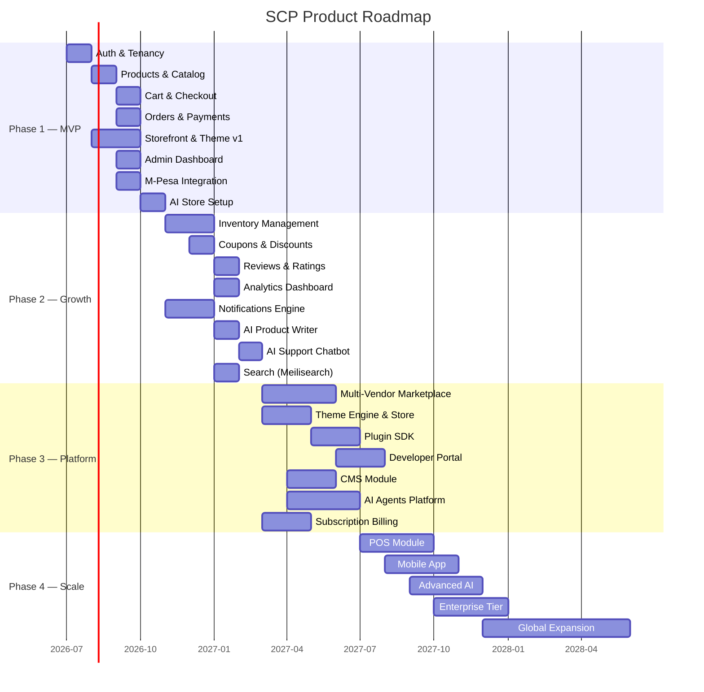

# Chapter 08: Product Roadmap

## Roadmap Philosophy

This roadmap follows the **modular monolith → selective extraction** strategy. Each phase delivers a usable product increment while building toward the full platform vision.

**Principles:**

- Ship working software every phase — no "foundation only" phases
- Each phase has clear success criteria tied to Chapter 07 metrics
- Architecture decisions in early phases must not block later phases
- AI capabilities increase in depth with each phase, not just breadth

---

## Phase Overview

---

## Phase 1: MVP — "Launch" (Months 1–4)

**Goal:** Merchants can create a store, add products, and accept M-Pesa payments in under 15 minutes.

### Deliverables

| Module | Features | Volume Reference |
|--------|----------|-----------------|
| **Identity & Tenancy** | Phone/email registration, OTP, tenant creation, RBAC | Vol 3, Vol 7 |
| **Product Catalog** | Products, variants, categories, images, collections | Vol 5 |
| **Shopping Cart** | Add/remove/update, persistent cart, guest + auth | Vol 5 |
| **Checkout** | Single-page checkout, address, shipping selection | Vol 5 |
| **Orders** | Order creation, status workflow, order history | Vol 5 |
| **Payments** | M-Pesa STK Push, payment confirmation, refunds | Vol 5, Vol 10 |
| **Storefront** | Homepage, product page, collection page, cart, checkout | Vol 4, Vol 6 |
| **Theme v1** | 3 built-in themes, basic customization (colors, logo) | Vol 6 |
| **Admin Dashboard** | Products, orders, customers, settings, basic analytics | Vol 4 |
| **AI Store Setup** | AI onboarding wizard, product description generation | Vol 9 |
| **Landing Page** | Marketing site for SCP platform itself | Vol 7 |

### Success Criteria

- [ ] 50 beta merchants onboarded
- [ ] Store activation rate ≥ 60%
- [ ] Time to launch ≤ 15 minutes
- [ ] M-Pesa payment success rate ≥ 95%
- [ ] Storefront LCP ≤ 2.0s on 4G
- [ ] Zero critical security vulnerabilities

### Technical Milestones

- [ ] Modular monolith deployed on single server (Docker Compose)
- [ ] PostgreSQL + Redis + Meilisearch running
- [ ] CI/CD pipeline with automated tests
- [ ] Laravel Octane enabled for API
- [ ] Next.js storefront with ISR

---

## Phase 2: Growth — "Scale Merchants" (Months 5–8)

**Goal:** Merchants have full business management tools. Platform handles 500+ active merchants.

### Deliverables

| Module | Features | Volume Reference |
|--------|----------|-----------------|
| **Inventory** | Stock tracking, low-stock alerts, multi-location | Vol 5 |
| **Coupons** | Percentage/fixed discounts, usage limits, expiry | Vol 5 |
| **Reviews** | Product reviews, ratings, moderation | Vol 5 |
| **Analytics** | Sales dashboard, product performance, traffic sources | Vol 5 |
| **Notifications** | Email, SMS, push, in-app, webhook dispatch | Vol 3 |
| **Search** | Full-text search, filters, autocomplete, AI semantic search | Vol 3, Vol 9 |
| **AI Product Writer** | Bulk description generation, SEO optimization | Vol 9 |
| **AI Support** | Customer chatbot, order tracking, FAQ | Vol 9 |
| **Additional Payments** | Paystack, Flutterwave, Airtel Money, COD | Vol 5 |
| **Customer Accounts** | Registration, order history, wishlist, addresses | Vol 5 |
| **Shipping** | Delivery zones, flat rate, weight-based, local couriers | Vol 5 |

### Success Criteria

- [ ] 500 active merchants
- [ ] $1M GMV/month
- [ ] Merchant retention M3 ≥ 50%
- [ ] AI feature adoption ≥ 40%
- [ ] Search success rate ≥ 70%
- [ ] 99.9% uptime

---

## Phase 3: Platform — "Ecosystem" (Months 9–14)

**Goal:** SCP becomes a platform with marketplace, theme store, plugin ecosystem, and developer APIs.

### Deliverables

| Module | Features | Volume Reference |
|--------|----------|-----------------|
| **Multi-Vendor Marketplace** | Vendor onboarding, commissions, payouts, vendor portal | Vol 8 |
| **Theme Engine** | Theme SDK, section/block editor, theme store, live preview | Vol 6 |
| **Plugin SDK** | Hook system, plugin marketplace, sandbox | Vol 12 |
| **Developer Portal** | API docs, SDK downloads, sandbox tenants, CLI | Vol 12 |
| **CMS** | Pages, blog, navigation, SEO, media library | Vol 7 |
| **Subscription Billing** | Plan management, usage metering, invoicing | Vol 7 |
| **AI Agents** | Autonomous sales, support, inventory, marketing agents | Vol 9 |
| **GraphQL API** | Storefront GraphQL API for headless commerce | Vol 12 |
| **Webhooks** | Event subscription, retry, delivery logs | Vol 12 |

### Success Criteria

- [ ] 2,000 active merchants
- [ ] 10+ third-party themes published
- [ ] 5+ plugins in marketplace
- [ ] 50+ marketplace vendors
- [ ] $10M GMV/month
- [ ] Developer portal live with ≥ 100 registered developers

---

## Phase 4: Scale — "Enterprise" (Months 15–24)

**Goal:** SCP serves enterprise clients, supports POS, mobile apps, and global expansion.

### Deliverables

| Module | Features | Volume Reference |
|--------|----------|-----------------|
| **POS** | In-store sales, barcode scanning, receipt printing, offline mode | Future product |
| **Mobile App** | React Native customer app, merchant app | Vol 3 |
| **Advanced AI** | Inventory forecasting, dynamic pricing, fraud detection | Vol 9 |
| **Enterprise Tier** | Dedicated tenant, SLA, custom integrations, SSO | Vol 7, Vol 10 |
| **Global Expansion** | Multi-region deployment, additional currencies/languages | Vol 3, Vol 10 |
| **Warehouse Management** | Pick/pack/ship, bin locations, transfer orders | Vol 5 |
| **Advanced Reporting** | Custom reports, data export, BI integration | Vol 5 |
| **Service Extraction** | Search, AI, Notifications as independent services | Vol 3, Vol 10 |

### Success Criteria

- [ ] 10,000 active merchants
- [ ] $50M GMV/month
- [ ] 10 enterprise clients
- [ ] 99.95% uptime
- [ ] Mobile app published on iOS + Android
- [ ] Expansion to 3+ African regions

---

## Feature Priority Matrix

| Feature | Phase | Priority | Persona | Dependencies |
|---------|-------|----------|---------|-------------|
| Phone OTP auth | 1 | P0 | Amina | — |
| Product CRUD | 1 | P0 | Amina, James | Auth |
| M-Pesa checkout | 1 | P0 | Amina, David | Cart, Orders |
| AI store setup | 1 | P0 | Amina | Auth, Products |
| Storefront themes | 1 | P0 | Amina, David | Products |
| Admin dashboard | 1 | P0 | All merchants | All Phase 1 |
| Inventory tracking | 2 | P1 | James | Products |
| AI chatbot | 2 | P1 | David | Orders, Products |
| Semantic search | 2 | P1 | David | Meilisearch, AI |
| Multi-vendor | 3 | P1 | Fatima | Auth, Products, Orders, Payments |
| Theme SDK | 3 | P1 | Grace | Theme Engine |
| Plugin SDK | 3 | P2 | Grace | Module architecture |
| POS | 4 | P2 | James | Products, Orders, Payments |
| Mobile app | 4 | P2 | David | API-first architecture |

---

## Risk Register

| Risk | Impact | Probability | Mitigation |
|------|--------|-------------|------------|
| M-Pesa API changes | High | Medium | Abstract payment gateway; adapter pattern |
| Solo developer bottleneck | High | High | Modular architecture enables future team scaling |
| Shopify enters Africa aggressively | Medium | Low | Deep local integration moat; AI differentiation |
| Infrastructure costs exceed revenue | High | Medium | Start with single-server Docker; scale on revenue |
| AI costs per tenant too high | Medium | Medium | Multi-model routing; cache common queries; usage limits per tier |
| Security breach | Critical | Low | OWASP ASVS from day one; regular audits; bug bounty (Phase 3) |

---

## Documentation Roadmap Alignment

| Volume | Author By | Depends On |
|--------|-----------|------------|
| Volume 2: Market Research | Before Phase 1 dev | Volume 1 ✅ |
| Volume 3: Architecture | Before Phase 1 dev | Volume 1 ✅ |
| Volume 4: Design System | Before Phase 1 UI | Volume 1, 3 |
| Volume 5: Commerce Engine | During Phase 1 | Volume 3 |
| Volume 6: Theme Engine | Before Phase 3 | Volume 3, 4 |
| Volume 7: CMS | Before Phase 3 | Volume 3 |
| Volume 8: Marketplace | Before Phase 3 | Volume 5 |
| Volume 9: AI Platform | During Phase 1 | Volume 3 |
| Volume 10: Infrastructure | Before Phase 1 deploy | Volume 3 |
| Volume 11: Security | Before Phase 1 deploy | Volume 3 |
| Volume 12: Developer Platform | Before Phase 3 | Volume 3, 5 |
| Volume 13: Testing | During Phase 1 | Volume 3, 5 |
| Volume 14: Operations | Before Phase 1 deploy | Volume 10 |
| Volume 15: Future Roadmap | After Phase 2 | All volumes |
