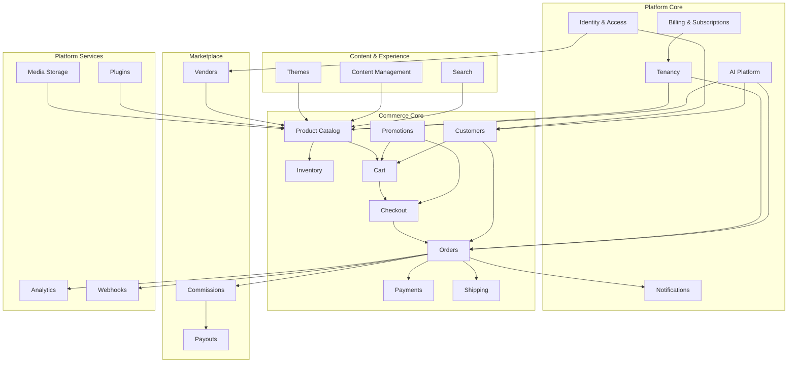
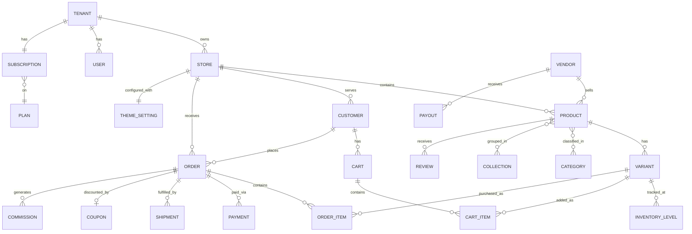

# Chapter 10: Domain Model Overview

The domain model defines the core business entities and their relationships. This is the conceptual foundation that Volume 3 (Architecture) implements and Volume 5+ (Commerce Engine) details.

---

## Domain Map

SCP is organized into bounded contexts. Each context owns its entities and exposes interfaces to other contexts.

---

## Core Entities

### Platform Core

| Entity | Description | Key Attributes |
|--------|-------------|----------------|
| **Tenant** | Merchant organization | id, name, plan, status, settings, domain |
| **User** | Platform user (admin, staff) | id, tenant_id, email, phone, role, status |
| **Plan** | Subscription tier | id, name, price, features, limits |
| **Subscription** | Tenant's active plan | id, tenant_id, plan_id, status, period |
| **Role** | Permission group | id, tenant_id, name, permissions[] |
| **AuditLog** | Immutable action record | id, tenant_id, user_id, action, entity, timestamp |

### Commerce Core

| Entity | Description | Key Attributes |
|--------|-------------|----------------|
| **Store** | Single commerce storefront | id, tenant_id, name, domain, currency, timezone |
| **Product** | Sellable item | id, store_id, title, description, status, type |
| **Variant** | Product configuration | id, product_id, sku, price, options, weight |
| **Category** | Product classification | id, store_id, name, parent_id, position |
| **Collection** | Curated product group | id, store_id, title, rules, products[] |
| **InventoryLevel** | Stock count per location | id, variant_id, location_id, available, reserved |
| **Cart** | Shopping session | id, store_id, customer_id, items[], expires_at |
| **CartItem** | Item in cart | id, cart_id, variant_id, quantity, price |
| **Order** | Completed purchase | id, store_id, customer_id, status, total, currency |
| **OrderItem** | Line item in order | id, order_id, variant_id, quantity, price, status |
| **Payment** | Financial transaction | id, order_id, gateway, amount, status, reference |
| **Shipment** | Delivery record | id, order_id, carrier, tracking, status |
| **Customer** | Store shopper | id, store_id, email, phone, name, addresses[] |
| **Coupon** | Discount code | id, store_id, code, type, value, limits, expiry |
| **Review** | Product review | id, product_id, customer_id, rating, body, status |

### Content & Experience

| Entity | Description | Key Attributes |
|--------|-------------|----------------|
| **Theme** | Store visual package | id, name, version, author, config, assets |
| **ThemeSetting** | Merchant theme customization | id, store_id, theme_id, settings (JSON) |
| **Page** | CMS content page | id, store_id, title, slug, body, template, status |
| **Navigation** | Menu structure | id, store_id, name, items[] |
| **Media** | Uploaded file | id, tenant_id, filename, url, mime, size |

### Marketplace

| Entity | Description | Key Attributes |
|--------|-------------|----------------|
| **Vendor** | Marketplace seller | id, tenant_id, name, status, commission_rate |
| **VendorProfile** | Public vendor info | id, vendor_id, description, logo, rating |
| **Commission** | Platform fee on sale | id, order_id, vendor_id, rate, amount |
| **Payout** | Vendor payment | id, vendor_id, amount, status, period |
| **Dispute** | Order dispute | id, order_id, reason, status, resolution |

---

## Entity Relationship Diagram (Core Commerce)

---

## Domain Events

Modules communicate asynchronously through domain events. These are immutable records of things that happened.

### Commerce Events

| Event | Publisher | Subscribers |
|-------|-----------|-------------|
| `ProductCreated` | Catalog | Search, Analytics, AI |
| `ProductUpdated` | Catalog | Search, Cache |
| `InventoryChanged` | Inventory | Catalog, Analytics, AI |
| `CartAbandoned` | Cart | Notifications, Analytics, AI |
| `OrderPlaced` | Orders | Payments, Inventory, Notifications, Analytics, Webhooks, AI |
| `OrderPaid` | Payments | Orders, Notifications, Analytics, Webhooks |
| `OrderShipped` | Shipping | Orders, Notifications, Webhooks |
| `OrderDelivered` | Shipping | Orders, Notifications, Analytics |
| `OrderCancelled` | Orders | Payments, Inventory, Notifications, Webhooks |
| `PaymentReceived` | Payments | Orders, Billing, Analytics |
| `PaymentFailed` | Payments | Orders, Notifications |
| `RefundIssued` | Payments | Orders, Analytics, Webhooks |
| `ReviewSubmitted` | Reviews | Catalog, Notifications, AI |

### Platform Events

| Event | Publisher | Subscribers |
|-------|-----------|-------------|
| `TenantCreated` | Tenancy | Billing, Analytics, AI |
| `TenantUpgraded` | Billing | Tenancy, Analytics |
| `UserRegistered` | Identity | Notifications, Analytics |
| `VendorApproved` | Marketplace | Notifications, Catalog |
| `PayoutProcessed` | Marketplace | Notifications, Analytics, Webhooks |

---

## Aggregate Roots

In DDD terms, these entities are aggregate roots — the entry points for business operations within their boundary.

| Aggregate | Root Entity | Consistency Boundary |
|-----------|-------------|---------------------|
| Product Aggregate | Product | Product + Variants + Media |
| Cart Aggregate | Cart | Cart + CartItems |
| Order Aggregate | Order | Order + OrderItems + Payments |
| Tenant Aggregate | Tenant | Tenant + Users + Settings |
| Vendor Aggregate | Vendor | Vendor + Profile + Commission rules |
| Theme Aggregate | Theme | Theme + Settings + Assets |

**Rule:** External modules reference aggregate roots by ID only. They never modify internal entities directly.

---

## Value Objects

Immutable objects with no identity, defined by their attributes:

| Value Object | Attributes | Used In |
|-------------|-----------|---------|
| **Money** | amount (integer, cents), currency (ISO 4217) | Pricing, Orders, Payments |
| **Address** | line1, line2, city, state, postal_code, country | Customer, Order, Shipment |
| **PhoneNumber** | country_code, number (E.164) | User, Customer |
| **Email** | address (validated) | User, Customer |
| **SKU** | code (unique per store) | Variant |
| **Slug** | value (URL-safe, unique per store) | Product, Page, Collection |
| **Percentage** | value (0–100, 2 decimal) | Coupon, Commission |
| **DateRange** | start, end (ISO 8601) | Coupon, Promotion, Analytics |
| **GeoCoordinate** | latitude, longitude | Shipping zone, Store location |
| **Weight** | value, unit (g, kg, lb, oz) | Variant, Shipping |

---

## Module → Domain Mapping

Each domain module (Volume 5+) maps to one or more bounded contexts:

| Module (Volume 5+) | Bounded Context | Aggregate Roots |
|--------------------|-------------------|-----------------|
| Product Catalog | Catalog | Product |
| Inventory | Inventory | InventoryLevel |
| Cart | Cart | Cart |
| Checkout | Checkout | (orchestrates Cart, Order) |
| Orders | Orders | Order |
| Payments | Payments | Payment |
| Shipping | Shipping | Shipment |
| Customers | Customers | Customer |
| Promotions | Promotions | Coupon |
| Reviews | Reviews | Review |
| Themes | Themes | Theme |
| CMS | Content | Page |
| Marketplace | Marketplace | Vendor |
| Analytics | Analytics | (read-only projections) |

---

## Requirements

| ID | Requirement | Priority |
|----|-------------|----------|
| FR-020 | All entities must include tenant_id for multi-tenant isolation | P0 |
| FR-021 | All financial values must use Money value object (integer cents) | P0 |
| FR-022 | All domain events must be immutable and include timestamp + tenant context | P0 |
| FR-023 | All aggregate roots must enforce invariants within their boundary | P0 |
| FR-024 | Cross-module communication must use events or published interfaces only | P0 |
| FR-025 | All entities must support soft delete with 30-day recovery window | P1 |

---

## Next Steps

This domain model is expanded in:

- **Volume 3:** System architecture, service boundaries, data flow
- **Volume 5:** Detailed entity schemas, business rules, state machines
- **Volume 8:** Marketplace-specific domain extensions
- **Volume 9:** AI platform integration points per domain

Each subsequent volume must trace its entities and events back to this domain model.
