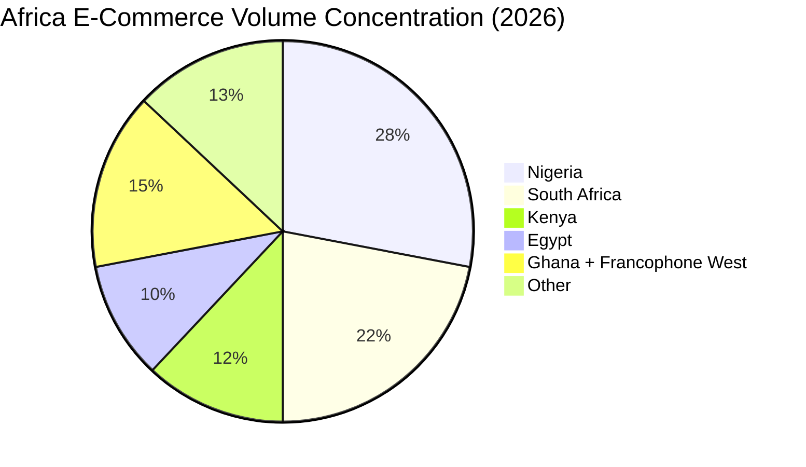
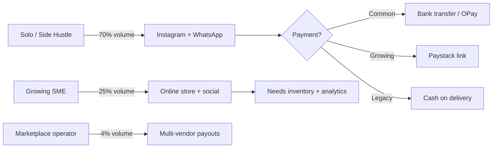

# Chapter 01: Commerce Landscape 2026

**Document ID:** SCP-MR-002-01  
**Version:** 1.0.0  
**Status:** ✅ Active  
**Traceability:** PRD-003, PRD-011, PRD-015; NFR-071, NFR-078; Volume 1 Chapter 03

---

## 1. Purpose

Establish an evidence-based view of the African and Nigerian digital commerce market in 2026. This chapter grounds SCP's geographic strategy, segment prioritization, and technology investments in verifiable market data—not generic "Africa is rising" narratives.

## 2. Scope

**In scope:**

- Africa-wide and Nigeria-specific market sizing (2026 baseline)
- Growth drivers: mobile, fintech, social commerce, logistics
- Merchant segment analysis aligned with Volume 1 tenant tiers
- Infrastructure realities affecting platform design (connectivity, payments, fulfillment)
- Implications for SCP product and technology priorities

**Out of scope:**

- Detailed competitor feature matrices (Chapters 02–03)
- Payment integration specifications (Chapter 04)
- Technology stack decisions (Chapters 05–07)

---

## 3. Africa Digital Commerce — 2026 Baseline

Analyst estimates for Africa e-commerce market size vary significantly due to methodology differences (B2C vs B2B inclusion, informal social commerce, cross-border). SCP treats ranges as planning inputs, not single-point forecasts.

| Source | 2025/2026 Estimate | Forecast | CAGR | Confidence |
|--------|-------------------|----------|------|------------|
| IMARC Group | USD 360.7B (2025) | USD 1,142.2B by 2034 | 13.25% | E2 |
| MarkWide Research | USD 58.4B (2026) | USD 236.3B by 2035 | 16.8% | E2 |
| Volume 1 (Statista ref.) | USD 75B by 2028 | — | — | E2 |

**Synthesis for SCP planning:** Use **USD 55–65B** as the conservative 2026 Africa B2C+B2B digital commerce addressable base (E2), with Nigeria, South Africa, Kenya, and Egypt as volume concentration markets (E2, MarkWide).

*Note: Percentages are planning estimates (E3) derived from analyst regional emphasis, not audited national statistics.*

---

## 4. Nigeria — Primary Market Deep Dive

Nigeria is SCP's **Phase 1 primary market** per Volume 1 Chapter 03 and ADR-011.

### 4.1 Market Size

| Metric | Value | Source | Confidence |
|--------|-------|--------|------------|
| Nigeria e-commerce market 2026 | USD 8.7B – 10.5B | MarkWide; Research and Markets | E2 |
| CAGR 2026–2031 | 12.2% – 17.4% | Research and Markets; MarkWide | E2 |
| Mobile share of online orders | >80% | Research and Markets | E2 |
| B2C share (2025) | 86.4% | Research and Markets | E2 |
| B2B digital commerce CAGR | 18.14% | Research and Markets | E2 |

Nigeria's scale—220M+ population, 40M+ MSMEs (SMEDAN, cited Volume 1)—makes it the largest English-language commerce opportunity in Africa for a SaaS platform launch.

### 4.2 Structural Growth Drivers

| Driver | Evidence | SCP Implication |
|--------|----------|-----------------|
| **Mobile-first commerce** | >80% orders via mobile (E2) | Mobile-first admin + storefront; NFR-001 LCP on 4G |
| **NIBSS instant payments** | Real-time bank transfers via NIBSS (E2, MarkWide) | Bank transfer as first-class checkout method |
| **Fintech rails** | Paystack, Flutterwave, OPay, PalmPay dominance (E1/E2) | Native PSP modules, not plugins |
| **Social/conversational commerce** | WhatsApp, Instagram as discovery/checkout (E2, E3) | Omnichannel APIs, shareable product links |
| **Cashless policy** | CBN cashless initiatives (E2) | Digital payment default; COD optional |
| **Logistics density in Lagos** | Superior last-mile economics in Lagos State (E2) | Courier integrations; address validation APIs |
| **Naira volatility** | FX and settlement friction (E3, Channels TV industry commentary) | Multi-currency architecture; settlement transparency |

### 4.3 Nigeria Merchant Reality

**Key insight (E3):** Most Nigerian merchants already sell digitally via social channels before adopting a formal store. SCP's onboarding must **import existing catalogs** (CSV, WhatsApp product lists, Instagram) rather than assume greenfield setup—supporting PRD-002 (AI-assisted onboarding).

---

## 5. Kenya & East Africa — Secondary Corridor

Kenya launches in parallel once Nigeria operational readiness is proven (Volume 1 Chapter 03).

| Factor | Kenya Data | Confidence |
|--------|------------|------------|
| M-Pesa adult penetration | 90%+ (Volume 1) | E2/E3 |
| Mobile internet users | 45M+ | E2 |
| MSMEs | 7.4M (KNBS 2024, Volume 1) | E2 |
| eCommerce YoY growth | 25%+ (Volume 1) | E2 |

**Strategic sequencing:** Nigeria first for regulatory registration (NDPA/NDPC), payment depth (NIBSS + Paystack/Flutterwave), and team market proximity. Kenya second for M-Pesa-native differentiation and East Africa expansion template.

---

## 6. Merchant Segments & SCP Tier Mapping

Aligned with Volume 1 Chapter 03 segments:

| Segment | % Base (est.) | Revenue Range | SCP Tier | Primary Pain | Volume 2 Research Finding |
|---------|---------------|---------------|----------|--------------|---------------------------|
| Solo entrepreneurs | 70% | $0–$2K/mo | Free/Starter | Professional store without developer | Social-to-store migration is #1 onboarding job |
| Growing SMEs | 25% | $2K–$50K/mo | Business | Inventory, analytics, automation | Outgrow spreadsheets at ~50 SKUs |
| Marketplace operators | 4% | $10K–$500K/mo | Marketplace | Vendor payouts, disputes | Jumia model rejected—merchants want owned customers |
| Enterprise | 1% | $500K+/mo | Enterprise | SLA, residency, integrations | Deferred to Phase 3–4 |

---

## 7. Total Addressable Market (TAM) — SCP Serviceable

| Layer | Estimate | Basis | Confidence |
|-------|----------|-------|------------|
| African SME merchants (digital-ready) | ~3M | IFC/World Bank; Volume 1 | E2 |
| Nigeria digital-ready merchants | ~800K–1.2M | SMEDAN + fintech adoption (E3 estimate) | E3 |
| Kenya digital-ready merchants | ~500K | KNBS + Volume 1 | E2 |
| SCP Year 5 merchant target | 50,000 active | Volume 1 revenue model | E4 (goal) |
| Platform conversion (3% of serviceable) | Achievable at scale | Shopify Africa analog | E4 |

**Assumption:** SCP captures merchants upgrading from social-only selling and local scripts (legacy PHP SaaS builders, WooCommerce self-hosted), not displacing entrenched Shopify global merchants in Year 1.

**Validation needed:** Beta cohort conversion rates; payment completion rates by method.

---

## 8. Infrastructure Constraints Affecting Technology Choices

| Constraint | Nigeria Impact | Kenya Impact | SCP Response |
|------------|----------------|--------------|--------------|
| Intermittent 3G/4G | High | Moderate | NFR-058; JS budget ≤150KB; SSR |
| Power outages | High | Moderate | Idempotent APIs; optimistic UI with retry |
| Addressing gaps | High (outside Lagos) | Moderate | Phone-based delivery; landmark fields |
| Settlement delays | 1–5 day FX cycles (E3) | M-Pesa near-instant | Webhook-driven order state; payout dashboards |
| Device mix | Android-dominant | Android-dominant | NFR-054–NFR-056 |
| Data residency | NDPA §41–43 | Kenya DPA §48–50 | ADR-011 Nigeria-primary hosting |

---

## 9. 2026 Commerce Trends Relevant to SCP

| Trend | Global Evidence | Africa/Nigeria Manifestation | SCP Priority |
|-------|-----------------|------------------------------|--------------|
| **AI-native admin** | Shopify Sidekick multi-step execution (E1) | Low local competition | P0 — core differentiator |
| **Agentic commerce** | Shopify agentic commerce roadmap 2026 (E1) | WhatsApp bot selling already informal | P1 — AI agents with tools |
| **Headless/composable** | commercetools, Medusa growth (E2) | Developer agencies only | P2 — API-first, not headless-only |
| **Embedded finance** | BNPL, wallet growth Nigeria (E2) | OPay, PalmPay wallets | P1 — wallet checkout |
| **Social checkout** | TikTok Shop, Instagram shops (E2) | Dominant in Nigeria | P1 — product links, UTM, social pixels |
| **B2B digitization** | 18% CAGR Nigeria B2B (E2) | Wholesale platforms | P2 — Phase 2 B2B catalog |

---

## 10. Architecture Impact

| Decision Area | Research Conclusion | ADR/NFR |
|---------------|---------------------|---------|
| Primary region | Nigeria (Lagos) production | ADR-011, NFR-071 |
| Currency | NGN, USD, KES, GHS at launch | NFR-078 |
| Mobile performance | Non-negotiable | NFR-001 – NFR-012 |
| Payment methods | African-first module set | PRD-003, ADR-004 |
| Onboarding | Social import + AI setup | PRD-001, PRD-002 |
| Marketplace | Multi-vendor without Plus pricing | PRD-008, PRD-020 |

---

## 11. Risks and Tradeoffs

| Risk | Likelihood | Impact | Mitigation |
|------|------------|--------|------------|
| Market size overestimation | Medium | High | Conservative revenue model; segment-level tracking |
| Naira devaluation affects GMV | High | Medium | USD reporting option; FX transparency |
| Logistics failures damage trust | High | High | Courier SLA tracking; merchant education |
| Regulatory change (NDPA, CBN) | Medium | High | Volume 11 compliance framework; legal review |
| Slow Kenya launch | Medium | Low | Nigeria proof first; shared multi-currency core |

---

## 12. Acceptance Criteria

Volume 2 Chapter 01 is complete when:

- [ ] Nigeria market sizing documented with ≥2 independent E2 sources
- [ ] Segment-to-tier mapping traceable to Volume 1 PRDs
- [ ] Infrastructure constraints mapped to ≥5 NFRs
- [ ] No unsubstantiated market claims without confidence level
- [ ] Quarterly refresh schedule documented in Volume 2 README

---

## 13. Engineering Principles Compliance

| Principle | Compliance |
|-----------|------------|
| UX First | Mobile-first segment research drives performance budgets |
| Performance | 3G/4G constraints explicitly tied to NFR targets |
| API-First | Social/omnichannel trends require API-consumable catalog |
| AI Native | AI admin trend identified as primary differentiation window |
| Multi-Tenant | Segment scale projections inform tenancy model (ADR-002) |
| Secure by Default | NDPA/residency constraints documented for Nigeria launch |

---

## 14. Sources

| # | Source | URL | Confidence |
|---|--------|-----|------------|
| 1 | IMARC Group — Africa E-Commerce Market | https://www.imarcgroup.com/africa-e-commerce-market | E2 |
| 2 | MarkWide Research — Africa E-Commerce 2026–2036 | https://markwideresearch.com/africa-e-commerce-market | E2 |
| 3 | MarkWide Research — Nigeria E-Commerce 2026–2036 | https://markwideresearch.com/e-commerce-in-nigeria-market | E2 |
| 4 | Research and Markets — Nigeria E-Commerce 2026–2031 | https://www.researchandmarkets.com/reports/5601277/nigeria-e-commerce-market-share-analysis | E2 |
| 5 | Volume 1 — Target Markets | `docs/01-vision/03-target-markets.md` | E1 (internal) |
| 6 | ADR-011 — Data Residency Africa | `docs/00-meta/adr/011-data-residency-africa.md` | E1 (internal) |
| 7 | Nigeria NDPA | https://ndpc.gov.ng/ | E1 |
| 8 | KNBS Kenya MSME statistics | https://www.knbs.or.ke/ | E2 |

---

## 15. Related Documents

- Volume 1 Chapter 03: Target Markets
- Volume 1 Chapter 06: Competitive Positioning
- Chapter 03: Competitive Analysis — Africa & Nigeria
- Chapter 04: Payment & Fintech Strategy
- Chapter 09: Strategic Positioning & Differentiation
