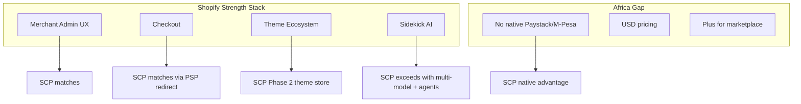
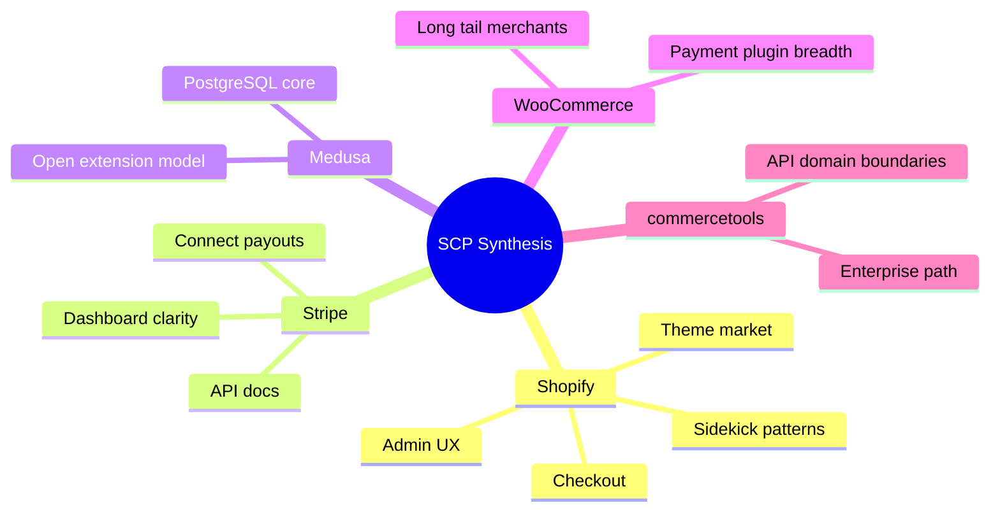

# Chapter 02: Competitive Analysis — Global Platforms

**Document ID:** SCP-MR-002-02  
**Version:** 1.0.0  
**Status:** ✅ Active  
**Traceability:** PRD-016, PRD-017, PRD-019; NFR-001, NFR-003; ADR-001, ADR-003

---

## 1. Purpose

Analyze global commerce platforms that set buyer and developer expectations for SCP. This chapter extracts **what to match**, **what to exceed**, and **what to deliberately not compete on** in Year 1, with evidence from official product documentation and public benchmarks.

## 2. Scope

**In scope:** Shopify, Stripe (commerce-adjacent), commercetools, Medusa, WooCommerce, BigCommerce, Saleor, VTEX, Ecwid.

**Out of scope:** Africa-specific local platforms (Chapter 03); SCP differentiation synthesis (Chapter 09).

---

## 3. Evaluation Dimensions

SCP scores competitors on dimensions that matter for Nigeria-primary, Africa-ready SaaS:

| Dimension | Weight | Rationale |
|-----------|--------|-----------|
| Merchant admin UX | 20% | PRD-016 — Shopify bar |
| Storefront quality & performance | 15% | NFR-001; Apple-influenced design target |
| Developer experience (APIs, docs) | 15% | Stripe bar; Volume 12 target |
| Extensibility (themes, apps) | 15% | Long-term moat |
| African payment fit | 15% | PRD-003, PRD-017 |
| AI commerce maturity | 10% | PRD-007, PRD-018 |
| Total cost of ownership (SMB) | 10% | PRD-019 |

---

## 4. Platform Profiles

### 4.1 Shopify

**Position:** Global SMB-to-mid-market SaaS commerce leader.

| Attribute | Detail | Confidence |
|-----------|--------|------------|
| Pricing (Basic) | From USD 39/month + transaction fees | E1 |
| Themes | 800+; Liquid templating | E1 |
| Checkout | Shopify Checkout (highly optimized) | E1 |
| AI — Sidekick | Multi-step admin tasks, store context, app extensions preview (Winter 2026) | E1 |
| APIs | REST Admin API, Storefront API, GraphQL | E1 |
| Africa payments | No native M-Pesa; Paystack via third-party apps | E3 |

**Strengths for SCP to match:**

- Onboarding flow completeness (store setup wizard)
- Theme marketplace economics
- Checkout conversion optimization
- Sidekick-style AI embedded in admin with **action execution**

**Weaknesses SCP exploits:**

- USD-centric pricing (PRD-019)
- African payment methods require paid apps
- Multi-vendor requires Shopify Plus (~USD 2,300+/mo)

**Sources:** https://www.shopify.com/pricing, https://help.shopify.com/en/manual/shopify-admin/productivity-tools/sidekick, https://www.shopify.com/news/winter-26-edition-renaissance

---

### 4.2 Stripe

**Position:** Payments and developer infrastructure; commerce via Stripe Checkout, Billing, Connect.

| Attribute | Detail | Confidence |
|-----------|--------|------------|
| Developer docs | Industry benchmark for clarity and examples | E1 |
| Checkout | Hosted Checkout; Elements for embedded | E1 |
| Connect | Marketplace splits and payouts | E1 |
| Africa | Paystack subsidiary for Nigeria/Ghana/Kenya | E1 |
| Full commerce | No native catalog, themes, or merchant admin | E1 |

**SCP takeaway:** Emulate Stripe's **API documentation quality** and **dashboard information architecture**; use Stripe Checkout as global card fallback; do not try to be payments-only.

**Sources:** https://stripe.com/docs, https://stripe.com/gb/connect

---

### 4.3 commercetools

**Position:** Enterprise composable commerce (MACH: Microservices, API-first, Cloud-native, Headless).

| Attribute | Detail | Confidence |
|-----------|--------|------------|
| Target | Enterprise retailers, USD 100K+ annual contracts typical | E2 |
| Architecture | API-only; frontend agnostic | E1 |
| African fit | No local payments; implementation partners required | E3 |
| Strength | Extreme scale, multi-brand, complex B2B | E1 |

**SCP takeaway:** Adopt **composable API boundaries** inside modular monolith (ADR-001); defer commercetools-style full headless-only posture for SMB segment.

**Sources:** https://commercetools.com/, https://docs.commercetools.com/

---

### 4.4 Medusa

**Position:** Open-source headless commerce framework (Node.js).

| Attribute | Detail | Confidence |
|-----------|--------|------------|
| License | MIT open source | E1 |
| Stack | Node.js, PostgreSQL, Redis | E1 |
| Admin | Medusa Admin (improving; still developer-oriented) | E1 |
| Themes | No native theme marketplace; BYO frontend | E1 |
| AI (2026) | MCP server, Bloom assistant for dev workflows | E1 |
| Africa | Community payment providers; no first-class Paystack/M-Pesa | E3 |

**SCP takeaway:** Medusa validates PostgreSQL + Redis + headless API pattern; SCP differentiates with **merchant-ready admin**, **theme engine (ADR-003)**, and **African payments**.

| Capability | Medusa | SCP |
|------------|--------|-----|
| Merchant self-serve admin | Partial | Full (target) |
| Theme marketplace | ❌ | Phase 2 |
| M-Pesa native | ❌ | ✅ |
| AI for merchants | Dev-focused (Bloom) | Merchant agents |
| Team size to operate | Requires dev agency | Solo merchant |

**Sources:** https://medusajs.com/, https://docs.medusajs.com/

---

### 4.5 WooCommerce

**Position:** WordPress plugin; largest installed base globally.

| Attribute | Detail | Confidence |
|-----------|--------|------------|
| Cost | Free plugin; hosting + extensions cost | E1 |
| Flexibility | 59,000+ plugins (WordPress ecosystem) | E1 |
| UX | Dated admin; theme inconsistency | E3 |
| Security | Merchant responsible for patching, hosting | E3 |
| Africa | Paystack/Flutterwave plugins available | E3 |
| Performance | Variable; plugin bloat common | E3 |

**SCP takeaway:** Win merchants who are **tired of hosting and security** burden; offer SaaS simplicity with WooCommerce-level payment flexibility via native modules.

**Sources:** https://woocommerce.com/, https://wordpress.org/plugins/woocommerce/

---

### 4.6 BigCommerce

**Position:** Mid-market to enterprise SaaS; strong B2B features.

| Attribute | Detail | Confidence |
|-----------|--------|------------|
| Pricing | From ~USD 39/mo; no transaction fees on higher tiers | E1 |
| Strength | Multi-storefront, B2B quoting | E1 |
| Weakness | Complex onboarding; US-centric | E3 |
| Africa | Limited local payment story | E3 |

**SCP takeaway:** B2B quoting and multi-storefront are Phase 2+ references; not Year 1 competition target.

---

### 4.7 Saleor

**Position:** GraphQL-first open-source headless commerce (Python/Django heritage).

| Attribute | Detail | Confidence |
|-----------|--------|------------|
| API | GraphQL-native | E1 |
| Audience | Developers, composable teams | E1 |
| Admin | Dashboard exists; not Shopify-polished | E3 |
| Africa | No native African payments | E3 |

**SCP takeaway:** GraphQL Storefront API in Phase 2 (per engineering principles); REST-first for MVP.

---

### 4.8 VTEX

**Position:** Latin America enterprise marketplace and commerce platform.

| Attribute | Detail | Confidence |
|-----------|--------|------------|
| Strength | Marketplace-native, regional dominance | E1 |
| Model | Enterprise contracts | E2 |
| Africa | Minimal presence | E3 |

**SCP takeaway:** Marketplace payout and commission patterns are reference material for Volume 8.

---

### 4.9 Ecwid

**Position:** Embeddable commerce widget; freemium entry.

| Attribute | Detail | Confidence |
|-----------|--------|------------|
| Strength | Fastest embed into existing site | E1 |
| Weakness | Limited platform depth | E1 |
| Africa | Basic payment plugins | E3 |

**SCP takeaway:** SCP loses embed-only simplicity battles; wins full-platform merchants.

---

## 5. Comparative Matrix

| Platform | Admin UX | Storefront | API/DX | Extensibility | Africa Pay | AI | SMB TCO | Weighted |
|----------|----------|------------|--------|---------------|------------|-----|---------|----------|
| Shopify | 9.5 | 9.0 | 8.5 | 9.5 | 3.0 | 8.5 | 5.0 | 7.8 |
| Stripe | N/A | 6.0 | 10.0 | 5.0 | 6.0 | 4.0 | 7.0 | 6.4 |
| commercetools | 6.0 | 8.0 | 9.0 | 8.0 | 2.0 | 5.0 | 2.0 | 5.6 |
| Medusa | 5.5 | 7.0 | 8.0 | 6.0 | 3.0 | 6.0 | 8.0 | 6.0 |
| WooCommerce | 5.0 | 6.0 | 6.0 | 9.0 | 6.0 | 3.0 | 7.0 | 6.1 |
| BigCommerce | 7.5 | 8.0 | 7.5 | 7.0 | 3.0 | 6.0 | 5.0 | 6.4 |
| **SCP Target** | **9.0** | **9.0** | **8.5** | **8.0** | **9.5** | **9.0** | **8.5** | **8.8** |

*Scores are engineering assessment (E3) for strategic planning, not audited benchmarks.*

---

## 6. Checkout & PCI Comparison

| Platform | Default Checkout Model | PCI Scope for Merchant | SCP Alignment |
|----------|---------------------|------------------------|---------------|
| Shopify | Hosted Shopify Checkout | SAQ A eligible | Match — ADR-004 |
| WooCommerce | Self-hosted + plugins | Often SAQ A-EP or higher | SCP avoids |
| Medusa | Custom frontend | Depends on integration | SCP PSP redirect default |
| Stripe Checkout | Fully hosted | SAQ A | SCP uses for global cards |

---

## 7. Developer Ecosystem Comparison

| Capability | Shopify | Medusa | WooCommerce | SCP (Target) |
|------------|---------|--------|-------------|--------------|
| Theme language | Liquid | React (BYO) | PHP templates | React + JSON (ADR-003) |
| Plugin runtime | Ruby/Rails apps | Node modules | WordPress hooks | Laravel hooks |
| CLI | Shopify CLI | medusa-cli | wp-cli | SCP CLI (Phase 2) |
| Webhooks | ✅ | ✅ | ✅ | ✅ |
| Sandbox stores | Dev stores | Local dev | Local/staging | Tenant sandbox |
| API versioning | Dated releases | Semver | Plugin-dependent | `/api/v1/` semver |

---

## 8. What SCP Learns From Each Platform

---

## 9. Architecture Impact

| Research Finding | SCP Decision | ADR |
|------------------|--------------|-----|
| Monolith-first at scale | Modular monolith | ADR-001 |
| Headless without admin fails SMB | Full-stack SaaS | — |
| Liquid themes dated for React teams | React + JSON themes | ADR-003 |
| Hosted checkout minimizes PCI | PSP redirect default | ADR-004 |
| GraphQL valuable but not MVP-critical | REST Phase 1; GraphQL Phase 2 | Engineering principles |

---

## 10. Risks

| Risk | Mitigation |
|------|------------|
| Shopify ships deep Africa payment partnerships | Accelerate Paystack/Flutterwave native depth |
| Medusa captures developer mindshare | Superior merchant UX + Africa payments |
| Feature parity trap | Focus Year 1 on onboarding, payments, AI, performance |

---

## 11. Acceptance Criteria

- [ ] ≥8 global platforms profiled with E1/E2 sources
- [ ] Weighted comparison matrix completed
- [ ] Each platform mapped to SCP match/exceed/ignore strategy
- [ ] ADR cross-references for checkout, themes, architecture

---

## 12. Sources

| # | Source | URL |
|---|--------|-----|
| 1 | Shopify Pricing | https://www.shopify.com/pricing |
| 2 | Shopify Sidekick Help | https://help.shopify.com/en/manual/shopify-admin/productivity-tools/sidekick |
| 3 | Shopify Winter 2026 Edition | https://www.shopify.com/news/winter-26-edition-renaissance |
| 4 | Stripe Documentation | https://stripe.com/docs |
| 5 | commercetools Documentation | https://docs.commercetools.com/ |
| 6 | Medusa Documentation | https://docs.medusajs.com/ |
| 7 | WooCommerce | https://woocommerce.com/ |
| 8 | BigCommerce Pricing | https://www.bigcommerce.com/essentials/pricing/ |
| 9 | Saleor | https://saleor.io/ |
| 10 | ADR-001 Modular Monolith | `docs/00-meta/adr/001-modular-monolith-over-microservices.md` |
| 11 | ADR-003 Theme Engine | `docs/00-meta/adr/003-theme-engine-react-json-schema.md` |
| 12 | ADR-004 Checkout PSP | `docs/00-meta/adr/004-checkout-psp-redirect-saq-a.md` |

---

## 13. Related Documents

- Chapter 03: Africa & Nigeria Competitive Analysis
- Chapter 06: Backend & Frontend Stack Decisions
- Chapter 08: AI Commerce Market Opportunity
- Volume 1 Chapter 06: Competitive Positioning
