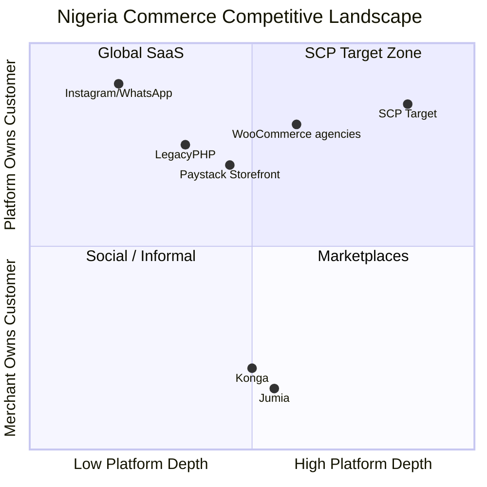
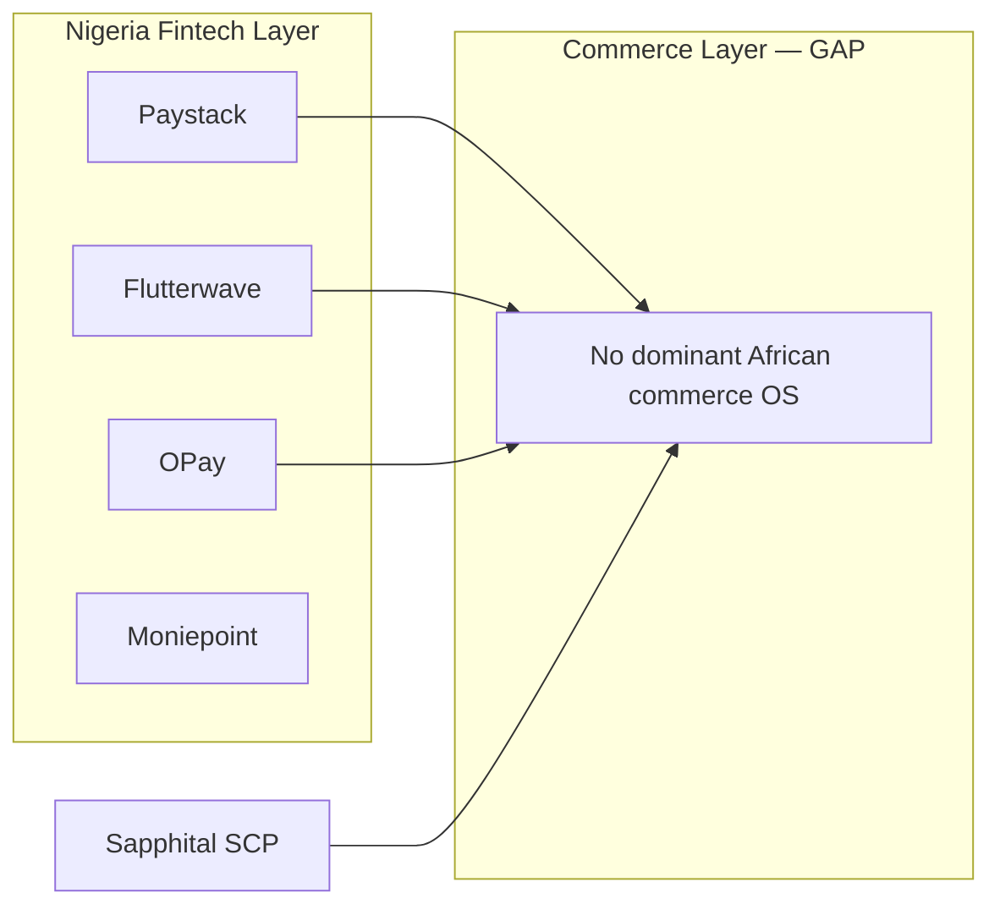

# Chapter 03: Competitive Analysis — Africa & Nigeria

**Document ID:** SCP-MR-002-03  
**Version:** 1.0.0  
**Status:** ✅ Active  
**Traceability:** PRD-003, PRD-017, PRD-020; NFR-083, NFR-084; ADR-004, ADR-011

---

## 1. Purpose

Document the African and Nigerian commerce competitive landscape: local platforms, marketplace operators, fintech ecosystems, and structural gaps SCP is positioned to fill. Nigeria is analyzed as the **primary** competitive arena; Kenya/East Africa as **secondary**.

## 2. Scope

**In scope:** Paystack ecosystem, Flutterwave, Jumia, Konga, local SaaS (legacy PHP builders, Storefront, etc.), agency-built WooCommerce, social-selling tools.

**Out of scope:** Global platform deep dives (Chapter 02); payment integration specs (Chapter 04).

---

## 3. Nigeria Commerce Competitive Map

---

## 4. Marketplace Operators

### 4.1 Jumia

| Attribute | Detail | Confidence |
|-----------|--------|------------|
| Model | First-party + third-party marketplace | E1 |
| Commission | Reported 10–15%+ category-dependent | E2/E3 |
| Logistics | Jumia Logistics network | E1 |
| Merchant control | Platform owns customer relationship | E1 |
| SaaS store | No independent merchant SaaS | E1 |
| AI | Limited merchant-facing AI | E3 |

**SCP positioning:** Merchants who reject marketplace commission and customer lock-in. SCP offers **owned storefront + optional marketplace mode** (Volume 8).

### 4.2 Konga

| Attribute | Detail | Confidence |
|-----------|--------|------------|
| Model | Marketplace (Yudala merger heritage) | E1 |
| Focus | Nigeria electronics, general merchandise | E2 |
| Seller tools | Seller portal; not full commerce OS | E3 |

**SCP positioning:** Same as Jumia—merchant-owned commerce with better economics.

---

## 5. Local SaaS & Scripts

### 5.1 Legacy PHP multi-tenant scripts (and similar)

| Attribute | Detail | Confidence |
|-----------|--------|------------|
| Model | Self-hosted multi-vendor script | E3 |
| Price | Low one-time license | E3 |
| UX | Dated admin UI | E3 |
| API | Limited or absent | E3 |
| AI | None | E3 |
| Payments | Basic Paystack/Flutterwave integration | E3 |
| Hosting | Merchant manages server | E3 |

**SCP win scenario:** Agency or merchant outgrows script—needs SaaS reliability, APIs, AI, modern UX.

### 5.2 WooCommerce + Agency Implementations

Common pattern in Lagos/Abuja SME segment (E3):

- WordPress + WooCommerce on local hosting
- Paystack plugin for payments
- Custom theme by agency (₦200K–₦2M project)
- No ongoing SaaS; maintenance burden on merchant

**SCP win scenario:** Merchant tired of plugin conflicts, security updates, slow mobile performance.

### 5.3 Paystack Commerce Adjacent Tools

Paystack ecosystem (E1/E2):

| Product | Function | SCP Relationship |
|---------|----------|------------------|
| Paystack Checkout | Payment links, hosted checkout | Integrate as PSP; compete on full commerce |
| Paystack Terminal | In-person payments | Future POS integration |
| Paystack Commerce (if expanded) | Payment-first | SCP = commerce OS; Paystack = rail |

Paystack processes **200,000+ businesses** (E2) and achieved **group profitability in 2026** with **12x volume growth** since Stripe acquisition (E2). SCP merchants are Paystack's customers too—partnership > competition.

**Sources:** https://techeconomy.ng/paystack-turns-profitable-records-12x-payment-volume-growth-since-stripe-acquisition/, https://paystack.com

---

## 6. Fintech as Competitive Infrastructure

African commerce competition is increasingly **fintech-led**:

| Player | Strength | Commerce Ambition | SCP Response |
|--------|----------|-------------------|--------------|
| **Paystack** (Stripe) | Developer UX, NG/GH/KE/CI/ZA | Payments + financial services | Deepest PSP integration |
| **Flutterwave** | Cross-border, enterprise | Infrastructure + Mono open banking | Secondary PSP + payouts |
| **Moniepoint** | Agent banking, SME dominance | Financial OS for SMEs | Wallet/checkout integration |
| **OPay** | Consumer wallet scale | Super-app | Wallet checkout module |
| **PalmPay** | Wallet, consumer | Payments | Wallet checkout module |

**Gap (E3):** No African-built platform combines Shopify-grade merchant UX, native fintech depth, and AI-native operations at SMB pricing. Fintechs optimize **money movement**; SCP optimizes **merchant operations + money movement**.

---

## 7. Kenya / East Africa Competitive Notes

| Player | Model | SCP Angle |
|--------|-------|-----------|
| Jumia Kenya | Marketplace | Same owned-store positioning |
| Copia | Agent/network commerce | Different segment (rural distribution) |
| WooCommerce agencies | Custom builds | Same SaaS upgrade path |
| M-Pesa integrators | Payment APIs | Native STK Push (PRD-012) |
| Shopify + plugins | Global SaaS | M-Pesa native beats plugin |

Kenya's **M-Pesa 90%+ penetration** (Volume 1) makes payment integration depth the primary competitive gate—not admin feature count.

---

## 8. Feature Gap Analysis — Nigeria

| Capability | Jumia | Legacy PHP scripts | WooCommerce | Paystack-only | SCP Target |
|------------|-------|---------|-------------|---------------|------------|
| Owned customer data | ❌ | ✅ | ✅ | Partial | ✅ |
| Multi-vendor marketplace | ✅ | ✅ | Plugin | ❌ | ✅ |
| Native Paystack | N/A | Basic | Plugin | ✅ | ✅ Deep |
| Native Flutterwave | N/A | Basic | Plugin | ❌ | ✅ |
| OPay/PalmPay wallet | ❌ | ❌ | Plugin | Partial | ✅ |
| AI store setup | ❌ | ❌ | ❌ | ❌ | ✅ |
| AI support agent | ❌ | ❌ | Plugin | ❌ | ✅ |
| Theme marketplace | ❌ | Basic | ✅ | ❌ | Phase 2 |
| Mobile admin | Partial | ❌ | Plugin | ✅ | ✅ |
| NDPA-ready privacy | Partial | ❌ | ❌ | ✅ | ✅ |
| API-first | Partial | ❌ | ✅ | ✅ | ✅ |
| Sub-2s mobile LCP | ❌ | ❌ | Rare | N/A | ✅ |

---

## 9. Pricing Competitive Landscape — Nigeria

| Option | Year 1 Cost (est.) | Hidden Costs | SCP Advantage |
|--------|-------------------|--------------|---------------|
| Jumia seller | Commission 10–15%+ | Ads, logistics fees | Lower commission; owned store |
| WooCommerce agency | ₦500K–₦2M setup | Hosting, maintenance, plugins | SaaS ₦5K–₦15K/mo |
| Shopify Basic | ~₦60K/mo + FX | USD volatility, apps | NGN pricing; local payments included |
| Legacy PHP license | ₦50K–₦150K one-time | Server, security, dev | Managed SaaS |
| **SCP Starter** | **₦5K–₦15K/mo target** | Transparent | AI + payments + hosting |

*FX conversions approximate (E3); PRD-019 requires SCP ≤30% of equivalent Shopify tier.*

---

## 10. Go-to-Market Competitor Responses

| Competitor Move | SCP Counter |
|-----------------|-------------|
| Jumia reduces commission | Emphasize customer ownership + lower total cost |
| Paystack expands commerce features | Partner on rails; differentiate on AI + marketplace |
| Shopify adds Nigeria payments | Already years behind on NGN pricing + NDPA residency |
| Moniepoint adds online store | Full theme + marketplace + developer ecosystem |

---

## 11. User Research Signals (E3/E4)

Practitioner observations from Nigerian merchant workflows:

1. **Trust:** Merchants trust Paystack brand more than unknown platforms → display "Payments by Paystack" badge
2. **WhatsApp:** Order management still happens in WhatsApp → SCP admin must support WhatsApp-shareable product links and order notifications
3. **COD:** Still requested in peri-urban areas → support but discourage via digital incentives
4. **Agencies:** Lagos agencies resell WooCommerce → agency partner program (Volume 12)
5. **Education sellers:** Courses + physical goods hybrid → Volume 7 education commerce

**Validation needed:** 50-merchant beta interviews in Lagos/Abuja; win/loss tracking.

---

## 12. Architecture Impact

| Gap | SCP Module | Phase |
|-----|------------|-------|
| Native Paystack/Flutterwave | Payments module | Phase 1 |
| OPay/PalmPay wallets | Wallet checkout | Phase 1 |
| M-Pesa STK | Payments module | Phase 1b (Kenya) |
| Multi-vendor payouts | Marketplace (Volume 8) | Phase 1 |
| NDPA compliance | Privacy engine (Volume 11) | Phase 1 |
| Nigeria hosting | Infrastructure (ADR-011) | Phase 1 |

---

## 13. Risks

| Risk | Likelihood | Impact | Mitigation |
|------|------------|--------|------------|
| Fintech vertical integration | Medium | High | Deep partnership; multi-PSP support |
| Jumia brand trust for consumers | High | Medium | Merchant education on owned channels |
| Price race with scripts | Medium | Medium | Emphasize TCO: security, AI, support |
| Regulatory PSP changes (CBN) | Medium | High | Abstraction layer; multi-PSP |

---

## 14. Acceptance Criteria

- [ ] ≥5 Nigeria competitors profiled with capabilities matrix
- [ ] Paystack ecosystem relationship defined (partner vs compete)
- [ ] Kenya secondary competitors noted
- [ ] Feature gap table covers payments, AI, compliance
- [ ] Pricing comparison supports PRD-019

---

## 15. Sources

| # | Source | URL |
|---|--------|-----|
| 1 | Paystack | https://paystack.com |
| 2 | Flutterwave milestone 2026 | https://techafricanews.com/2026/06/03/flutterwave-surpasses-1-billion-transactions-and-40-billion-in-payment-value-milestone/ |
| 3 | Paystack profitability & growth | https://techeconomy.ng/paystack-turns-profitable-records-12x-payment-volume-growth-since-stripe-acquisition/ |
| 4 | Paystack competitive profile | https://accrastreetjournal.com/2026/05/04/paystack/ |
| 5 | Jumia | https://www.jumia.com.ng/ |
| 6 | Nigeria e-commerce market | https://www.researchandmarkets.com/reports/5601277/nigeria-e-commerce-market-share-analysis |
| 7 | Volume 1 Competitive Positioning | `docs/01-vision/06-competitive-positioning.md` |
| 8 | ADR-011 Data Residency | `docs/00-meta/adr/011-data-residency-africa.md` |
| 9 | Nigeria NDPA | https://ndpc.gov.ng/ |

---

## 16. Related Documents

- Chapter 02: Global Platform Analysis
- Chapter 04: Payment & Fintech Strategy
- Chapter 09: Strategic Positioning & Differentiation
- Volume 8: Marketplace (planned)
