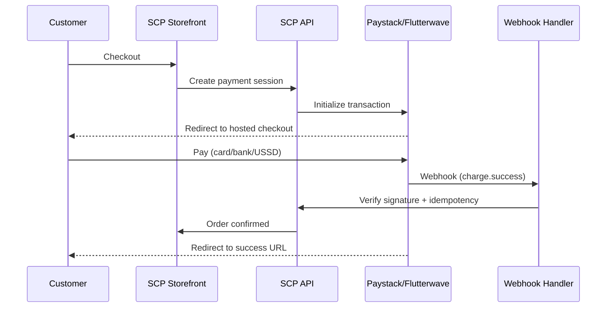
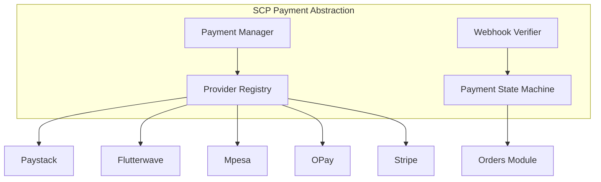

# Chapter 04: Payment & Fintech Strategy

**Document ID:** SCP-MR-002-04  
**Version:** 1.0.0  
**Status:** ✅ Active  
**Traceability:** PRD-003, PRD-011, PRD-012; NFR-044, NFR-078, NFR-083, NFR-084; ADR-004, ADR-011

---

## 1. Purpose

Define SCP's payment and fintech strategy aligned with **Commerce Infrastructure for Africa** (ADR-019). Nigeria launches first; Kenya, Ghana, Uganda, Tanzania, Rwanda, and South Africa expand via the **Financial Services Layer** gateway adapter catalog ([Volume 5 Ch. 17](../05-commerce-engine/17-payment-gateway-adapters-africa.md)).

## 2. Scope

**In scope:** FSL architecture, Paystack, Flutterwave, M-Pesa, pan-African aggregators (DPO, Cellulant, Pesapal), country-specific mobile money, OPay, Moniepoint (adjacent), Stripe (international fallback), bank transfer/USSD, cash on delivery, smart routing, split payments, payout architecture, PCI scope.

**Out of scope:** Tax/currency/language engine detail (Volume 5 Ch. 18), shipping carrier adapters (Volume 5 Ch. 10).

---

## 3. Strategic Principles

| # | Principle | Rationale |
|---|-----------|-----------|
| 1 | **African PSPs are first-class modules**, not plugins | PRD-003; Nigeria market reality |
| 2 | **Never store cardholder data** | NFR-044; ADR-004 |
| 3 | **PSP redirect/hosted default** | PCI SAQ A r1 eligibility (March 2025 updates) |
| 4 | **Multi-PSP abstraction** | CBN/ODPC resilience; merchant choice |
| 5 | **Webhook-verified payment state** | OWASP A10; no client-side paid status |
| 6 | **Transparent settlement reporting** | Nigeria FX/settlement pain (Chapter 01) |

---

## 4. Nigeria Payment Landscape (2026)

### 4.1 Provider Scale

| Provider | Scale Indicator | Strength | Confidence |
|----------|----------------|----------|------------|
| **Paystack** | 200K+ businesses; 12x volume growth since Stripe acquisition; group profitable 2026 | Developer UX, Stripe backing, NG/GH/KE/CI/ZA | E2 |
| **Flutterwave** | 1B+ transactions; $40B+ cumulative volume; Mono acquisition 2026 | Cross-border, enterprise, wallet growth 289% YoY | E2 |
| **Moniepoint** | Agent banking dominance | SME financial OS, physical + digital | E2 |
| **OPay** | Consumer wallet scale | Checkout wallet, urban consumers | E3 |
| **PalmPay** | Consumer wallet | Similar to OPay | E3 |

### 4.2 Payment Method Mix (Nigeria)

| Method | Share Trend | Phase 1 | Integration Model |
|--------|---------------|---------|-------------------|
| Cards (local/international) | Stable | ✅ | Paystack/Flutterwave redirect |
| Bank transfer (NIBSS) | Growing rapidly | ✅ | Paystack dedicated account / transfer |
| USSD | Moderate | ✅ | Paystack USSD |
| OPay/PalmPay wallet | Growing | ✅ | PSP wallet APIs |
| Cash on delivery | Declining but persistent | Optional | Manual confirmation |
| BNPL | Emerging | Phase 2 | Partner integration |

---

## 5. Kenya / East Africa Payment Strategy

| Method | Priority | Provider Path | Notes |
|--------|----------|---------------|-------|
| M-Pesa STK Push | P0 | Paystack Kenya / direct Safaricom Daraja | No card data; SAQ A friendly |
| M-Pesa Paybill/Till | P1 | Daraja API | B2B and marketplace payouts |
| Airtel Money | P1 | Aggregator | Phase 1b |
| Cards | P1 | Paystack Kenya | Redirect model |

**Kenya launch gate:** ODPC registration (NFR-084) before processing KE customer PII in payments flow.

---

## 6. PCI DSS Strategy — SAQ A

SCP and merchants target **PCI DSS v4.0.1 SAQ A r1** (NFR-044).

### 6.1 ADR-004 Integration Model

| Model | PCI Impact | Phase | Use Case |
|-------|------------|-------|----------|
| PSP full redirect | SAQ A | Phase 1 default | Cards, bank, USSD |
| PSP hosted checkout page | SAQ A | Phase 1 | Paystack Checkout |
| M-Pesa STK Push | Out of card scope | Phase 1b | Kenya |
| Embedded iframe (Elements) | SAQ A eligibility requires script-attack controls on **all** checkout pages | Phase 2 gated | Premium UX tier only |
| Direct card API | SAQ D | ❌ Never | Prohibited |

**March 2025 PCI update (E1):** Merchants using embedded payment iframes must implement script-attack detection on pages hosting the iframe. Because SCP allows merchant theme customization, embedded checkout would expand PCI scope across all storefronts—unacceptable for Phase 1.

**Sources:** https://blog.pcisecuritystandards.org/important-updates-announced-for-merchants-validating-to-self-assessment-questionnaire-a, ADR-004

### 6.2 SCP PCI Responsibilities

| Responsibility | Owner |
|----------------|-------|
| No PAN/CVV storage | SCP platform |
| TLS 1.3 on all surfaces | SCP platform |
| Quarterly ASV scans | SCP platform |
| SAQ A completion | SCP (platform) + merchant guidance |
| Checkout page script control | SCP locked templates (Phase 1) |
| PSP AoC on file | SCP compliance |

---

## 7. Payment Provider Priority Matrix

| Provider | Nigeria | Kenya | Ghana | Priority | Role |
|----------|---------|-------|-------|----------|------|
| Paystack | ✅ Primary | ✅ | ✅ | P0 | Default PSP Nigeria |
| Flutterwave | ✅ Secondary | ✅ | ✅ | P0 | Failover + cross-border |
| M-Pesa (Daraja) | ❌ | ✅ Primary | ❌ | P0 (KE) | Kenya mobile money |
| OPay | ✅ | ❌ | ❌ | P1 | Wallet |
| PalmPay | ✅ | ❌ | ❌ | P1 | Wallet |
| Stripe Checkout | ✅ Global cards | ✅ | ✅ | P1 | International cards |
| Moniepoint | ✅ Adjacent | ❌ | ❌ | P2 | Agent network future |

---

## 8. Payment Module Architecture

### 8.1 Payment State Machine Rules

| Rule | Enforcement |
|------|-------------|
| Order → `paid` only on verified webhook | Server-side |
| Idempotent webhook processing | `provider_reference` unique index |
| Failed payments never leave orphan paid orders | State machine guards |
| Refunds require authorization + audit | ADR-009 |
| Partial payments (installments) | Phase 2 |

---

## 9. Marketplace Payouts (Preview)

Multi-vendor marketplace (Volume 8) requires split payouts:

| Pattern | Provider | Use |
|---------|----------|-----|
| Split payments at charge | Paystack Split / Flutterwave subaccounts | Real-time vendor share |
| Escrow + scheduled payout | Platform ledger + batch transfer | Dispute window |
| Connect-style onboarding | Stripe Connect (global) | International vendors |

**Nigeria consideration:** CBN KYC requirements for subaccounts (E2)—vendor onboarding must collect required identity fields.

---

## 10. FX & Multi-Currency

| Requirement | Implementation | NFR |
|-------------|----------------|-----|
| Display currencies | NGN, USD, KES, GHS | NFR-078 |
| Settlement currency | Merchant-configured | PRD-011 |
| Exchange rates | Daily ECB/CBN reference + manual override | PRD-011 |
| FX transparency | Show rate + timestamp at checkout | E3 best practice |

**Assumption:** SCP does not act as money transmitter; PSPs handle fund flow (E3).

**Validation needed:** Legal review of CBN agent licensing boundaries.

---

## 11. Fraud & Risk Controls

| Control | Phase | Standard |
|---------|-------|----------|
| Webhook signature verification | 1 | Provider docs |
| Velocity limits on checkout | 1 | NFR-036 |
| Turnstile on checkout | 1 | NFR-046 |
| AVS/CVV via PSP | 1 | PSP-side |
| Device fingerprinting | 2 | Partner evaluation |
| ML fraud scoring | 3 | PSP or Stripe Radar |

---

## 12. Regulatory Alignment

| Regulation | Market | SCP Action |
|------------|--------|------------|
| Nigeria NDPA | Primary | Subprocessor disclosure for PSPs; DPA annex |
| NDPC GAID 2025 | Primary | Registration; RoPA includes payment data flows |
| Kenya DPA | Secondary | ODPC registration; KE data residency for KE merchants |
| PCI DSS v4.0.1 | All card checkout | SAQ A via ADR-004 |
| CBN PSP guidelines | Nigeria | Use licensed PSPs only |

---

## 13. Engineering Principles Compliance

| Principle | Compliance |
|-----------|------------|
| Secure by Default | SAQ A; webhook verification; no PAN storage |
| UX First | Phase 2 embedded option for conversion optimization |
| API-First | Payment session API for mobile, POS, AI agents |
| Modular | Payments owns provider registry; Orders consumes events |
| Observable | Payment success rate, webhook latency, PSP error dashboards |

---

## 14. Acceptance Criteria

- [ ] Paystack + Flutterwave specified as P0 Nigeria PSPs
- [ ] M-Pesa STK specified for Kenya gate
- [ ] ADR-004 integration model documented with PCI sources
- [ ] Payment state machine rules defined
- [ ] Multi-currency requirements trace to NFR-078
- [ ] Marketplace payout patterns previewed for Volume 8

---

## 15. Risks

| Risk | Mitigation |
|------|------------|
| PSP outage | Multi-PSP failover |
| Webhook delivery failure | Reconciliation cron + PSP API poll |
| PCI scope creep via themes | Locked checkout; theme review |
| CBN regulatory change | Legal monitoring; abstraction layer |

---

## 16. Sources

| # | Source | URL |
|---|--------|-----|
| 1 | PCI SAQ A Updates (March 2025) | https://blog.pcisecuritystandards.org/important-updates-announced-for-merchants-validating-to-self-assessment-questionnaire-a |
| 2 | PCI FAQ iframe eligibility | https://blog.pcisecuritystandards.org/faq-clarifies-new-saq-a-eligibility-criteria-for-e-commerce-merchants |
| 3 | Paystack | https://paystack.com/docs |
| 4 | Flutterwave docs | https://developer.flutterwave.com/docs |
| 5 | Safaricom Daraja (M-Pesa) | https://developer.safaricom.co.ke/ |
| 6 | Flutterwave $40B milestone | https://techafricanews.com/2026/06/03/flutterwave-surpasses-1-billion-transactions-and-40-billion-in-payment-value-milestone/ |
| 7 | Paystack growth & profitability | https://techeconomy.ng/paystack-turns-profitable-records-12x-payment-volume-growth-since-stripe-acquisition/ |
| 8 | ADR-004 | `docs/00-meta/adr/004-checkout-psp-redirect-saq-a.md` |
| 9 | Nigeria NDPA | https://ndpc.gov.ng/ |
| 10 | Kenya ODPC | https://www.odpc.go.ke/ |

---

## 17. Related Documents

- Chapter 03: Africa & Nigeria Competitive Analysis
- Volume 5: Commerce Core Engine (payments module)
- Volume 11: Security — PCI and Africa regulatory compliance
- ADR-004, ADR-011
