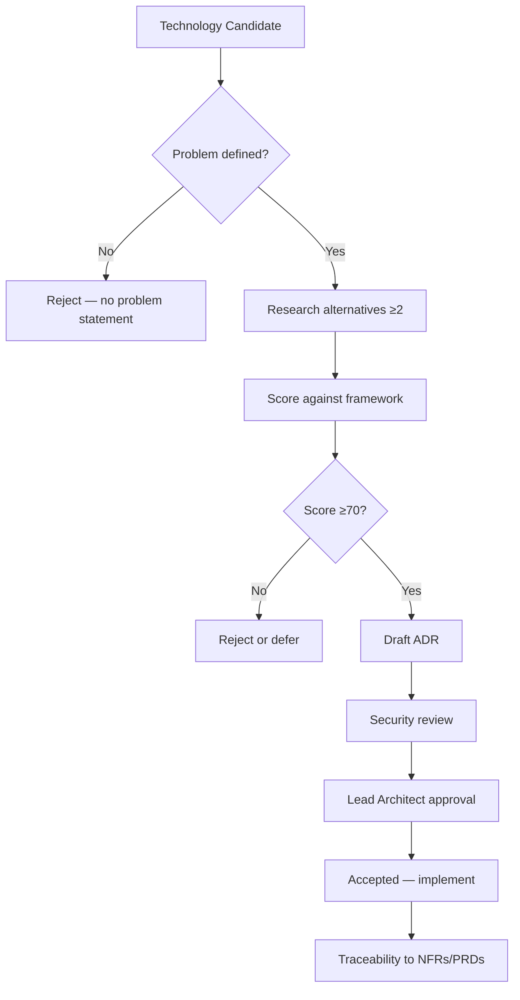

# Chapter 05: Technology Evaluation Framework

**Document ID:** SCP-MR-002-05  
**Version:** 1.0.0  
**Status:** ✅ Active  
**Traceability:** SCP-META-RESEARCH-001; All ADRs; NFR-001 – NFR-085

---

## 1. Purpose

Provide a repeatable, evidence-based framework for evaluating technologies, vendors, and architectural patterns before they become ADRs. Every major SCP technology choice must score against this framework and document alternatives rejected.

## 2. Scope

**In scope:** Evaluation criteria, scoring model, decision workflow, evidence requirements, team-scale constraints.

**Out of scope:** Specific stack decisions (Chapter 06); implementation standards (EDRs).

---

## 3. The Ten Research Questions

From `docs/00-meta/research-and-synthesis-program.md`, every evaluation must answer:

1. What problem are we solving?
2. Who experiences this problem?
3. How do successful platforms solve similar problems today?
4. What alternatives were considered?
5. Why is this choice right for SCP?
6. What are the tradeoffs?
7. What are security, performance, cost, and operational implications?
8. How does the decision scale from 10 to 100,000 merchants?
9. What acceptance criteria prove the design is complete?
10. What ADR records the decision?

---

## 4. Evaluation Dimensions

| Dimension | Weight | Key Questions | Maps To |
|-----------|--------|---------------|---------|
| **Team fit** | 15% | Can 1–5 engineers operate it? | Volume 1 constraints |
| **Time to MVP** | 15% | Ships in 3-month MVP? | Product roadmap |
| **Performance** | 15% | Meets NFR-001 – NFR-012? | Engineering principles |
| **Security** | 15% | ASVS L2? Tenant isolation? PCI? | Volume 11 |
| **Scalability path** | 10% | 10 → 100K merchants without rewrite? | ADR-001 extraction |
| **Africa fit** | 10% | Nigeria hosting, payments, connectivity? | ADR-011 |
| **Ecosystem** | 10% | Packages, hiring pool, community? | Long-term maintenance |
| **Cost (Phase 1)** | 5% | Bootstrap-friendly? | Infrastructure budget |
| **Extensibility** | 5% | Plugin/theme/API extension? | Principle 9 |

**Minimum passing score:** 70/100 for Phase 1 adoption; 80/100 for core platform dependencies.

---

## 5. Evidence Requirements

| Score Impact | Evidence Required |
|--------------|-------------------|
| ≥15% weight dimension | ≥1 E1 or E2 source |
| ADR justification | ≥2 alternatives documented |
| Performance claims | Benchmark methodology or NFR mapping |
| Security claims | Threat model reference or standard citation |
| Cost claims | Pricing page or infrastructure estimate |

Unverified claims must use:

```text
Assumption: [statement]
Validation needed: [method]
```

---

## 6. Evaluation Workflow



---

## 7. Scoring Template

```markdown
## Technology Evaluation: [Name]

**Evaluator:** [Name]  
**Date:** YYYY-MM-DD  
**Decision:** Adopt / Defer / Reject

### Problem Statement
[Who needs what]

### Alternatives
| Option | Score | Pros | Cons |
|--------|-------|------|------|
| A | | | |
| B | | | |

### Dimension Scores
| Dimension | Weight | Score (0-10) | Weighted |
|-----------|--------|--------------|----------|
| Team fit | 15% | | |
| ... | | | |
| **Total** | 100% | | **/100** |

### Scale Path
[10 → 100K merchant implications]

### ADR Required?
[Yes/No — ID]

### Sources
[E1/E2 URLs]
```

---

## 8. Category-Specific Criteria

### 8.1 Backend Framework

| Criterion | Threshold |
|-----------|-----------|
| ORM maturity | Production-grade migrations, query builder |
| Multi-tenancy support | Middleware + global scopes + RLS compatible |
| Queue/scheduler | Built-in or first-class package |
| API tooling | OpenAPI generation, validation |
| Long-running performance | Octane/Swoole compatibility preferred |
| Hiring (Nigeria) | PHP/Laravel talent availability |

### 8.2 Frontend Framework

| Criterion | Threshold |
|-----------|-----------|
| SSR/ISR | Required for NFR-001 |
| React ecosystem | Theme engine ADR-003 alignment |
| Bundle size control | Code splitting, ≤150KB JS budget |
| Admin complexity | Component library compatible (Volume 4) |

### 8.3 Database

| Criterion | Threshold |
|-----------|-----------|
| RLS support | Required (ADR-002) |
| JSON fields | Product attributes, theme config |
| Full-text search | Native or external index |
| Vector search | pgvector for AI RAG (Phase 1) |
| Managed hosting in Africa | Nigeria/West Africa availability |

### 8.4 Search Engine

| Criterion | Threshold |
|-----------|-----------|
| p95 autocomplete ≤100ms | NFR-005 |
| Tenant isolation | Index-per-tenant or filtered aliases |
| Operational complexity | Single engineer manageable |
| African language support | Configurable tokenization |

### 8.5 Cache Layer

| Criterion | Threshold |
|-----------|-----------|
| Tenant-prefixed keys | Mandatory |
| Session store | Supported |
| Queue backend | Supported |
| Managed Africa hosting | Preferred |

### 8.6 AI / LLM Gateway

| Criterion | Threshold |
|-----------|-----------|
| Multi-model | OpenAI, Anthropic, Gemini minimum |
| Cost tracking per tenant | Required |
| Tool calling | Agent architecture |
| Data residency | NDPA subprocessors documented |

---

## 9. Anti-Patterns — Auto-Reject

| Anti-Pattern | Reason |
|--------------|--------|
| "Industry best practice" without context | Violates research program |
| Microservices for MVP | ADR-001 |
| Client-side payment confirmation | NFR-044, OWASP A10 |
| App-level-only tenant isolation | ADR-002 |
| Storing PAN/CVV | NFR-044 |
| US-only hosting default | ADR-011 |
| Technology team has zero experience with | Team fit fail |
| No Africa-region deployment path | Market strategy fail |

---

## 10. Scale Evaluation Matrix

Every technology must answer scaling stages:

| Stage | Merchants | Traffic | Expected Stack Behavior |
|-------|-----------|---------|------------------------|
| S1 | 10–100 | Low | Single VPS; vertical scale |
| S2 | 100–1,000 | Medium | Read replica; CDN; queue workers |
| S3 | 1,000–10,000 | High | Octane; Redis cluster; search external |
| S4 | 10,000–100,000 | Very high | Service extraction; multi-region |

**Extraction trigger (ADR-001):** Domain exceeds 30% resource consumption OR needs different scaling (GPU, extreme concurrency).

---

## 11. Cost Evaluation Model (Phase 1)

| Component | Budget Target | Evaluation Gate |
|-----------|---------------|-----------------|
| Compute (app + workers) | $50–150/mo | Must run on 1–2 VPS |
| PostgreSQL managed | $30–80/mo | Nigeria region |
| Redis | $15–40/mo | Same region |
| Object storage | $10–30/mo | S3-compatible |
| CDN/WAF | $0–50/mo | Cloudflare free/pro |
| Search (Meilisearch) | $0–30/mo | Self-hosted acceptable |
| **Total Phase 1** | **$100–300/mo** | Bootstrap constraint |

---

## 12. Security Evaluation Gate

No technology passes without:

- [ ] STRIDE impact documented
- [ ] Tenant isolation implications stated
- [ ] Secrets management approach (ADR-007)
- [ ] Dependency license compatible (MIT/Apache/BSD preferred)
- [ ] CVE history reviewed for critical vulnerabilities
- [ ] Data residency/subprocessor impact (ADR-011)

---

## 13. Worked Example — PostgreSQL vs MySQL

| Dimension | PostgreSQL | MySQL 8 |
|-----------|------------|---------|
| RLS | ✅ Native (ADR-002) | ❌ Not equivalent |
| pgvector | ✅ AI RAG | ❌ |
| JSON | ✅ Strong | Partial |
| Laravel support | ✅ First-class | ✅ First-class |
| Africa managed hosting | ✅ Available | ✅ Available |
| **Decision** | **Adopt** | Reject for SCP |

*Full scoring in Chapter 06.*

---

## 14. ADR Trigger List

An ADR is **required** when evaluation outcome affects:

- Framework or language selection
- Database or search technology
- Multi-tenancy model
- API style (REST vs GraphQL priority)
- Payment integration model
- Authentication stack
- Event architecture
- Service extraction boundary
- Security architecture
- Theme/plugin runtime

---

## 15. Acceptance Criteria

- [ ] Ten research questions embedded in workflow
- [ ] Weighted scoring model defined
- [ ] Evidence levels E1–E4 enforced
- [ ] Category-specific criteria for backend, frontend, DB, search, cache, AI
- [ ] Anti-patterns and auto-reject rules documented
- [ ] Scale stages S1–S4 defined
- [ ] ADR trigger list complete

---

## 16. Engineering Principles Compliance

| Principle | Compliance |
|-----------|------------|
| All 10 principles | Each evaluation dimension maps to ≥1 principle |
| Observable | Cost and performance dimensions require metrics |
| Secure by Default | Security gate mandatory before adoption |

---

## 17. Sources

| # | Source | URL |
|---|--------|-----|
| 1 | SCP Research Program | `docs/00-meta/research-and-synthesis-program.md` |
| 2 | Engineering Principles | `docs/00-meta/engineering-principles.md` |
| 3 | ADR Template | `docs/00-meta/adr/000-template.md` |
| 4 | ISO/IEC 25010 Quality Model | https://www.iso.org/standard/35733.html |
| 5 | Martin Fowler — Architecture Decision Records | https://martinfowler.com/articles/shipley-adr.html |

---

## 18. Related Documents

- Chapter 06: Backend & Frontend Stack Decisions
- Chapter 07: Data, Search, Caching & Storage
- Chapter 10: Technology Roadmap & Risks
- Volume 0: ADR registry
