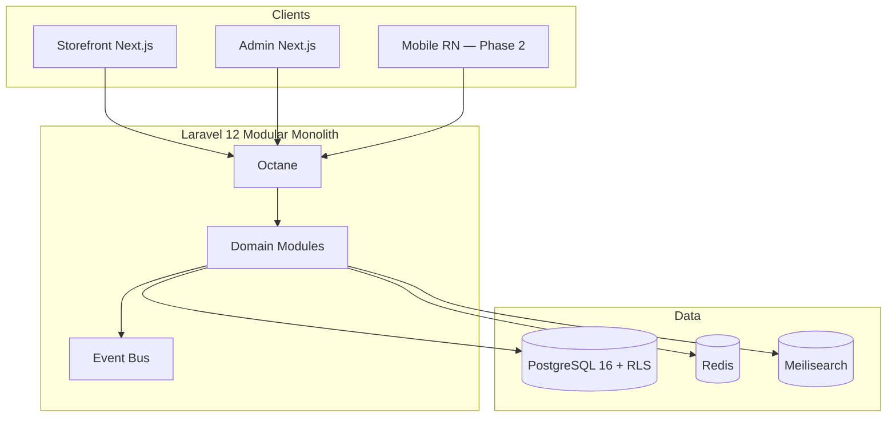

# Chapter 06: Backend & Frontend Stack Decisions

**Document ID:** SCP-MR-002-06  
**Version:** 1.0.0  
**Status:** ✅ Active  
**Traceability:** NFR-059, NFR-060, NFR-061; ADR-001, ADR-002, ADR-003, ADR-006; PRD-004, PRD-016

---

## 1. Purpose

Document evidence-based decisions for SCP's core technology stack: **Laravel 12** (backend), **Next.js** (frontend), **PostgreSQL 16+** (database). This chapter explains why each was chosen, which alternatives were rejected, and how the stack scales from MVP to enterprise.

## 2. Scope

**In scope:** Application framework, frontend framework, database, runtime versions, key packages, deployment unit.

**Out of scope:** Search/caching detail (Chapter 07); infrastructure provisioning (Volume 10).

---

## 3. Stack Summary

| Layer | Technology | Version | ADR |
|-------|------------|---------|-----|
| Backend framework | Laravel | 12.x | ADR-001 |
| PHP runtime | PHP | 8.4+ | NFR-059 |
| API performance | Laravel Octane (FrankenPHP) | Latest stable | ADR-001 |
| Admin + Storefront | Next.js (App Router) | 15.x / 20 LTS Node | NFR-061 |
| Database | PostgreSQL | 16+ | ADR-002 |
| Connection pool | PgBouncer | Transaction mode | ADR-005 |
| Cache/Queue | Redis | 7.x | Chapter 07 |
| Auth | Laravel Fortify + Sanctum | — | ADR-006 |
| Search | Meilisearch | — | Chapter 07 |



---

## 4. Backend — Laravel 12

### 4.1 Decision

**Adopt Laravel 12** as the SCP modular monolith framework.

### 4.2 Evidence & Rationale

| Factor | Evidence | Score Impact |
|--------|----------|--------------|
| Team expertise | Existing Laravel capability (Volume 1 constraints) | Team fit: 9/10 |
| MVP velocity | Batteries-included: auth, queues, migrations, validation | TTM: 9/10 |
| Modular structure | `app/Domain/{Module}/` pattern per engineering principles | Modular: 9/10 |
| Multi-tenancy | Global scopes + middleware; PostgreSQL RLS integration | Security: 9/10 |
| API tooling | API Resources, FormRequests, OpenAPI generators | API-First: 8/10 |
| Performance | Laravel Octane 2–10x throughput vs PHP-FPM (E1, Laravel docs) | Performance: 8/10 |
| Africa hiring | Strong PHP/Laravel contractor pool in Nigeria/Kenya | Ecosystem: 8/10 |
| AI integration | Robust HTTP client, queue for async AI jobs | AI Native: 8/10 |

**Weighted score: 86/100** — exceeds 70-point adoption threshold.

### 4.3 Alternatives Considered

| Alternative | Pros | Cons | Why Rejected |
|-------------|------|------|--------------|
| **Node.js (NestJS)** | Single language with Next.js | Weaker ORM/tenancy patterns; team PHP strength | Team fit; migration risk |
| **Django (Python)** | Strong admin, ML ecosystem | Saleor proves viable but team gap; separate from Next.js | Team fit |
| **Medusa (Node)** | Commerce-focused OSS | No merchant admin; rebuild platform UX | Product gap (Ch. 02) |
| **Ruby on Rails** | Shopify provenance | Smaller Africa hiring pool; team gap | Ecosystem |
| **Go (Fiber/Chi)** | Performance | Slow feature velocity for small team | TTM |
| **Java (Spring)** | Enterprise scale | Heavy operational overhead for 1–5 engineers | Team fit |

### 4.4 Laravel Module Structure

```text
app/Domain/
├── Commerce/
├── Catalog/
├── Payments/
├── Marketplace/
├── Themes/
├── AI/
├── Identity/
└── Tenancy/
```

Each module owns models, actions, events, policies—no cross-module DB access (engineering principle 4).

### 4.5 Octane Strategy

| Phase | Configuration | Target |
|-------|---------------|--------|
| Phase 1 | FrankenPHP Octane, 4 workers | NFR-017: 100 req/s |
| Phase 2 | 8–16 workers, horizontal app servers | 1,000 req/s |
| Phase 3 | Load balanced Octane pool | 5,000 req/s |

**Source:** https://laravel.com/docs/octane

---

## 5. Frontend — Next.js

### 5.1 Decision

**Adopt Next.js (App Router)** for storefront, admin panel, and vendor portal.

### 5.2 Evidence & Rationale

| Factor | Evidence | Score Impact |
|--------|----------|--------------|
| SSR/ISR | Native; meets NFR-001 LCP targets | Performance: 9/10 |
| React ecosystem | ADR-003 theme engine uses React + JSON | Extensibility: 9/10 |
| Team expertise | React/Next.js experience (Volume 1) | Team fit: 9/10 |
| Bundle optimization | App Router code splitting, `next/image` | NFR-009: 8/10 |
| API consumption | Same REST APIs as mobile/POS/AI | API-First: 9/10 |
| SEO | SSR for product pages, metadata API | Commerce: 9/10 |

**Weighted score: 88/100**

### 5.3 Alternatives Considered

| Alternative | Pros | Cons | Why Rejected |
|-------------|------|------|--------------|
| **Remix** | Strong web standards | Smaller ecosystem; theme marketplace harder | Ecosystem |
| **Nuxt (Vue)** | Good SSR | Team React alignment; ADR-003 React themes | Team fit |
| **SvelteKit** | Small bundles | Theme SDK ecosystem immature | Extensibility |
| **Inertia.js + Laravel** | Monolith simplicity | Harder separate storefront CDN deployment | Performance scale |
| **SPA (Vite + React)** | Simple | Poor SEO; slower FCP without SSR | NFR-001 fail |

### 5.4 Surface Architecture

| Surface | Next.js App | Hosting |
|---------|-------------|---------|
| Storefront | `apps/storefront` | Edge/CDN; ISR for product pages |
| Admin | `apps/admin` | Protected; SSR auth check |
| Vendor portal | `apps/vendor` | Marketplace Phase 1 |
| Theme preview | `apps/theme-preview` | Sandboxed renderer |

### 5.5 Performance Budgets (from Engineering Principles)

| Resource | Budget | Enforcement |
|----------|--------|-------------|
| JS (initial) | ≤150 KB gzip | Bundle analyzer CI |
| CSS | ≤50 KB gzip | Tailwind purge |
| LCP | ≤2.0s mobile | Lighthouse CI |

---

## 6. Database — PostgreSQL 16+

### 6.1 Decision

**Adopt PostgreSQL 16+** as the sole primary datastore (ADR-002).

### 6.2 Evidence & Rationale

| Factor | Evidence | Score Impact |
|--------|----------|--------------|
| Row-Level Security | Native RLS policies—defense-in-depth (ADR-002) | Security: 10/10 |
| pgvector | AI RAG without separate vector DB Phase 1 | AI Native: 9/10 |
| JSONB | Product attributes, theme config, metadata | Flexibility: 9/10 |
| Full-text search | Built-in `tsvector` for fallback | Search: 7/10 |
| Laravel support | First-class PostgreSQL driver | Team fit: 9/10 |
| ACID transactions | Orders + inventory + payments atomicity | Commerce: 10/10 |
| Africa hosting | AWS af-south-1, Azure South Africa, regional VPS | Africa fit: 7/10 |
| Medusa/Stripe precedent | PostgreSQL standard in modern commerce | Ecosystem: 8/10 |

**Weighted score: 89/100**

### 6.3 Alternatives Considered

| Alternative | Pros | Cons | Why Rejected |
|-------------|------|------|--------------|
| **MySQL 8** | Familiar; Laravel default history | No native RLS equivalent | ADR-002 fail |
| **MongoDB** | Flexible schema | Weak ACID for financial transactions | Commerce integrity |
| **CockroachDB** | Distributed SQL | Overkill Phase 1; cost | Team fit |
| **SQLite** | Dev simplicity | Not production multi-tenant | Scale fail |
| **Supabase** | Postgres + auth + realtime | Vendor coupling; RLS patterns differ | Control |

### 6.4 Multi-Tenancy Implementation

Per ADR-002 and ADR-005:

1. `tenant_id` on all tenant-scoped tables
2. Eloquent global scopes
3. PostgreSQL RLS: `SET LOCAL app.tenant_id` per transaction
4. PgBouncer transaction pooling with isolation tests in CI

### 6.5 Schema Design Principles

| Principle | Implementation |
|-----------|----------------|
| UUID primary keys | `uuid` v7 for sortable IDs |
| Soft deletes | NFR-074 |
| Audit columns | `created_at`, `updated_at`, `created_by` |
| Tenant index | Composite indexes leading with `tenant_id` |
| Migrations | Zero-downtime expand-contract (NFR-076) |

---

## 7. Authentication Stack

**Decision:** Laravel Fortify (auth flows) + Sanctum (API tokens) per ADR-006.

| Capability | Implementation |
|------------|----------------|
| Merchant login | Email/password + MFA Phase 2 |
| API tokens | Sanctum scoped tokens |
| Storefront customer auth | Sanctum SPA or session |
| Admin MFA | Required Phase 1 (Volume 11) |
| Social login | OAuth Phase 2 |

---

## 8. API Strategy

| Phase | API Style | Rationale |
|-------|-----------|-----------|
| Phase 1 | REST `/api/v1/` | Simpler SDK generation; Stripe-like docs |
| Phase 2 | GraphQL Storefront API | Flexible merchant queries (engineering principles) |
| Both | OpenAPI 3.1 spec | API-First principle |
| Errors | RFC 7807 Problem Details | Consistency |

**Assumption:** GraphQL adds schema maintenance burden premature for MVP (E3).

**Validation needed:** Developer beta feedback on REST completeness.

---

## 9. Monorepo Layout

```text
sapphital-commerce/
├── apps/
│   ├── api/          # Laravel 12
│   ├── storefront/   # Next.js
│   ├── admin/        # Next.js
│   └── vendor/       # Next.js
├── packages/
│   ├── ui/           # Design system (Volume 4)
│   ├── theme-sdk/    # ADR-003
│   └── commerce-sdk/ # TypeScript SDK
└── docs/             # SCP specification
```

---

## 10. Scale Path

| Merchants | Backend | Frontend | Database |
|-----------|---------|----------|----------|
| 10–100 | 1 VPS Octane | CDN static | Single PG |
| 100–1K | 2 app servers | ISR + edge | PG + read replica |
| 1K–10K | Horizontal Octane | Multi-region CDN | PgBouncer pool |
| 10K–100K | Extract search/AI | Edge middleware | Partitioning; enterprise schema-per-tenant |

---

## 11. Risks & Tradeoffs

| Tradeoff | Choice | Mitigation |
|----------|--------|------------|
| PHP perception vs Node | Laravel | Octane benchmarks; Shopify-scale precedents |
| Two runtimes (PHP + Node) | Accept | Clear API boundary; shared TypeScript SDK |
| RLS complexity | PostgreSQL | ADR-005 SET LOCAL discipline; CI tests |
| Next.js complexity | App Router | Templates; Volume 4 design system |

---

## 12. Acceptance Criteria

- [ ] Laravel 12, Next.js, PostgreSQL scored ≥70 on framework
- [ ] ≥3 alternatives documented per layer
- [ ] ADR cross-references: 001, 002, 003, 005, 006
- [ ] NFR version requirements met (059–061)
- [ ] Scale path S1–S4 documented

---

## 13. Engineering Principles Compliance

| Principle | Compliance |
|-----------|------------|
| Performance | Octane + Next.js SSR/ISR |
| API-First | Laravel API modules; thin clients |
| Modular | Domain folder structure |
| Decoupled | Clean Architecture layers |
| Multi-Tenant | PostgreSQL RLS + scopes |
| Extensible | React theme SDK; Laravel plugin hooks |

---

## 14. Sources

| # | Source | URL |
|---|--------|-----|
| 1 | Laravel 12 Documentation | https://laravel.com/docs/12.x |
| 2 | Laravel Octane | https://laravel.com/docs/octane |
| 3 | Next.js Documentation | https://nextjs.org/docs |
| 4 | PostgreSQL 16 Release Notes | https://www.postgresql.org/docs/16/release-16.html |
| 5 | PostgreSQL RLS | https://www.postgresql.org/docs/current/ddl-rowsecurity.html |
| 6 | ADR-001 Modular Monolith | `docs/00-meta/adr/001-modular-monolith-over-microservices.md` |
| 7 | ADR-002 Multi-Tenancy | `docs/00-meta/adr/002-multi-tenancy-shared-db-rls.md` |
| 8 | ADR-003 Theme Engine | `docs/00-meta/adr/003-theme-engine-react-json-schema.md` |
| 9 | ADR-005 RLS PgBouncer | `docs/00-meta/adr/005-rls-pgbouncer-set-local.md` |
| 10 | ADR-006 Authentication | `docs/00-meta/adr/006-authentication-stack.md` |
| 11 | Engineering Principles | `docs/00-meta/engineering-principles.md` |

---

## 15. Related Documents

- Chapter 05: Technology Evaluation Framework
- Chapter 07: Data, Search, Caching & Storage
- Chapter 10: Technology Roadmap & Risks
- Volume 3: System Architecture (planned)
