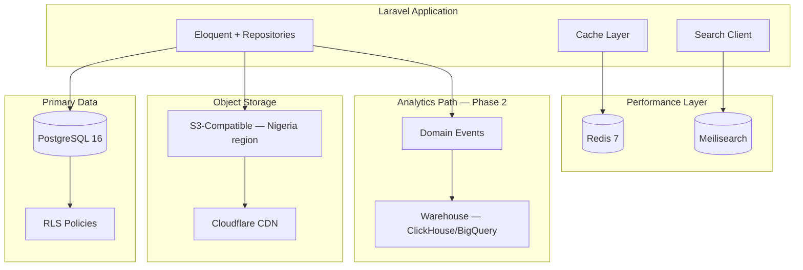
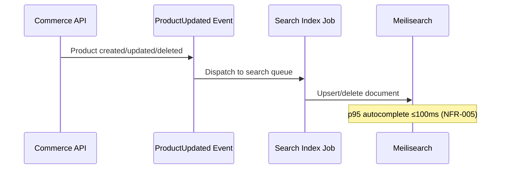

# Chapter 07: Data, Search, Caching & Storage

**Document ID:** SCP-MR-002-07  
**Version:** 1.0.0  
**Status:** ✅ Active  
**Traceability:** NFR-005, NFR-007, NFR-018, NFR-019, NFR-071, NFR-074, NFR-075; ADR-002, ADR-005, ADR-009, ADR-011

---

## 1. Purpose

Define SCP's data platform strategy: primary storage (PostgreSQL), caching (Redis), search (Meilisearch), object storage, and analytics data path. Decisions here directly enable NFR performance targets and multi-tenant isolation.

## 2. Scope

**In scope:** Database patterns, indexing, RLS, cache layers, search indexing, file storage, backup, analytics pipeline overview.

**Out of scope:** Full schema design (Volume 16); BI dashboards (Volume 14).

---

## 3. Data Platform Architecture



---

## 4. PostgreSQL — Primary Datastore

### 4.1 Role

Single source of truth for all transactional data: tenants, products, orders, payments, customers, themes, AI embeddings (pgvector).

### 4.2 Tenant Isolation (ADR-002, ADR-005)

| Layer | Mechanism |
|-------|-----------|
| Application | `tenant_id` global scopes on Eloquent |
| Database | RLS policies using `current_setting('app.tenant_id')` |
| Connection pool | `SET LOCAL app.tenant_id` per transaction (PgBouncer safe) |
| CI | Cross-tenant access test suite — must return 0 leaks |

```sql
-- Example RLS policy pattern
ALTER TABLE products ENABLE ROW LEVEL SECURITY;
CREATE POLICY tenant_isolation ON products
  USING (tenant_id = current_setting('app.tenant_id')::uuid);
```

### 4.3 Indexing Strategy

| Table Class | Index Pattern | Target |
|-------------|---------------|--------|
| Tenant-scoped entities | `(tenant_id, id)` PK; `(tenant_id, created_at DESC)` | NFR-007 ≤50ms |
| Product catalog | `(tenant_id, slug)` unique; GIN on `attributes jsonb` | Fast lookup |
| Orders | `(tenant_id, status, created_at)` | Admin dashboards |
| Full-text fallback | `tsvector` generated column + GIN | Degraded search mode |

### 4.4 pgvector for AI RAG

| Use | Configuration | Phase |
|-----|---------------|-------|
| Product knowledge | `vector(1536)` OpenAI embeddings | Phase 1 |
| Support docs | Tenant-scoped document chunks | Phase 1 |
| Semantic search | Hybrid: Meilisearch keyword + pgvector rerank | Phase 2 |

**Rationale:** Avoid separate vector DB operational cost for Phase 1 (E3); extract if embedding queries exceed 30% DB load (ADR-001).

### 4.5 Audit & Immutability (ADR-009)

| Data Type | Storage | Retention |
|-----------|---------|-----------|
| Financial events | Append-only `audit_log` table | 7 years (NFR-073) |
| Identity changes | Audit log | 7 years |
| Soft deletes | `deleted_at` on entities | NFR-074 recovery window |

---

## 5. Redis — Caching & Queues

### 5.1 Decision

**Adopt Redis 7** for cache, session store, queue backend, and rate limiting.

### 5.2 Cache Key Convention

```text
{env}:{tenant_id}:{module}:{resource}:{id}
```

**Example:** `prod:uuid-tenant:catalog:product:uuid-product`

### 5.3 TTL Strategy

| Resource | TTL | Invalidation |
|----------|-----|--------------|
| Product detail (public) | 5 min | On product update event |
| Category tree | 15 min | On category change |
| Store settings | 10 min | On settings update |
| Theme config | 30 min | On theme publish |
| API rate limit counters | 1 min sliding | Automatic |
| Search autocomplete cache | 60 sec | Low — high churn acceptable |

### 5.4 Queue Architecture

| Queue | Purpose | Workers Phase 1 |
|-------|---------|-----------------|
| `default` | General async tasks | 2 |
| `payments` | Webhook processing | 2 |
| `notifications` | Email, SMS, push | 2 |
| `search` | Index updates | 1 |
| `ai` | LLM requests, embeddings | 1 |
| `webhooks` | Outbound merchant webhooks | 1 |

Horizon for monitoring (NFR-008 ≤5s job p95).

### 5.5 Alternatives Considered

| Alternative | Why Rejected |
|-------------|--------------|
| Memcached | No queue/pub-sub; less versatile |
| Database queues | Poor performance at scale |
| Kafka Phase 1 | Operational overhead for small team |

---

## 6. Meilisearch — Product Search

### 6.1 Decision

**Adopt Meilisearch** as the primary product search engine (external to PostgreSQL).

### 6.2 Rationale

| Factor | Meilisearch | PostgreSQL FTS | Elasticsearch |
|--------|-------------|----------------|---------------|
| Autocomplete speed | Excellent sub-50ms (E2) | Moderate | Good but heavy |
| Operational complexity | Low — single binary | None extra | High |
| Tenant filtering | `filter: tenant_id = X` | RLS | Index-per-tenant |
| Typo tolerance | Built-in | Manual | Built-in |
| Resource usage | Light | Shared with DB | Heavy |
| Africa self-host | Easy on VPS | N/A | Difficult |

**Weighted score:** Meilisearch 85/100 for SCP Phase 1.

### 6.3 Index Design

| Index | Primary Key | Filterable Attributes | Searchable |
|-------|-------------|----------------------|------------|
| `products_{tenant_id}` | `id` | `tenant_id`, `category_id`, `price`, `in_stock` | `title`, `description`, `tags` |
| `products_global` (admin) | Platform admin only | `tenant_id` | Cross-tenant admin search |

**Tenant isolation:** Prefer per-tenant indexes at scale; shared index with mandatory `tenant_id` filter at MVP.

### 6.4 Indexing Pipeline



### 6.5 Search Performance Targets

| Operation | Target | NFR |
|-----------|--------|-----|
| Autocomplete | p95 ≤100ms | NFR-005 |
| Full search results | p95 ≤200ms | NFR-003 |
| Index lag | ≤5 seconds | Operational SLO |
| Index size | 1M docs Phase 1 | NFR-019 |

### 6.6 Extraction Path

When search exceeds 30% platform resources or 100M documents (NFR-019 Phase 3):

- Dedicated Meilisearch cluster
- Or migrate to managed OpenSearch/Elasticsearch (enterprise)

---

## 7. Object Storage

### 7.1 Decision

**S3-compatible object storage** in Nigeria/West Africa region (ADR-011).

| Asset Type | Path Pattern | CDN |
|------------|--------------|-----|
| Product images | `/{tenant_id}/products/{id}/` | Cloudflare |
| Theme assets | `/{tenant_id}/themes/{theme_id}/` | Cloudflare |
| Digital downloads | `/{tenant_id}/downloads/` | Signed URLs |
| User uploads (CMS) | `/{tenant_id}/media/` | Cloudflare |

### 7.2 Image Optimization

| Rule | Target |
|------|--------|
| Format | WebP/AVIF with JPEG fallback |
| Hero image | ≤200 KB (NFR-011) |
| Responsive variants | 320, 640, 1024, 1920 widths |
| Upload validation | MIME allowlist; max 10 MB |

### 7.3 Providers Evaluated

| Provider | Nigeria Region | Score |
|----------|----------------|-------|
| AWS S3 af-south-1 | Cape Town (nearest) | 7/10 |
| Cloudflare R2 | Global edge | 8/10 |
| Backblaze B2 | Via CDN | 7/10 |
| Local (Layershift, Truehost) | Lagos VPS | 6/10 Phase 1 option |

**Phase 1:** Cloudflare R2 + CDN (ADR-008 edge security synergy) with documented cross-border transfer in RoPA.

---

## 8. Backup & Recovery

| Component | Frequency | RTO | RPO | NFR |
|-----------|-----------|-----|-----|-----|
| PostgreSQL | Every 6 hours + WAL | ≤4h | ≤6h | NFR-025–027 |
| Redis | Daily snapshot | ≤1h | ≤24h | Best effort |
| Meilisearch | Rebuild from PG | ≤2h | Eventual | Reindex job |
| Object storage | Versioning enabled | ≤4h | ≤1h | Provider-native |

Backups remain in same region as primary (ADR-011); cross-region DR copy documented in RoPA.

---

## 9. Data Residency (ADR-011)

| Data Class | Nigeria Tenant | Kenya Tenant |
|------------|----------------|--------------|
| PostgreSQL | Lagos/West Africa | East Africa region |
| Redis | Co-located | Co-located |
| Object storage | Same region | Same region |
| Meilisearch | Same region | Same region |
| Backups | Same region | Same region |

---

## 10. Analytics Data Path (Phase 2 Preview)

| Stage | Technology | Purpose |
|-------|------------|---------|
| Event collection | Domain events → queue | Order placed, product viewed |
| Stream processing | Laravel queues → aggregator | Real-time metrics |
| Warehouse | ClickHouse or BigQuery | OLAP queries |
| Dashboard | Grafana / custom admin | NFR-069 |

**Phase 1:** PostgreSQL materialized views + Redis counters for GMV, orders, signups.

---

## 11. Caching vs CDN vs ISR

| Content | Strategy |
|---------|----------|
| Product pages (storefront) | Next.js ISR 60s + CDN |
| Category pages | ISR 120s |
| Cart/checkout | No cache — dynamic |
| Admin API reads | Redis 5 min TTL |
| Static theme assets | CDN immutable cache |

---

## 12. Risks

| Risk | Mitigation |
|------|------------|
| RLS + PgBouncer leak | ADR-005 SET LOCAL; CI isolation tests |
| Cache stampede | Probabilistic early expiration |
| Search index drift | Reconciliation cron nightly |
| Storage cost at scale | Image optimization; tiered storage |
| Meilisearch memory limits | Per-tenant index sharding |

---

## 13. Acceptance Criteria

- [ ] PostgreSQL RLS + indexing strategy documented
- [ ] Redis TTL table defined per resource type
- [ ] Meilisearch selected with alternatives comparison
- [ ] Object storage path conventions defined
- [ ] Backup RTO/RPO aligned to NFR-025–027
- [ ] Data residency mapped to ADR-011

---

## 14. Engineering Principles Compliance

| Principle | Compliance |
|-----------|------------|
| Performance | Redis + Meilisearch + ISR meet NFR targets |
| Multi-Tenant | Tenant-prefixed cache keys; RLS; search filters |
| Observable | Horizon, pg_stat, Meilisearch metrics |
| Secure by Default | Signed URLs; encrypted backups |
| AI Native | pgvector for RAG |

---

## 15. Sources

| # | Source | URL |
|---|--------|-----|
| 1 | PostgreSQL RLS Documentation | https://www.postgresql.org/docs/current/ddl-rowsecurity.html |
| 2 | pgvector | https://github.com/pgvector/pgvector |
| 3 | Meilisearch Documentation | https://www.meilisearch.com/docs |
| 4 | Redis Documentation | https://redis.io/docs/ |
| 5 | Laravel Cache | https://laravel.com/docs/12.x/cache |
| 6 | Laravel Queues / Horizon | https://laravel.com/docs/12.x/queues |
| 7 | Cloudflare R2 | https://developers.cloudflare.com/r2/ |
| 8 | ADR-002, ADR-005, ADR-009, ADR-011 | `docs/00-meta/adr/` |
| 9 | Engineering Principles — Performance | `docs/00-meta/engineering-principles.md` |

---

## 16. Related Documents

- Chapter 06: Backend & Frontend Stack
- Volume 16: Database Architecture (planned)
- Volume 10: Infrastructure (planned)
- Volume 9: AI Platform — RAG pipeline
