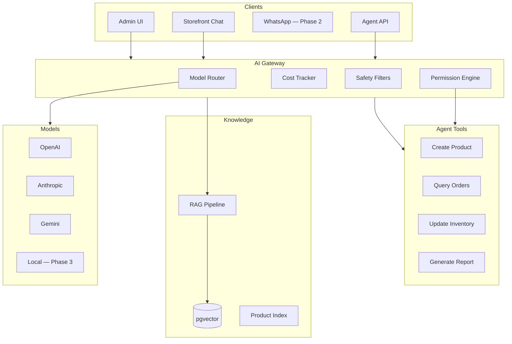
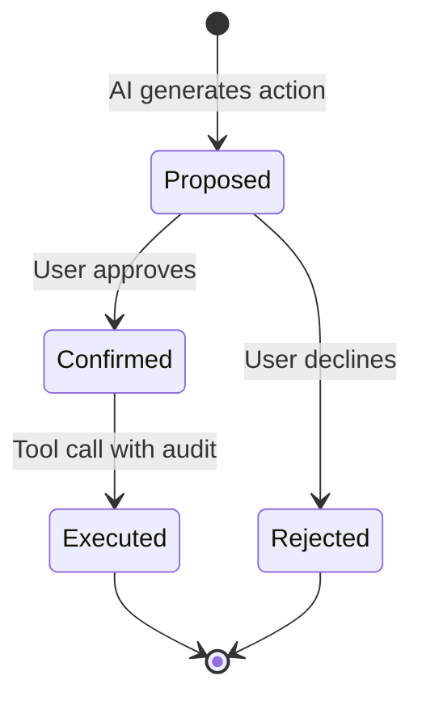

# Chapter 08: AI Commerce Market Opportunity

**Document ID:** SCP-MR-002-08  
**Version:** 1.0.0  
**Status:** ✅ Active  
**Traceability:** PRD-002, PRD-007, PRD-018; NFR-001; Engineering Principle 6 (AI Native); ADR-001

---

## 1. Purpose

Analyze the AI-in-commerce market opportunity in 2026 and define how SCP's **AI-native architecture** (not AI-enhanced features) creates defensible differentiation—especially for Nigeria-primary merchants who lack access to Shopify Sidekick-class tooling at accessible price points.

## 2. Scope

**In scope:** Global AI commerce trends, competitor AI maturity, agentic workflows, SCP AI platform requirements preview, permissions/safety, cost model.

**Out of scope:** Full AI platform specification (Volume 9); model training; legal AI liability (Volume 19).

---

## 3. Market Context — 2026 Inflection Point

2026 is the year AI assistants transition from **chat interfaces** to **action-capable commerce co-pilots** integrated with store data (E1, Shopify Winter 2026 Edition).

| Signal | Evidence | Confidence |
|--------|----------|------------|
| Shopify Sidekick executes multi-step admin tasks | Winter 2026 Edition; Help Center docs | E1 |
| Sidekick App Extensions preview | Third-party app data in AI context | E1 |
| Agentic commerce on platform roadmaps | Shopify 2026 priorities | E1 |
| Medusa AI dev tooling (MCP, Bloom) | Developer-focused AI | E1 |
| African merchants use informal AI (ChatGPT) | Copy-paste product descriptions (E3) | E3 |
| No African platform offers native AI agents | Competitive gap analysis Ch. 02–03 | E3 |

**SCP thesis:** Africa-first merchants will skip the "AI as feature" generation and adopt platforms where AI is **infrastructure**—if pricing and connectivity constraints are respected.

---

## 4. Competitor AI Maturity Matrix

| Platform | AI Product | Depth | Autonomy | Africa Access | Score |
|----------|-----------|-------|----------|---------------|-------|
| Shopify | Sidekick | Deep — store context, actions, skills | High (2026) | Expensive; USD | 8.5/10 |
| BigCommerce | AI copy tools | Shallow | Low | Limited | 4/10 |
| WooCommerce | Plugin ecosystem | Variable | Low | Plugin cost | 3/10 |
| Medusa | Bloom (dev) | Dev-focused | Medium | Self-host only | 5/10 |
| Jumia | Basic recommendations | Shallow | Low | Marketplace only | 3/10 |
| Legacy PHP SaaS builders | None | — | — | Local | 0/10 |
| **SCP Target** | Multi-agent platform | Deep + African context | High | NGN pricing | **9/10** |

---

## 5. AI Use Cases by Merchant Segment

### 5.1 Solo Entrepreneurs (70% base)

| Use Case | Value | Phase |
|----------|-------|-------|
| AI store setup wizard | Launch in &lt;15 min (PRD-001) | Phase 1 |
| Product description generation | Professional copy from photo/title | Phase 1 |
| WhatsApp-ready product messages | Social selling (Ch. 01) | Phase 1 |
| AI pricing suggestions | Competitive positioning | Phase 2 |

### 5.2 Growing SMEs (25% base)

| Use Case | Value | Phase |
|----------|-------|-------|
| Inventory forecasting | Reduce stockouts | Phase 2 |
| Customer support agent | 24/7 order tracking, FAQs | Phase 1 |
| Marketing campaign drafts | Email, social, SMS | Phase 1 |
| Analytics narration | "Why did sales drop?" | Phase 2 |

### 5.3 Marketplace Operators (4% base)

| Use Case | Value | Phase |
|----------|-------|-------|
| Vendor onboarding assistant | Policy compliance checks | Phase 2 |
| Dispute triage | Suggested resolutions | Phase 3 |
| Fraud pattern detection | Anomaly alerts | Phase 3 |

---

## 6. SCP AI Architecture Preview

### 6.1 Multi-Model Gateway

| Model | Use Case | Routing Logic |
|-------|----------|---------------|
| GPT-4o mini | High-volume, low-cost tasks | Default for descriptions |
| Claude Sonnet | Complex reasoning, support | Escalation tier |
| Gemini Flash | Cost optimization fallback | Budget tenants |
| Local (Phase 3) | PII-sensitive, offline | Enterprise tier |

**Principle:** No single-model dependency (engineering principle 6).

### 6.2 RAG Pipeline

| Data Source | Scope | TTL |
|-------------|-------|-----|
| Product catalog | Tenant-scoped | Index on change |
| Store policies (shipping, returns) | Tenant-scoped | On update |
| Order history (support agent) | Customer-scoped | Session |
| Platform help docs | Global | Versioned |

Embeddings stored in PostgreSQL pgvector (Chapter 07)—tenant_id enforced on all retrieval queries.

---

## 7. Agent Permissions Model

AI agents must not exceed human role permissions (OWASP ASVS authorization).

| Role | AI Can | AI Cannot |
|------|--------|-----------|
| Merchant owner | Full store operations with confirmation | Delete store without MFA |
| Staff (inventory) | Read/update inventory | Change payout settings |
| Support agent | Read orders, draft replies | Issue refunds &gt;₦50K without approval |
| Customer (storefront) | Search, track own orders | Access other customers' data |
| Platform admin | Diagnostics with audit | Access tenant data without impersonation log (ADR-010) |

**Phase 1:** Human-in-the-loop for all write actions.  
**Phase 2:** Auto-execute read-only + low-risk writes (e.g., draft descriptions).  
**Phase 3:** Autonomous agents with spending limits and audit trails.

---

## 8. Safety & Cost Controls

| Control | Implementation |
|---------|----------------|
| Content moderation | Pre-publish filter on AI-generated product content |
| Prompt injection defense | Tool allowlist; no raw SQL from LLM |
| PII in prompts | Redact customer PII before external model calls |
| Cost cap per tenant | Monthly AI credit budget by tier |
| Cost tracking | Per-request token logging → billing |
| Fallback | Graceful degradation if model unavailable |
| NDPA compliance | Subprocessor disclosure for AI providers (ADR-011) |

---

## 9. African Market AI Considerations

| Factor | Challenge | SCP Response |
|--------|-----------|--------------|
| Connectivity | Intermittent 4G | Stream responses; cache common answers |
| Language | English + Pidgin + local languages | Multi-language prompts Phase 1.5 |
| Product photos | Low-quality images | Vision model enhancement suggestions |
| Price sensitivity | Cannot afford $39/mo + AI fees | AI included in SCP tiers |
| Trust | Skepticism of automation | Transparent "AI suggested" labels |
| Power outages | Mid-task failures | Idempotent agent jobs; resume capability |

---

## 10. Differentiation vs Shopify Sidekick

| Capability | Shopify Sidekick | SCP AI |
|------------|------------------|--------|
| Store context | ✅ | ✅ |
| Multi-step execution | ✅ (2026) | ✅ Phase 1 target |
| African payment context | ❌ | ✅ ("Why did Paystack fail?") |
| M-Pesa/USSD guidance | ❌ | ✅ |
| Multi-model | Opaque | ✅ Explicit gateway |
| Local language | Limited | Hausa/Yoruba/Igbo/Swahili roadmap |
| Cost | Bundled in $39+ plans | Bundled in ₦ pricing |
| Vendor/marketplace AI | Plus tier | Marketplace tier |

**PRD-018 target:** Exceed Sidekick in **autonomy depth** and **African operational context**, not raw model capability.

---

## 11. Revenue & Cost Model

| Tier | AI Credits/month | Overage |
|------|------------------|---------|
| Free | 50 requests | Upgrade prompt |
| Starter | 500 requests | ₦2/request |
| Business | 5,000 requests | ₦1/request |
| Marketplace | 20,000 requests | ₦0.50/request |
| Enterprise | Custom | Contract |

**Assumption (E4):** AI COGS ≤15% of subscription revenue at Business tier with model routing optimization.

**Validation needed:** 90-day token usage telemetry from beta.

---

## 12. Architecture Impact

| Component | Decision | Volume |
|-----------|----------|--------|
| AI Gateway module | Laravel domain module | Volume 9 |
| pgvector RAG | PostgreSQL extension | Volume 9, Ch. 07 |
| Agent tools API | REST internal tools | Volume 9 |
| Storefront chat widget | Next.js component | Volume 4 |
| Audit trail | ADR-009 for AI actions | Volume 11 |

**Extraction candidate (ADR-001):** AI service extracted when GPU inference or queue depth justifies independent scaling.

---

## 13. Risks

| Risk | Likelihood | Impact | Mitigation |
|------|------------|--------|------------|
| AI hallucination in product data | Medium | High | Human review; publish gates |
| Model API outage | Medium | Medium | Multi-model fallback |
| Runaway token costs | Medium | High | Per-tenant caps |
| Regulatory (NDPA AI processing) | Medium | Medium | RoPA; DPIA for AI features |
| Competitor catches up | High | Medium | African context depth moat |

---

## 14. Acceptance Criteria

- [ ] Competitor AI matrix completed
- [ ] Use cases mapped to merchant segments and phases
- [ ] Agent permissions model defined
- [ ] Safety and cost controls specified
- [ ] Differentiation vs Sidekick documented
- [ ] Traceability to PRD-002, PRD-007, PRD-018

---

## 15. Engineering Principles Compliance

| Principle | Compliance |
|-----------|------------|
| AI Native | Infrastructure-level gateway, RAG, agents |
| Secure by Default | Permission engine; human-in-the-loop Phase 1 |
| Multi-Tenant | Tenant-scoped RAG; cost caps per tenant |
| Observable | Token usage metrics; agent action audit |
| UX First | Streaming; graceful degradation on slow networks |

---

## 16. Sources

| # | Source | URL |
|---|--------|-----|
| 1 | Shopify Sidekick Help | https://help.shopify.com/en/manual/shopify-admin/productivity-tools/sidekick |
| 2 | Shopify Winter 2026 Edition | https://www.shopify.com/news/winter-26-edition-renaissance |
| 3 | Shopify Enterprise Sidekick | https://www.shopify.com/enterprise/blog/sidekick-ai-enterprise |
| 4 | Medusa AI | https://medusajs.com/ |
| 5 | OpenAI API | https://platform.openai.com/docs |
| 6 | Anthropic API | https://docs.anthropic.com/ |
| 7 | Engineering Principle 6 | `docs/00-meta/engineering-principles.md` |
| 8 | Volume 1 Mission — AI-native positioning | `docs/01-vision/01-mission-and-vision.md` |

---

## 17. Related Documents

- Chapter 02: Global Competitive Analysis
- Chapter 09: Strategic Positioning
- Volume 9: AI Platform (planned)
- ADR-001: Service extraction path for AI
