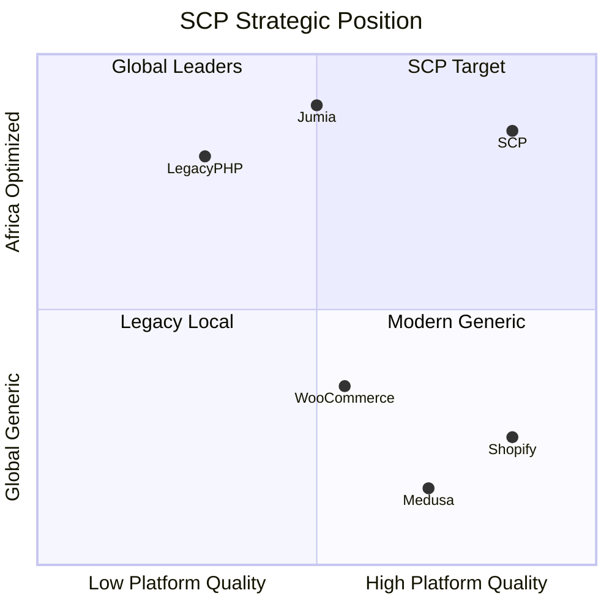
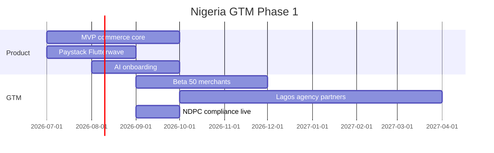

# Chapter 09: Strategic Positioning & Differentiation

**Document ID:** SCP-MR-002-09  
**Version:** 1.0.0  
**Status:** ✅ Active  
**Traceability:** PRD-016 – PRD-020; Volume 1 Chapters 01, 06, 07; ADR-001, ADR-004, ADR-011

---

## 1. Purpose

Synthesize market research (Chapters 01–08) into SCP's **strategic positioning**: target quadrant, differentiation pillars, pricing strategy, go-to-market sequence, competitive moats, and win/loss scenarios. This chapter is the executive summary engineers and product leaders use to align decisions.

## 2. Scope

**In scope:** Positioning statement, differentiation pillars, pricing, GTM phases, moats, competitive responses.

**Out of scope:** Detailed competitor profiles (Chapters 02–03); implementation roadmap (Chapter 10).

---

## 3. Positioning Statement

> **For African merchants who need global-quality commerce tooling with local payment and compliance depth, SAPPHITAL Commerce Platform is the AI-native Commerce Operating System that lets you launch, sell, and scale across online, social, and marketplace channels—without USD pricing, plugin hunting, or marketplace lock-in.**

**Primary market:** Nigeria  
**Secondary market:** Kenya / East Africa  
**Expansion:** West Africa → Southern Africa → global emerging markets

---

## 4. Target Position on Market Map

**Unoccupied quadrant:** High platform quality + Africa-optimized at SMB-accessible pricing.

---

## 5. Five Differentiation Pillars

### Pillar 1: AI-Native Commerce OS

| Competitor | SCP Advantage |
|------------|---------------|
| Shopify Sidekick (USD $39+) | Full AI suite at ₦ pricing; African operational context |
| WooCommerce plugins | Built-in agents, not bolt-ons |
| Legacy PHP SaaS builders | No AI |

**Proof points:** AI store setup &lt;15 min (PRD-001); support agent; inventory AI Phase 2.

### Pillar 2: Africa-First Payments

| Method | Shopify | SCP |
|--------|---------|-----|
| Paystack (deep) | Plugin | Native P0 |
| Flutterwave | Plugin | Native P0 |
| OPay/PalmPay | ❌ | Native P1 |
| M-Pesa STK | Plugin | Native P0 (Kenya) |
| NIBSS bank transfer | ❌ | Native |

**Proof points:** PRD-017 — more African methods than any competitor; ADR-004 PCI safety.

### Pillar 3: Merchant Ownership

| Model | Jumia/Konga | SCP |
|-------|-------------|-----|
| Customer data | Platform-owned | Merchant-owned |
| Commission | 10–15%+ | SaaS + optional transaction fee |
| Brand | Marketplace brand | Merchant brand |
| Multi-vendor | Marketplace only | Marketplace mode optional |

**Proof points:** PRD-008, PRD-020 — multi-vendor at ≤10% Shopify Plus cost.

### Pillar 4: Modern Developer Ecosystem

| Capability | Shopify | SCP |
|------------|---------|-----|
| Theme SDK | Liquid | React + JSON (ADR-003) |
| API docs quality | Excellent | Target: Stripe-level (Volume 12) |
| Plugin model | Ruby | Laravel hooks |
| Headless | Storefront API | REST Phase 1; GraphQL Phase 2 |

### Pillar 5: Compliance & Trust by Default

| Requirement | Typical local script | SCP |
|-------------|---------------------|-----|
| Nigeria NDPA | ❌ | NFR-083 |
| PCI SAQ A | Variable | ADR-004 |
| Kenya DPA | ❌ | NFR-084 |
| Africa data residency | ❌ | ADR-011 |
| Tenant isolation | App-level only | RLS + scopes (ADR-002) |

---

## 6. Pricing Strategy

### 6.1 Principles

1. **Price in NGN** for Nigeria merchants (PRD-019)
2. **≤30% of equivalent Shopify tier** (PRD-019)
3. **AI included**, not à la carte
4. **Transparent transaction fees** — lower than marketplace commission
5. **Free tier** for acquisition; convert via AI value + payment volume

### 6.2 Proposed Tier Structure

| Tier | Nigeria Price (monthly) | Shopify Equivalent | SCP % of Shopify |
|------|------------------------|-------------------|------------------|
| Free | ₦0 | — | — |
| Starter | ₦7,500 (~$5) | Basic $39 | ~13% |
| Business | ₦29,000 (~$19) | Shopify $105 | ~18% |
| Marketplace | ₦79,000 (~$52) | Plus $2,300+ | ~2% |
| Enterprise | Custom | Plus/Enterprise | Negotiated |

*FX approximate for planning (E3); actual pricing set at launch.*

### 6.3 Revenue Mix (Year 5 target, Volume 1)

| Source | % Revenue |
|--------|-----------|
| Subscriptions | 70% |
| Transaction fees (0.5% GMV) | 12% |
| Marketplace commission | 9% |
| Theme/plugin marketplace | 7% |
| Enterprise | 2% |

---

## 7. Go-to-Market Sequence

### Phase 1a: Nigeria Launch

| Activity | Detail |
|----------|--------|
| Beta cohort | 50 Lagos/Abuja merchants; free Business 6 months |
| Agency channel | WooCommerce agencies become SCP resellers |
| Content | YouTube/TikTok: "Launch store in 10 minutes" |
| Community | WhatsApp merchant group |
| Trust | "Payments powered by Paystack" co-marketing |

### Phase 1b: Kenya Launch

| Gate | Requirement |
|------|-------------|
| ODPC registration | NFR-084 |
| M-Pesa STK live | PRD-012 |
| Kenya-region hosting | ADR-011 |
| Nigeria ops stable | 30 days 99.9% uptime |

### Phase 2: West Africa + Developer Ecosystem

- Ghana (MTN MoMo); Côte d'Ivoire (Francophone UI)
- Theme Store; Plugin marketplace
- Developer docs portal (Volume 12)
- Swahili + French localization

### Phase 3: Southern Africa + Enterprise

- South Africa (ZAR)
- Enterprise tier; schema-per-tenant
- GraphQL Storefront API

---

## 8. Competitive Moats (Cumulative)

| Moat | Timeline | Defensibility |
|------|----------|---------------|
| Deepest Nigeria payment integration | Year 1 | High — integration depth |
| AI trained on African commerce patterns | Year 2+ | Medium — data flywheel |
| Theme/plugin marketplace network effects | Year 2+ | High — ecosystem |
| "Powered by Sapphital" trust brand | Year 2+ | Medium — brand |
| Multi-product platform (SCP + POS + ERP) | Year 3+ | High — platform lock-in (positive) |
| NDPA/compliance certification depth | Year 1+ | Medium — regulatory |

---

## 9. Win / Loss Scenarios

### We Win When

| Scenario | Why SCP Wins |
|----------|--------------|
| Nigerian merchant needs Paystack + professional store | Native payments + AI + ₦ pricing |
| Merchant rejects Jumia commission | Owned customer + lower cost |
| Agency client outgrows WooCommerce | SaaS reliability + APIs |
| Marketplace operator can't afford Shopify Plus | Marketplace tier |
| Developer wants React themes | ADR-003 modern stack |
| Kenya merchant needs M-Pesa native | STK Push built-in |

### We Lose When

| Scenario | Who Wins | SCP Response |
|----------|----------|--------------|
| Global shipping to 50+ countries | Shopify | Partner integrations Phase 3 |
| Enterprise SAP/Oracle integration | commercetools | Enterprise tier Phase 3 |
| Simplest embed widget | Ecwid | Not our segment |
| Merchant already successful on Shopify | Shopify | Target Africa-first migrants |
| Merchant wants zero SaaS cost | WooCommerce self-host | TCO calculator |

---

## 10. What We Deliberately Do NOT Compete On (Year 1)

| Area | Leader | SCP Strategy |
|------|--------|--------------|
| Global logistics network | Amazon, Shopify Shipping | Local courier APIs (Sendy, GIG) |
| 100K+ SKU enterprise | SAP, commercetools | Phase 4 enterprise |
| POS hardware | Square, Shopify POS | Software POS Phase 2 |
| Brand awareness | Shopify | Merchant success stories |
| Super-app wallet | OPay | Integrate as payment rail |

---

## 11. Success Metrics (from Volume 1)

| Metric | Year 1 Target | Measurement |
|--------|---------------|-------------|
| Active merchants | 500 | Platform analytics |
| Merchant activation (first sale) | 60% within 14 days | Funnel |
| Payment success rate | ≥95% | PSP webhooks |
| Storefront LCP p75 | ≤2.0s | CrUX |
| NPS | ≥40 | Quarterly survey |
| AI onboarding completion | ≥80% | Product analytics |
| Monthly churn | ≤5% Starter | Billing |

---

## 12. Architecture Impact Summary

| Strategic Pillar | Technical Enabler |
|------------------|-------------------|
| AI-Native | AI Gateway module; pgvector RAG (Ch. 08) |
| Africa Payments | Payment abstraction; ADR-004 |
| Merchant Ownership | Multi-tenant SaaS; custom domains |
| Developer Ecosystem | Theme SDK; OpenAPI; webhooks |
| Compliance | NDPA engine; RLS; ADR-011 residency |

---

## 13. Risks to Positioning

| Risk | Impact | Mitigation |
|------|--------|------------|
| "Africa-only niche" perception | Limits global ambition | "Built for Africa, architected for global" messaging |
| Race to bottom pricing | Margin erosion | AI + marketplace upsell; transaction revenue |
| Shopify Nigeria expansion | Direct competition | Speed to market; compliance + pricing moat |
| Fintech becomes commerce platform | Disintermediation | Partner deeply; focus on merchant ops |

---

## 14. Acceptance Criteria

- [ ] Positioning statement approved
- [ ] Five pillars documented with competitor proof
- [ ] Pricing meets PRD-019 (≤30% Shopify)
- [ ] GTM phases aligned to Nigeria primary, Kenya secondary
- [ ] Win/loss scenarios cover ≥6 cases each
- [ ] Moat timeline documented

---

## 15. Engineering Principles Compliance

| Principle | Compliance |
|-----------|------------|
| UX First | Shopify-quality bar explicit (PRD-016) |
| AI Native | Pillar 1 — core positioning |
| Secure by Default | Pillar 5 — compliance differentiation |
| Extensible | Pillar 4 — developer ecosystem |
| Performance | LCP targets in success metrics |

---

## 16. Sources

| # | Source | URL |
|---|--------|-----|
| 1 | Volume 1 — Competitive Positioning | `docs/01-vision/06-competitive-positioning.md` |
| 2 | Volume 1 — Target Markets | `docs/01-vision/03-target-markets.md` |
| 3 | Volume 1 — Success Metrics | `docs/01-vision/07-success-metrics.md` |
| 4 | Shopify Pricing | https://www.shopify.com/pricing |
| 5 | Nigeria e-commerce market | https://www.researchandmarkets.com/reports/5601277/nigeria-e-commerce-market-share-analysis |
| 6 | Chapters 01–08 | `docs/02-market-research/` |

---

## 17. Related Documents

- Volume 1: Vision & Product Strategy
- Chapter 10: Technology Roadmap & Risks
- Volume 8: Marketplace (planned)
- Volume 12: Developer Platform (planned)
