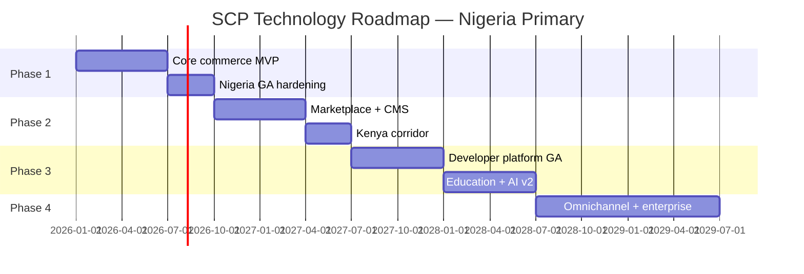
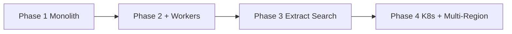

# Chapter 10: Technology Roadmap & Risks

**Document ID:** SCP-MR-002-10  
**Version:** 1.0.0  
**Status:** ✅ Active  
**Traceability:** PRD-001 – PRD-020, NFR-013 – NFR-028, ADR-001, ADR-011, Engineering Principles 1–10

---

## 1. Purpose

Define SCP's **phased technology delivery roadmap** from Nigeria MVP through enterprise multi-region scale, and maintain a **living risk register** with mitigations, owners, and acceptance gates.

## 2. Scope

- Phase 1–4 delivery milestones
- Module extraction criteria (ADR-001)
- Infrastructure evolution path
- Technology risk register (operational, security, market, talent)
- Go/no-go gates per phase

## 3. Out of Scope

- Detailed sprint plans (implementation backlog)
- Legal contract SLAs (Volume 19)
- Financial projections beyond infrastructure cost bands (Volume 10 Ch. 11)

---

## 4. Delivery Phases

### 4.1 Phase Overview

| Phase | Timeline | Merchant Target | Nigeria Focus | Key Deliverables |
|-------|----------|-----------------|---------------|------------------|
| **Phase 1** | Months 1–9 | 0 → 500 | Lagos-primary GA | Catalog, checkout (Paystack), orders, admin, 2 themes, RLS tenancy |
| **Phase 2** | Months 10–18 | 500 → 5,000 | Multi-city Nigeria + Kenya pilot | Marketplace, CMS, AI agents v1, read replicas, OAuth apps |
| **Phase 3** | Months 19–30 | 5,000 → 10,000 | West + East Africa | Theme Store, plugin marketplace, education commerce, extracted search |
| **Phase 4** | Months 31–48 | 10,000+ | Pan-Africa + enterprise | POS, mobile apps, K8s multi-AZ, ERP connectors, EU GDPR tier |

### 4.2 Phase 1 — Nigeria Commerce MVP (Launch Blockers)

| Workstream | Must Ship | Dependency |
|------------|-----------|------------|
| Tenancy + Identity | Shared DB + RLS, Fortify auth, MFA for platform admins | ADR-002, ADR-006 |
| Commerce core | Products, cart, Paystack redirect checkout, orders | ADR-004 |
| Storefront | Next.js + 2 built-in themes, Cloudflare CDN | ADR-003, ADR-008 |
| Operations | CI/CD, backups, on-call, NDPA RoPA | ADR-011, Volume 11 |
| Quality | Tenant isolation suite, PCI SAQ A pack, Lighthouse ≥ 85 mobile | Volume 13 |

**Nigeria GA gate:** NDPC registration, DPO appointed, production in Lagos region, zero P1 security findings.

### 4.3 Phase 2 — Growth & Kenya Corridor

| Workstream | Deliverable | Extraction Trigger |
|------------|-------------|-------------------|
| Marketplace | Vendor onboarding, split payouts, commissions | None — stays in monolith |
| CMS | Page builder, blog, SEO, media library | None |
| AI Platform | Shopping assistant, merchant ops agent | Dedicated worker pool when GPU/API cost > 15% infra |
| Data layer | PostgreSQL read replica, PgBouncer mandatory | Replica before 2,000 active tenants |
| Kenya | Nairobi region, M-Pesa, ODPC registration | ADR-011 extension |

### 4.4 Phase 3 — Platform Ecosystem

| Workstream | Deliverable | Extraction Trigger |
|------------|-------------|-------------------|
| Developer platform | OAuth apps, webhooks GA, plugin runtime | None until 50+ active apps |
| Theme Store | Review pipeline, revenue share | CDN-only; no service split |
| Search | Meilisearch dedicated cluster | > 5M indexed documents OR p95 > 100ms |
| Education | Courses, enrollments, certificates | Learning module stays in monolith |

### 4.5 Phase 4 — Enterprise & Omnichannel

| Workstream | Deliverable |
|------------|-------------|
| POS | Offline-capable Lagos retail pilots |
| Mobile | Merchant admin app (React Native), shopper PWA |
| Analytics | ClickHouse or BigQuery export pipeline |
| Enterprise | SSO (SAML), custom contracts, dedicated cells |

---

## 5. Service Extraction Path

Per ADR-001, extraction is **criteria-driven**, not calendar-driven.

| Candidate Service | Extract When | Keep in Monolith Until |
|-------------------|--------------|------------------------|
| **Search (Meilisearch)** | Index size > 5M docs OR dedicated team needed | p95 autocomplete ≤ 100ms on shared cluster |
| **AI inference workers** | Monthly AI spend > ₦2M OR queue lag p95 > 30s | Horizon workers sufficient |
| **Webhook delivery** | > 50M deliveries/month OR delivery SLA breaches | Monolith Horizon handles retries |
| **Media processing** | Video transcoding at scale | Image resize via Cloudflare Images |
| **Notifications** | SMS/email volume requires separate rate pools | Termii/Africa's Talking via adapters |

**Anti-pattern:** Premature microservices before 5,000 merchants — operational cost kills Nigerian SME pricing model.

---

## 6. Technology Risk Register

| ID | Risk | Likelihood | Impact | Mitigation | Owner | Residual |
|----|------|------------|--------|------------|-------|----------|
| R-T01 | **NDPA enforcement delays merchant signup** | Medium | High | Legal review pre-GA; DPO appointed; privacy center self-serve | Legal + DPO | Low |
| R-T02 | **Paystack/Flutterwave outage blocks checkout** | Medium | High | Dual PSP support; queue reconciliation; status page comms | Engineering | Medium |
| R-T03 | **Cross-tenant data leak** | Low | Critical | RLS + app scope + isolation test suite on every PR | Security | Low |
| R-T04 | **Lagos datacenter/network instability** | Medium | High | Cloudflare edge caching; multi-AZ Phase 4; DR drills | DevOps | Medium |
| R-T05 | **Talent shortage (Laravel + Next.js)** | High | Medium | Agency partnerships; documented onboarding; Nigeria dev community | HR + Eng | Medium |
| R-T06 | **AI cost overrun per tenant** | Medium | Medium | Token budgets, model routing, tenant cost caps (Volume 9) | AI lead | Low |
| R-T07 | **Shopify price compression in Africa** | Medium | Medium | Nigeria pricing (NGN), local payments, education moat | Product | Medium |
| R-T08 | **FrankenPHP/Octane memory leaks** | Low | Medium | Worker max-requests, memory alerts, graceful restart | DevOps | Low |
| R-T09 | **Currency volatility (NGN/USD)** | High | Medium | NGN-native billing; USD infra hedging in cost model | Finance | Medium |
| R-T10 | **Plugin/theme malicious code** | Medium | High | App review, CSP sandbox, capability model (Volumes 6, 12) | Security | Low |

### 6.1 Risk Review Cadence

| Activity | Frequency | Output |
|----------|-----------|--------|
| Risk register review | Monthly | Updated scores in this chapter |
| Phase gate review | Per milestone | Go/no-go memo |
| Competitive threat scan | Quarterly | Volume 2 Ch. 02–03 refresh |
| DR / security tabletop | Quarterly | Volume 14 incident logs |

---

## 7. Dependency & Sequencing Rules

1. **Security before scale** — NDPA, RLS, PCI SAQ A complete before marketing push beyond 100 merchants.
2. **API before UI** — Every admin feature ships Storefront/Admin API first (Engineering Principle 4).
3. **Events before integrations** — Webhook catalog stable before app marketplace opens.
4. **Observability before extraction** — Cannot split a service without traces and SLOs (NFR-062).
5. **Nigeria before Kenya** — KE region only after NG SLOs sustained 99.9% for 90 days.

---

## 8. Architecture Impact Summary

| Decision | Roadmap Impact |
|----------|----------------|
| Modular monolith | Phases 1–3 ship as single deploy; reduces Nigeria ops burden |
| Nigeria-primary | Phase 1–2 engineering concentrated on Lagos latency and NDPA |
| Event-driven | Enables async AI, webhooks, analytics without blocking checkout |
| Cloudflare edge | Mitigates R-T04; global PoPs help African shoppers |
| Phased extraction | Protects unit economics for ₦15k–₦50k/month merchant plans |

---

## 9. Acceptance Criteria

- [ ] Phase 1–4 milestones documented with merchant count targets
- [ ] Service extraction criteria aligned with ADR-001 and Volume 3 Ch. 11
- [ ] Risk register contains ≥ 10 technology risks with owners and mitigations
- [ ] Nigeria GA gate lists NDPC, DPO, residency, and isolation suite requirements
- [ ] Kenya corridor gated behind Nigeria 99.9% SLO proof
- [ ] Monthly risk review process assigned to Lead Architect
- [ ] No placeholder phases or undated deliverables

---

## 10. References

- [ADR-001: Modular Monolith](../00-meta/adr/001-modular-monolith-over-microservices.md)
- [ADR-011: Data Residency](../00-meta/adr/011-data-residency-africa.md)
- [Volume 3 Ch. 11 — Scalability](../03-architecture/11-scalability-and-service-extraction.md)
- [Volume 10 — Infrastructure](../10-infrastructure/README.md)
- [Volume 15 — Future Roadmap](../15-future-roadmap/01-roadmap-overview.md)
- [Research Program](../00-meta/research-and-synthesis-program.md)
