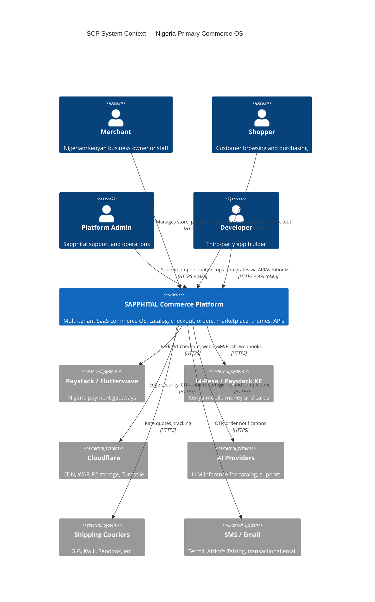
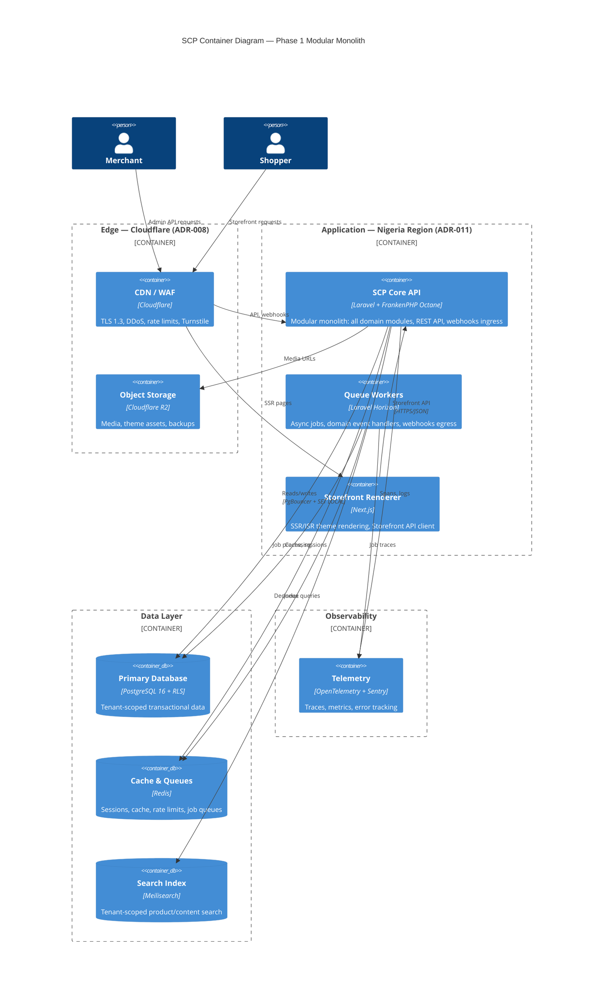
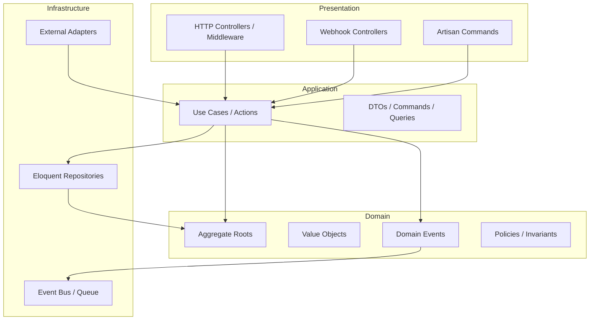
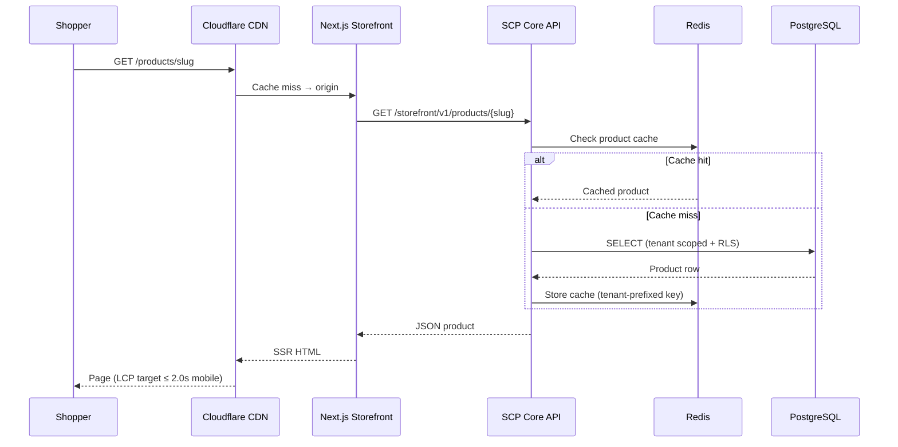
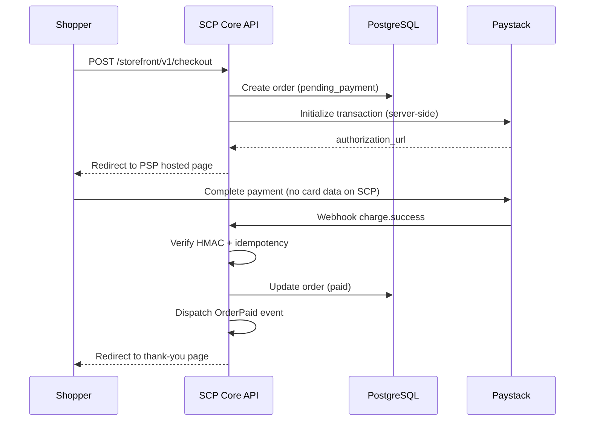
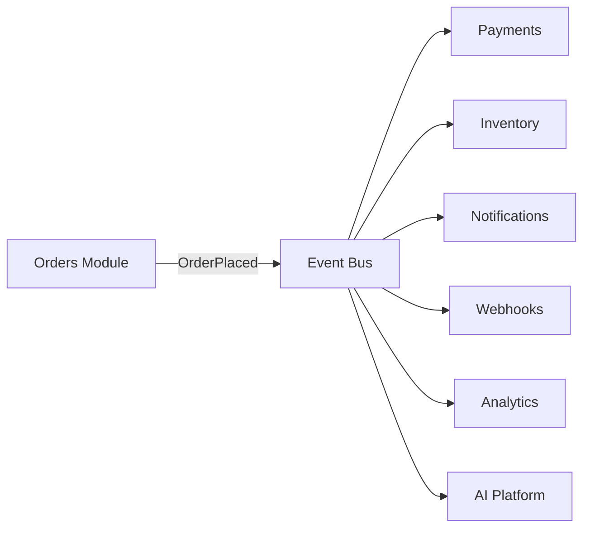

# Chapter 01: Architecture Overview

**Document ID:** SCP-ARCH-001-01  
**Version:** 1.0.0  
**Status:** ✅ Active  
**Traceability:** ADR-001, NFR-001 – NFR-028, FR-020 – FR-025  

---

## Purpose

Provide a system-level view of SCP using the C4 model. This chapter establishes the platform boundary, major containers, and data flows that all subsequent architecture chapters refine.

## Scope

- C4 Level 1 (System Context)
- C4 Level 2 (Container)
- High-level request and event flows
- Nigeria-primary deployment context

## Out of Scope

- Component-level diagrams per module (Volume 5+)
- Infrastructure sizing and runbooks (Volume 10)

---

## 1. System Context (C4 Level 1)

SCP sits between merchants, shoppers, payment providers, and third-party integrators. The platform is operated by Sapphital Learning Company with **primary compute and data residency in Nigeria (Lagos region)** per ADR-011.

### Context Actors

| Actor | Primary Market | Interaction |
|-------|----------------|-------------|
| Merchant | Nigeria (primary), Kenya | Admin dashboard, mobile admin |
| Shopper | Nigeria, Kenya, Africa | Storefront (Next.js), mobile web |
| Platform Admin | Nigeria HQ | Separate auth guard, MFA, impersonation (ADR-010) |
| Developer | Global | REST API, webhooks, future OAuth apps |

### External Systems

| System | Role | PCI / Compliance |
|--------|------|------------------|
| Paystack, Flutterwave | Nigeria card, bank, USSD | Hosted/redirect — SAQ A (ADR-004) |
| M-Pesa, Paystack KE | Kenya payments | No card data on SCP |
| Cloudflare | Edge, CDN, R2, bot protection | Subprocessor per NDPA RoPA |
| AI providers | Descriptions, support assist | DPIA; no cross-tenant context |
| Couriers | Fulfillment integrations | Merchant-configured credentials |

---

## 2. Container Diagram (C4 Level 2)

SCP Phase 1 deploys as a **modular monolith** (ADR-001) with externalized search and edge services.

### Container Responsibilities

| Container | Responsibility | Scaling (Phase 1 → 3) |
|-----------|----------------|------------------------|
| **SCP Core API** | HTTP API, admin, webhook ingress, domain logic | Vertical → horizontal replicas |
| **Queue Workers** | Events, notifications, search indexing, webhooks | Horizontal worker pool |
| **Storefront Renderer** | Theme SSR/ISR, edge-cacheable pages | CDN + multiple Next.js instances |
| **PostgreSQL** | System of record; RLS enforcement | Read replicas Phase 2 |
| **Redis** | Hot cache, sessions, queues | Sentinel/cluster Phase 3 |
| **Meilisearch** | Full-text search | Dedicated cluster; extractable service |
| **Cloudflare** | Security perimeter, static asset delivery | Managed scale |

---

## 3. Logical Architecture Layers

Within the SCP Core API container, code follows **clean architecture** (see Chapter 04):

**Rule:** Domain layer has zero dependencies on Laravel, HTTP, or database frameworks.

---

## 4. Primary Data Flows

### 4.1 Storefront Product Browse

### 4.2 Checkout and Payment (Redirect Model)

Per ADR-004, SCP never stores PAN/CVV. Payment state transitions require webhook verification — never client-side confirmation alone.

### 4.3 Cross-Module Event Flow

Events are the **only** approved mechanism for cross-module side effects (FR-024).

---

## 5. Deployment Context

| Attribute | Phase 1 Value |
|-----------|---------------|
| Primary region | Nigeria (Lagos) or nearest West Africa cloud AZ |
| Kenya merchants | Route to East Africa region when activated (ADR-011) |
| Runtime | Docker Compose → managed VPS; FrankenPHP Octane |
| Edge | Cloudflare proxy (orange-cloud) on all public domains |
| Availability target | 99.9% monthly (NFR-021) |

Detailed topology in [Chapter 12](./12-deployment-and-runtime-topology.md).

---

## 6. Architecture Impact Summary

| Decision | Impact |
|----------|--------|
| Modular monolith | Single deploy; ACID cross-domain transactions |
| API-first | Storefront, admin, mobile, AI all consume same APIs |
| Event-driven | Loose coupling; async side effects; extraction-ready |
| Shared DB + RLS | Operational simplicity; defense-in-depth isolation |
| Nigeria-primary | NDPA alignment; low latency for Lagos merchants |

---

## 7. Acceptance Criteria

- [ ] C4 Context diagram includes all Phase 1 external systems (Paystack, Flutterwave, Cloudflare, M-Pesa)
- [ ] C4 Container diagram shows modular monolith boundary and externalized Meilisearch
- [ ] Checkout flow documented as PSP redirect (ADR-004)
- [ ] Primary data residency noted as Nigeria (ADR-011)
- [ ] Event-driven cross-module rule stated (FR-024)
- [ ] Architecture review confirms alignment with Volume 1 domain map

---

## References

- [ADR-001: Modular Monolith](../00-meta/adr/001-modular-monolith-over-microservices.md)
- [ADR-023: Platform OS](../00-meta/adr/023-sapphital-platform-os.md)
- [Chapter 13 — Platform OS Architecture](./13-platform-os-architecture.md)
- [ADR-004: Checkout / SAQ A](../00-meta/adr/004-checkout-psp-redirect-saq-a.md)
- [ADR-008: Cloudflare Edge](../00-meta/adr/008-edge-security-cloudflare.md)
- [ADR-011: Data Residency](../00-meta/adr/011-data-residency-africa.md)
- [Volume 1 — Domain Model](../01-vision/10-domain-model-overview.md)
- C4 Model: https://c4model.com/
