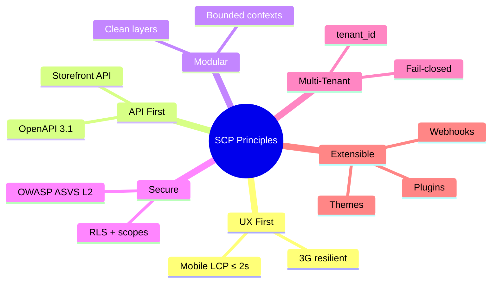
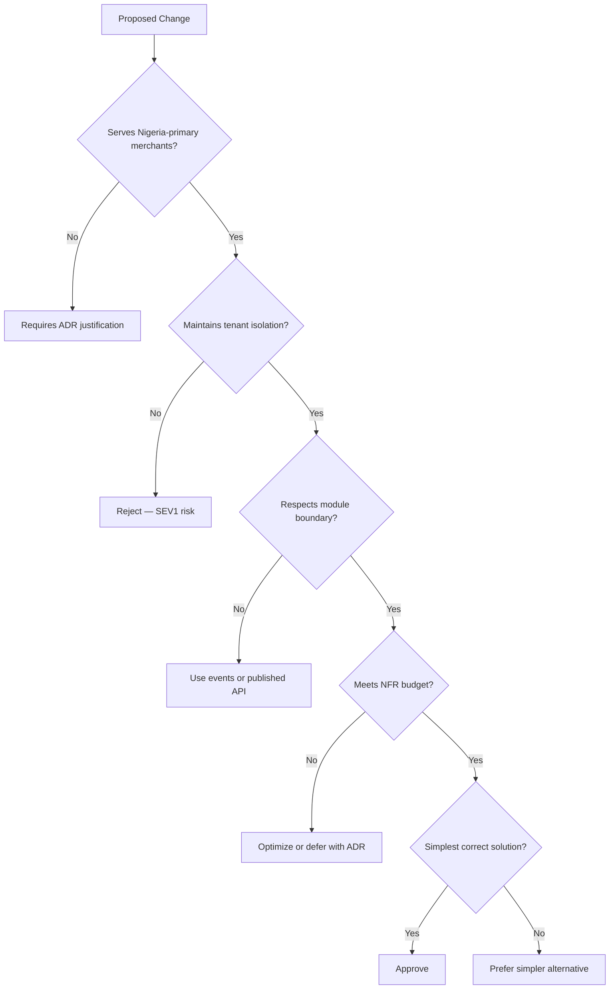

# Chapter 02: Architectural Principles and Constraints

**Document ID:** SCP-ARCH-001-02  
**Version:** 1.0.0  
**Status:** ✅ Active  
**Traceability:** ADR-001, ADR-023, NFR-001 – NFR-082, Volume 1 Product Principles  

---

## Purpose

Define the **non-negotiable architectural principles** and **binding constraints** that govern every SCP design decision. When modules conflict or trade-offs arise, these principles determine the correct resolution.

## Scope

- Engineering principles (platform-level)
- Architectural constraints derived from NFRs and ADRs
- Decision framework for module authors
- Anti-patterns explicitly forbidden

## Out of Scope

- Product UX principles (Volume 1, Chapter 04)
- Module-specific business rules (Volume 5+)

---

## 1. Engineering Principles

SCP architecture implements ten engineering principles. Each maps to concrete enforcement mechanisms.

| # | Principle | Architectural Expression | Enforcement |
|---|-----------|-------------------------|-------------|
| 1 | **UX First** | SSR/ISR storefront; optimistic admin updates via API | NFR-001, NFR-006; Next.js + Octane |
| 2 | **Performance** | Cache-aside reads; async writes; query budgets | NFR-003 – NFR-008; Redis, indexes |
| 3 | **API-First** | All surfaces consume versioned REST APIs | OpenAPI 3.1; no admin-only hidden endpoints |
| 4 | **Modular** | Platform OS: Kernel / Services / Products / Connectors | `Platform/`, `Modules/`, `Connectors/`; ADR-023 |
| 5 | **Decoupled** | Events and published interfaces only cross modules | FR-024; no cross-module Eloquent relations |
| 6 | **AI Native** | AI module as first-class bounded context | Extraction-ready; tenant-scoped prompts |
| 7 | **Secure by Default** | Fail-closed tenant context; deny-by-default authz | NFR-029 – NFR-046; RLS (ADR-002) |
| 8 | **Multi-Tenant** | `tenant_id` everywhere; defense-in-depth isolation | ADR-002, ADR-005; isolation test suite |
| 9 | **Extensible** | Themes, plugins, webhooks without core forks | ADR-003; extension registry |
| 10 | **Observable** | Structured logs, traces, metrics on every path | NFR-062 – NFR-068; OpenTelemetry |

---

## 2. Binding Architectural Constraints

These constraints are **mandatory** for Phase 1 Nigeria launch. Violations require an ADR with explicit risk acceptance.

### 2.1 Structural Constraints

| ID | Constraint | Source | Rationale |
|----|------------|--------|-----------|
| AC-001 | Single deployable modular monolith | ADR-001 | Team size (1–5); MVP timeline |
| AC-002 | PostgreSQL as system of record | NFR-060 | ACID for orders + inventory + payments |
| AC-003 | No direct cross-module database joins | FR-024 | Module extraction path |
| AC-004 | Aggregate roots referenced by ID across modules | Domain Model | Consistency boundaries |
| AC-005 | All tenant-scoped tables include `tenant_id` | FR-020, ADR-002 | Isolation foundation |
| AC-006 | Money stored as integer minor units | FR-021 | Naira/KES precision; no floats |

### 2.2 Security Constraints

| ID | Constraint | Source |
|----|------------|--------|
| AC-007 | PostgreSQL RLS on all tenant tables | ADR-002, NFR-040 |
| AC-008 | `SET LOCAL app.tenant_id` per transaction | ADR-005 |
| AC-009 | Missing tenant context → request rejected | Volume 11 acceptance |
| AC-010 | PSP redirect checkout only (Phase 1) | ADR-004, NFR-044 |
| AC-011 | No secrets in source control | ADR-007, NFR-045 |
| AC-012 | TLS 1.3 minimum | NFR-030 |
| AC-013 | Platform admin separate auth guard + MFA | ADR-006 |

### 2.3 Operational Constraints

| ID | Constraint | Source |
|----|------------|--------|
| AC-014 | Primary production in Nigeria/West Africa | ADR-011, NFR-071 |
| AC-015 | Cloudflare as edge security provider | ADR-008 |
| AC-016 | Zero-downtime migrations from Phase 2 | NFR-028, NFR-076 |
| AC-017 | Audit log append-only for mandatory events | ADR-009, NFR-075 |
| AC-018 | Isolation test suite blocking in CI | NFR-040, Volume 11 |

### 2.4 Performance Budgets

| Surface | Metric | Target | NFR |
|---------|--------|--------|-----|
| Storefront LCP (mobile p75) | ≤ 2.0s | NFR-001 |
| API read p95 | ≤ 200ms | NFR-003 |
| API write p95 | ≤ 500ms | NFR-004 |
| DB query p95 | ≤ 50ms | NFR-007 |
| Search autocomplete p95 | ≤ 100ms | NFR-005 |
| Background job p95 | ≤ 5s | NFR-008 |

---

## 3. Nigeria-Primary Design Constraints

African market realities shape architecture beyond generic SaaS patterns.

| Constraint | Implementation |
|------------|----------------|
| **Mobile-first traffic** | Storefront JS budget ≤ 150 KB gzipped (NFR-009); touch targets ≥ 44px |
| **3G resilience** | Functional on 768 Kbps (NFR-058); skeleton screens; deferred images |
| **Local payments first** | Paystack, Flutterwave, USSD, M-Pesa adapters; redirect model |
| **Phone as identity** | E.164 phone numbers; OTP path Phase 2 (ADR-006) |
| **Multi-currency** | NGN, KES, GHS, USD (NFR-078); Money value object |
| **NDPA compliance** | Nigeria residency default; subprocessor register; export/deletion APIs |
| **Latency** | Cloudflare African PoPs; Nigeria-region compute |

---

## 4. Decision Framework

When evaluating an architectural choice, score against this checklist:

### Escalation to ADR

An ADR is **required** when a decision:

- Changes module boundaries or data ownership
- Introduces a new external dependency or subprocessor
- Weakens security or tenant isolation
- Deviates from NFR targets with accepted trade-off
- Affects deployment topology or data residency

---

## 5. Forbidden Anti-Patterns

| Anti-Pattern | Why Forbidden | Alternative |
|--------------|---------------|-------------|
| God service / god module | Unmaintainable; blocks extraction | Split bounded context |
| Cross-module Eloquent `belongsTo` | Hidden coupling; breaks extraction | Query via repository interface or event projection |
| Session-level `SET app.tenant_id` | Cross-tenant leak with PgBouncer | `SET LOCAL` per transaction (ADR-005) |
| Client-side price authority | Fraud vector | Server-side recompute at checkout |
| Shared mutable static state in Octane | Worker memory leak; tenant bleed | Request-scoped containers |
| Synchronous cross-module calls in HTTP path | Latency cascade; tight coupling | Domain events + async handlers |
| Embedded payment iframe (Phase 1) | PCI SAQ A eligibility risk | PSP redirect (ADR-004) |
| Raw SQL without parameterization | SQL injection | Eloquent / query builder |
| Secrets in `.env` committed to git | Credential leak | CI gitleaks gate (ADR-007) |
| Optional tenant context | Cross-tenant access | Fail-closed middleware |

---

## 6. Quality Attribute Priorities

When quality attributes conflict, resolve in this priority order for Phase 1:

1. **Security & tenant isolation** — non-negotiable
2. **Data integrity** — financial and order consistency
3. **Availability** — 99.9% target
4. **Performance** — meet NFR budgets
5. **Maintainability** — module clarity over cleverness
6. **Cost efficiency** — within single-server Phase 1 budget

---

## 7. Risks and Tradeoffs

| Risk | Mitigation |
|------|------------|
| Module boundary erosion over time | Architecture reviews; lint rules; CODEOWNERS per module |
| Noisy neighbor on shared DB | Per-tenant rate limits; query timeouts; read replicas |
| Monolith scaling ceiling | Documented extraction path (Chapter 11) |
| RLS + pooling complexity | ADR-005; automated isolation tests |
| Theme XSS/PCI scope | Sandboxed themes; checkout template lockdown (ADR-003) |

---

## 8. Acceptance Criteria

- [ ] All ten engineering principles mapped to enforcement mechanisms
- [ ] Binding constraints AC-001 through AC-018 documented with source IDs
- [ ] Nigeria-primary constraints explicitly listed
- [ ] Decision framework and ADR escalation criteria defined
- [ ] Anti-pattern list reviewed by security and architecture leads
- [ ] No principle conflicts with ADR-001 through ADR-011 without documented exception

---

## References

- [ADR-001: Modular Monolith](../00-meta/adr/001-modular-monolith-over-microservices.md)
- [Volume 1 — Product Principles](../01-vision/04-product-principles.md)
- [Volume 1 — NFRs](../01-vision/09-non-functional-requirements.md)
- ISO/IEC/IEEE 42010 — Architecture description
