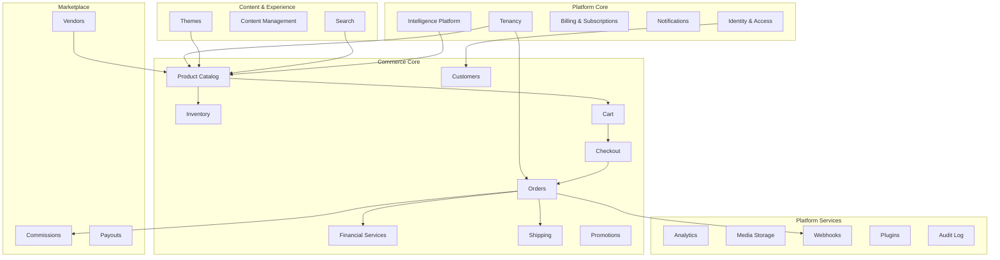
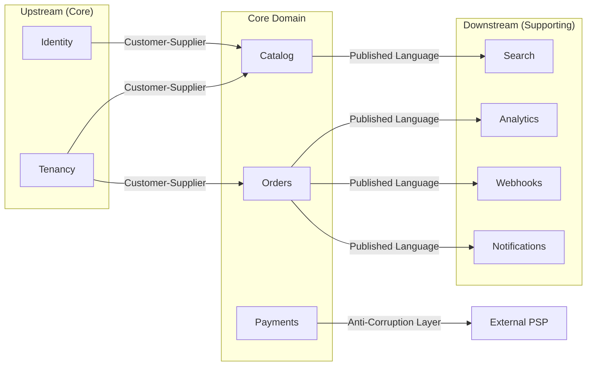

# Chapter 03: Bounded Contexts and Modules

**Document ID:** SCP-ARCH-001-03  
**Version:** 1.1.0  
**Status:** ✅ Active  
**Traceability:** ADR-001, ADR-023, FR-020 – FR-025, Volume 1 Domain Model  

---

## Purpose

Map SCP's **bounded contexts** to **Platform OS packages** (ADR-023). Bounded contexts are logical DDD boundaries; **installable packages** are physical units under `Platform/`, `Modules/`, `Connectors/`, `Themes/`, and `AI/`. Full layering in [Chapter 13 — Platform OS Architecture](./13-platform-os-architecture.md).

## Scope

- Bounded context catalog
- Platform OS package map (installable units)
- Internal package structure (DDD layers inside each package)
- Context mapping (upstream/downstream)
- Aggregate ownership
- Cross-package interaction rules

## Out of Scope

- Detailed entity schemas (Volume 5+)
- API endpoint specifications (module volumes)

---

## 1. Bounded Context Catalog

SCP organizes into five context groups aligned with [Volume 1 Domain Model](../01-vision/10-domain-model-overview.md).



---

## 2. Platform OS Package Map

**Installable packages** are versioned units with `module.json`, independent CI, and semver. They are **not** the same as bounded contexts — Commerce is one product containing many contexts (Catalog, Cart, Orders, …).

| Package | Layer | Path | Bounded Contexts | Phase |
|---------|-------|------|------------------|-------|
| **Kernel** | Kernel | `Platform/Kernel/` | Module Manager, Settings, Events, Jobs | 1 |
| **Identity** | Kernel | `Platform/Identity/` | Identity & Access | 1 |
| **Tenancy** | Kernel | `Platform/Tenancy/` | Tenancy | 1 |
| **Billing** | Kernel | `Platform/Billing/` | Billing & Subscriptions | 1 |
| **Provisioning** | Kernel | `Platform/Provisioning/` | Tenant Provisioning (TPE) | 1 |
| **FinancialServices** | Platform Service | `Platform/FinancialServices/` | Financial Services Layer | 1 |
| **Intelligence** | Platform Service | `Platform/Intelligence/` | Intelligence Platform (SIP) | 1 |
| **Notifications** | Platform Service | `Platform/Notifications/` | Notifications | 1 |
| **Search** | Platform Service | `Platform/Search/` | Search | 1 |
| **Workflow** | Platform Service | `Platform/Workflow/` | Automation | 2 |
| **Media** | Platform Service | `Platform/Media/` | Media Storage | 1 |
| **Analytics** | Platform Service | `Platform/Analytics/` | Analytics | 2 |
| **Webhooks** | Platform Service | `Platform/Webhooks/` | Webhooks | 1 |
| **Audit** | Platform Service | `Platform/Audit/` | Audit Log | 1 |
| **Commerce** | Business Product | `Modules/Commerce/` | Catalog, Inventory, Cart, Checkout, Orders, Customers, Promotions, Shipping | 1 |
| **Marketplace** | Business Product | `Modules/Marketplace/` | Vendors, Commissions, Payouts | 2 |
| **Content** | Extension | `Modules/Commerce/Extensions/Content/` or `Modules/Extensions/Content/` | CMS | 2 |
| **Plugins** | Extension | `Modules/Extensions/` | Plugin installations | 3 |
| **Paystack, Flutterwave, …** | Connector | `Connectors/{Name}/` | PSP anti-corruption layers | 1 |
| **Theme packages** | Theme | `Themes/{Name}/` | Storefront presentation | 1–3 |
| **AI Skills** | AI Skill | `AI/{Name}/` | CatalogAgent, SupportAgent, … | 1–2 |

**Rules:**

- Kernel packages **must not** import from `Modules\`.
- Connectors implement platform contracts only (e.g. `PaymentGatewayAdapter`).
- Commerce bounded contexts communicate in-process within `Modules/Commerce/`; cross-product calls use events or platform service APIs.

---

## 3. Bounded Context Registry

Logical DDD boundaries from [Volume 1 Domain Model](../01-vision/10-domain-model-overview.md). Rows marked **internal** live inside a parent product package, not as separate installables.

| Context | Parent Package | Aggregate Roots | Phase | Owner Team |
|---------|----------------|-----------------|-------|------------|
| **Provisioning** (TPE) | `Platform/Provisioning/` | ProvisioningRun, Store | 1 | Platform |
| **Tenancy** | `Platform/Tenancy/` | Tenant | 1 | Platform |
| **Identity & Access** | `Platform/Identity/` | User, Role | 1 | Platform |
| **Billing & Subscriptions** | `Platform/Billing/` | Subscription, Plan | 1 | Platform |
| **Product Catalog** | `Modules/Commerce/` *(internal)* | Product | 1 | Commerce |
| **Inventory** | `Modules/Commerce/` *(internal)* | InventoryLevel | 1 | Commerce |
| **Cart** | `Modules/Commerce/` *(internal)* | Cart | 1 | Commerce |
| **Checkout** | `Modules/Commerce/` *(internal)* | (orchestrator) | 1 | Commerce |
| **Orders** | `Modules/Commerce/` *(internal)* | Order | 1 | Commerce |
| **Financial Services** | `Platform/FinancialServices/` | PaymentIntent, LedgerEntry | 1 | Platform / FSL |
| **Payments** (facade) | `Platform/FinancialServices/` | Payment | 1 | Delegates to FSL |
| **Shipping** | `Modules/Commerce/` *(internal)* | Shipment | 1 | Commerce |
| **Customers** | `Modules/Commerce/` *(internal)* | Customer | 1 | Commerce |
| **Promotions** | `Modules/Commerce/` *(internal)* | Coupon | 1 | Commerce |
| **Reviews** | `Modules/Commerce/` *(internal)* | Review | 2 | Commerce |
| **Themes** | `Themes/*` | Theme | 1–3 | Experience |
| **Content Management** | Extension / Commerce | Page | 2 | Experience |
| **Search** | `Platform/Search/` | (projection) | 1 | Platform |
| **Marketplace** | `Modules/Marketplace/` | Vendor | 2 | Marketplace |
| **Notifications** | `Platform/Notifications/` | (delivery) | 1 | Platform |
| **Analytics** | `Platform/Analytics/` | (read models) | 2 | Platform |
| **Media Storage** | `Platform/Media/` | Media | 1 | Platform |
| **Webhooks** | `Platform/Webhooks/` | WebhookSubscription | 1 | Developer |
| **Plugins** | `Modules/Extensions/` | PluginInstallation | 3 | Developer |
| **Intelligence Platform** | `Platform/Intelligence/` | Conversation, AgentRun | 1 | Platform |
| **Audit Log** | `Platform/Audit/` | AuditLog | 1 | Platform |

---

## 4. Package Internal Structure

Every **installable package** follows the layout in [Chapter 13 §10](./13-platform-os-architecture.md). Inside `src/`, DDD layers remain consistent for extraction readiness:

```text
{Platform|Modules|Connectors}/{PackageName}/
├── src/
│   ├── Domain/
│   │   ├── Aggregates/
│   │   ├── ValueObjects/
│   │   ├── Events/
│   │   ├── Repositories/
│   │   └── Services/
│   ├── Application/
│   │   ├── Actions/
│   │   ├── DTOs/
│   │   ├── Queries/
│   │   └── Listeners/
│   ├── Infrastructure/
│   │   ├── Persistence/
│   │   ├── External/
│   │   └── Jobs/
│   └── Http/
│       ├── Controllers/
│       ├── Requests/
│       └── Resources/
├── database/migrations/
├── routes/
├── tests/
├── docs/                    # Module contract docs (ADR-023)
├── module.json
├── composer.json
└── {PackageName}ServiceProvider.php
```

**Legacy note:** Early scaffolds may reference `app/Modules/` — new work uses `Platform/` and `Modules/` at repository root only.

### Service Provider Responsibilities

- Register routes, policies, event listeners from `module.json`
- Bind repository interfaces to implementations
- **Must not** import another package's Infrastructure layer

---

## 5. Context Mapping

Relationships between contexts follow DDD context mapping patterns.



| Pattern | Example | Rule |
|---------|---------|------|
| **Customer-Supplier** | Tenancy → Catalog | Upstream defines contract; downstream conforms |
| **Published Language** | Orders → Webhooks | Events are the shared contract |
| **Anti-Corruption Layer** | Payments → Paystack | External adapter isolates PSP models |
| **Conformist** | Search → Catalog events | Search conforms to catalog event schema |
| **Orchestrator** | Checkout | Coordinates Cart, Orders, Payments without owning their aggregates |

### Checkout as Orchestrator

Checkout is **not** an aggregate owner. It coordinates:

1. Cart validation (Cart module)
2. Order creation (Orders module)
3. Payment initialization (Payments module)
4. Inventory reservation (Inventory module)

Checkout owns **no persistent entities** beyond workflow state (optional checkout session cache in Redis).

---

## 6. Interaction Rules

### 6.1 Allowed Cross-Package Communication

| Mechanism | Use Case | Example |
|-----------|----------|---------|
| **Domain events (async)** | Side effects, notifications, projections | `OrderPlaced` → Notifications |
| **Published query interface** | Read-only cross-module data | `CatalogQueryInterface::findProduct(id)` |
| **Shared kernel (Platform)** | Value objects, tenant context | `Money`, `TenantId` |
| **Synchronous interface (narrow)** | Checkout orchestration only | `OrderCreatorInterface::createFromCart()` |

### 6.2 Forbidden Cross-Package Communication

| Mechanism | Why Forbidden |
|-----------|---------------|
| Direct Eloquent relation across modules | Hidden coupling; breaks extraction |
| Direct table JOIN in another module's repository | Violates data ownership |
| Importing another module's Infrastructure classes | Layer violation |
| Mutating another module's aggregate | Invariant violation (FR-023) |
| Global static mutable state | Octane worker contamination |

### 6.3 Event Subscription Matrix (Core)

| Event | Publisher | Subscribers |
|-------|-----------|-------------|
| `ProductCreated` | Catalog | Search, Analytics, AI |
| `ProductUpdated` | Catalog | Search, Cache invalidation |
| `InventoryChanged` | Inventory | Catalog (availability), Analytics |
| `CartAbandoned` | Cart | Notifications, Analytics, AI |
| `OrderPlaced` | Orders | Payments, Inventory, Notifications, Webhooks, Analytics |
| `OrderPaid` | Payments | Orders, Notifications, Webhooks, Billing |
| `OrderShipped` | Shipping | Orders, Notifications, Webhooks |
| `OrderCancelled` | Orders | Payments, Inventory, Notifications, Webhooks |
| `TenantCreated` | Tenancy | Billing, Analytics, AI |
| `PaymentReceived` | Payments | Orders, Billing, Analytics |

Full event catalog in [Chapter 07](./07-event-driven-communication.md).

---

## 7. Aggregate Ownership Rules

| Rule | Description |
|------|-------------|
| **Single writer** | Only the owning module mutates its aggregate roots |
| **ID-only references** | External modules store foreign aggregate IDs, not embedded entities |
| **Invariant enforcement** | All state changes go through aggregate root methods |
| **Event emission** | Aggregate changes emit domain events after successful persistence |
| **Soft delete** | 30-day recovery window (FR-025); hard delete via scheduled job |

---

## 8. Platform Shared Kernel

These types live in `Packages/Shared/` and may be imported by any package:

| Type | Purpose |
|------|---------|
| `TenantId`, `StoreId`, `UserId` | Branded UUID types |
| `Money` | Integer cents + ISO 4217 currency |
| `Address`, `PhoneNumber`, `Email` | Validated value objects |
| `DomainEvent` | Base event interface |
| `TenantContext` | Request-scoped tenant binding |
| `Auditable` | Trait for audit-eligible actions |

---

## 9. Package Extraction Readiness

Packages designed for future extraction (ADR-001) must:

- Expose all external access via HTTP API or message queue
- Own their database tables (prefix or schema namespace)
- Not depend on in-process calls from other modules except via interfaces
- Publish OpenAPI spec for their public surface

**First extraction candidates:** Search, AI, Notifications (Chapter 11).

---

## 10. Acceptance Criteria

- [ ] All bounded contexts from Volume 1 domain map appear in bounded context registry
- [ ] Every installable package mapped to Platform OS layer (§2)
- [ ] Every context has defined aggregate roots (or orchestrator role for Checkout)
- [ ] Package structure documented in Ch. 13 and enforced in scaffold
- [ ] Context mapping patterns assigned to major relationships
- [ ] Event subscription matrix covers all Volume 1 domain events
- [ ] Cross-package forbidden patterns listed and referenced in PR template
- [ ] Shared kernel types in `Packages/Shared/` only

---

## References

- [ADR-001: Modular Monolith](../00-meta/adr/001-modular-monolith-over-microservices.md)
- [ADR-023: Platform OS](../00-meta/adr/023-sapphital-platform-os.md)
- [Chapter 13 — Platform OS Architecture](./13-platform-os-architecture.md)
- [Volume 1 — Domain Model](../01-vision/10-domain-model-overview.md)
- *Domain-Driven Design* — Eric Evans (context mapping)
- *Implementing Domain-Driven Design* — Vaughn Vernon
