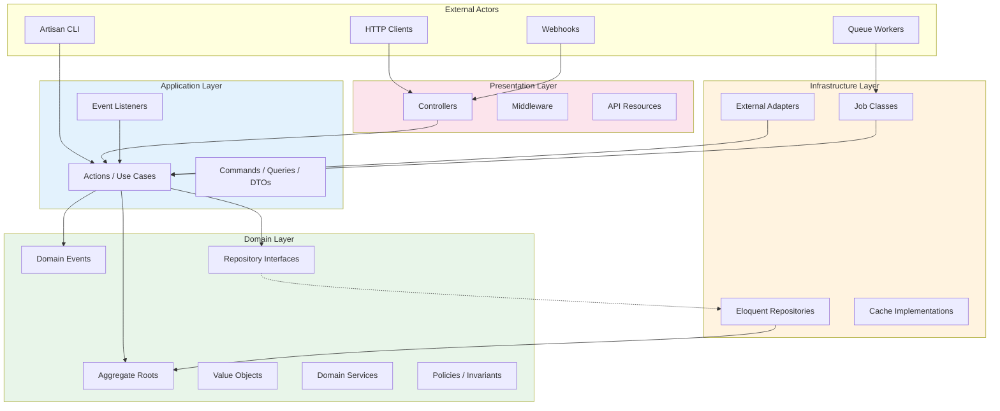
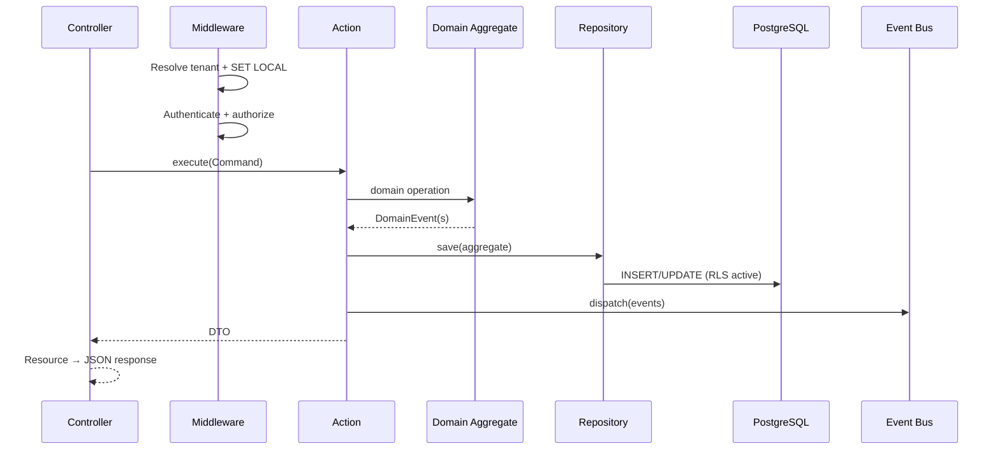
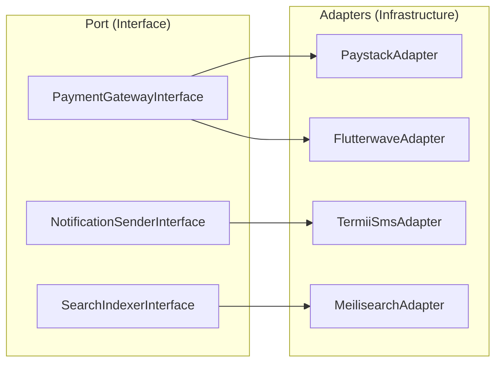

# Chapter 04: Clean Architecture Layers

**Document ID:** SCP-ARCH-001-04  
**Version:** 1.0.0  
**Status:** ✅ Active  
**Traceability:** ADR-001, FR-023, FR-024  

---

## Purpose

Define the **layered architecture** inside each SCP module. Enforce dependency direction so domain logic remains testable, framework-independent, and extraction-ready.

## Scope

- Layer definitions and dependency rules
- Request flow through layers
- Testing strategy per layer
- Octane-specific considerations

## Out of Scope

- Specific use case implementations (Volume 5+)
- Frontend architecture (Volume 4, Volume 6)

---

## 1. Layer Model

SCP implements **Clean Architecture** (Uncle Bob) with **Hexagonal Ports and Adapters** at the infrastructure boundary.



### Dependency Rule

**Dependencies point inward only.** Domain knows nothing about Laravel, HTTP, Eloquent, or Redis.

| Layer | May Depend On | Must Not Depend On |
|-------|---------------|-------------------|
| Domain | Nothing external | Application, Infrastructure, Presentation |
| Application | Domain | Infrastructure (direct), Presentation |
| Infrastructure | Domain, Application | Presentation |
| Presentation | Application, Domain (DTOs only) | Infrastructure (direct) |

---

## 2. Layer Responsibilities

### 2.1 Domain Layer

The **heart** of each module. Pure PHP.

| Component | Responsibility | Example |
|-----------|----------------|---------|
| Aggregate Root | Enforce invariants; emit events | `Order::markAsPaid()` |
| Value Object | Immutable typed attributes | `Money`, `Address` |
| Domain Event | Record what happened | `OrderPlaced` |
| Repository Interface | Persistence contract | `OrderRepositoryInterface` |
| Domain Service | Logic spanning aggregates | `PricingCalculator` |

```php
// Domain layer example — no Laravel imports
final class Order
{
    public function markAsPaid(PaymentReference $ref): OrderPaid
    {
        if ($this->status !== OrderStatus::PendingPayment) {
            throw new InvalidOrderTransitionException();
        }
        $this->status = OrderStatus::Paid;
        return new OrderPaid($this->id, $ref, TenantId::current());
    }
}
```

### 2.2 Application Layer

Orchestrates use cases. **No business rules** — delegates to domain.

| Component | Responsibility | Example |
|-----------|----------------|---------|
| Action | Single use case entry point | `PlaceOrderAction` |
| Command / Query | Input structure | `PlaceOrderCommand` |
| DTO | Output for presentation | `OrderSummaryDTO` |
| Listener | React to cross-module events | `OnOrderPlacedSendNotification` |

```php
// Application layer — coordinates domain + ports
final class PlaceOrderAction
{
    public function __construct(
        private OrderRepositoryInterface $orders,
        private EventDispatcherInterface $events,
    ) {}

    public function execute(PlaceOrderCommand $cmd): OrderId
    {
        $order = Order::createFromCart($cmd->cartSnapshot);
        $this->orders->save($order);
        $this->events->dispatch($order->pullDomainEvents());
        return $order->id();
    }
}
```

### 2.3 Infrastructure Layer

Implements ports. All framework and external I/O lives here.

| Component | Responsibility | Example |
|-----------|----------------|---------|
| Eloquent Repository | DB persistence | `EloquentOrderRepository` |
| External Adapter | Third-party APIs | `PaystackPaymentGateway` |
| Cache Store | Redis implementations | `RedisProductCache` |
| Job | Async execution wrapper | `IndexProductJob` |

### 2.4 Presentation Layer

Translates HTTP to application commands. **Thin controllers.**

| Component | Responsibility |
|-----------|----------------|
| Controller | Validate auth, delegate to Action, return Resource |
| Form Request | Input validation (syntax, not business rules) |
| API Resource | JSON serialization shape |
| Middleware | Tenant resolution, auth, rate limits |

**Controller rule:** ≤ 15 lines per method. No business logic.

---

## 3. Request Flow Through Layers



---

## 4. Ports and Adapters

External systems connect via **ports** (interfaces in Domain/Application) and **adapters** (Infrastructure implementations).



**Rule:** Application layer depends on port interfaces. Service provider binds implementations.

---

## 5. CQRS Lite

SCP uses **command/query separation** without full event sourcing.

| Side | Path | Storage |
|------|------|---------|
| **Commands** | Action → Aggregate → Repository → DB | PostgreSQL (writes) |
| **Queries** | Query handler → Read model / cache | PostgreSQL replicas, Redis, Meilisearch |

**Not event sourced:** Aggregate state lives in PostgreSQL. Events trigger projections and side effects but are not the source of truth for entity state (Phase 1).

Queries **must not** mutate state. Query handlers may bypass aggregate loading for performance when reading denormalized views.

---

## 6. Testing Strategy per Layer

| Layer | Test Type | Dependencies | Location |
|-------|-----------|--------------|----------|
| Domain | Unit | None (pure PHP) | `tests/Unit/Modules/{Name}/Domain/` |
| Application | Unit / Integration | Mocked ports | `tests/Unit/Modules/{Name}/Application/` |
| Infrastructure | Integration | Test DB, Redis | `tests/Integration/Modules/{Name}/` |
| Presentation | Feature / HTTP | Full stack | `tests/Feature/Modules/{Name}/` |
| Cross-module | Contract | Event schema validation | `tests/Contract/` |

**Coverage targets:**

- Domain: 100% of invariant paths
- Application: all use cases
- Tenant isolation: 100% of tenant-scoped models (blocking CI)

---

## 7. Laravel Octane Considerations

FrankenPHP Octane runs persistent workers. Layer design must avoid worker state leaks.

| Concern | Mitigation |
|---------|------------|
| Static properties | Prohibited for request-scoped data |
| Singleton tenant context | Reset in Octane `RequestReceived` listener |
| Memory growth | Monitor worker memory; `--max-requests` recycle |
| Open DB connections | Connection pooling via PgBouncer; Octane disconnect |
| Container bindings | Request-scoped bindings for `TenantContext` |

```php
// Octane listener — reset tenant context between requests
Event::listen(RequestReceived::class, function () {
    TenantContext::reset();
});
```

---

## 8. Module Boundary Enforcement

CI checks (Phase 1 minimum):

| Check | Tool | Rule |
|-------|------|------|
| Domain import purity | PHPStan / custom rule | No `Illuminate\*` in Domain |
| Cross-module infra imports | Deptrac | Infrastructure cannot cross module boundaries |
| Controller thinness | PHPStan | No direct Eloquent in controllers |
| Layer dependency direction | Deptrac | Presentation → Application → Domain |

---

## 9. Acceptance Criteria

- [ ] Four layers defined with dependency rules
- [ ] Domain layer framework independence stated and enforceable
- [ ] Request flow sequence diagram covers tenant binding and event dispatch
- [ ] Ports and adapters pattern documented with payment example
- [ ] CQRS lite approach defined (not event sourcing Phase 1)
- [ ] Testing strategy per layer with isolation test requirement
- [ ] Octane worker state reset documented
- [ ] CI boundary enforcement rules listed

---

## References

- *Clean Architecture* — Robert C. Martin
- *Implementing Domain-Driven Design* — Vaughn Vernon
- [ADR-001: Modular Monolith](../00-meta/adr/001-modular-monolith-over-microservices.md)
- Laravel Octane: https://laravel.com/docs/octane
