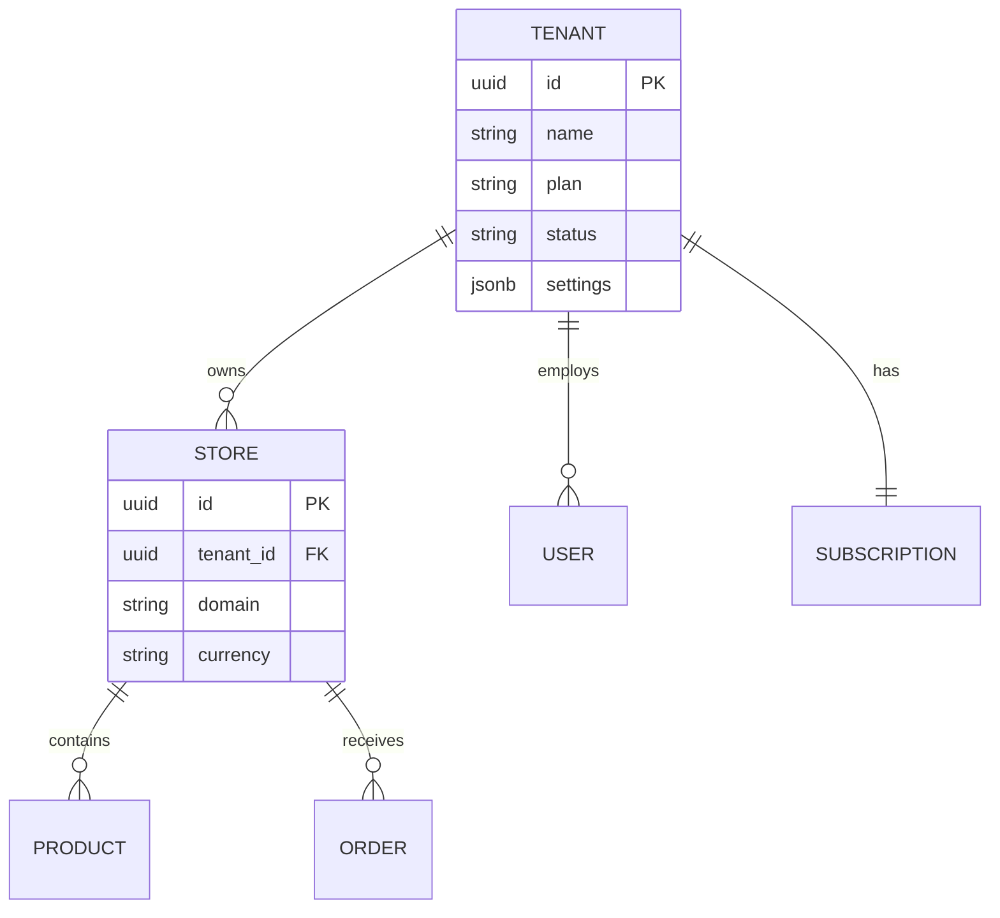
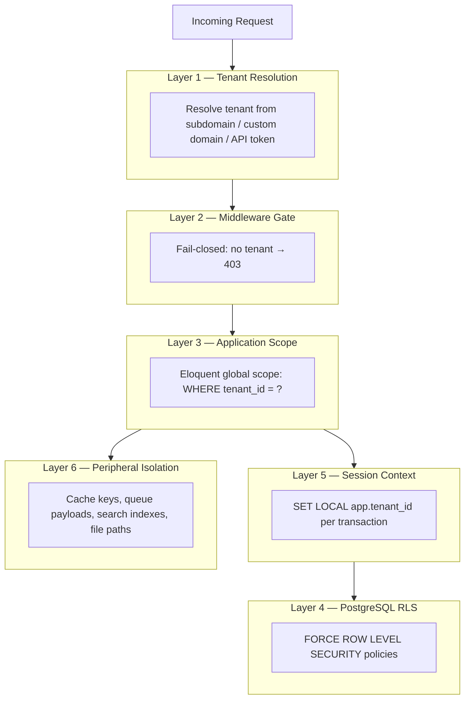
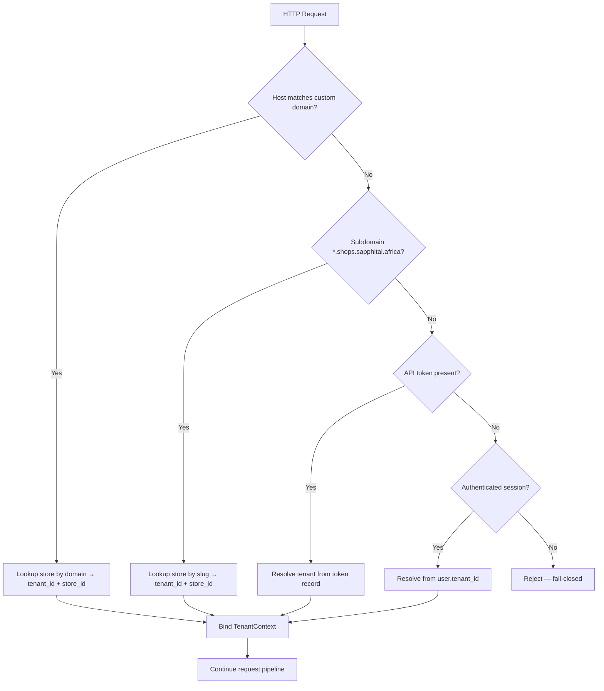
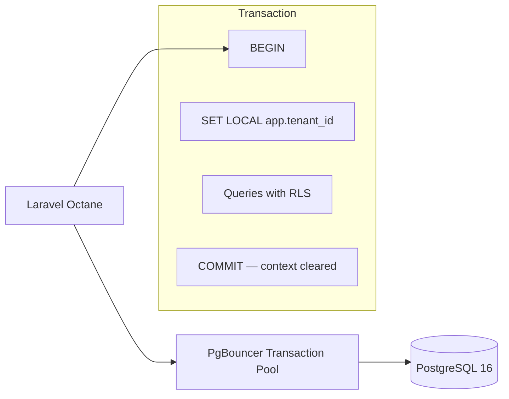
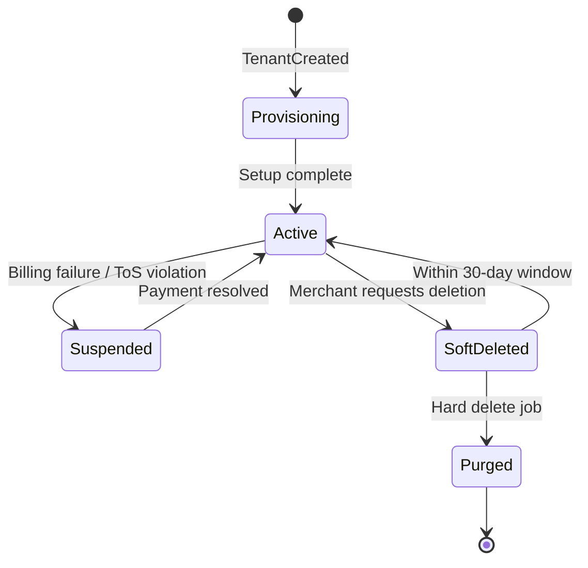

# Chapter 05: Multi-Tenancy and Isolation

**Document ID:** SCP-ARCH-001-05  
**Version:** 1.0.0  
**Status:** ✅ Active  
**Traceability:** ADR-002, ADR-005, FR-020, NFR-040, NFR-071  

---

## Purpose

Define SCP's **multi-tenancy model** and **defense-in-depth isolation** strategy. Every merchant's data must be inaccessible to other tenants — verified by automated tests on every pull request.

## Scope

- Tenancy model (shared database + RLS)
- Tenant resolution and context propagation
- Six-layer isolation stack
- RLS policy design and PgBouncer `SET LOCAL` discipline
- Cache, queue, search, and file isolation
- Enterprise tier upgrade path

## Out of Scope

- Billing plans and entitlements (Volume 7)
- Legal DPA text (legal counsel)

---

## 1. Tenancy Model

SCP is a **multi-tenant SaaS platform** where each merchant organization is a **Tenant**. A tenant may operate one or more **Stores** (storefronts).



### Decision Summary (ADR-002)

| Phase | Model | Isolation |
|-------|-------|-----------|
| Phase 1–3 | Shared PostgreSQL, `tenant_id` column | App scopes + RLS |
| Phase 4 (Enterprise) | Schema-per-tenant or dedicated DB | Physical separation |

**Rejected alternatives:** Database-per-tenant (10K DBs at scale), app-level-only scoping (single bug = total breach).

---

## 2. Defense-in-Depth Isolation Stack

Tenant isolation is enforced at **six independent layers**. All must pass for data access.



| Layer | Failure Mode | Detection |
|-------|--------------|-----------|
| 1 — Resolution | Wrong tenant bound | Integration tests per resolution path |
| 2 — Gate | Anonymous access to tenant data | Authz matrix tests |
| 3 — Eloquent scope | Missing scope on new model | CI model audit; isolation suite |
| 4 — RLS | Bypass via raw SQL | RLS direct-query tests |
| 5 — SET LOCAL | Cross-tenant on pooled connection | PgBouncer simulation test (ADR-005) |
| 6 — Peripherals | Cache/search leak | Prefix validation tests |

---

## 3. Tenant Resolution

Tenant context is resolved **before** any domain logic executes.

| Surface | Resolution Method | Priority |
|---------|-------------------|----------|
| Merchant admin | Session user's `tenant_id` | Primary |
| Storefront | Host header → **store** → tenant | Primary (ADR-022) |
| API (merchant) | Bearer token → token's `tenant_id` | Primary |
| Webhook (PSP) | Signature + merchant reference in payload | Validated |
| Platform admin | Explicit tenant selection or impersonation | ADR-010 |
| Queue worker | `tenant_id` in job payload | Required field |



**Fail-closed rule:** If tenant cannot be resolved for a tenant-scoped endpoint, return `403 Forbidden` — never default to a tenant or allow unscoped queries (Volume 11 acceptance criteria).

---

## 4. PostgreSQL Row-Level Security

RLS provides **database-level enforcement** even if application code has bugs (ADR-002).

### 4.1 Policy Template

Every tenant-scoped table:

```sql
ALTER TABLE {table} ENABLE ROW LEVEL SECURITY;
ALTER TABLE {table} FORCE ROW LEVEL SECURITY;

CREATE POLICY tenant_isolation ON {table}
    USING (tenant_id = current_setting('app.tenant_id', true)::uuid)
    WITH CHECK (tenant_id = current_setting('app.tenant_id', true)::uuid);
```

**`FORCE ROW LEVEL SECURITY`** ensures even table owners (application role) cannot bypass policies.

### 4.2 Tables Without RLS

| Table | Reason |
|-------|--------|
| `plans` | Platform-global reference data |
| `migrations` | Schema management |
| Platform admin tables | Separate schema; admin connection role |

All other tenant-scoped tables **must** have RLS. New table migrations require RLS in the same migration (CI gate).

### 4.3 Index Strategy

Composite indexes lead with `tenant_id`:

```sql
CREATE INDEX idx_products_tenant_store_status
    ON products (tenant_id, store_id, status);
```

Query planner uses `tenant_id` predicate from RLS + Eloquent scope for efficient partition-like access.

---

## 5. PgBouncer and SET LOCAL (ADR-005)

PgBouncer **transaction pooling** reuses connections across tenants. Session-level `SET app.tenant_id` **leaks context** to the next transaction — a **SEV1 isolation failure**.

### 5.1 Required Pattern

```php
// Executed at start of EVERY database transaction
DB::statement("SET LOCAL app.tenant_id = ?", [$tenantId]);
```

| Rule | Detail |
|------|--------|
| Use `SET LOCAL` | Transaction-scoped; auto-resets on commit/rollback |
| Never session `SET` | Forbidden with transaction pooling |
| Queue workers | Re-assert from job payload before any query |
| Long-running jobs | Re-bind if transaction spans multiple tenant operations (one tenant per job) |
| Platform admin queries | Use separate `admin` DB role with documented bypass (audit logged) |

### 5.2 Connection Architecture



### 5.3 Isolation Test: Pooled Connection Reuse

CI test simulates:

1. Transaction A sets `SET LOCAL` to tenant_1, inserts row
2. Transaction A commits
3. Transaction B sets `SET LOCAL` to tenant_2
4. Transaction B queries — must **not** see tenant_1 row
5. Transaction B without `SET LOCAL` — must see **zero** tenant rows (RLS blocks)

---

## 6. Application-Level Scoping

### 6.1 Eloquent Global Scope

All tenant-scoped models apply automatic filtering:

```php
trait BelongsToTenant
{
    protected static function bootBelongsToTenant(): void
    {
        static::addGlobalScope('tenant', function (Builder $query) {
            if ($tenantId = TenantContext::id()) {
                $query->where($query->getModel()->getTable() . '.tenant_id', $tenantId);
            }
        });

        static::creating(function (Model $model) {
            $model->tenant_id ??= TenantContext::id();
        });
    }
}
```

### 6.2 Bypass Rules

| Scenario | Allowed | Requirements |
|----------|---------|--------------|
| Platform admin reporting | Yes | Separate connection; audit log |
| Tenant data export | Yes | Owner role + MFA; scoped to own tenant |
| Isolation test suite | Yes | Test harness only |
| Convenience in dev | **No** | Never disable scope in production code |

---

## 7. Peripheral Isolation

### 7.1 Cache Keys

Format: `tenant:{tenant_id}:{module}:{key}`

Example: `tenant:abc-123:catalog:product:slug:blue-shirt`

**Rule:** Never use unscoped cache keys for tenant data. CI lint validates prefix.

### 7.2 Queue Jobs

Every tenant-scoped job payload **must** include `tenant_id`. Worker middleware:

1. Extract `tenant_id` from payload
2. Bind `TenantContext`
3. Execute `SET LOCAL` before processing
4. Reset context in `finally` block

### 7.3 Search (Meilisearch)

- Separate index per tenant: `products_{tenant_id}` (Phase 1)
- API key scoped to tenant index
- Index requests include tenant filter as defense-in-depth

### 7.4 File Storage (Cloudflare R2)

Path prefix: `tenants/{tenant_id}/media/{file_id}`

Signed URLs include tenant validation. Cross-tenant path access returns 404.

### 7.5 Logs and Traces

Structured JSON logs include `tenant_id` field. OpenTelemetry spans carry `tenant.id` attribute. PII scrubbing per Volume 11.

---

## 8. Tenant Lifecycle



| State | Data Access | Notes |
|-------|-------------|-------|
| Provisioning | Tenant-scoped, limited | Default store creation |
| Active | Full | Normal operations |
| Suspended | Read-only storefront | Admin can update billing |
| Soft Deleted | None (403) | 30-day recovery (FR-025) |
| Purged | N/A | Hard delete all tenant data; audit retained |

---

## 9. Enterprise Tier (Phase 4)

For merchants requiring dedicated isolation (ADR-002):

| Tier | Model | Use Case |
|------|-------|----------|
| Standard | Shared DB + RLS | Default |
| Enterprise | Schema-per-tenant | Regulatory or contractual isolation |
| Enterprise+ | Dedicated DB in region | Data residency contract (ADR-011) |

Migration path: export tenant data → import to dedicated schema/DB → update tenant routing → verify isolation suite.

---

## 10. Noisy Neighbor Mitigation

| Control | Implementation |
|---------|----------------|
| Query timeout | 30 seconds maximum (ADR-002) |
| Per-tenant API rate limits | Plan-based; Redis counters |
| Connection pool limits | PgBouncer per-database pool size |
| Storage quotas | Plan limits (NFR-018) |
| Background job fairness | Per-tenant queue rate limiting |

---

## 11. Acceptance Criteria

Aligned with [Volume 11 — Acceptance Criteria](../11-security/07-acceptance-criteria.md) §1:

- [ ] Isolation test suite: **0** cross-tenant accesses across API, DB (RLS direct query), cache, search, queue, files
- [ ] Suite runs on every PR; covers 100% of tenant-scoped models
- [ ] All tenant tables have `ENABLE` + `FORCE ROW LEVEL SECURITY`
- [ ] `SET LOCAL` used exclusively — no session-level `SET` in codebase
- [ ] PgBouncer connection reuse test passes in CI
- [ ] Missing tenant context returns 403 (fail-closed)
- [ ] Cache keys, queue payloads, and R2 paths use tenant prefix
- [ ] New model migration without RLS blocked by CI

---

## References

- [ADR-002: Multi-Tenancy Shared DB + RLS](../00-meta/adr/002-multi-tenancy-shared-db-rls.md)
- [ADR-005: RLS + PgBouncer SET LOCAL](../00-meta/adr/005-rls-pgbouncer-set-local.md)
- [ADR-011: Data Residency](../00-meta/adr/011-data-residency-africa.md)
- PostgreSQL RLS: https://www.postgresql.org/docs/current/ddl-rowsecurity.html
- PgBouncer pooling: https://www.pgbouncer.org/features.html
