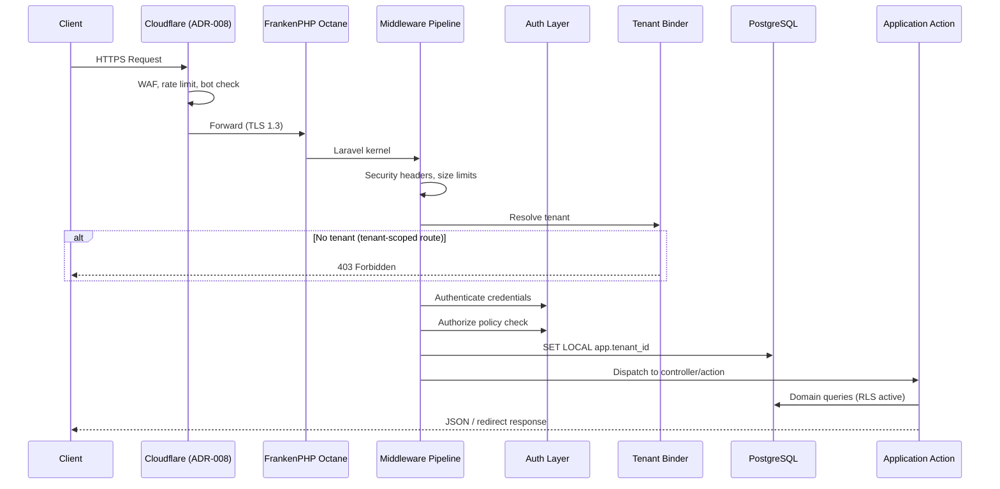
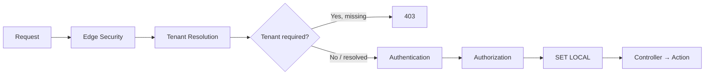
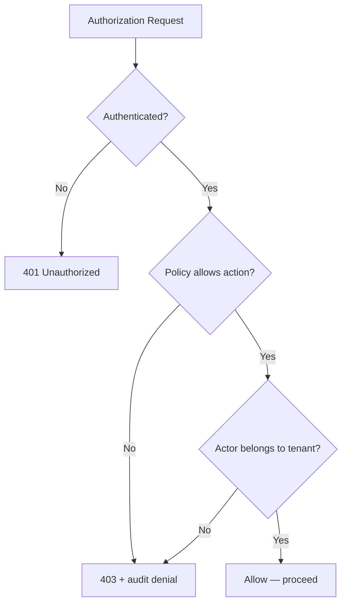
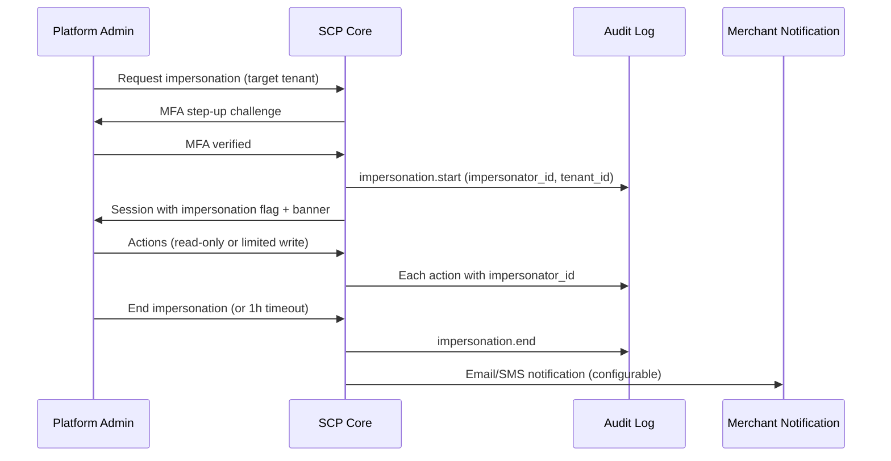

# Chapter 06: Request Lifecycle and Auth

**Document ID:** SCP-ARCH-001-06  
**Version:** 1.0.0  
**Status:** ✅ Active  
**Traceability:** ADR-006, ADR-008, ADR-010, NFR-029 – NFR-036, NFR-033  

---

## Purpose

Document the **end-to-end HTTP request lifecycle** from Cloudflare edge to domain logic, including tenant resolution, authentication, authorization, and database context binding.

## Scope

- Middleware pipeline
- Authentication surfaces (web, API, admin)
- Authorization model (policies, roles, scopes)
- Session and token management
- Admin impersonation flow

## Out of Scope

- OAuth 2.1 app marketplace (Phase 3)
- Detailed Fortify configuration (Volume 10)

---

## 1. Request Lifecycle Overview

---

## 2. Middleware Pipeline

Middleware executes in defined order. Order is **security-critical** — tenant binding precedes database access.

| Order | Middleware | Responsibility |
|-------|------------|----------------|
| 1 | `TrustProxies` | Cloudflare IP ranges |
| 2 | `SecurityHeaders` | CSP, HSTS, X-Frame-Options |
| 3 | `RequestId` | UUIDv7 request ID → logs + traces |
| 4 | `ThrottleRequests` | Per-route rate limits (Redis) |
| 5 | `ResolveTenant` | Bind `TenantContext` from host/token/session |
| 6 | `RequireTenant` | Fail-closed for tenant-scoped routes |
| 7 | `Authenticate` | Session or token validation |
| 8 | `Authorize` | Policy check (permission + tenant membership) |
| 9 | `BindTenantToDatabase` | `SET LOCAL app.tenant_id` |
| 10 | `AuditContext` | Attach actor to audit context |

---

## 3. Authentication Surfaces (ADR-006)

| Surface | Mechanism | Phase 1 | Token / Session |
|---------|-----------|---------|-----------------|
| Merchant admin (web) | Laravel Fortify + Sanctum session | ✅ | HttpOnly, Secure, SameSite=Lax cookie |
| Customer storefront (web) | Sanctum session | ✅ | Separate cookie domain per store |
| Merchant API | Sanctum personal access tokens | ✅ | `Authorization: Bearer scp_live_...` |
| Platform admin | Separate guard (`admin`) | ✅ | Short session (4h); MFA mandatory |
| Developer API | Sanctum tokens with scopes | ✅ | Scoped permissions |
| Customer passwordless | Phone OTP | Phase 2 | Termii / Africa's Talking |

### 3.1 Password Security

| Control | Value | NFR |
|---------|-------|-----|
| Hashing algorithm | Argon2id | NFR-032 |
| Breached password check | HIBP k-anonymity API | ADR-006 |
| Minimum length | 12 characters | OWASP ASVS |
| Login rate limit | 5/min per account + per IP | NFR-036 |
| Account enumeration | Uniform error messages | ADR-006 |

### 3.2 API Token Format

Prefix-identifiable tokens for secret scanning (Stripe pattern):

| Prefix | Environment |
|--------|-------------|
| `scp_live_` | Production |
| `scp_test_` | Sandbox / staging |

Tokens stored as SHA-256 hash; plaintext shown once at creation.

### 3.3 Session Configuration

| Attribute | Value |
|-----------|-------|
| Cookie flags | HttpOnly, Secure, SameSite |
| Merchant session lifetime | 24 hours (NFR-033) |
| Platform admin session | 4 hours |
| Idle timeout | 30 minutes (admin), 24 hours (merchant) |
| Session storage | Redis (encrypted payload) |

---

## 4. Authorization Model

Authorization follows **deny-by-default** with two independent checks:

1. **Permission check** — does the role have the required ability?
2. **Tenant membership check** — does the actor belong to the resolved tenant?

Both must pass. Platform admin operations use separate policies on the `admin` guard.

### 4.1 Role Hierarchy (Merchant)

| Role | Scope | Typical Permissions |
|------|-------|---------------------|
| Owner | Full tenant | All except platform ops |
| Admin | Full store ops | Products, orders, settings |
| Staff | Limited | Orders, customers (read/write) |
| Viewer | Read-only | Reports, products (read) |

Roles are tenant-scoped. A user may belong to multiple tenants with different roles.

### 4.2 Step-Up Authentication

High-risk operations require MFA re-verification within 5 minutes:

| Operation | Requirement |
|-----------|-------------|
| Payout bank detail change | Owner + MFA |
| API token creation (production) | Admin + MFA |
| Data export (full tenant) | Owner + MFA |
| Admin impersonation | Platform admin MFA (ADR-010) |
| Refund above threshold | Owner + MFA |

### 4.3 Platform Admin Guard

Separate authentication stack:

- Distinct user table / guard (`admin`)
- MFA mandatory Phase 1 (TOTP)
- IP allowlist optional Phase 2
- All actions audit-logged with `actor_type: platform_admin`
- Cannot access merchant data without impersonation flow

---

## 5. Admin Impersonation (ADR-010)

Platform support may view merchant accounts for debugging.

| Control | Value |
|---------|-------|
| Who | Platform admin only |
| MFA | Required immediately before session |
| Duration | Max 1 hour |
| UI | Visible banner: "Viewing as [Merchant]" |
| Blocked actions | Payment capture, payout changes |
| Audit | Full trail with `impersonator_id` |
| Notification | Merchant informed after session ends |

---

## 6. Route Classification

| Route Class | Tenant Required | Auth Required | Example |
|-------------|-----------------|---------------|---------|
| Public storefront | Yes (via host) | No | `GET /products/{slug}` |
| Customer account | Yes | Customer session | `GET /account/orders` |
| Merchant admin | Yes | Merchant session | `POST /admin/products` |
| Merchant API | Yes | API token | `GET /api/v1/orders` |
| Platform admin | No (global) | Admin guard | `GET /platform/tenants` |
| Webhook ingress | Yes (from payload) | HMAC signature | `POST /webhooks/paystack` |
| Health check | No | No | `GET /health` |

---

## 7. Webhook Authentication

Inbound webhooks bypass session auth but require signature verification:

| Provider | Verification |
|----------|--------------|
| Paystack | HMAC SHA-512 of raw body with secret |
| Flutterwave | `verif-hash` header |
| M-Pesa | Safaricom validation callback |

Additional controls:

- Timestamp tolerance ≤ 5 minutes
- Event ID deduplication (idempotency table)
- IP allowlist where provider publishes ranges
- Never mark order paid on client redirect alone

---

## 8. Edge Integration (ADR-008)

Cloudflare handles first-line defense before requests reach Octane:

| Control | Edge (Cloudflare) | Application (Redis) |
|---------|-------------------|---------------------|
| DDoS | ✅ | — |
| WAF OWASP rules | ✅ | — |
| Bot / Turnstile | ✅ Signup, login, checkout | — |
| Rate limit (general) | 300 req/min per IP | — |
| Rate limit (auth) | 10 req/min per IP | 5/min per account |
| Rate limit (API) | — | Plan-based per tenant |
| TLS | 1.3 full-strict | — |

429 responses include `Retry-After` header (Volume 11 acceptance).

---

## 9. Error Handling

| Condition | HTTP Status | Client Response |
|-----------|-------------|-----------------|
| Not authenticated | 401 | Generic message; no tenant hint |
| Not authorized | 403 | Generic message; audit logged |
| Tenant not resolved | 403 | "Unable to process request" |
| Rate limited | 429 | `Retry-After` header |
| Validation error | 422 | Field-level errors |
| Server error | 500 | Generic message; **no stack trace** |

---

## 10. Observability per Request

Every request emits:

| Signal | Fields |
|--------|--------|
| Access log | `request_id`, `tenant_id`, `user_id`, `method`, `path`, `status`, `duration_ms` |
| Trace span | OpenTelemetry: `http.route`, `tenant.id`, `user.id` |
| Audit (if mutating) | Actor, action, resource, before/after |
| Error (if 5xx) | Sentry exception with request context (PII scrubbed) |

---

## 11. Acceptance Criteria

- [ ] Middleware pipeline order documented with tenant-before-DB rule
- [ ] All auth surfaces from ADR-006 mapped
- [ ] Deny-by-default authorization with dual check (permission + tenant)
- [ ] Impersonation flow matches ADR-010 controls
- [ ] Webhook verification documented per Nigeria PSP
- [ ] Fail-closed tenant resolution verified (403 on missing context)
- [ ] No stack traces in client responses (Volume 11 §12)
- [ ] Authz matrix tests cover every route (Volume 11 §6)

---

## References

- [ADR-006: Authentication Stack](../00-meta/adr/006-authentication-stack.md)
- [ADR-008: Cloudflare Edge](../00-meta/adr/008-edge-security-cloudflare.md)
- [ADR-010: Admin Impersonation](../00-meta/adr/010-admin-impersonation.md)
- [Volume 11 — Security Architecture](../11-security/04-security-architecture.md)
- OWASP ASVS 5.0 V6–V9: https://asvs.dev/v5.0.0/
