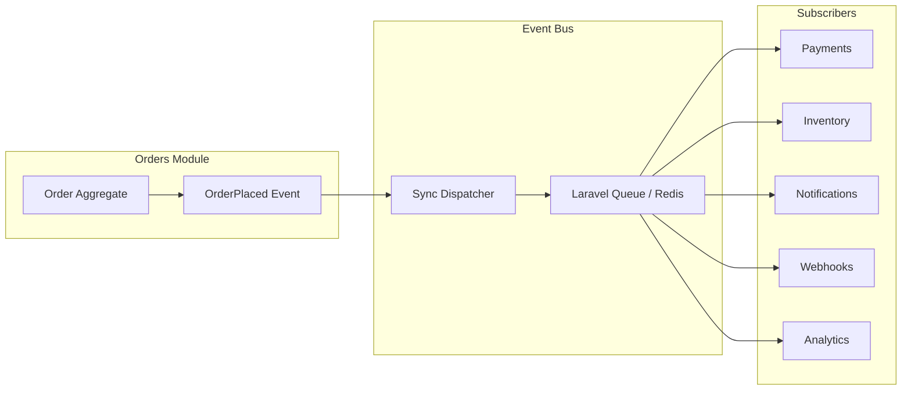
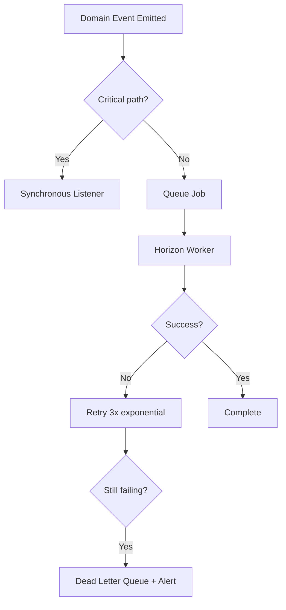
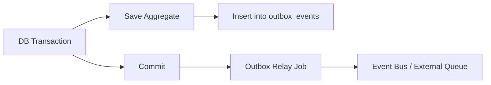

# Chapter 07: Event-Driven Communication

**Document ID:** SCP-ARCH-001-07  
**Version:** 1.0.0  
**Status:** ✅ Active  
**Traceability:** ADR-001, FR-022, FR-024, NFR-008, NFR-020  

---

## Purpose

Define how SCP modules communicate **asynchronously through domain events**. Events decouple modules, enable eventual consistency, and provide the extraction boundary for future microservices.

## Scope

- Event taxonomy and naming conventions
- Event bus implementation
- Event schema and envelope
- Publisher and subscriber rules
- Idempotency and ordering
- Event catalog (commerce and platform)

## Out of Scope

- Message broker selection for extracted services (Phase 3)
- Event sourcing (not Phase 1)

---

## 1. Why Event-Driven

In a modular monolith (ADR-001), modules must not call each other's internals directly (FR-024). Domain events provide:

| Benefit | Description |
|---------|-------------|
| **Decoupling** | Publisher does not know subscribers |
| **Extensibility** | New subscribers without changing publisher |
| **Async processing** | Side effects off the HTTP critical path (NFR-008) |
| **Extraction readiness** | Events become service boundaries |
| **Auditability** | Immutable record of business facts (FR-022) |



---

## 2. Event Taxonomy

| Type | Scope | Example | Persistence |
|------|-------|---------|-------------|
| **Domain Event** | Within module; may cross module | `OrderPlaced` | Dispatched after DB commit |
| **Integration Event** | Cross-module contract | Same as domain event at boundary | Outbox table (Phase 2) |
| **System Event** | Infrastructure | `TenantContextBound` | Logs only |

**Phase 1:** Domain events and integration events share the same envelope. Outbox pattern added Phase 2 for guaranteed delivery to external systems.

---

## 3. Event Envelope Schema

Every event conforms to this structure (FR-022):

```json
{
  "event_id": "01932a7b-8c4d-7000-8000-000000000001",
  "event_type": "orders.order_placed",
  "event_version": 1,
  "occurred_at": "2026-07-12T10:30:00+01:00",
  "tenant_id": "01932a7b-8c4d-7000-8000-000000000010",
  "store_id": "01932a7b-8c4d-7000-8000-000000000020",
  "aggregate_type": "order",
  "aggregate_id": "01932a7b-8c4d-7000-8000-000000000030",
  "actor": {
    "type": "customer",
    "id": "01932a7b-8c4d-7000-8000-000000000040"
  },
  "payload": {
    "order_number": "SCP-10042",
    "total": { "amount": 4500000, "currency": "NGN" },
    "item_count": 3
  },
  "metadata": {
    "correlation_id": "req_abc123",
    "causation_id": "cart_checkout_789"
  }
}
```

| Field | Rule |
|-------|------|
| `event_id` | UUIDv7; globally unique |
| `event_type` | Dot-namespaced: `{module}.{past_tense_action}` |
| `event_version` | Integer; increment on breaking schema change |
| `tenant_id` | **Required** on all tenant-scoped events |
| `payload` | Minimal facts; no full aggregate serialization |
| `occurred_at` | ISO 8601 with timezone (tenant TZ for display, UTC for storage) |

---

## 4. Naming Conventions

| Rule | Good | Bad |
|------|------|-----|
| Past tense | `OrderPlaced` | `PlaceOrder` |
| Module prefix in type | `orders.order_placed` | `order_placed` |
| Fact, not command | `PaymentReceived` | `ProcessPayment` |
| Immutable | Event never modified after emission | Update event record |

---

## 5. Publisher Rules

| Rule | Description |
|------|-------------|
| **Emit after commit** | Events dispatch only after successful DB transaction |
| **Aggregate owns events** | Aggregate collects events; repository dispatches on save |
| **Minimal payload** | Include IDs and changed values, not full entity graphs |
| **One event per fact** | `OrderPlaced` and `OrderPaid` are separate events |
| **No subscriber logic in publisher** | Publisher unaware of downstream effects |

```php
// Aggregate collects events
final class Order
{
    /** @var DomainEvent[] */
    private array $events = [];

    public function place(): void
    {
        // ... invariant checks ...
        $this->events[] = new OrderPlaced($this->id, /* ... */);
    }

    /** @return DomainEvent[] */
    public function pullDomainEvents(): array
    {
        $events = $this->events;
        $this->events = [];
        return $events;
    }
}
```

---

## 6. Subscriber Rules

| Rule | Description |
|------|-------------|
| **Idempotent** | Handle duplicate delivery gracefully |
| **Single responsibility** | One listener class per reaction |
| **No circular events** | Subscriber must not emit events that loop back |
| **Tenant context** | Re-bind tenant from event envelope in queue worker |
| **Failure isolation** | Subscriber failure does not roll back publisher transaction |
| **Retry with backoff** | 3 retries exponential; then dead letter queue |

### 6.1 Listener Registration

Each module registers listeners in its service provider:

```php
Event::listen(OrderPlaced::class, [
    ReserveInventoryListener::class,
    SendOrderConfirmationListener::class,
    DispatchWebhookListener::class,
]);
```

Cross-module listeners live in the **subscriber's** module, never the publisher's.

---

## 7. Sync vs Async Dispatch

| Event Category | Dispatch | Rationale |
|----------------|----------|-----------|
| Cache invalidation | Sync (same request) | Consistency for subsequent reads |
| Inventory reservation | Sync (checkout path) | Must confirm before payment redirect |
| Notifications | Async (queue) | Off critical path |
| Search indexing | Async (queue) | Eventual consistency acceptable |
| Webhooks | Async (queue) | External latency |
| Analytics | Async (queue) | Fire-and-forget |



---

## 8. Idempotency

| Mechanism | Implementation |
|-----------|----------------|
| Event ID dedup | `processed_events` table: `(event_id, listener_class)` unique |
| Webhook dedup | PSP event ID stored; skip if seen |
| Job dedup | Laravel `ShouldBeUnique` for scheduled reconciliation |
| Idempotency key | HTTP writes accept `Idempotency-Key` header (API chapter) |

---

## 9. Event Catalog

### 9.1 Commerce Events

| Event | Publisher | Payload Highlights | Subscribers |
|-------|-----------|-------------------|-------------|
| `catalog.product_created` | Catalog | product_id, title, status | Search, Analytics, AI |
| `catalog.product_updated` | Catalog | product_id, changed_fields[] | Search, Cache |
| `inventory.inventory_changed` | Inventory | variant_id, available, reserved | Catalog, Analytics, AI |
| `cart.cart_abandoned` | Cart | cart_id, customer_id, items[] | Notifications, Analytics, AI |
| `orders.order_placed` | Orders | order_id, total, items[] | Payments, Inventory, Notifications, Webhooks, Analytics |
| `payments.order_paid` | Payments | order_id, payment_id, reference | Orders, Notifications, Webhooks, Billing |
| `shipping.order_shipped` | Shipping | order_id, tracking, carrier | Orders, Notifications, Webhooks |
| `shipping.order_delivered` | Shipping | order_id, delivered_at | Orders, Notifications, Analytics |
| `orders.order_cancelled` | Orders | order_id, reason | Payments, Inventory, Notifications, Webhooks |
| `payments.payment_received` | Payments | payment_id, amount | Orders, Billing, Analytics |
| `payments.payment_failed` | Payments | order_id, reason | Orders, Notifications |
| `payments.refund_issued` | Payments | refund_id, amount | Orders, Analytics, Webhooks |
| `reviews.review_submitted` | Reviews | review_id, product_id, rating | Catalog, Notifications, AI |

### 9.2 Platform Events

| Event | Publisher | Subscribers |
|-------|-----------|-------------|
| `tenancy.tenant_created` | Tenancy | Billing, Analytics, AI |
| `billing.tenant_upgraded` | Billing | Tenancy, Analytics |
| `identity.user_registered` | Identity | Notifications, Analytics |
| `marketplace.vendor_approved` | Marketplace | Notifications, Catalog |
| `marketplace.payout_processed` | Marketplace | Notifications, Analytics, Webhooks |

---

## 10. Dead Letter Queue and Monitoring

| Metric | Alert Threshold |
|--------|-----------------|
| Queue depth (per queue) | > 1000 for 5 minutes |
| Job failure rate | > 5% over 15 minutes |
| Dead letter count | > 0 (immediate P2 alert) |
| Event processing latency p95 | > 5 seconds (NFR-008) |

Dead letter jobs require manual review or automated replay after root cause fix.

---

## 11. Future: Outbox Pattern (Phase 2)

For guaranteed delivery to external systems and extracted services:



Outbox ensures events are never lost between DB commit and queue dispatch.

---

## 12. Service Extraction Event Boundary

When a module is extracted (Chapter 11), its events transition from in-process Laravel events to message queue transport. The **event envelope schema remains unchanged** — only the transport layer changes.

| Phase | Transport |
|-------|-----------|
| Phase 1 | Laravel Events + Redis Queue |
| Phase 3 | Redis Streams or SQS between services |
| Phase 4 | Full message broker (if warranted) |

---

## 13. Acceptance Criteria

- [ ] Event envelope schema defined with required `tenant_id` and `event_id`
- [ ] Naming conventions documented (past tense, module prefix)
- [ ] Publisher rules include after-commit dispatch
- [ ] Subscriber idempotency mechanism defined
- [ ] Full event catalog matches Volume 1 domain events
- [ ] Sync vs async classification documented for checkout-critical events
- [ ] Dead letter queue alerting defined
- [ ] Cross-module direct calls prohibited (FR-024) with event alternative stated

---

## References

- [ADR-001: Modular Monolith](../00-meta/adr/001-modular-monolith-over-microservices.md)
- [Volume 1 — Domain Events](../01-vision/10-domain-model-overview.md)
- *Enterprise Integration Patterns* — Hohpe & Woolf
- Laravel Events: https://laravel.com/docs/events
