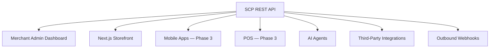
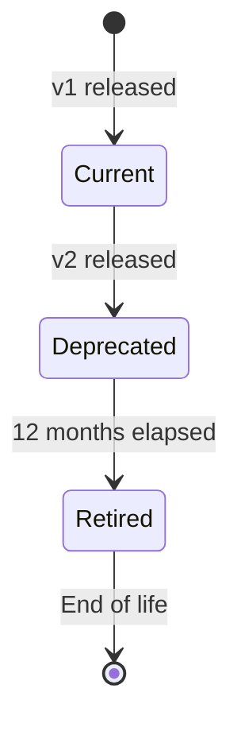

# Chapter 08: API Architecture and Versioning

**Document ID:** SCP-ARCH-001-08  
**Version:** 1.0.0  
**Status:** ✅ Active  
**Traceability:** NFR-003, NFR-004, NFR-017, OpenAPI 3.1, ADR-001  

---

## Purpose

Define SCP's **API-first architecture**: REST API surfaces, versioning strategy, authentication, rate limiting, error conventions, and OpenAPI specification requirements.

## Scope

- API surface taxonomy (Admin, Storefront, Platform, Webhooks)
- URL structure and versioning
- Request/response conventions
- Pagination, filtering, sorting
- Idempotency and rate limiting
- OpenAPI documentation

## Out of Scope

- GraphQL (evaluated; deferred — see §9)
- OAuth 2.1 developer marketplace (Phase 3, Volume 12)
- Individual endpoint specifications (module volumes)

---

## 1. API-First Principle

Every user-facing surface consumes the same APIs:



**Rule:** Admin dashboard must not use private endpoints unavailable to API consumers. If the admin needs it, it must be in the public API (with appropriate auth).

---

## 2. API Surface Taxonomy

| Surface | Base Path | Auth | Audience |
|---------|-----------|------|----------|
| **Storefront API** | `/storefront/v1/` | Optional session / public | Shoppers, themes |
| **Admin API** | `/admin/v1/` | Sanctum session or token | Merchants, staff |
| **Platform API** | `/platform/v1/` | Admin guard | Sapphital operations |
| **Webhook Ingress** | `/webhooks/` | HMAC signature | PSPs, couriers |
| **Health** | `/health`, `/ready` | None | Load balancers, monitoring |

### 2.1 Storefront API

Read-heavy, optimized for SSR/ISR and mobile:

- Product catalog, collections, search
- Cart operations
- Checkout initiation
- Customer account (authenticated)
- Store configuration (theme settings, navigation)

**Performance target:** p95 ≤ 200ms reads (NFR-003).

### 2.2 Admin API

Full CRUD for merchant operations:

- Product management, inventory, orders
- Customer management, promotions
- Store settings, theme customization
- Analytics dashboards
- API token management

**Performance target:** p95 ≤ 500ms writes (NFR-004).

### 2.3 Platform API

Restricted to platform administrators:

- Tenant lifecycle management
- Impersonation (ADR-010)
- System health and metrics
- Feature flag management

---

## 3. URL Structure and Versioning

### 3.1 URL Pattern

```text
https://{host}/api/{surface}/v{major}/{resource}/{id?}/{sub-resource?}
```

Examples:

```text
GET  /api/storefront/v1/products/blue-dress-shirt
POST /api/admin/v1/products
GET  /api/admin/v1/orders?status=paid&page=2
POST /api/admin/v1/orders/{id}/refunds
GET  /api/platform/v1/tenants/{id}
```

### 3.2 Versioning Strategy

| Aspect | Policy |
|--------|--------|
| Version in URL | `/v1/`, `/v2/` (major version) |
| Breaking change | Increment major version; maintain previous for 12 months |
| Non-breaking addition | Same version; additive fields |
| Deprecation header | `Sunset: Sat, 01 Jan 2028 00:00:00 GMT` |
| Deprecation notice | `Deprecation: true` + Link header to migration guide |
| Minimum support | Current + previous major version |

**Breaking changes include:** removing fields, changing field types, changing auth requirements, changing error codes.

**Non-breaking changes include:** adding optional fields, adding endpoints, adding enum values.

### 3.3 Version Lifecycle



---

## 4. Request and Response Conventions

### 4.1 Content Type

| Direction | Format |
|-----------|--------|
| Request body | `application/json` (UTF-8) |
| Response body | `application/json` (UTF-8) |
| File upload | `multipart/form-data` |
| Webhook payload | Raw JSON (for signature verification) |

### 4.2 Standard Response Envelope

**Single resource:**

```json
{
  "data": {
    "id": "01932a7b-8c4d-7000-8000-000000000030",
    "type": "product",
    "attributes": { "title": "Blue Dress Shirt", "status": "active" },
    "relationships": { "variants": { "data": [{ "id": "...", "type": "variant" }] } }
  },
  "meta": {
    "request_id": "req_abc123"
  }
}
```

**Collection:**

```json
{
  "data": [ /* ... */ ],
  "meta": {
    "request_id": "req_abc123",
    "pagination": {
      "current_page": 2,
      "per_page": 25,
      "total": 142,
      "total_pages": 6
    }
  },
  "links": {
    "self": "/api/admin/v1/products?page=2",
    "first": "/api/admin/v1/products?page=1",
    "prev": "/api/admin/v1/products?page=1",
    "next": "/api/admin/v1/products?page=3",
    "last": "/api/admin/v1/products?page=6"
  }
}
```

**Error:**

```json
{
  "error": {
    "code": "validation_failed",
    "message": "The given data was invalid.",
    "details": [
      { "field": "price", "message": "Must be a positive integer (minor units)" }
    ]
  },
  "meta": {
    "request_id": "req_abc123"
  }
}
```

### 4.3 Identifiers

| Type | Format |
|------|--------|
| Resource IDs | UUIDv7 (sortable, time-ordered) |
| Public order numbers | Human-readable: `SCP-{store_prefix}-{sequence}` |
| API tokens | Prefixed opaque strings: `scp_live_...` |
| Slugs | URL-safe, unique per store scope |

### 4.4 Money Fields

All monetary values use integer minor units (FR-021):

```json
{
  "price": { "amount": 4500000, "currency": "NGN" },
  "display": "₦45,000.00"
}
```

`display` is computed server-side for locale formatting (NFR-081). Clients must not perform currency arithmetic on display strings.

### 4.5 Timestamps

ISO 8601 with timezone offset. Stored as UTC; returned in tenant timezone for admin, store timezone for storefront.

```json
{
  "created_at": "2026-07-12T10:30:00+01:00"
}
```

---

## 5. Pagination, Filtering, Sorting

### 5.1 Pagination

Cursor-based for storefront (performance at scale); offset-based for admin (simplicity).

| Surface | Method | Parameters |
|---------|--------|------------|
| Storefront | Cursor | `?cursor={opaque}&limit=25` |
| Admin | Offset | `?page=2&per_page=25` (max 100) |

### 5.2 Filtering

```text
GET /api/admin/v1/orders?filter[status]=paid&filter[created_after]=2026-07-01
GET /api/storefront/v1/products?filter[category]=shirts&filter[price_max]=5000000
```

Allowlist approach — only documented filter fields accepted (NFR-037).

### 5.3 Sorting

```text
GET /api/admin/v1/products?sort=-created_at,title
```

Prefix `-` for descending. Allowlist enforced.

### 5.4 Field Selection

```text
GET /api/storefront/v1/products/123?fields[product]=title,price,images
```

Sparse fieldsets reduce payload size for mobile (NFR-009).

---

## 6. Idempotency

State-changing requests support idempotency for safe retries:

| Header | Value |
|--------|-------|
| `Idempotency-Key` | Client-generated UUID; valid 24 hours |

Server stores `(idempotency_key, tenant_id, endpoint, response)` and returns cached response on duplicate.

**Required on:** checkout creation, payment initialization, refund creation, payout initiation.

---

## 7. Rate Limiting

| Surface | Limit | Scope | Response |
|---------|-------|-------|----------|
| Storefront (public) | 300/min | Per IP (edge) | 429 + `Retry-After` |
| Auth endpoints | 10/min | Per IP (edge) + 5/min per account | 429 |
| Admin API | Plan-based | Per tenant + per token | 429 |
| Platform API | 100/min | Per admin user | 429 |

Rate limit headers on every response:

```text
X-RateLimit-Limit: 1000
X-RateLimit-Remaining: 847
X-RateLimit-Reset: 1720785600
```

Plan-based limits (Volume 7):

| Plan | Admin API req/min | Storefront req/min |
|------|-------------------|--------------------|
| Starter | 120 | 600 |
| Business | 600 | 3000 |
| Enterprise | 3000 | 10000 |

---

## 8. Authentication on API Requests

| Method | Header | Surface |
|--------|--------|---------|
| Session cookie | `Cookie: scp_session=...` | Admin, Storefront (browser) |
| Bearer token | `Authorization: Bearer scp_live_...` | Admin API, integrations |
| Webhook signature | `X-Paystack-Signature: ...` | Webhook ingress |

CORS policy:

| Origin | Allowed |
|--------|---------|
| Merchant admin domain | Yes |
| Store custom domains | Yes (storefront API) |
| Arbitrary third-party | No (use server-side integration) |

---

## 9. GraphQL Evaluation

GraphQL was evaluated and **deferred to Phase 3+**:

| Factor | REST (chosen) | GraphQL |
|--------|---------------|---------|
| Caching | HTTP cache, CDN friendly | Complex |
| Versioning | URL-based, explicit | Schema evolution |
| Team familiarity | High (Laravel) | Learning curve |
| Mobile bandwidth | Field selection via sparse fieldsets | Natural fit |
| Storefront SSR | Simple fetch patterns | Additional server |

**Decision:** REST with sparse fieldsets for Phase 1–2. Re-evaluate GraphQL for Storefront API if mobile/POS complexity warrants (requires ADR).

---

## 10. OpenAPI Specification

All public APIs documented in **OpenAPI 3.1** format:

```text
docs/api/
├── storefront-v1.openapi.yaml
├── admin-v1.openapi.yaml
└── platform-v1.openapi.yaml
```

| Requirement | Detail |
|-------------|--------|
| Auto-generation | Laravel OpenAPI generator from Form Requests + Resources |
| CI validation | Spectral lint on every PR |
| SDK generation | TypeScript client for admin dashboard and theme SDK |
| Changelog | Per-version breaking change log |
| Try-it | Scalar or Swagger UI in developer docs (Volume 12) |

---

## 11. Webhook Delivery (Outbound)

SCP delivers webhooks to merchant-configured URLs for domain events:

| Aspect | Policy |
|--------|--------|
| Payload | Event envelope (Chapter 07 schema) |
| Signature | HMAC SHA-256 in `X-SCP-Signature` header |
| Retry | 3 attempts: 1min, 5min, 30min exponential |
| Timeout | 10 seconds per delivery attempt |
| Ordering | Not guaranteed; include `event_id` for dedup |
| SSRF prevention | URL validation; no private IP ranges |

---

## 12. Acceptance Criteria

- [ ] Four API surfaces defined with base paths and auth
- [ ] URL versioning strategy with 12-month deprecation window
- [ ] Standard response envelope (data, error, pagination) documented
- [ ] Money fields as integer minor units (FR-021)
- [ ] Idempotency-Key required on financial endpoints
- [ ] Rate limiting tiers with 429 + Retry-After
- [ ] OpenAPI 3.1 spec requirement stated
- [ ] GraphQL deferral documented with re-evaluation criteria
- [ ] API-first rule: admin uses same endpoints as integrations

---

## References

- OpenAPI 3.1: https://spec.openapis.org/oas/v3.1.0
- Stripe API design: https://stripe.com/docs/api
- JSON:API specification (influence): https://jsonapi.org/
- [ADR-001: Modular Monolith](../00-meta/adr/001-modular-monolith-over-microservices.md)
- [Chapter 07 — Events](./07-event-driven-communication.md)
