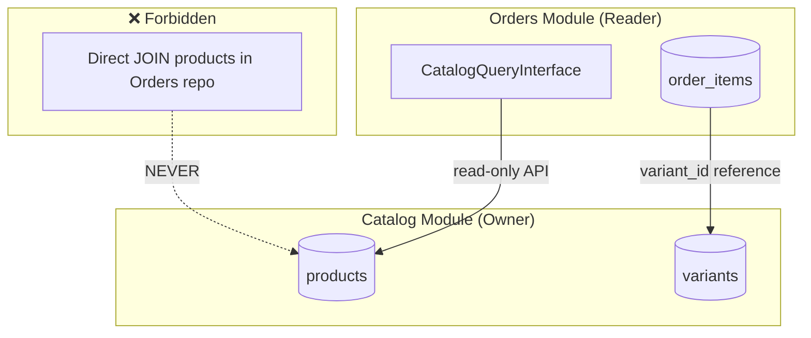
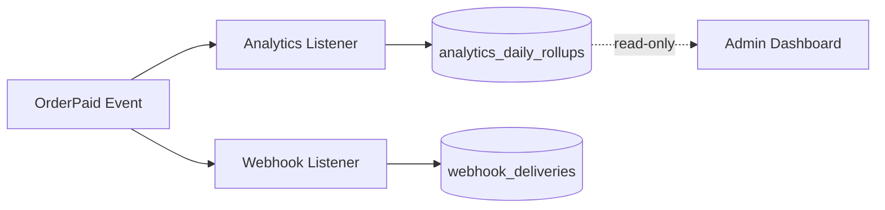

# Chapter 09: Data Ownership and Contracts

**Document ID:** SCP-ARCH-001-09  
**Version:** 1.0.0  
**Status:** ✅ Active  
**Traceability:** FR-020 – FR-025, ADR-002, ADR-009, NFR-073 – NFR-077  

---

## Purpose

Define **which module owns which data**, how modules access data owned by others, and the **contracts** (interfaces, events, query APIs) that govern cross-module data interaction.

## Scope

- Data ownership matrix
- Table ownership and naming
- Cross-module read contracts
- Shared data rules
- Data lifecycle (retention, export, deletion)
- Schema migration rules

## Out of Scope

- Detailed column-level schemas (Volume 5+)
- Database backup procedures (Volume 10)

---

## 1. Data Ownership Principle

**Every table has exactly one owning module.** Only the owner module may INSERT, UPDATE, or DELETE rows. Other modules access data through:

1. **Domain events** (async, for reactions)
2. **Published query interfaces** (sync, read-only)
3. **Foreign aggregate IDs** (stored as references, never joined)



---

## 2. Data Ownership Matrix

### 2.1 Platform Core

| Module | Owned Tables | Key Entities |
|--------|-------------|--------------|
| **Tenancy** | `tenants`, `tenant_settings` | Tenant |
| **Identity** | `users`, `roles`, `role_user`, `personal_access_tokens` | User, Role |
| **Billing** | `plans`, `subscriptions`, `invoices`, `usage_records` | Plan, Subscription |
| **Audit** | `audit_logs` | AuditLog (append-only, ADR-009) |

### 2.2 Commerce Core

| Module | Owned Tables | Key Entities |
|--------|-------------|--------------|
| **Catalog** | `products`, `variants`, `categories`, `collections`, `product_media` | Product, Variant |
| **Inventory** | `inventory_levels`, `locations`, `stock_movements` | InventoryLevel |
| **Cart** | `carts`, `cart_items` | Cart, CartItem |
| **Orders** | `orders`, `order_items`, `order_status_history` | Order, OrderItem |
| **Payments** | `payments`, `refunds`, `payment_methods` | Payment |
| **Shipping** | `shipments`, `shipping_zones`, `shipping_rates` | Shipment |
| **Customers** | `customers`, `addresses`, `customer_groups` | Customer |
| **Promotions** | `coupons`, `promotion_rules`, `coupon_usages` | Coupon |
| **Reviews** | `reviews` | Review |

### 2.3 Content & Experience

| Module | Owned Tables | Key Entities |
|--------|-------------|--------------|
| **Themes** | `themes`, `theme_settings`, `theme_assets` | Theme |
| **Content** | `pages`, `navigation_items`, `blog_posts` | Page |
| **Search** | `search_synonyms` (config only; index in Meilisearch) | — |
| **Media** | `media_files` | Media |

### 2.4 Marketplace

| Module | Owned Tables | Key Entities |
|--------|-------------|--------------|
| **Marketplace** | `vendors`, `vendor_profiles`, `commissions`, `payouts`, `disputes` | Vendor |

### 2.5 Platform Services

| Module | Owned Tables | Key Entities |
|--------|-------------|--------------|
| **Notifications** | `notification_templates`, `notification_log` | — |
| **Webhooks** | `webhook_subscriptions`, `webhook_deliveries` | WebhookSubscription |
| **Plugins** | `plugin_installations`, `plugin_settings` | PluginInstallation |
| **Analytics** | `analytics_daily_rollups` (projections) | — |
| **AI** | `ai_sessions`, `ai_prompts_log` | — |

---

## 3. Table Design Rules

Every tenant-scoped table must include:

| Column | Type | Rule |
|--------|------|------|
| `id` | UUID (v7) | Primary key |
| `tenant_id` | UUID | NOT NULL; FK to tenants; indexed |
| `created_at` | TIMESTAMPTZ | UTC storage |
| `updated_at` | TIMESTAMPTZ | UTC storage |
| `deleted_at` | TIMESTAMPTZ | Nullable; soft delete (FR-025) |

Store-scoped tables additionally include `store_id`.

### 3.1 Naming Conventions

| Element | Convention | Example |
|---------|------------|---------|
| Table | snake_case, plural | `order_items` |
| Column | snake_case | `tenant_id`, `created_at` |
| Index | `idx_{table}_{columns}` | `idx_products_tenant_store_status` |
| FK constraint | `fk_{table}_{referenced}` | `fk_orders_tenant` |
| RLS policy | `tenant_isolation` | Same name on all tables |

### 3.2 Module Table Prefix (Optional)

For extraction readiness, modules may use table prefixes:

```text
catalog_products, catalog_variants
orders_orders, orders_order_items
payments_payments, payments_refunds
```

Prefix is recommended for new modules; existing unprefixed tables migrate during extraction.

---

## 4. Cross-Module Read Contracts

When a module needs data owned by another, it uses a **published query interface**:

```php
// Defined in Catalog module (Application layer, public interface)
interface CatalogQueryInterface
{
    public function findProduct(ProductId $id): ?ProductSnapshot;
    public function findVariant(VariantId $id): ?VariantSnapshot;
    public function getProductTitle(ProductId $id): string;
}

// ProductSnapshot is a read-only DTO — not the domain aggregate
final readonly class ProductSnapshot
{
    public function __construct(
        public ProductId $id,
        public string $title,
        public Money $price,
        public ProductStatus $status,
    ) {}
}
```

| Rule | Detail |
|------|--------|
| Interface location | Publisher module's `Application/Contracts/` |
| Return type | Read-only DTO (snapshot), never Eloquent model |
| Implementation | Publisher module's Infrastructure |
| Binding | Service provider binds interface to implementation |
| Caching | Implementation may cache; caller does not |

### 4.1 Published Query Interfaces (Phase 1)

| Interface | Owner | Consumers |
|-----------|-------|-----------|
| `CatalogQueryInterface` | Catalog | Orders, Cart, Checkout, Search, AI |
| `InventoryQueryInterface` | Inventory | Catalog, Checkout, Orders |
| `CustomerQueryInterface` | Customers | Orders, Cart, Notifications |
| `OrderQueryInterface` | Orders | Payments, Shipping, Analytics, Webhooks |
| `TenantQueryInterface` | Tenancy | All modules |
| `PricingQueryInterface` | Promotions | Cart, Checkout |

---

## 5. Shared Data Rules

### 5.1 Shared Kernel (Not Owned by Any Module)

| Data | Location | Access |
|------|----------|--------|
| Value objects | `App\Platform\Shared` | Import freely |
| Enums (status types) | `App\Platform\Shared\Enums` | Import freely |
| `tenant_id` context | `TenantContext` | Read-only per request |

### 5.2 Read Models / Projections

Analytics and search maintain **derived data** from events:

| Projection | Source Events | Owner |
|------------|---------------|-------|
| Product search index | `ProductCreated`, `ProductUpdated` | Search |
| Daily sales rollup | `OrderPaid`, `RefundIssued` | Analytics |
| Webhook delivery log | All outbound events | Webhooks |

Projections are **eventually consistent**. They do not feed back into source aggregates.



---

## 6. Data Lifecycle

### 6.1 Retention Policy (NFR-073)

| Data Class | Retention | Storage |
|------------|-----------|---------|
| Transaction data (orders, payments) | 7 years | PostgreSQL |
| Audit logs (financial) | 7 years | PostgreSQL → cold storage |
| Audit logs (general) | 1 year | PostgreSQL → cold storage |
| Application logs | 90 days hot, 1 year cold | Log store |
| Analytics aggregates | 3 years | PostgreSQL |
| Soft-deleted entities | 30 days, then hard delete | PostgreSQL |
| Cart sessions | 30 days | PostgreSQL / Redis |

### 6.2 Data Export (NFR-077)

Merchants may export all their data on demand:

| Aspect | Policy |
|--------|--------|
| Format | JSON (default) or CSV per entity type |
| Scope | All tenant-owned data across modules |
| Auth | Owner role + MFA step-up |
| Delivery | Signed R2 URL, expires 24 hours |
| Audit | Export event logged (ADR-009) |
| NDPA | Supports data subject access requests |

Export orchestrator queries each module's export interface:

```php
interface TenantDataExporterInterface
{
    public function export(TenantId $tenant): ExportChunk;
}
```

### 6.3 Data Deletion

| Trigger | Process |
|---------|---------|
| Merchant request | Soft delete → 30-day window → hard delete job |
| NDPA erasure request | Targeted PII deletion with legal retention exceptions |
| Tenant purge | Hard delete all tenant-scoped rows; audit log retained |

Hard delete job runs per module in dependency order (orders before products, etc.).

---

## 7. Schema Migration Rules (NFR-076)

| Rule | Detail |
|------|--------|
| Backward compatible | Add columns as nullable first; backfill; then add NOT NULL |
| No destructive in single deploy | Drop column = deploy 1: stop using; deploy 2: drop |
| RLS in same migration | New tenant table = RLS policies in same migration file |
| Zero-downtime (Phase 2+) | Expand-contract pattern for column renames |
| Rollback plan | Every migration must be reversible or documented as irreversible |
| Index creation | `CREATE INDEX CONCURRENTLY` in production |

---

## 8. Financial Data Integrity

| Rule | Source |
|------|--------|
| Money as integer minor units | FR-021 |
| No floating point for currency | FR-021 |
| Immutable order line prices | Captured at order creation |
| Audit trail for refunds/payouts | ADR-009, NFR-075 |
| Server-side price authority | Recompute at checkout; never trust client |

---

## 9. Contract Versioning

When a published query interface or event schema changes:

| Change Type | Action |
|-------------|--------|
| Add optional field to DTO | Non-breaking; same interface version |
| Remove field from DTO | Breaking; increment event version; maintain old listener |
| Add method to interface | Non-breaking |
| Remove method from interface | Breaking; deprecation period 12 months |

---

## 10. Acceptance Criteria

- [ ] Data ownership matrix covers all modules and primary tables
- [ ] Single-owner rule stated: only owner module writes
- [ ] Cross-module access limited to events and published query interfaces
- [ ] Table design rules include tenant_id, soft delete, RLS requirement
- [ ] Published query interface pattern documented with example
- [ ] Retention policy aligned with NFR-073
- [ ] Export and deletion flows support NDPA requirements
- [ ] Migration rules include zero-downtime expand-contract pattern
- [ ] Financial data rules reference FR-021 and server-side pricing

---

## References

- [ADR-002: Multi-Tenancy](../00-meta/adr/002-multi-tenancy-shared-db-rls.md)
- [ADR-009: Audit Log](../00-meta/adr/009-audit-log-immutability.md)
- [Volume 1 — Domain Model](../01-vision/10-domain-model-overview.md)
- [Chapter 07 — Events](./07-event-driven-communication.md)
