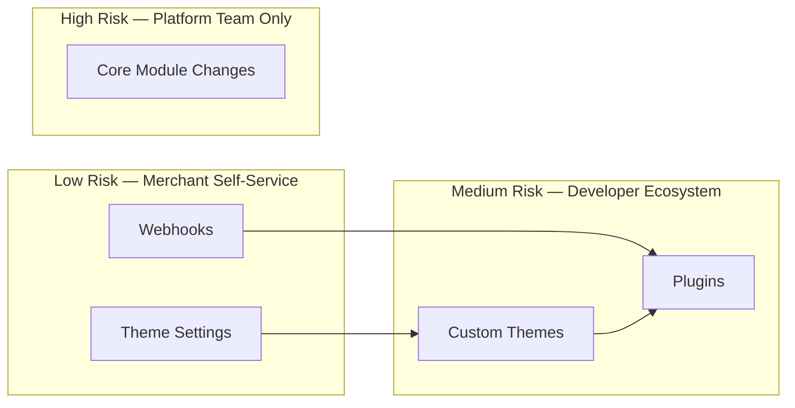
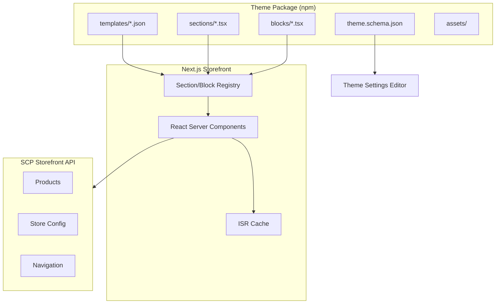
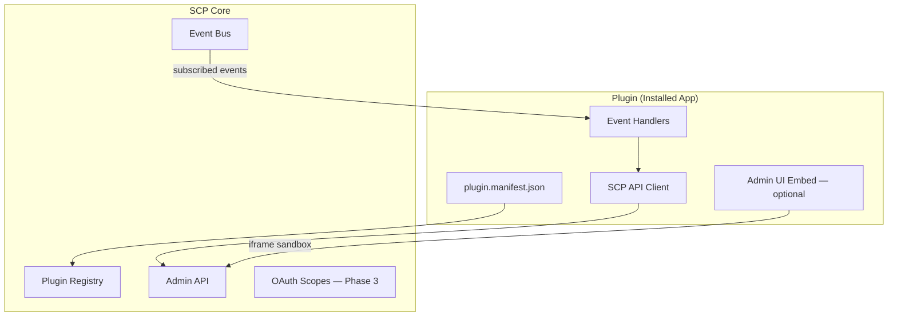
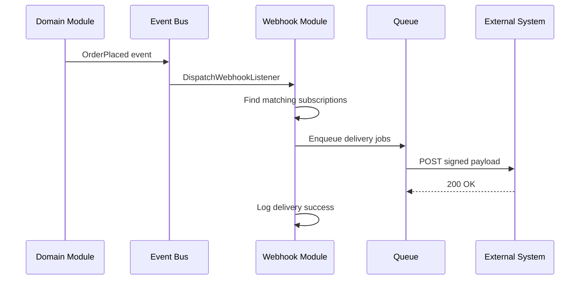

# Chapter 10: Extensibility — Themes, Plugins, Webhooks

**Document ID:** SCP-ARCH-001-10  
**Version:** 1.0.0  
**Status:** ✅ Active  
**Traceability:** ADR-003, ADR-004, FR-024, NFR-009, NFR-010  

---

## Purpose

Define SCP's **extensibility architecture** — how merchants and third-party developers customize storefronts, extend platform functionality, and integrate external systems without modifying core code.

## Scope

- Theme engine architecture (React + JSON schema)
- Plugin system design
- Webhook subscriptions and delivery
- Extension security model
- Theme Store and Plugin Marketplace (Phase 3)

## Out of Scope

- Theme SDK CLI implementation (Volume 6)
- Developer portal UX (Volume 12)
- Individual plugin API specifications

---

## 1. Extensibility Strategy

SCP provides three extension mechanisms, ordered by capability and risk:



| Mechanism | Who | Phase | Risk |
|-----------|-----|-------|------|
| Theme settings | Merchant | 1–2 | Low — schema-validated JSON |
| Webhooks | Developer / merchant | 1 | Low — outbound only |
| Custom themes | Theme developer | 2–3 | Medium — sandboxed React |
| Plugins | App developer | 3 | Medium — scoped API access |
| Core modifications | Platform team | Always | High — requires ADR |

**Rule:** Extensibility must never bypass tenant isolation or PCI scope (ADR-004).

---

## 2. Theme Engine (ADR-003)

### 2.1 Architecture

Themes are **npm packages** containing React components, rendered by Next.js with a **JSON template schema** defining page structure.



### 2.2 JSON Template Schema

Page structure defined in JSON — merchants customize via visual editor:

```json
{
  "name": "homepage",
  "sections": [
    {
      "type": "Hero",
      "settings": {
        "heading": "Welcome to our store",
        "image": "media://hero-banner.jpg",
        "cta_text": "Shop Now",
        "cta_link": "/collections/all"
      }
    },
    {
      "type": "ProductGrid",
      "settings": {
        "collection": "featured",
        "columns": 4,
        "limit": 8
      }
    },
    {
      "type": "Footer",
      "settings": {}
    }
  ]
}
```

| Element | Purpose |
|---------|---------|
| `sections/` | Full-width page sections (Hero, ProductGrid, Footer) |
| `blocks/` | Components within sections (Heading, Image, Button) |
| `templates/` | Page layout definitions (index, product, collection) |
| `theme.schema.json` | Merchant-customizable settings (colors, fonts, logo) |

### 2.3 Rendering Flow

```text
JSON Template → Section Registry → React Components → SSR/ISR → HTML
                     ↑
              Theme Settings (merchant customization)
                     ↑
              Design Tokens (colors, fonts, spacing)
```

### 2.4 Theme Data Access

Themes consume data **exclusively through the Storefront API** — no direct database access.

| Data | API Endpoint | Cache |
|------|-------------|-------|
| Products | `/storefront/v1/products` | ISR 60s |
| Collections | `/storefront/v1/collections` | ISR 60s |
| Store config | `/storefront/v1/store` | ISR 300s |
| Navigation | `/storefront/v1/navigation` | ISR 300s |
| Cart | `/storefront/v1/cart` | No cache (session) |

### 2.5 Theme Security

| Control | Detail |
|---------|--------|
| No arbitrary JS in settings | Schema-validated types only (string, number, color, image) |
| No direct API credentials in theme | Storefront API uses session/public scope |
| CSP enforcement | Nonce-based `script-src`; no inline scripts |
| Checkout lockdown | Checkout uses platform template, not theme-modifiable (ADR-004) |
| Theme review | Automated Lighthouse + manual review before Theme Store |
| JS budget | ≤ 100 KB gzipped per theme (stricter than platform NFR-009) |
| Performance gate | Lighthouse ≥ 85 to publish |

### 2.6 Theme Phases

| Phase | Capability |
|-------|------------|
| Phase 1 | 3 built-in themes; color/logo customization |
| Phase 2 | Section/block editor; theme settings schema |
| Phase 3 | Theme SDK (`scp-theme` CLI); Theme Store; third-party themes |

---

## 3. Plugin System

### 3.1 Plugin Model

Plugins extend SCP functionality through **scoped API access** and **event subscriptions**:



### 3.2 Plugin Manifest

```json
{
  "name": "whatsapp-notifications",
  "version": "1.0.0",
  "author": "Developer Name",
  "scopes": ["orders:read", "notifications:write", "customers:read"],
  "events": ["orders.order_placed", "orders.order_shipped"],
  "settings_schema": {
    "whatsapp_api_key": { "type": "secret", "required": true },
    "notification_template": { "type": "string", "default": "Order #{order_number} shipped!" }
  },
  "webhook_url": "https://plugin.example.com/scp/events"
}
```

### 3.3 Plugin Capabilities (Phase 3)

| Capability | Mechanism |
|------------|-----------|
| React to events | Webhook to plugin URL or registered handler |
| Read/write data | Admin API with OAuth scopes |
| Admin UI embed | Sandboxed iframe in admin dashboard |
| Settings | Schema-validated configuration per tenant |
| Background jobs | Plugin-scheduled via SCP job API |

### 3.4 Plugin Security

| Control | Detail |
|---------|--------|
| OAuth scopes | Minimum necessary permissions (deny-by-default) |
| Tenant isolation | Plugin operates within installing tenant's context only |
| Secret storage | Encrypted per-tenant (ADR-007) |
| SSRF prevention | Plugin webhook URLs validated; no private IPs |
| Code review | Manual review before Plugin Marketplace listing |
| Rate limits | Plugin API calls count against tenant quota |
| No direct DB access | API-only interaction |

---

## 4. Webhook System

### 4.1 Architecture

Webhooks are the **primary integration mechanism** for Phase 1 (before plugin marketplace).



### 4.2 Subscription Model

Merchants and developers register webhook endpoints:

| Field | Description |
|-------|-------------|
| `url` | HTTPS endpoint (no private IPs) |
| `events[]` | Subscribed event types |
| `secret` | HMAC signing secret (auto-generated) |
| `status` | active / paused |
| `metadata` | Developer notes |

### 4.3 Delivery Contract

| Aspect | Policy |
|--------|--------|
| Method | POST |
| Content-Type | `application/json` |
| Signature | `X-SCP-Signature: sha256={hmac}` |
| Timestamp | `X-SCP-Timestamp: {unix}` |
| Payload | Event envelope (Chapter 07) |
| Retry | 3 attempts: 1min, 5min, 30min |
| Timeout | 10 seconds |
| Idempotency | `event_id` in payload for dedup |

### 4.4 Webhook Security

| Threat | Mitigation |
|--------|------------|
| SSRF | URL validation; block private IP ranges, localhost, metadata endpoints |
| Replay | Timestamp tolerance ≤ 5 minutes |
| Payload tampering | HMAC signature verification (documented for receivers) |
| Secret leak | Unique secret per subscription; rotatable |
| Webhook storm | Rate limit deliveries per tenant (NFR-020) |

---

## 5. Extension Points Summary

| Extension Point | Phase | Interface | Documentation |
|-----------------|-------|-----------|---------------|
| Theme settings | 1 | JSON schema | Volume 6 |
| Webhook subscriptions | 1 | Admin API + UI | Volume 12 |
| Storefront API | 1 | REST / OpenAPI | Chapter 08 |
| Custom themes | 2–3 | Theme SDK | Volume 6 |
| Plugin marketplace | 3 | OAuth + manifest | Volume 12 |
| Payment providers | 1 | `PaymentGatewayInterface` | Volume 5 |
| Shipping carriers | 1 | `ShippingProviderInterface` | Volume 5 |
| SMS/email providers | 1 | `NotificationSenderInterface` | Volume 5 |
| AI providers | 2 | `AIProviderInterface` | Volume 9 |

---

## 6. Checkout Extensibility Boundary

Per ADR-004, checkout has **restricted extensibility** in Phase 1:

| Customizable | Not Customizable (Phase 1) |
|--------------|---------------------------|
| Checkout branding (logo, colors) | Payment form (PSP hosted) |
| Order summary layout | Payment iframe embedding |
| Shipping/pickup options | Card data fields |
| Thank-you page | Payment JS SDK |

Checkout template is **platform-controlled** with locked-down CSP to maintain PCI SAQ A eligibility.

---

## 7. Acceptance Criteria

- [ ] Three extension mechanisms documented (themes, plugins, webhooks)
- [ ] Theme architecture matches ADR-003 (React + JSON schema + Next.js SSR/ISR)
- [ ] Theme security controls include checkout lockdown and CSP
- [ ] Plugin manifest schema defined with OAuth scopes
- [ ] Webhook delivery contract with HMAC signing documented
- [ ] SSRF prevention on webhook URLs stated
- [ ] Extension points table covers Phase 1–3 timeline
- [ ] Checkout extensibility boundary respects ADR-004 PCI constraints
- [ ] Theme JS budget (≤ 100 KB) stricter than platform budget documented

---

## References

- [ADR-003: Theme Engine](../00-meta/adr/003-theme-engine-react-json-schema.md)
- [ADR-004: Checkout / SAQ A](../00-meta/adr/004-checkout-psp-redirect-saq-a.md)
- [Chapter 07 — Events](./07-event-driven-communication.md)
- [Chapter 08 — API Architecture](./08-api-architecture-and-versioning.md)
- Shopify Online Store 2.0: sections/blocks architecture
