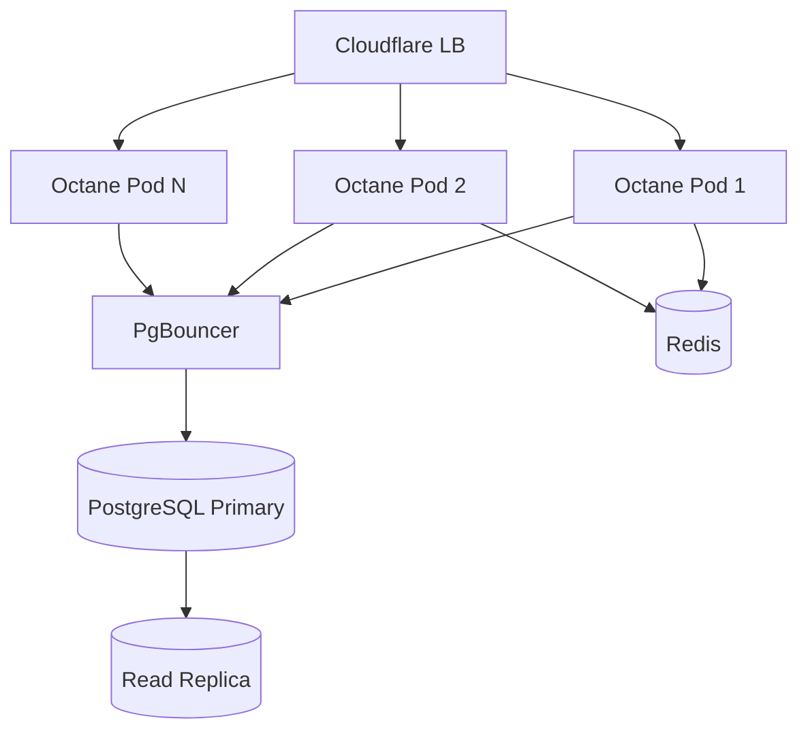
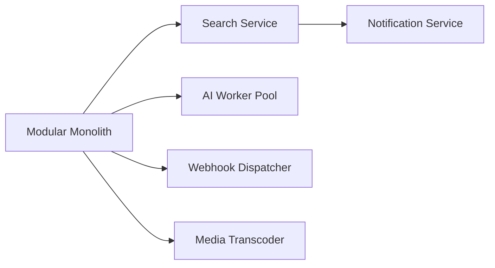

# Chapter 11: Scalability and Service Extraction

**Document ID:** SCP-ARCH-001-11  
**Version:** 1.0.0  
**Status:** ✅ Active  
**Traceability:** ADR-001, NFR-013 – NFR-020, NFR-021, FR-024

---

## Purpose

Define how SCP scales from **10 merchants to 100,000+** within the modular monolith, and the **objective criteria** for extracting services into independently deployable units without breaking tenant isolation or transactional integrity.

## Scope

- Horizontal and vertical scaling patterns per container
- Database scaling (connection pooling, read replicas, partitioning)
- Cache and queue scaling
- Search and AI worker scaling
- Service extraction decision framework
- Anti-patterns and rollback

## Out of Scope

- Kubernetes manifests (Volume 10 Ch. 10)
- Cost modeling (Volume 10 Ch. 11)
- Module-level performance tuning (Volume 5+)

---

## 1. Scaling Philosophy

SCP follows **scale-up-first, scale-out-second, extract-last**:

1. Optimize the monolith (Octane workers, query indexes, cache hit ratio).
2. Add replicas for read-heavy paths and worker pools for async work.
3. Extract only when a bounded context has independent scaling, team, and failure-domain requirements.

**Nigeria context:** Early merchants cluster in Lagos business hours (09:00–22:00 WAT). Autoscaling policies must handle **predictable diurnal peaks** without over-provisioning overnight.

---

## 2. Scaling Dimensions by Container

| Container | Phase 1 (≤500) | Phase 2 (≤5k) | Phase 3 (≤10k) | Phase 4 (10k+) |
|-----------|----------------|---------------|----------------|----------------|
| **SCP Core API** | 1 VM, 4 Octane workers | 2–4 VMs, LB | 6–12 VMs, LB | K8s HPA, multi-AZ |
| **Horizon workers** | 2 workers | 8–16 workers | Dedicated queues per domain | K8s worker deployments |
| **Next.js storefront** | 1 instance + CDN | 2–3 instances | 6+ instances, ISR warming | Edge + regional origins |
| **PostgreSQL** | Single primary | Primary + 1 read replica | Partition planning | Citus or sharding evaluation |
| **Redis** | Single instance | Sentinel | Cluster | Cluster + dedicated rate-limit shard |
| **Meilisearch** | Co-located | Dedicated VM | Dedicated cluster | Extracted search service |

### 2.1 Core API Horizontal Scaling

**Rules:**

- All app instances are **stateless**; sessions in Redis.
- Tenant context set per request; no sticky sessions required.
- Health checks: `/health` (liveness), `/ready` (DB + Redis connectivity).

### 2.2 Database Scaling

| Technique | When | SCP Implementation |
|-----------|------|-------------------|
| Index optimization | Always | Tenant-prefixed composite indexes on hot queries |
| PgBouncer | > 100 concurrent API workers | Transaction pooling + `SET LOCAL` (ADR-005) |
| Read replica | Read:write ratio > 3:1 | Storefront product/collection reads |
| Connection budget | Per worker | Max 5 DB connections per Octane worker via pool |
| Archival | Orders > 24 months | Cold storage to R2; searchable summary retained |

**Cross-tenant transactions** (marketplace split payouts) remain on primary — never on replica.

### 2.3 Queue Scaling

| Queue | Priority | Scale Trigger |
|-------|----------|---------------|
| `critical` | Webhook verification, payment reconciliation | Lag p95 > 5s |
| `default` | Notifications, index updates | Lag p95 > 30s |
| `low` | Analytics, AI batch | Lag p95 > 5 min acceptable |
| `ai` | LLM inference jobs | GPU/API latency SLO breach |

Horizon **supervisor count** scales per queue depth metric, not global CPU alone.

---

## 3. Performance Targets (Scale-Linked)

| Metric | 500 merchants | 5,000 merchants | 10,000 merchants |
|--------|---------------|-----------------|------------------|
| API read p95 | ≤ 200 ms | ≤ 200 ms | ≤ 250 ms |
| API write p95 | ≤ 500 ms | ≤ 500 ms | ≤ 600 ms |
| Checkout init p95 | ≤ 800 ms | ≤ 1 s | ≤ 1 s |
| Search autocomplete p95 | ≤ 100 ms | ≤ 100 ms | ≤ 120 ms |
| Monthly availability | 99.9% | 99.9% | 99.95% |

Degradation beyond targets for 7 days triggers capacity review (Volume 14 Ch. 05).

---

## 4. Service Extraction Framework

### 4.1 Extraction Scorecard

A bounded context is **extraction-eligible** when it scores ≥ 4 on the following (yes = 1 point):

| Criterion | Question |
|-----------|----------|
| **Independent scale** | Does it need 3× different replica count than core API? |
| **Independent team** | Dedicated team of ≥ 3 engineers? |
| **Failure isolation** | Can outage be tolerated without blocking checkout? |
| **Data boundary** | Owns tables with no cross-module FK writes? |
| **Async interface** | Consumers use events/API only (no shared transactions)? |
| **Operational maturity** | SLOs, runbooks, on-call rotation exist? |

### 4.2 Approved Extraction Candidates (Ordered)

| Service | Phase | Interface | Data |
|---------|-------|-----------|------|
| Search | 3 | REST + index events | Meilisearch indexes; rebuild from events |
| AI workers | 2–3 | Queue jobs | Ephemeral; no tenant PII in logs |
| Webhook dispatcher | 3 | Outbound HTTP + retry store | `webhook_deliveries` owned by Developer module |
| Media transcoder | 4 | Queue jobs | R2 objects; metadata via events |

### 4.3 Extraction Procedure

1. **Strangler pattern** — Dual-write or event-sync shadow period (≥ 2 weeks staging).
2. **Contract freeze** — OpenAPI/event schema versioned before cutover.
3. **Rollback plan** — Feature flag routes traffic back to monolith within 15 minutes.
4. **Isolation proof** — Tenant isolation suite extended to extracted service.
5. **Observability** — Distributed traces across monolith ↔ service before prod cutover.

### 4.4 Never Extract (Phase 1–3)

| Context | Reason |
|---------|--------|
| Orders + Payments | ACID checkout; marketplace splits |
| Catalog + Inventory | Strong consistency on stock reservation |
| Tenancy + Identity | Every request depends on tenant resolution |
| Cart | Session affinity to checkout funnel |

---

## 5. Multi-Region Scaling (Kenya Corridor)

| Attribute | Nigeria (primary) | Kenya (Phase 2+) |
|-----------|-------------------|------------------|
| Compute | Lagos AZ | Nairobi AZ |
| PostgreSQL | Primary + replicas | KE tenant data regional preference |
| CDN | Cloudflare global | Same; origin routing by tenant region |
| Payments | Paystack, Flutterwave | M-Pesa, Paystack KE |

**Cross-region rule:** No synchronous cross-region DB writes. Global admin uses async replication or federated read APIs.

---

## 6. Capacity Triggers & Actions

| Signal | Threshold | Action |
|--------|-----------|--------|
| API CPU sustained | > 70% for 1 h | Add Octane instance |
| PgBouncer wait time | p95 > 50 ms | Increase pool or add replica |
| Redis memory | > 80% | Evict cold cache keys; scale instance |
| Meilisearch index lag | > 5 min | Add indexer workers |
| Disk IOPS | > 80% sustained | Upgrade storage tier |
| Error budget burn | > 50% mid-month | Freeze non-critical deploys |

---

## 7. Anti-Patterns

| Anti-Pattern | Why It Fails in Nigeria |
|--------------|-------------------------|
| Microservices on day one | 2× ops headcount; delays GA |
| Sticky sessions on app tier | Uneven load during sales spikes |
| Read replica for checkout | Payment state inconsistency |
| Global Redis without namespacing | Cross-tenant cache bleed risk |
| Extract before observability | Incidents become undebuggable |

---

## 8. Acceptance Criteria

- [ ] Scaling table covers Phase 1–4 for all containers in Chapter 01
- [ ] Extraction scorecard documented with ≥ 6 criteria
- [ ] Orders/Payments/Catalog marked non-extractable through Phase 3
- [ ] PgBouncer + read replica triggers defined
- [ ] Kenya multi-region rules prohibit synchronous cross-region writes
- [ ] Capacity trigger table linked to Volume 14 capacity planning
- [ ] Strangler extraction procedure includes rollback within 15 minutes

---

## References

- [ADR-001: Modular Monolith](../00-meta/adr/001-modular-monolith-over-microservices.md)
- [ADR-005: RLS + PgBouncer](../00-meta/adr/005-rls-pgbouncer-set-local.md)
- [Chapter 12 — Deployment Topology](./12-deployment-and-runtime-topology.md)
- [Volume 10 Ch. 10 — Kubernetes](../10-infrastructure/10-scaling-path-kubernetes.md)
- [Volume 2 Ch. 10 — Technology Roadmap](../02-market-research/10-technology-roadmap-and-risks.md)
