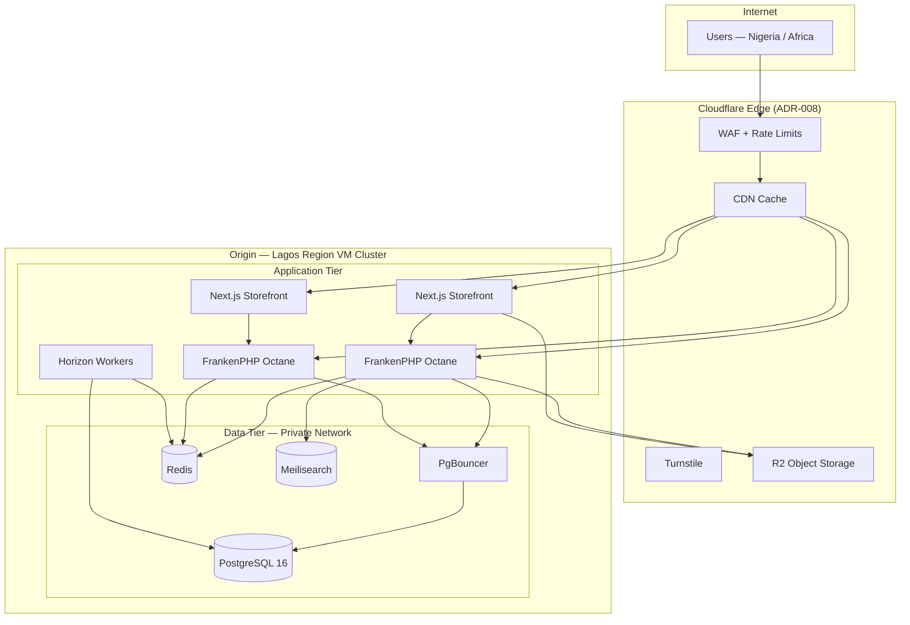
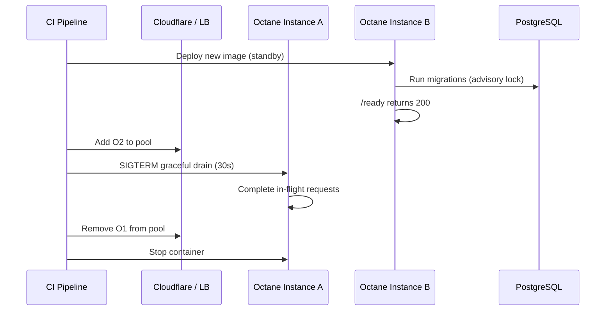

# Chapter 12: Deployment and Runtime Topology

**Document ID:** SCP-ARCH-001-12  
**Version:** 1.0.0  
**Status:** ✅ Active  
**Traceability:** ADR-001, ADR-008, ADR-011, NFR-021 – NFR-028, NFR-076

---

## Purpose

Specify SCP's **runtime deployment topology** — how containers, networks, and edge services are arranged in Nigeria-primary production, staging, and local environments.

## Scope

- Phase 1 Docker Compose production topology
- Network zones and traffic flows
- FrankenPHP Octane runtime configuration
- Next.js storefront deployment
- Cloudflare edge integration
- Zero-downtime deploy sequence
- Health checks and graceful shutdown

## Out of Scope

- CI/CD pipeline details (Volume 10 Ch. 06)
- Runbook step-by-step commands (Volume 10 Ch. 12)
- Security WAF rule tuning (Volume 11)

---

## 1. Phase 1 Production Topology (Nigeria)

Primary region: **`af-ng-lagos`** — Lagos or nearest West Africa availability zone with NDPA-aligned hosting.



### 1.1 VM Sizing (Phase 1 — ≤500 merchants)

| Role | vCPU | RAM | Disk | Count |
|------|------|-----|------|-------|
| App + Octane + Horizon | 8 | 32 GB | 200 GB NVMe | 1–2 |
| PostgreSQL | 4 | 16 GB | 500 GB NVMe | 1 |
| Redis + Meilisearch | 2 | 8 GB | 100 GB | 1 |

Scale horizontally by adding app VMs before upgrading DB tier (Chapter 11).

---

## 2. Network Zones

| Zone | Components | Exposure |
|------|------------|----------|
| **Public edge** | Cloudflare proxy, R2 public URLs | Internet |
| **DMZ / origin** | Next.js, Octane HTTP | Cloudflare IPs only (allowlist) |
| **Private data** | PostgreSQL, Redis, Meilisearch, PgBouncer | Origin private subnet only |
| **Management** | SSH via bastion, CI deploy agent | VPN / IP allowlist |

```text
Firewall rule: PostgreSQL port 5432 NEVER exposed to public internet.
Redis port 6379 NEVER exposed to public internet.
```

### 2.1 TLS Termination

| Hop | TLS Mode |
|-----|----------|
| Client → Cloudflare | TLS 1.3 (Full Strict) |
| Cloudflare → Origin | TLS 1.3, origin certificate |
| App → PostgreSQL | TLS optional Phase 1; mandatory Phase 3 |
| App → Redis | TLS Phase 2+ |

---

## 3. Request Routing

| Hostname Pattern | Target | Cache |
|------------------|--------|-------|
| `{store}.sapphital.shop` | Next.js storefront | ISR + CDN |
| `admin.sapphital.com` | Octane admin API + SPA | No cache |
| `api.sapphital.com` | Octane REST API | No cache (except GET storefront) |
| `hooks.sapphital.com` | Webhook ingress controllers | No cache |
| Custom domain (merchant) | CNAME → Cloudflare → storefront | Per theme cache rules |

**Tenant resolution:** Host header → `tenants.domain` lookup → `SET LOCAL app.tenant_id` on DB connection.

---

## 4. FrankenPHP Octane Runtime

| Setting | Value | Rationale |
|---------|-------|-----------|
| Server | FrankenPHP | Built-in HTTP/2, worker mode |
| Workers | `2 × vCPU` (min 4, max 16) | CPU-bound API handlers |
| `max_requests` | 1000 | Mitigate memory leaks |
| `memory_limit` | 256 MB per worker | Prevent runaway plugins |
| Opcache | Enabled, preloaded | Laravel bootstrap once per worker |
| Graceful shutdown | 30 s drain | In-flight checkout completes |

### 4.1 Process Model

```text
supervisord
├── frankenphp (N workers)
├── horizon (queue workers)
└── schedule:work (cron)
```

Octane and Horizon run in **separate containers** in Phase 2+ to isolate queue spikes from API latency.

---

## 5. Next.js Storefront Runtime

| Setting | Value |
|---------|-------|
| Node | 22 LTS |
| Mode | Standalone output |
| Instances | 2+ behind Cloudflare |
| ISR revalidation | Webhook-triggered on product/content change |
| Env | `STOREFRONT_API_URL` → internal Octane URL |

Storefront **never** connects to PostgreSQL directly — Storefront API only (ADR-003).

---

## 6. Docker Compose Service Map (Phase 1)

| Service | Image / Build | Ports (internal) | Volumes |
|---------|---------------|------------------|---------|
| `octane` | `scp-api:latest` | 8000 | — |
| `horizon` | `scp-api:latest` | — | — |
| `storefront` | `scp-storefront:latest` | 3000 | — |
| `postgres` | `postgres:16` | 5432 | `pgdata` |
| `pgbouncer` | `edoburu/pgbouncer` | 6432 | — |
| `redis` | `redis:7-alpine` | 6379 | `redisdata` |
| `meilisearch` | `getmeili/meilisearch` | 7700 | `meilidata` |

Cloudflare Tunnel or origin IP allowlist replaces public port exposure.

---

## 7. Zero-Downtime Deployment



**Rules:**

- Migrations run **once** per deploy on standby instance before traffic shift.
- Backward-compatible migrations only (NFR-076); destructive changes use expand-contract.
- Rollback: shift traffic to previous image tag; forward-only migrations require compat layer.

---

## 8. Health Endpoints

| Endpoint | Check | Use |
|----------|-------|-----|
| `GET /health` | Process alive | Liveness |
| `GET /ready` | DB + Redis + Meilisearch ping | Readiness / LB |
| `GET /metrics` | Prometheus scrape | Monitoring |

Failed readiness removes instance from pool; liveness restart after 3 failures.

---

## 9. Staging vs Production Parity

| Attribute | Staging | Production |
|-----------|---------|------------|
| Topology | Identical services | Identical |
| Scale | 50% resources | Full |
| Cloudflare | Full proxy | Full proxy |
| PSP | Paystack test mode | Paystack live |
| Data | Synthetic + anonymized | Live merchant data |
| Region | `af-ng-lagos` | `af-ng-lagos` |

---

## 10. Kenya Region Topology (Phase 2)

Duplicate Phase 1 stack in **`af-ke-nairobi`** with:

- KE tenant routing by `tenant.region` flag
- M-Pesa webhook ingress on `hooks-ke.sapphital.com`
- Async replication or export for cross-region analytics only

No shared PostgreSQL primary across regions.

---

## 11. Acceptance Criteria

- [ ] Phase 1 diagram shows Cloudflare → Octane/Next.js → PgBouncer → PostgreSQL
- [ ] PostgreSQL and Redis not publicly exposed
- [ ] FrankenPHP worker settings documented
- [ ] Zero-downtime deploy sequence includes migration advisory lock
- [ ] Storefront documented as API-only (no direct DB)
- [ ] Nigeria `af-ng-lagos` specified as primary region
- [ ] Kenya Phase 2 topology specifies separate regional stack
- [ ] Health and readiness endpoints defined

---

## References

- [ADR-008: Cloudflare Edge](../00-meta/adr/008-edge-security-cloudflare.md)
- [ADR-011: Data Residency](../00-meta/adr/011-data-residency-africa.md)
- [Volume 10 Ch. 03 — Compute](../10-infrastructure/03-compute-frankenphp-octane.md)
- [Volume 10 Ch. 12 — Runbooks](../10-infrastructure/12-runbooks.md)
- [Chapter 11 — Scalability](./11-scalability-and-service-extraction.md)
