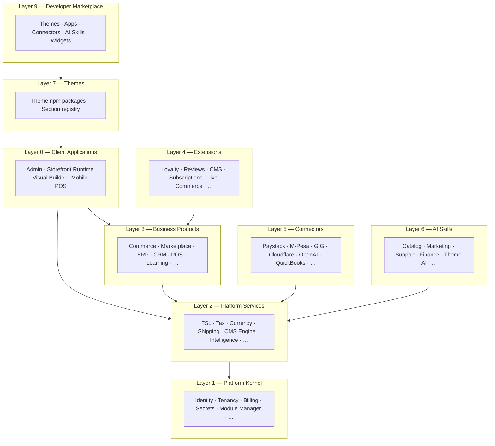

# Chapter 13: Platform OS Architecture

**Document ID:** SCP-ARCH-001-13  
**Version:** 1.1.0  
**Status:** ✅ Active  
**Traceability:** ADR-023, ADR-001, ADR-019, ADR-020, ADR-022  

---

## Purpose

Define the **SAPPHITAL Platform OS** — not a flat module list, but an operating system where **Products**, **Platform Services**, **Connectors**, and **Extensions** are independently versioned, installable packages.

> **Windows is not Microsoft Office.** Commerce is installed on the platform. Identity and Billing are the kernel.

---

## 1. Nine Layers (Including Client Runtimes)

The repository has **nine** physical layers. Layer 0 (Client Applications) was missing from early drafts but is required by ADR-017, Vol 4, Vol 6, and Vol 18.



---

## 2. Layer 0 — Client Applications & Runtimes

**Not Laravel packages.** Independent deployable frontends under `apps/` that consume Platform APIs. Required by [ADR-017](../00-meta/adr/017-three-system-storefront-architecture.md).

| Application | Path | Runtime | Phase | Doc |
|-------------|------|---------|-------|-----|
| **Merchant Admin** | `apps/admin/` | Next.js / React | 1 | Vol 4 Ch. 07 |
| **Platform Admin** | `apps/platform-admin/` | Next.js | 1 | Vol 16 |
| **Storefront Runtime** | `apps/storefront/` | Next.js SSR/ISR | 1 | ADR-017, Vol 6 Ch. 12–14 |
| **Visual Builder** | `apps/visual-builder/` | Next.js (admin module) | 1–2 | Vol 6 Ch. 13 |
| **Customer Shopping App** | `apps/mobile-customer/` | React Native | 2 | Vol 18 Ch. 03 |
| **Merchant Admin App** | `apps/mobile-merchant/` | React Native | 2 | Vol 18 Ch. 04 |
| **POS Register App** | `apps/pos/` | React Native + offline SQLite | 2 | Vol 18, Vol 15 Ch. 09 |

**Rules:**

1. Client apps **never** embed Commerce domain logic — only call Admin API, Storefront API, or Intelligence API.
2. Visual Builder **never** runs on the customer request path (ADR-017).
3. `Modules/POS/` holds POS **domain logic**; `apps/pos/` holds device UI, offline sync, printer/scanner bridge.

```text
/
├── apps/
│   ├── admin/
│   ├── platform-admin/
│   ├── storefront/
│   ├── visual-builder/
│   ├── mobile-customer/
│   ├── mobile-merchant/
│   └── pos/
├── Platform/
├── Modules/
└── …
```

---

## 3. Layer 1 — Platform Kernel

**Mandatory.** Kernel code **must not** reference Commerce, ERP, CRM, or Learning domain models.

| Responsibility | Package | Phase | ADR / Vol |
|----------------|---------|-------|-----------|
| Authentication & sessions | `Platform/Identity/` | 1 | ADR-006 |
| Authorization, roles, permissions | `Platform/Identity/` | 1 | ADR-006 |
| Organizations, users, teams | `Platform/Identity/` | 1 | Vol 16 |
| Tenants, stores (registry) | `Platform/Tenancy/` | 1 | ADR-002 |
| Billing, subscriptions, plans | `Platform/Billing/` | 1 | Vol 16 |
| Licensing & entitlements | `Platform/Billing/` | 1 | Vol 16 Ch. 03 |
| Module & package manager | `Platform/Kernel/ModuleManager/` | 1 | ADR-023 |
| Settings & configuration | `Platform/Kernel/Settings/` | 1 | — |
| Feature flags | `Platform/Kernel/FeatureFlags/` | 1 | Vol 16 |
| Event bus primitives | `Platform/Kernel/Events/` | 1 | Vol 3 Ch. 07 |
| Job & queue infrastructure | `Platform/Kernel/Jobs/` | 1 | Vol 10 |
| File storage abstraction | `Platform/Storage/` | 1 | Vol 10 |
| Structured logging | `Platform/Kernel/Logging/` | 1 | Vol 14 |
| Immutable audit log | `Platform/Audit/` | 1 | ADR-009 |
| Secrets & credential vault | `Platform/Secrets/` | 1 | ADR-007 |
| Admin impersonation | `Platform/Identity/Impersonation/` | 1 | ADR-010 |
| Localization (i18n/l10n core) | `Platform/Kernel/Localization/` | 1 | ADR-015 |
| API gateway (routing, versioning) | `Platform/Kernel/Api/` | 1 | Vol 3 Ch. 08 |
| Developer OAuth & app registry | `Platform/Developer/` | 2 | Vol 12 Ch. 05 |
| Tenant provisioning (TPE) | `Platform/Provisioning/` | 1 | ADR-022 |
| Domain, DNS, SSL orchestration | `Platform/Provisioning/Domains/` | 1 | ADR-022, Vol 16 Ch. 07 |
| Data residency & region policy | `Platform/Governance/Residency/` | 1 | ADR-011 |
| Analytics event ingestion (primitives) | `Platform/Analytics/Ingest/` | 1 | Vol 17 |

**Kernel vs Service rule:** Kernel provides **primitives and contracts**; Platform Services provide **business-capable engines** built on those primitives.

---

## 4. Layer 2 — Platform Services

Reusable **engines** consumed by all business products.

| Service | Package | Phase | Doc |
|---------|---------|-------|-----|
| Payment Engine (FSL) | `Platform/FinancialServices/` | 1 | ADR-019, Vol 5 Ch. 16–19 |
| Tax Engine | `Platform/Tax/` | 1 | Vol 5 Ch. 18 |
| Currency Engine | `Platform/Currency/` | 1 | Vol 5 Ch. 18 |
| Language / Regional Engine | `Platform/Localization/` | 1–2 | ADR-015, Vol 5 Ch. 18 |
| Notification Engine | `Platform/Notifications/` | 1 | Vol 19 |
| Email Engine | `Platform/Messaging/Email/` | 1 | Vol 19 Ch. 07 |
| SMS / WhatsApp Engine | `Platform/Messaging/` | 1–2 | Vol 19 Ch. 07 |
| Media Engine | `Platform/Media/` | 1 | Vol 7 |
| Document Engine | `Platform/Media/Documents/` | 2 | Vol 7 |
| Workflow / Automation Engine | `Platform/Workflow/` | 2 | Vol 19 Ch. 02 |
| Integration Service | `Platform/Integrations/` | 2 | Vol 19 Ch. 06 |
| Reporting Engine | `Platform/Reporting/` | 2 | Vol 14 |
| Search Engine | `Platform/Search/` | 1 | Vol 5, Vol 9 |
| Webhook delivery | `Platform/Webhooks/` | 1 | Vol 12 Ch. 04 |
| Shipping / Logistics Engine | `Platform/Shipping/` | 1–2 | Vol 5 Ch. 10 |
| Fraud / Risk Engine | `Platform/Risk/` | 2 | Vol 8, Vol 9 |
| AI Engine (orchestrator, memory, RAG) | `Platform/Intelligence/` | 1 | ADR-020, Vol 9 Ch. 17–22 |
| CMS / Content Engine | `Platform/Content/` | 2 | ADR-012–014, Vol 7 |
| Theme Engine (registry, validation CI) | `Platform/ThemeEngine/` | 1 | ADR-003, Vol 6 |
| Observability (OTel, metrics export) | `Platform/Observability/` | 1 | Vol 10, Vol 14 |

**Rule:** Commerce calls `PaymentEngine::pay()` — never `Paystack\Client` directly. Shipping rates call `Platform/Shipping/` — never courier APIs directly.

---

## 5. Layer 3 — Business Products

Installable applications under `Modules/`.

| Product | Path | Internal Bounded Contexts | Phase |
|---------|------|---------------------------|-------|
| **Commerce** (SCP) | `Modules/Commerce/` | Catalog, Inventory, Cart, Checkout, Orders, Customers, Promotions, Shipping UI | 1 |
| **Marketplace** | `Modules/Marketplace/` | Vendors, Commissions, Payouts, Disputes | 2–3 |
| **POS** (domain) | `Modules/POS/` | Registers, shifts, offline sync protocol | 2 |
| **CRM** | `Modules/CRM/` | Leads, pipelines, contacts | 2 |
| **ERP** | `Modules/ERP/` | Procurement, manufacturing hooks | 3 |
| **Learning** | `Modules/Learning/` | Courses, enrollments, progress | 2 |
| **Finance** | `Modules/Finance/` | AR/AP (not GL — ERP connectors own ledger) | 3+ |
| **HR** | `Modules/HR/` | Staff, payroll hooks | 4+ |
| **Inventory / WMS** | `Modules/Inventory/` *(optional standalone)* | Multi-warehouse when ERP/POS need shared WMS | 3+ |
| **Healthcare / Schools / Hotels / Restaurants** | Vertical products | Industry-specific workflows | 4+ |

**Note:** Phase 1 ships **Commerce only**. Inventory stays **internal** to Commerce until WMS standalone product is justified (see §26).

Each product: own semver, migrations, routes, permissions, tests, CI pipeline.

---

## 6. Layer 4 — Extensions

Optional features installable per tenant:

Optional features installable per tenant under `Modules/Extensions/` or `Modules/Commerce/Extensions/`:

| Extension | Path | Requires | Phase | Doc |
|-----------|------|----------|-------|-----|
| Loyalty & referrals | `Extensions/Loyalty/` | Commerce | 2 | Vol 5 Ch. 15 |
| Gift Cards | `Extensions/GiftCards/` | Commerce, FSL | 2 | Vol 5 Ch. 13 |
| Coupons / Promotions (advanced) | `Extensions/Coupons/` | Commerce | 1* | Vol 5 Ch. 11 |
| Subscriptions | `Extensions/Subscriptions/` | Commerce, FSL | 2 | Vol 5 Ch. 13 |
| Reviews & Q&A | `Extensions/Reviews/` | Commerce | 2 | Vol 5 Ch. 15 |
| Community / Wishlists | `Extensions/Community/` | Commerce | 2–3 | Vol 5 Ch. 15 |
| Live Commerce | `Extensions/LiveCommerce/` | Commerce, Media | 3 | Vol 5 Ch. 15 |
| Affiliates | `Extensions/Affiliates/` | Commerce | 3 | — |
| Bookings / Appointments | `Extensions/Bookings/` | Commerce | 3 | Vol 5 Ch. 22 |
| Blog / Newsletter | `Extensions/Blog/` | Content | 2 | Vol 7 |
| Chat / Help Desk | `Extensions/HelpDesk/` | CRM or Commerce | 3 | — |
| Forum | `Extensions/Forum/` | Community | 3 | — |
| Auctions / Donations | `Extensions/Auctions/` | Commerce | 3+ | — |
| Events / Memberships | `Extensions/Memberships/` | Commerce | 3+ | — |
| Projects / Calendar / Timesheets | `Extensions/Projects/` | CRM/ERP | 4+ | Future |
| Plugins (third-party) | `Extensions/Plugins/` | Developer platform | 3 | Vol 12 Ch. 07 |

\*Core promotions ship inside Commerce Phase 1; advanced extension when marketplace plugins need isolation.

---

## 7. Layer 5 — Connectors

External systems — **versioned, replaceable** under `Connectors/`. Each implements a platform contract.

### Payments (FSL adapters — Vol 5 Ch. 17)

Paystack · Flutterwave · M-Pesa (KE/TZ) · Pesapal · Pesalink · DPO · Cellulant · Moniepoint · PayFast · Peach · Ozow · Yoco · PayGate · MTN MoMo (UG/GH/RW) · Airtel Money · **Stripe · PayPal** (global only) · Opay · …

### Logistics & Shipping

GIG · Kwik · Sendy · DHL · FedEx · Kobo360 · **ShipRocket** (India/Africa expansion) · manual carrier · …

### Messaging & Social

Meta WhatsApp · Twilio SMS · Africa's Talking · Termii · Instagram · Facebook · TikTok · Google (OAuth, Merchant Center, **GTM/GA4**) · **Cloudflare Turnstile** · …

### Accounting & ERP

QuickBooks · Xero · Zoho Books · Sage · Google Sheets · SAP · Oracle · Salesforce · HubSpot · **WooCommerce** (migration import) · …

### AI Providers (routed by Intelligence Gateway)

OpenAI · Anthropic · Google Gemini · DeepSeek · Mistral · local/on-prem models · …

### Infrastructure & Edge

Cloudflare (CDN, WAF, R2, custom hostnames, SSL) · AWS S3-compatible · …

```text
Connectors/
├── Paystack/
├── PayPal/
├── Stripe/
├── Flutterwave/
├── Mpesa/
├── GigLogistics/
├── ShipRocket/
├── Cloudflare/
├── MetaWhatsApp/
├── WooCommerce/
├── OpenAI/
├── QuickBooks/
└── …
```

Maps to FSL adapters (Vol 5 Ch. 17) and Integration Service (Vol 19 Ch. 06).

---

## 8. Layer 6 — AI Skills

Optional agent packages under `AI/`:

```text
AI/
├── CatalogAgent/          # Product descriptions, categorization, import
├── MarketingAgent/        # Campaigns, social copy, SEO
├── FinanceAgent/          # Reconciliation, forecasting
├── SupportAgent/          # Customer support, order tracking
├── ThemeAgent/            # Theme generation, quality coach (ASI)
├── DeveloperAgent/        # API docs, integration help
├── ShoppingAssistant/     # Storefront NL search (Vol 9 Ch. 05)
├── InventoryAgent/        # Stock forecasting, reorder
├── PricingAgent/          # Dynamic pricing suggestions
├── FraudAgent/            # Risk scoring (with Platform/Risk)
├── OnboardingAgent/       # Merchant setup (ADR-021)
├── TranslationAgent/      # Hausa, Yoruba, Igbo, Swahili
├── VisionAgent/           # Image tagging, quality check
└── AnalyticsAgent/        # Insights, anomaly detection
```

Skills register with `Platform/Intelligence/` orchestrator. Consumed by Commerce, ERP, etc. via capability API (Vol 9 Ch. 19).

---

## 9. Layer 7 — Themes

Packages under `Themes/` (published npm packages) plus platform runtime in `Platform/ThemeEngine/`:

```text
Themes/                          # Installable theme packages
├── scp-dawn/                    # Reference: general retail
├── scp-market/                  # Reference: marketplace
├── scp-catalog/                 # Reference: catalog-first
└── …

Packages/
├── theme-sdk/                   # @sapphital/theme-sdk, scp-theme CLI
├── section-schemas/             # Shared JSON schemas
└── shared/                      # Money, TenantId, DomainEvent (Vol 3 Ch. 03)
```

ADR-003: React + JSON schema; Theme Store distribution Phase 3. **Theme Engine** (validation, section registry, CI) is a Platform Service; **Themes/** are merchant-installable packages; **Storefront Runtime** (`apps/storefront/`) renders them.

---

## 10. Layer 8 — Developer Marketplace

Phase 3+ unified marketplace for third-party listings. One platform, multiple listing types:

| Listing type | Source path | Review | Revenue share |
|--------------|-------------|--------|---------------|
| Themes | `Themes/*` | Vol 6 Ch. 07 | 70/30 → 80/20 (reconcile in Vol 6) |
| Apps / Plugins | `Modules/Extensions/Plugins/` | Vol 12 Ch. 10 | TBD |
| Connectors | `Connectors/*` | Vol 19 | TBD |
| AI Skills | `AI/*` | Vol 9 Ch. 19 | TBD |
| Widgets / Blocks | Theme app extensions | Vol 12 Ch. 08 | TBD |

Module Manager + Developer Portal (`Platform/Developer/`) power install, licensing, and entitlement checks.

---

## 11. Repository Layout

```text
/
├── apps/                  # Layer 0 — Client applications (ADR-017)
│   ├── admin/
│   ├── storefront/
│   ├── visual-builder/
│   └── …
├── Platform/              # Layer 1–2 — Kernel + Services
│   ├── Kernel/
│   ├── Identity/
│   ├── Tenancy/
│   ├── Billing/
│   ├── Provisioning/
│   ├── Secrets/
│   ├── FinancialServices/
│   ├── Intelligence/
│   ├── Content/
│   ├── ThemeEngine/
│   ├── Shipping/
│   └── …
├── Modules/               # Layer 3–4 — Products + Extensions
│   ├── Commerce/
│   ├── Marketplace/
│   └── Extensions/
├── Connectors/            # Layer 5
├── AI/                    # Layer 6
├── Themes/                # Layer 7
├── Packages/              # Shared libs (see §26)
├── Bootstrap/
├── Config/
├── Database/              # Kernel migrations only
├── app/                   # Thin Laravel shell
├── routes/
├── tests/
└── composer.json          # Workspace root
```

**Modules are NOT inside `app/`.**

---

## 12. Commerce Module Structure (Reference)

```text
Modules/Commerce/
├── src/
│   ├── Controllers/
│   ├── Services/
│   ├── Actions/
│   ├── Models/
│   ├── Policies/
│   ├── Events/
│   └── Contracts/
├── database/migrations/
├── routes/web.php
├── routes/api.php
├── resources/views/
├── tests/Feature/
├── tests/Unit/
├── docs/
│   ├── README.md
│   ├── ARCHITECTURE.md
│   ├── API.md
│   ├── PERMISSIONS.md
│   ├── EVENTS.md
│   ├── CONFIG.md
│   ├── TESTING.md
│   └── UPGRADE.md
├── CHANGELOG.md
├── composer.json
└── module.json
```

---

## 13. Module Manifest

```json
{
  "name": "Commerce",
  "slug": "commerce",
  "version": "1.0.0",
  "author": "SAPPHITAL",
  "type": "product",
  "requires": {
    "kernel": ">=2.0",
    "platform/billing": ">=1.0",
    "platform/financial-services": ">=1.0",
    "platform/tenancy": ">=1.0"
  },
  "permissions": [
    "commerce.view",
    "commerce.edit",
    "commerce.orders.fulfill"
  ],
  "providers": ["Modules\\Commerce\\CommerceServiceProvider"],
  "routes": ["routes/api.php", "routes/web.php"],
  "migrations": "database/migrations",
  "events": {
    "publishes": ["OrderPaid", "ProductCreated"],
    "subscribes": ["TenantProvisioned"]
  },
  "menus": ["admin.commerce"],
  "widgets": []
}
```

---

## 14. Module Manager

First-class admin + CLI application:

| Function | Description |
|----------|-------------|
| Installed | List enabled packages per tenant |
| Available | Marketplace / licensed catalog |
| Updates | Semver upgrade paths |
| Dependencies | Graph validation |
| Licenses | Entitlement check |
| Permissions | Register on enable |
| Health | Migration status, failed jobs |
| Logs | Install/upgrade audit |

### Install Pipeline

```text
Download → Verify signature → Verify license → Dependency check
  → Migrate → Publish assets → Register routes/menus/permissions/events → Enable
```

---

## 15. Dependency Graph (Example)

```text
Commerce → FinancialServices → Kernel
Commerce → Tenancy → Kernel
Commerce → Shipping → Connectors/GigLogistics
Marketplace → Commerce → …
CRM → Notifications → Kernel
Modules/Inventory (standalone, Phase 3+) → Kernel
```

**Clarification:** Phase 1 inventory is **internal** to `Modules/Commerce/`. Standalone `Modules/Inventory/` only when WMS product ships for ERP/POS.

Module Manager blocks enable if `requires` unsatisfied.

---

## 16. Independent Versioning & CI/CD

| Package | Version (example) |
|---------|-------------------|
| Commerce | 4.2.1 |
| FinancialServices | 5.0.0 |
| ERP | 2.1.0 |
| Paystack Connector | 3.1.2 |

Each package: own test pipeline → static analysis → security scan → publish artifact. **Failure in ERP does not block Commerce release.**

---

## 17. Team Ownership Model

| Team | Owns |
|------|------|
| Platform | Kernel, Tenancy, Billing, Secrets, Module Manager, Provisioning |
| Financial Services | FSL, payment Connectors |
| Intelligence | Platform/Intelligence, AI/ skills |
| Commerce | Modules/Commerce + commerce Extensions |
| Experience | apps/storefront, apps/visual-builder, Themes/, Platform/ThemeEngine |
| Integrations | Platform/Integrations, accounting Connectors |
| Marketplace | Modules/Marketplace |
| Mobile | apps/mobile-*, apps/pos + Modules/POS domain |

---

## 18. Namespace Convention

| Path | PHP Namespace |
|------|---------------|
| `Platform/FinancialServices/` | `Platform\FinancialServices\` |
| `Modules/Commerce/` | `Modules\Commerce\` |
| `Connectors/Paystack/` | `Connectors\Paystack\` |
| `AI/CatalogAgent/` | `AI\CatalogAgent\` |

Laravel `app/` registers service providers from discovered `module.json` files.

---

## 19. Migration from Current Docs

| Current doc term | Platform OS term |
|------------------|------------------|
| Bounded context module | Product or Platform Service |
| `App\Domains\AI` | `Platform/Intelligence/` |
| `App\Domains\FinancialServices` | `Platform/FinancialServices/` |
| Volume 5 Commerce Engine | `Modules/Commerce/` internals |
| Gateway adapters Vol 5 Ch 17 | `Connectors/*` |

---

| `App\Domains\Marketplace` | `Modules/Marketplace/` |
| `apps/storefront` (implicit) | `apps/storefront/` (Layer 0) |
| Vol 7 CMS | `Platform/Content/` |
| Vol 19 Integration Service | `Platform/Integrations/` |

---

## 20. Packages & Shared Infrastructure

`Packages/` holds **non-installable shared libraries** — not tenant-scoped products:

| Package | Purpose | Imported by |
|---------|---------|-------------|
| `Packages/shared/` | Value objects: `Money`, `TenantId`, `DomainEvent` | All Platform + Modules |
| `Packages/theme-sdk/` | `@sapphital/theme-sdk`, section types | Themes/, apps/storefront |
| `Packages/section-schemas/` | Canonical section JSON schemas | ThemeEngine, Visual Builder |
| `Packages/testing/` | Tenant isolation harness, factories | CI across all packages |
| `Packages/contracts/` | PHP interfaces for Connectors | Platform + Connectors |

**Rules:** No business logic in `Packages/`. No database migrations. Semver published to internal Composer/npm registry.

---

## 21. Canonical Placement Decisions

Resolves ambiguities found in cross-volume audit:

| Topic | Decision | Rationale |
|-------|----------|-----------|
| **Notifications** | Kernel = event dispatch primitives; `Platform/Notifications/` + `Platform/Messaging/` = delivery | Avoid duplicate listing in Kernel table |
| **Audit** | `Platform/Audit/` (Kernel-adjacent, mandatory) | ADR-009 immutability is platform-wide |
| **Search** | `Platform/Search/` only; Kernel exposes search contracts in API gateway | Single owner |
| **Webhooks** | Outbound: `Platform/Webhooks/`; Inbound PSP: Connectors | Vol 12 vs Vol 5 split |
| **CMS / Content** | `Platform/Content/` service, Phase 2 | Vol 7 is cross-product; not buried in Commerce |
| **Learning** | `Modules/Learning/` product; course SKUs extend Commerce catalog per ADR-016 | Product + catalog extension pattern |
| **Reviews / Loyalty / Live commerce** | Extensions under `Modules/Extensions/` | Vol 5 Ch. 15 |
| **Inventory / WMS** | Internal to Commerce Phase 1; optional `Modules/Inventory/` Phase 3+ | ERP/POS shared WMS trigger |
| **Marketplace phase** | Phase 2 pilot, Phase 3 full multi-vendor | Align playbooks to Ch. 03 registry |
| **Themes path** | Published packages: `Themes/`; SDK: `Packages/theme-sdk/` | ADR-017 three-system model |
| **Security ADRs** | Secrets → `Platform/Secrets/`; Impersonation → `Identity/Impersonation/`; Cloudflare → `Connectors/Cloudflare/` | Cross-cutting kernel/connector |
| **Observability** | `Platform/Observability/` exports OTel; Vol 10/14 own runbooks | Launch gate in Vol 21 Ch. 12 |
| **GraphQL** | Phase 3 extension of `Platform/Kernel/Api/` | Vol 12 Ch. 01 |

---

## 22. Phase 1 Minimum Platform Stack

What must exist before first merchant (aligned with Vol 21 playbooks):

| Layer | Phase 1 packages / apps |
|-------|-------------------------|
| **Clients** | `apps/admin`, `apps/storefront`, `apps/visual-builder` (MVP) |
| **Kernel** | Identity, Tenancy, Billing, Provisioning, Secrets, Audit, Kernel/* |
| **Services** | FinancialServices, Notifications, Messaging/Email, Media, Search, Intelligence (MVP), ThemeEngine, Observability |
| **Products** | `Modules/Commerce/` |
| **Connectors** | Paystack, Flutterwave, Cloudflare |
| **AI Skills** | OnboardingAgent, CatalogAgent, ShoppingAssistant (limited) |
| **Themes** | scp-dawn (reference) |

---

## 23. Acceptance Criteria

- [ ] ADR-023 accepted; folder layout includes `apps/` and `Packages/`
- [ ] Kernel has zero imports from `Modules\Commerce`
- [ ] Every installable package has `module.json` + contract docs
- [ ] Module Manager dependency check on enable
- [ ] Connectors implement interface contracts only
- [ ] Client apps consume APIs only (no domain logic in `apps/`)
- [ ] Performance, security, and scale standards enforced (Engineering Standards §13–16; Cursor rule)
- [ ] Complete inventory (§3–§10) traceable from Vol 1–21
- [ ] Per-package CI pipeline documented in Vol 21

---

## References

- [ADR-023](../00-meta/adr/023-sapphital-platform-os.md)
- [Engineering Knowledge Base](../00-meta/engineering-knowledge-base.md)
- [Chapter 03 — Bounded Contexts](./03-bounded-contexts-and-modules.md)
- [ADR-017 — Three-System Storefront](../00-meta/adr/017-three-system-storefront-architecture.md)
- [ADR-007 — Secrets](../00-meta/adr/007-secrets-management.md)
- [ADR-010 — Impersonation](../00-meta/adr/010-admin-impersonation.md)
- [Volume 6 — Theme Engine](../06-theme-engine/README.md)
- [Volume 7 — CMS](../07-cms/README.md)
- [Volume 18 — Mobile & POS](../18-mobile-pos/README.md)
- [Volume 19 — Automation & Integrations](../19-automation-integrations/README.md)
