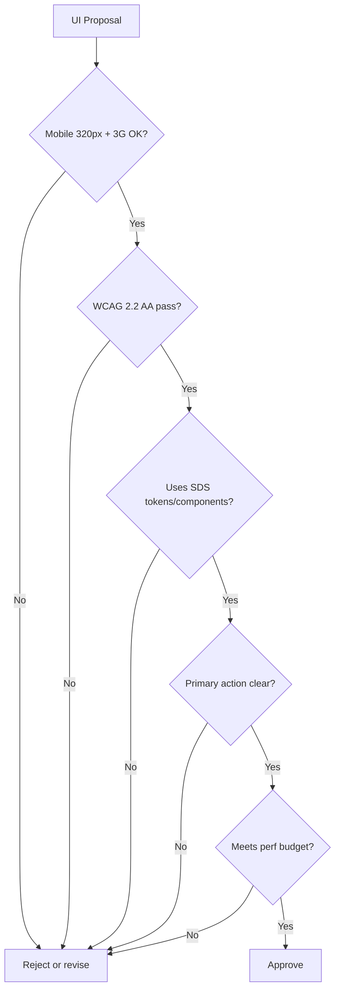

# Chapter 01: Design Philosophy & Principles

**Document ID:** SCP-DS-001-01  
**Version:** 1.0.0  
**Status:** ✅ Active  
**Traceability:** Product Principles 1–10, NFR-047 – NFR-053  

---

## 1. Purpose

Define the philosophical foundation of the SAPPHITAL Design System (SDS) and how it operationalizes SCP product principles into concrete design decisions. Every UI choice in admin, storefront, and theme surfaces must trace back to this chapter.

## 2. Design North Star

> **Commerce that feels fast, clear, and trustworthy on a ₦50,000 Android phone over 3G in Lagos.**

SDS targets the quality bar of **Shopify Polaris** (merchant clarity), **Stripe Dashboard** (data density without clutter), and **Linear** (speed and keyboard fluency) — adapted for African mobile-first commerce.

## 3. Core Design Values

| Value | Definition | Nigeria Context |
|-------|------------|-----------------|
| **Velocity** | Perceived speed equals trust | Skeleton screens, optimistic cart, no full reloads on filter |
| **Clarity** | One primary action per section | Naira amounts always visible; payment method logos at checkout |
| **Mobile primacy** | 320px is the design canvas | Thumb-zone navigation, 44px touch targets, bottom sheets |
| **Local first** | NGN, +234 phone, local PSPs default | Paystack/Flutterwave first; USSD/bank transfer surfaced |
| **Inclusive** | WCAG 2.2 AA on all surfaces | Screen reader checkout; high contrast; reduced motion |
| **Consistent** | One system, all surfaces | Same save/delete/filter patterns in admin and vendor portal |

## 4. Product Principle → Design Expression

### Principle 1: Speed Is a Feature

**Design rules:**

- Use skeleton placeholders matching final layout dimensions — never spinners on blank pages
- Optimistic UI for cart quantity, wishlist, and settings toggles
- Prefetch product cards on viewport entry (Intersection Observer)
- Admin heavy actions: immediate toast + background progress bar

**Anti-patterns:** Full-page reload for collection filters; blocking modals during async save.

### Principle 2: Clarity Over Cleverness

Every screen answers:

1. **Where am I?** — Breadcrumbs, page titles, active nav state
2. **What can I do?** — One primary CTA per section (filled button)
3. **What happens next?** — Button labels are verbs ("Place order", not "Continue")

Error messages follow: **What happened → Why → How to fix.**

Example (checkout phone validation):

```text
Invalid phone number.
Enter a Nigerian mobile number starting with 070, 080, 081, 090, or 091.
Example: 0803 456 7890
```

### Principle 3: Mobile Is Primary

| Rule | Specification |
|------|---------------|
| Breakpoints | 320, 768, 1024, 1440 px |
| Touch targets | ≥ 44×44 px (NFR-051) |
| Mobile admin nav | Bottom tab bar (5 items max) |
| Checkout | ≤ 3 taps from cart to payment redirect |
| Test profile | Chrome DevTools "Slow 3G", 320×568 viewport |

### Principle 4: AI Should Be Invisible Until Needed

- AI affordances use subtle ghost buttons with sparkle icon — never auto-open modals
- AI-generated product descriptions appear in editable textarea with "Review before publish" banner
- Destructive AI actions require explicit confirmation checkbox

### Principle 5: Local First, Global Ready

| Element | Nigeria Default | Expansion |
|---------|-----------------|-----------|
| Currency | NGN (`₦`) | KES, GHS via tenant locale |
| Number format | `₦12,500.00` | `KSh 12,500.00` |
| Phone identity | +234 primary | E.164 everywhere |
| Date/time | Africa/Lagos, 12h/24h toggle | Tenant timezone |
| Payments | Paystack, Flutterwave, bank transfer | M-Pesa (Kenya) |

### Principle 6: Progressive Disclosure

- Product create: Title + price + photo visible; variants/shipping/SEO collapsed under "Advanced"
- Settings: "Common" tab first; "Advanced" and "Developer" separated
- Admin nav: 5–7 top-level items; detail in secondary sidebar

### Principle 7: Trust by Design

Visual trust signals required on storefront and checkout:

- SSL padlock + "Secure checkout" label
- PSP logos (Paystack, Visa, Mastercard) above pay button
- Return policy link before "Place order"
- Merchant verification badge on marketplace listings
- Order confirmation screen with SMS sent indicator

### Principle 8: Consistency Across Surfaces

| Action | Pattern |
|--------|---------|
| Save | Primary button, bottom-right (desktop) or sticky footer (mobile) |
| Delete | Destructive dialog with typed confirmation for irreversible |
| Filter | Sheet on mobile, sidebar panel on desktop |
| Notifications | Top-right toast stack; persistent inbox in header bell |
| Empty state | Illustration + headline + single CTA |

### Principle 9: Data-Informed, Not Data-Driven

- Analytics widgets use SDS `MetricCard` — never raw chart libraries in business components
- A/B test variants must pass accessibility audit before rollout
- Merchant-facing analytics respect privacy: no customer PII in aggregate views

### Principle 10: Accessible to All

Non-negotiable (NFR-047 – NFR-053):

- WCAG 2.2 AA on all surfaces
- Keyboard operable admin workflows
- Screen reader tested checkout (NVDA + VoiceOver)
- Contrast ≥ 4.5:1 text, ≥ 3:1 UI components
- `prefers-reduced-motion` honored globally

## 5. Design Decision Framework

When evaluating a UI proposal, score against:



| Question | Weight | Pass Criteria |
|----------|--------|---------------|
| Works on 320px mobile over 3G? | High | LCP skeleton ≤ 2s perceived |
| WCAG 2.2 AA compliant? | High | axe-core zero critical |
| Uses semantic tokens? | High | No hardcoded hex in components |
| Clear primary action? | High | One filled button per section |
| Nigeria locale correct? | High | NGN, +234, local PSPs |
| Consistent with existing patterns? | High | Matches Chapter 06 inventory |
| Respects perf budget? | High | See Chapter 12 |

Features failing any **High** criterion require ADR justification.

## 6. Surface-Specific Posture

| Surface | Density | Motion | Primary User |
|---------|---------|--------|--------------|
| Platform admin | High (Stripe-like) | Minimal | SCP operators |
| Merchant dashboard | Medium-high | Subtle | Nigerian SMB merchants |
| Vendor portal | Medium | Subtle | Marketplace sellers |
| Storefront | Medium-low | Expressive (theme) | Mobile shoppers |
| Checkout | Low (focused) | None | Anxious buyers |

Checkout and payment surfaces intentionally restrict motion and decoration — clarity and trust override brand expression.

## 7. What SDS Is Not

- **Not one fixed marketing aesthetic** — SDS primitives optimize task completion; storefront themes add agency-quality storytelling within Chapter 13 contracts
- **Not theme-specific** — Themes inherit tokens; they do not redefine primitives
- **Not desktop-first** — Desktop is an enhancement, not the default design canvas
- **Not icon-only** — Labels always accompany icons in admin; storefront may use icon+label on mobile nav

## 8. Acceptance Criteria

- [ ] Design review checklist derived from Section 5 in Figma (Chapter 11)
- [ ] All new UI PRs reference applicable product principle(s)
- [ ] Nigeria locale fixtures used in Storybook default stories
- [ ] Zero custom hex values in `apps/admin` and `apps/storefront` — tokens only

## 9. Sources

| Source | Confidence | Use |
|--------|------------|-----|
| [Product Principles](../01-vision/04-product-principles.md) | E1 | Principle mapping |
| [NFRs](../01-vision/09-non-functional-requirements.md) | E1 | Accessibility, performance |
| Shopify Polaris design guidelines | E3 | Merchant dashboard patterns |
| Stripe Dashboard UX patterns | E3 | Data density reference |
| Linear app interaction patterns | E3 | Keyboard-first admin |
