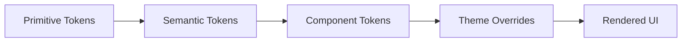

# Chapter 02: Design Tokens

**Document ID:** SCP-DS-001-02  
**Version:** 1.0.0  
**Status:** ✅ Active  
**Traceability:** NFR-050, ADR-003  

---

## 1. Purpose

Define the canonical design token system for SDS. Tokens are the contract between design (Figma), engineering (Tailwind/CSS), and themes (merchant customization). All SCP surfaces consume tokens — never raw values in component code.

## 2. Token Architecture



| Layer | Example | Who Sets |
|-------|---------|----------|
| Primitive | `--color-green-500: #22c55e` | Platform (immutable) |
| Semantic | `--color-success: var(--color-green-500)` | Platform (SDS) |
| Component | `--button-primary-bg: var(--color-brand)` | Platform (SDS) |
| Theme | `--color-brand: #006644` | Merchant (settings) |

## 3. Token Delivery

Tokens ship as `@scp/design-tokens` package:

```text
packages/design-tokens/
├── src/
│   ├── primitives.css      # Raw palette, spacing scale
│   ├── semantic.css        # Role-based aliases
│   ├── tailwind.preset.ts  # Tailwind v4 theme extension
│   └── figma.tokens.json   # Figma Variables sync
└── package.json
```

Tailwind consumption:

```typescript
// tailwind.config.ts (app)
import sdsPreset from '@scp/design-tokens/tailwind';

export default {
  presets: [sdsPreset],
  content: ['./src/**/*.{ts,tsx}'],
};
```

## 4. Spacing — 8px Grid

All spacing derives from a **4px base unit** with an **8px primary grid**. Odd values (4px) allowed for fine adjustments (icon gaps, badge padding).

| Token | Value | Use |
|-------|-------|-----|
| `--space-0` | 0 | Reset |
| `--space-0.5` | 4px | Icon-text gap, badge inset |
| `--space-1` | 8px | Inline padding, compact lists |
| `--space-2` | 16px | Card inner padding (mobile) |
| `--space-3` | 24px | Section gap (mobile) |
| `--space-4` | 32px | Card inner padding (desktop) |
| `--space-5` | 40px | Section gap (desktop) |
| `--space-6` | 48px | Page section margin |
| `--space-8` | 64px | Hero vertical rhythm |
| `--space-10` | 80px | Marketing section (storefront) |
| `--space-12` | 96px | Page top offset (admin) |

Tailwind mapping: `space-1` = 8px, `space-2` = 16px, etc.

**Layout rules:**

- Component internal padding: multiples of 8px
- Stack gaps between form fields: `--space-2` (16px)
- Page gutters: `--space-2` mobile, `--space-4` desktop
- Sticky footer/checkout bar height: `--space-6` (48px) minimum

## 5. Semantic Color Tokens

Primitives use OKLCH for perceptual uniformity and wide-gamut support. Semantic tokens map roles.

### 5.1 Brand & Action

| Token | Light Mode | Dark Mode | Use |
|-------|------------|-----------|-----|
| `--color-brand` | `#006644` | `#34d399` | Primary brand, merchant theme override |
| `--color-brand-hover` | `#005538` | `#6ee7b7` | Hover on brand surfaces |
| `--color-brand-subtle` | `#ecfdf5` | `#064e3b` | Brand tinted backgrounds |
| `--color-action-primary` | `var(--color-brand)` | same | Primary buttons, links |
| `--color-action-primary-fg` | `#ffffff` | `#022c22` | Text on primary actions |

Nigeria note: Default brand green evokes growth/trust; merchants override via theme settings (Chapter 10).

### 5.2 Surface & Background

| Token | Light | Dark | Use |
|-------|-------|------|-----|
| `--color-bg` | `#ffffff` | `#0a0a0a` | Page background |
| `--color-bg-subtle` | `#f8fafc` | `#171717` | Alternate sections |
| `--color-bg-muted` | `#f1f5f9` | `#262626` | Disabled, skeleton base |
| `--color-surface` | `#ffffff` | `#171717` | Cards, modals |
| `--color-surface-raised` | `#ffffff` | `#262626` | Elevated cards (shadow) |
| `--color-overlay` | `rgba(0,0,0,0.5)` | `rgba(0,0,0,0.7)` | Modal backdrop |

### 5.3 Text

| Token | Light | Contrast on `--color-bg` | Use |
|-------|-------|--------------------------|-----|
| `--color-text` | `#0f172a` | 16.1:1 ✓ | Body text |
| `--color-text-secondary` | `#475569` | 7.5:1 ✓ | Labels, captions |
| `--color-text-muted` | `#64748b` | 5.2:1 ✓ | Placeholder, hints |
| `--color-text-inverse` | `#ffffff` | — | Text on dark surfaces |
| `--color-text-link` | `#006644` | 5.8:1 ✓ | Inline links |

All text tokens meet NFR-050 (≥ 4.5:1 on default backgrounds).

### 5.4 Border & Divider

| Token | Value | Use |
|-------|-------|-----|
| `--color-border` | `#e2e8f0` | Default borders |
| `--color-border-strong` | `#cbd5e1` | Input focus ring base |
| `--color-divider` | `#f1f5f9` | Section separators |

### 5.5 Feedback

| Token | Light | Use |
|-------|-------|-----|
| `--color-success` | `#16a34a` | Order confirmed, saved |
| `--color-success-subtle` | `#f0fdf4` | Success banner bg |
| `--color-warning` | `#d97706` | Low stock, pending |
| `--color-warning-subtle` | `#fffbeb` | Warning banner bg |
| `--color-error` | `#dc2626` | Validation, failed payment |
| `--color-error-subtle` | `#fef2f2` | Error banner bg |
| `--color-info` | `#2563eb` | Informational notices |
| `--color-info-subtle` | `#eff6ff` | Info banner bg |

### 5.6 Commerce-Specific

| Token | Use |
|-------|-----|
| `--color-price` | Product price (inherits `--color-text`) |
| `--color-price-sale` | Sale price emphasis (`--color-error`) |
| `--color-price-strike` | Compare-at (`--color-text-muted`, line-through) |
| `--color-stock-in` | "In stock" badge |
| `--color-stock-low` | "Only 3 left" (`--color-warning`) |
| `--color-stock-out` | "Sold out" (`--color-text-muted`) |

## 6. Typography Scale Tokens

See Chapter 03 for full typography spec. Token summary:

| Token | Size | Line Height | Weight |
|-------|------|-------------|--------|
| `--font-size-xs` | 12px | 16px | 400 |
| `--font-size-sm` | 14px | 20px | 400 |
| `--font-size-base` | 16px | 24px | 400 |
| `--font-size-lg` | 18px | 28px | 500 |
| `--font-size-xl` | 20px | 28px | 600 |
| `--font-size-2xl` | 24px | 32px | 600 |
| `--font-size-3xl` | 30px | 36px | 700 |
| `--font-size-4xl` | 36px | 40px | 700 |

Mobile storefront product title: `--font-size-xl` (20px). Admin page title: `--font-size-2xl`.

## 7. Radius Tokens

| Token | Value | Use |
|-------|-------|-----|
| `--radius-none` | 0 | Tables, full-bleed images |
| `--radius-sm` | 4px | Badges, chips |
| `--radius-md` | 8px | Buttons, inputs, cards |
| `--radius-lg` | 12px | Modals, large cards |
| `--radius-xl` | 16px | Storefront hero cards |
| `--radius-full` | 9999px | Avatars, pills |

Default component radius: `--radius-md` (8px).

## 8. Shadow / Elevation Tokens

| Token | Value | Use |
|-------|-------|-----|
| `--shadow-none` | none | Flat surfaces |
| `--shadow-sm` | `0 1px 2px rgba(0,0,0,0.05)` | Subtle lift |
| `--shadow-md` | `0 4px 6px -1px rgba(0,0,0,0.1)` | Cards, dropdowns |
| `--shadow-lg` | `0 10px 15px -3px rgba(0,0,0,0.1)` | Modals |
| `--shadow-xl` | `0 20px 25px -5px rgba(0,0,0,0.1)` | Mobile bottom sheets |

Dark mode shadows use higher opacity (`0.3–0.5`) for visibility.

## 9. Motion Tokens

| Token | Value | Use |
|-------|-------|-----|
| `--duration-instant` | 0ms | Reduced motion default |
| `--duration-fast` | 100ms | Hover, toggle |
| `--duration-normal` | 200ms | Dropdown open |
| `--duration-slow` | 300ms | Modal enter |
| `--ease-default` | `cubic-bezier(0.4, 0, 0.2, 1)` | General |
| `--ease-spring` | `cubic-bezier(0.34, 1.56, 0.64, 1)` | Playful (storefront only) |

When `prefers-reduced-motion: reduce`, all durations resolve to `--duration-instant`.

## 10. Z-Index Scale

| Token | Value | Use |
|-------|-------|-----|
| `--z-base` | 0 | Default |
| `--z-dropdown` | 100 | Menus, popovers |
| `--z-sticky` | 200 | Sticky headers, checkout bar |
| `--z-modal` | 300 | Dialogs, sheets |
| `--z-toast` | 400 | Toast notifications |
| `--z-tooltip` | 500 | Tooltips |

## 11. Breakpoint Tokens

| Token | Value | Target |
|-------|-------|--------|
| `--breakpoint-xs` | 320px | Minimum supported |
| `--breakpoint-sm` | 640px | Large phones |
| `--breakpoint-md` | 768px | Tablet |
| `--breakpoint-lg` | 1024px | Desktop |
| `--breakpoint-xl` | 1440px | Wide desktop |

Mobile-first: base styles target 320px; enhance with `md:` and `lg:` prefixes.

## 12. Locale & Formatting Tokens

| Token | Default (Nigeria) | Example |
|-------|-------------------|---------|
| `--locale-currency-code` | `NGN` | — |
| `--locale-currency-symbol` | `₦` | ₦12,500.00 |
| `--locale-number-separator` | `,` | 1,234,567 |
| `--locale-decimal-separator` | `.` | .00 |
| `--locale-phone-country` | `NG` | +234 |
| `--locale-date-format` | `DD MMM YYYY` | 12 Jul 2026 |

Formatting logic lives in `@scp/i18n`; tokens expose CSS `content` where needed (e.g., currency symbol prefix via data attribute).

## 13. Theme Override Contract

Merchants may override these tokens via theme settings (ADR-003):

| Overridable | Not Overridable |
|-------------|-----------------|
| `--color-brand` (+ hover, subtle) | Feedback colors (success/error) |
| `--font-family-heading` | Spacing scale |
| `--font-family-body` | Touch target minimums |
| `--radius-md`, `--radius-lg` | Contrast ratios |
| Logo asset URL | Z-index scale |

Theme validation rejects overrides that fail WCAG contrast checks (Chapter 10).

## 14. Acceptance Criteria

- [ ] `@scp/design-tokens` published; zero hardcoded colors in SDS components
- [ ] Figma Variables sync from `figma.tokens.json` (bidirectional)
- [ ] Dark mode tokens pass contrast audit (NFR-050)
- [ ] Merchant brand override recalculates `--color-action-primary-fg` automatically
- [ ] Spacing audit: 100% of SDS components use 8px grid multiples

## 15. Sources

| Source | Confidence |
|--------|------------|
| [ADR-003](../00-meta/adr/003-theme-engine-react-json-schema.md) | E1 |
| Tailwind CSS v4 theme documentation | E1 |
| OKLCH color space (CSS Color Module Level 4) | E1 |
| Shopify Polaris tokens | E3 |
