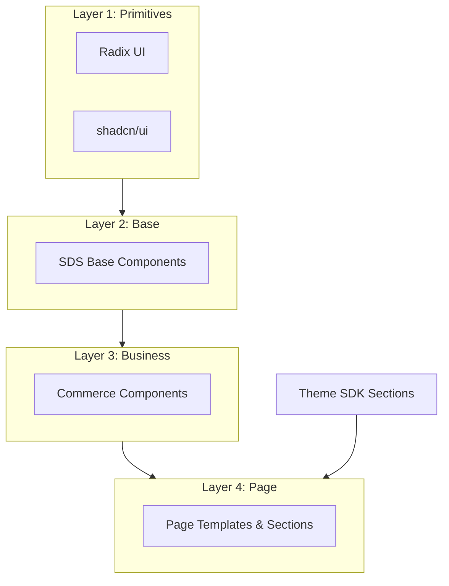

# Chapter 05: Component Architecture

**Document ID:** SCP-DS-001-05  
**Version:** 1.0.0  
**Status:** ✅ Active  
**Traceability:** ADR-003, Product Principle 8  

---

## 1. Purpose

Define the four-layer component architecture for SDS: **Primitive → Base → Business → Page**. This hierarchy ensures accessibility and consistency at the foundation while enabling commerce-specific composition without duplication.

## 2. Architecture Overview



| Layer | Package | Owner | Customizable by Merchant |
|-------|---------|-------|--------------------------|
| Primitive | `@radix-ui/*` | External | No |
| Base | `@scp/ui` | Platform | No |
| Business | `@scp/commerce-ui` | Platform | No |
| Page | `@scp/admin`, `@scp/storefront`, theme packages | App / Theme dev | Sections via theme editor |

**Rule:** Dependencies flow downward only. Business components never import from page layer. Themes never import admin components.

## 3. Layer 1: Primitives

Unstyled, accessible building blocks from Radix UI, configured via shadcn/ui copy-into-repo model.

| Primitive | Radix Package | Purpose |
|-----------|---------------|---------|
| Dialog | `@radix-ui/react-dialog` | Modals |
| Dropdown Menu | `@radix-ui/react-dropdown-menu` | Action menus |
| Select | `@radix-ui/react-select` | Single select |
| Popover | `@radix-ui/react-popover` | Floating content |
| Tabs | `@radix-ui/react-tabs` | Tab panels |
| Toast | `@radix-ui/react-toast` | Notifications |
| Tooltip | `@radix-ui/react-tooltip` | Hints |
| Switch | `@radix-ui/react-switch` | Toggles |
| Checkbox | `@radix-ui/react-checkbox` | Multi-select |
| Radio Group | `@radix-ui/react-radio-group` | Single choice |
| Slider | `@radix-ui/react-slider` | Range input |
| Scroll Area | `@radix-ui/react-scroll-area` | Custom scroll |
| Accordion | `@radix-ui/react-accordion` | Collapsible sections |

Primitives are **never used directly** in app code — always wrapped by Base layer.

## 4. Layer 2: Base Components

Styled, token-driven components in `@scp/ui`. One Base component per shadcn primitive + SDS extensions.

### 4.1 Base Inventory

| Component | Variants | Key Props |
|-----------|----------|-----------|
| `Button` | primary, secondary, ghost, destructive, link | `size`: sm/md/lg, `loading`, `iconLeft`, `iconRight` |
| `Input` | default, error, disabled | `label`, `hint`, `error`, `prefix`, `suffix` |
| `Textarea` | default, error | `maxLength`, `showCount` |
| `Select` | default | `options`, `placeholder`, `error` |
| `Checkbox` | default | `label`, `description` |
| `RadioGroup` | default | `options`, `orientation` |
| `Switch` | default | `label`, `description` |
| `Badge` | default, success, warning, error, info | `size`: sm/md |
| `Card` | default, interactive | `header`, `footer`, `padding` |
| `Dialog` | default | `title`, `description`, `footer` |
| `Sheet` | bottom (mobile), right (desktop) | Same as Dialog |
| `DropdownMenu` | default | Standard menu items |
| `Popover` | default | Trigger + content |
| `Tabs` | default, underline | `items[]` |
| `Table` | default | Sortable columns, row selection |
| `Toast` | success, error, warning, info | Via `useToast()` hook |
| `Tooltip` | default | Delay 300ms |
| `Skeleton` | text, circle, rect | `width`, `height` |
| `Avatar` | image, fallback | `size`: sm/md/lg |
| `Separator` | horizontal, vertical | — |
| `ScrollArea` | default | Max height control |
| `Breadcrumb` | default | `items[]` |
| `Pagination` | default | `page`, `totalPages`, `onChange` |
| `Alert` | success, warning, error, info | Dismissible option |
| `Progress` | default, indeterminate | `value`, `max` |
| `Spinner` | sm, md, lg | Used only < 1s loads |

### 4.2 Base Component Contract

Every Base component MUST:

1. Consume semantic tokens only (Chapter 02)
2. Forward refs (`React.forwardRef`)
3. Accept `className` for Tailwind extension
4. Include TypeScript props interface exported
5. Pass axe-core audit in isolation
6. Document in Storybook with Controls + a11y panel
7. Support dark mode via CSS variables

Example:

```tsx
// packages/ui/src/button.tsx
interface ButtonProps extends React.ButtonHTMLAttributes<HTMLButtonElement> {
  variant?: 'primary' | 'secondary' | 'ghost' | 'destructive' | 'link';
  size?: 'sm' | 'md' | 'lg';
  loading?: boolean;
  iconLeft?: React.ReactNode;
  iconRight?: React.ReactNode;
}

export const Button = React.forwardRef<HTMLButtonElement, ButtonProps>(
  ({ variant = 'primary', size = 'md', loading, children, ...props }, ref) => {
    // Implementation using CVA + tokens
  }
);
```

## 5. Layer 3: Business Components

Commerce-aware compositions in `@scp/commerce-ui`. Combine Base components with domain logic props — no direct API calls.

### 5.1 Business Inventory (Summary)

Full specs in Chapter 06. Categories:

- **Inputs:** `PriceInput`, `PhoneInput`, `AddressForm`, `VariantPicker`
- **Feedback:** `OrderStatusBadge`, `StockBadge`, `PaymentStatusBanner`
- **Navigation:** `AdminSidebar`, `MobileTabBar`, `StorefrontHeader`
- **Commerce:** `ProductCard`, `CartLineItem`, `CheckoutSummary`, `PaymentMethodSelector`
- **Analytics:** `MetricCard`, `RevenueChart`, `OrdersSparkline`

### 5.2 Business Component Contract

1. Accept **data props** only — no `fetch()` inside components
2. Use `@scp/i18n` for currency, date, phone formatting
3. Include loading skeleton variant
4. Include empty state variant
5. Mobile-first responsive behavior built-in
6. Export from `@scp/commerce-ui` with tree-shaking support

```tsx
// packages/commerce-ui/src/product-card.tsx
interface ProductCardProps {
  title: string;
  price: Money;           // { amount: 1250000, currency: 'NGN' } — minor units
  compareAtPrice?: Money;
  imageUrl: string;
  imageAlt: string;
  href: string;
  badge?: 'sale' | 'new' | 'sold-out';
  onAddToCart?: () => void;
  loading?: boolean;
}
```

## 6. Layer 4: Page Components

Application-specific layouts composing Business + Base layers.

### 6.1 Admin Pages (`apps/admin`)

| Page | Components Used |
|------|-----------------|
| Dashboard | `MetricCard[]`, `RevenueChart`, `RecentOrdersTable` |
| Product List | `DataTable`, `FilterSheet`, `BulkActionBar` |
| Product Edit | `ProductForm`, `VariantPicker`, `MediaUploader` |
| Order Detail | `OrderTimeline`, `OrderLineItems`, `FulfillmentActions` |

### 6.2 Storefront Pages (`apps/storefront`)

Rendered via Next.js App Router + theme JSON templates (ADR-003):

```text
Page Route → JSON Template → Section Registry → Business/Base Components
```

### 6.3 Theme Sections (Volume 6)

Theme developers build Layer 4 sections using Layer 2–3 components:

```tsx
// themes/default/sections/ProductGrid.tsx
import { ProductCard } from '@scp/commerce-ui';

export function ProductGrid({ products }: { products: Product[] }) {
  return (
    <section className="grid grid-cols-2 md:grid-cols-4 gap-4">
      {products.map(p => <ProductCard key={p.id} {...p} />)}
    </section>
  );
}
```

## 7. Composition Patterns

### 7.1 Compound Components

Complex UI uses compound pattern:

```tsx
<Card>
  <Card.Header>
    <Card.Title>Order #SCP-1042</Card.Title>
    <Card.Description>Placed 12 Jul 2026</Card.Description>
  </Card.Header>
  <Card.Content>{/* ... */}</Card.Content>
  <Card.Footer>
    <Button variant="primary">Fulfill</Button>
  </Card.Footer>
</Card>
```

### 7.2 Render Props / Slots

Business components expose slots for customization:

```tsx
<ProductCard
  {...product}
  renderActions={(p) => <WishlistButton productId={p.id} />}
/>
```

### 7.3 Polymorphism

Navigation components support `asChild` via Radix Slot:

```tsx
<Button asChild>
  <Link href="/products/new">Add product</Link>
</Button>
```

## 8. File & Export Conventions

```text
packages/ui/src/
├── button.tsx
├── input.tsx
├── index.ts          # Re-exports all base
└── lib/
    └── cn.ts         # clsx + tailwind-merge

packages/commerce-ui/src/
├── product-card.tsx
├── price-input.tsx
├── index.ts
└── types/
    └── money.ts
```

Naming: PascalCase components, kebab-case files, `@scp/ui/button` subpath exports.

## 9. Testing Requirements

| Layer | Unit | Visual | a11y |
|-------|------|--------|------|
| Base | Vitest + RTL | Chromatic | axe in Storybook |
| Business | Vitest + RTL | Chromatic | axe + keyboard |
| Page | Playwright E2E | Percy (optional) | axe E2E on critical flows |

## 10. Acceptance Criteria

- [ ] Zero Radix imports in `apps/admin` or `apps/storefront` — Base layer only
- [ ] Business components have no API/fetch dependencies
- [ ] Theme sections use `@scp/commerce-ui` — no duplicated ProductCard
- [ ] Storybook documents all Base components with a11y panel
- [ ] Dependency graph lint rule prevents upward imports

## 11. Sources

| Source | Confidence |
|--------|------------|
| [ADR-003](../00-meta/adr/003-theme-engine-react-json-schema.md) | E1 |
| shadcn/ui architecture | E1 |
| Shopify Polaris component tiers | E3 |
| Atomic Design (Brad Frost) — adapted to 4 layers | E3 |
