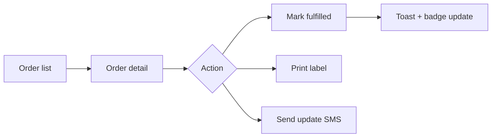

# Chapter 07: Admin & Merchant Dashboard UX

**Document ID:** SCP-DS-001-07  
**Version:** 1.0.0  
**Status:** ✅ Active  
**Traceability:** NFR-006, NFR-048, Product Principles 2, 3, 6  

---

## 1. Purpose

Define UX patterns for SCP platform admin and merchant dashboard surfaces. These patterns target Nigerian SMB merchants operating primarily on mobile devices, with desktop as a power-user enhancement.

## 2. User Personas

| Persona | Device | Context | Priority Flows |
|---------|--------|---------|----------------|
| **Amina** — Lagos fashion merchant | Android phone (720p) | On shop floor, 3G | Check orders, update stock, share product link |
| **Chidi** — Abuja electronics seller | Laptop + phone | Office + warehouse | Bulk product import, analytics, fulfillment |
| **SCP Operator** — Platform admin | Desktop | Support desk | Tenant management, impersonation, system health |

Design for Amina first; Chidi second; Operator third.

## 3. Information Architecture

### 3.1 Merchant Dashboard Navigation

Top-level items (max 7):

| # | Item | Icon | Badge |
|---|------|------|-------|
| 1 | Home | `LayoutDashboard` | — |
| 2 | Products | `Tag` | — |
| 3 | Orders | `Package` | Unfulfilled count |
| 4 | Customers | `Users` | — |
| 5 | Analytics | `BarChart3` | Business tier gate |
| 6 | Marketing | `Megaphone` | Phase 2 |
| 7 | Settings | `Settings` | — |

Mobile: bottom tab bar with Home, Products, Orders, Analytics, More (Customers + Settings).
Desktop: left sidebar with full labels.

### 3.2 Platform Admin Navigation

Separate app (`admin.sapphital.com`):

| Section | Items |
|---------|-------|
| Overview | Dashboard, System health |
| Tenants | Merchants, Plans, Billing |
| Commerce | Orders (cross-tenant), Disputes |
| Platform | Themes, Feature flags, Audit log |
| Support | Impersonation, Tickets |

Higher data density permitted — Stripe Dashboard reference.

## 4. Layout System

### 4.1 Page Shell

```text
┌─────────────────────────────────────────┐
│ Top bar: search, notifications, profile │  56px
├──────────┬──────────────────────────────┤
│ Sidebar  │ Page header (title + actions)│
│ 256px    ├──────────────────────────────┤
│          │ Content area                 │
│          │ (max-width: 1280px)          │
│          │                              │
└──────────┴──────────────────────────────┘
```

Mobile: sidebar hidden; bottom tab bar; page header with back arrow.

### 4.2 Page Header Pattern

| Element | Rule |
|---------|------|
| Title | `text-2xl` (desktop), `text-xl` (mobile) |
| Description | One line, `text-sm`, optional |
| Primary action | Right-aligned: "Add product", "Create order" |
| Secondary actions | Ghost buttons or `DropdownMenu` ("More actions") |
| Breadcrumb | Above title on desktop; hidden on mobile |

### 4.3 Content Width

| Content Type | Max Width |
|--------------|-----------|
| Data tables | Full width |
| Forms | 640px (`max-w-xl`) |
| Detail pages | 960px (`max-w-4xl`) |
| Settings | 640px with section nav |

## 5. Key Flows

### 5.1 Onboarding Wizard

3 steps to launch (Product Principle 6):

| Step | Content | Validation |
|------|---------|------------|
| 1. Store basics | Name, logo, category | Name required |
| 2. First product | Title, price, photo | Price > 0, 1 photo |
| 3. Payment setup | Connect Paystack | OAuth complete |

Progress bar at top. Back/Next buttons. Skip advanced → dashboard with checklist widget.

Mobile: full-screen steps, one field group per screen.

### 5.2 Order Fulfillment



Mobile order detail:

- Customer name + phone (tap-to-call `tel:` link)
- Line items with thumbnails
- Payment status banner
- Sticky footer: "Mark as fulfilled" primary button
- Swipe actions on order list: fulfill, view

### 5.3 Product Management

List view:

- Mobile: card list (image, title, price, stock badge, status)
- Desktop: `DataTable` with sort/filter
- Filter: bottom sheet (mobile), sidebar panel (desktop)
- Bulk actions: publish, unpublish, delete (with confirmation)

Create/edit: progressive disclosure form (Chapter 06, §5.5).

Quick actions from list: edit, duplicate, preview storefront link (share sheet on mobile).

### 5.4 Analytics Dashboard (Business Tier)

Layout:

```text
┌────────┬────────┬────────┬────────┐
│ Revenue│ Orders │  AOV   │ Conv.  │  MetricCard row
├────────┴────────┴────────┴────────┤
│ Revenue chart (30d default)       │
├──────────────────┬────────────────┤
│ Top products     │ Recent orders  │
└──────────────────┴────────────────┘
```

Mobile: single column stack. Charts full width, 200px height.
Naira formatting throughout (`₦1,234,567.00`).

Free tier: upgrade prompt instead of analytics section.

## 6. Interaction Patterns

### 6.1 Save Pattern

| Context | Behavior |
|---------|----------|
| Form save | Optimistic toast "Saved" + async persist |
| Settings | Explicit "Save changes" button (no auto-save) |
| Destructive | Dialog with typed confirmation ("DELETE") |
| Navigation away | Unsaved changes dialog |

Mobile: sticky footer with primary save button, 48px height.

### 6.2 Search & Filter

| Surface | Pattern |
|---------|---------|
| Global search | `Cmd+K` / top bar; searches products, orders, customers |
| List filter | Filter icon → sheet (mobile) or panel (desktop) |
| Active filters | Removable chips below search |
| Results | Count label: "42 products" |

### 6.3 Notifications

| Type | Channel | UI |
|------|---------|-----|
| New order | Push + in-app | Toast + bell badge |
| Low stock | In-app | Bell badge |
| Payment received | SMS + in-app | Toast |
| System | In-app | Banner (admin only) |

Notification center: slide-over panel from bell icon. Group by date. Mark all read.

### 6.4 Keyboard Shortcuts (Desktop)

Linear-inspired power-user shortcuts:

| Shortcut | Action |
|----------|--------|
| `Cmd+K` | Command palette |
| `G then O` | Go to Orders |
| `G then P` | Go to Products |
| `N` | New (context: product, order) |
| `/` | Focus search |
| `Esc` | Close modal/panel |

Shortcuts documented in `?` help dialog.

## 7. Nigeria-Specific UX

| Scenario | Design Response |
|----------|-----------------|
| Phone-first identity | Phone number prominent on customer profiles; SMS actions |
| Naira cash rounding | PriceInput handles kobo; display always 2 decimals |
| Intermittent connectivity | Optimistic UI + retry banner: "Changes will sync when online" |
| Share product link | Native share sheet (`navigator.share`) on mobile |
| Low literacy | Plain language labels; icons supplement, not replace |
| WhatsApp commerce | "Share on WhatsApp" button on product detail (admin preview) |
| Power outages | Auto-save drafts every 30s; recover unsaved on return |

## 8. Responsive Behavior Summary

| Breakpoint | Sidebar | Tab Bar | Table View | Form Layout |
|------------|---------|---------|------------|-------------|
| 320–767 | Hidden | Bottom | Card list | Single column |
| 768–1023 | Collapsed (64px) | Hidden | Table | Single column |
| 1024+ | Expanded (256px) | Hidden | Table | Two column where appropriate |

## 9. Empty & Error States

Every list page includes:

| State | Pattern |
|-------|---------|
| Empty (new merchant) | Illustration + "Add your first {item}" CTA |
| Empty (filtered) | "No results match your filters" + clear filters link |
| Error (load fail) | "Couldn't load {items}" + retry button |
| Offline | Banner: "You're offline. Showing cached data." |

## 10. Acceptance Criteria

- [ ] Merchant onboarding completable in ≤ 5 minutes on 320px mobile
- [ ] Order fulfillment achievable in ≤ 3 taps on mobile
- [ ] All admin workflows keyboard-operable (NFR-048)
- [ ] TTI ≤ 3.0s on admin dashboard (NFR-006)
- [ ] Command palette functional on desktop
- [ ] Offline draft recovery tested for product form

## 11. Sources

| Source | Confidence |
|--------|------------|
| Product Principles 2, 3, 6 | E1 |
| Shopify admin mobile patterns | E3 |
| Stripe Dashboard IA | E3 |
| Linear keyboard shortcuts | E3 |
