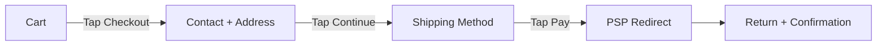

# Chapter 08: Storefront & Checkout UX

**Document ID:** SCP-DS-001-08  
**Version:** 1.0.0  
**Status:** ✅ Active  
**Traceability:** NFR-001, NFR-012, ADR-004, Product Principles 3, 5, 7  

---

## 1. Purpose

Define UX patterns for customer-facing storefront and checkout — the revenue-critical surfaces where Nigerian mobile shoppers convert. Checkout follows ADR-004 (PSP redirect, SAQ A); storefront follows ADR-003 (theme engine).

## 2. Storefront Architecture

```mermaid
flowchart TD
    A[Customer Browser] --> B[Next.js Storefront]
    B --> C[Theme JSON Template]
    C --> D[Section Components]
    D --> E[@scp/commerce-ui]
    E --> F[Storefront API]
    B --> G[ISR Cache / CDN]
```

Merchant customization affects tokens and section settings — not checkout security layout (locked template).

### 2.1 Storefront Visual Outcome

Storefronts must feel **professionally art-directed**, not like one recognizable template with merchant colors applied. They standardize accessible commerce behavior while allowing themes to vary composition, typography, media ratios, section rhythm, and vertical-specific components.

Every homepage must pass the [Chapter 13 five-second test](./13-storefront-visual-direction.md):

1. What does the merchant sell?
2. Why should the shopper trust the merchant?
3. What is the primary action to buy?

## 3. Page Types

| Page | Template | Key Sections |
|------|----------|--------------|
| Homepage | `index.json` | Hero, categories, merchandising, trust, optional AI finder and editorial sections |
| Collection | `collection.json` | Collection header, Filter/sort, Product grid |
| Product | `product.json` | Gallery, Title/price, Variant picker, Add to cart, Description |
| Cart | `cart.json` | Line items, Summary, Checkout CTA |
| Search | `search.json` | Search input, Results grid |
| CMS page | `page.json` | Rich text, custom sections |
| 404 | `404.json` | Message, Search, Home link |

## 4. Storefront Layout

### 4.1 Header

| Element | Mobile | Desktop |
|---------|--------|---------|
| Logo | Center, max 120px wide | Left |
| Navigation | Hamburger → full-screen menu | Horizontal links (≤ 7) |
| Search | Icon → overlay input | Inline search bar |
| Cart | Icon + count badge | Icon + count + "Cart" label |
| Announcement bar | Optional, dismissible, above header | Same |

Sticky on scroll with `--shadow-sm`. Height: 56px (+ announcement bar).

Stores with more than seven top-level destinations use a keyboard-accessible mega menu on desktop and a drill-down navigation sheet on mobile. Search and cart remain reachable in one tap.

Optional mobile bottom navigation uses: **Home, Categories, Search, Wishlist, Account**. Cart remains in the sticky header. On PDP, the sticky purchase bar takes priority and may collapse bottom navigation to avoid overlap.

### 4.2 Footer

| Column | Content |
|--------|---------|
| Shop | Collection links |
| Help | Contact, FAQ, Returns |
| Legal | Privacy, Terms |
| Social | WhatsApp, Instagram, X icons |

Mobile: accordion sections. Payment logos row (Visa, Mastercard, Paystack).

### 4.3 Product Detail Page

Mobile-first layout (320px):

```text
┌─────────────────────────┐
│ Image gallery (swipe)   │  1:1 ratio, pinch-to-zoom
├─────────────────────────┤
│ Title                   │  text-lg, 2 lines max
│ ₦12,500.00  ₦15,000     │  sale + compare-at
│ ★★★★☆ (24 reviews)      │  Phase 2
├─────────────────────────┤
│ Variant picker          │  44px touch targets
│ [  Add to cart  ]       │  Full width, 48px height
│ [  Buy now      ]       │  Secondary, direct to checkout
├─────────────────────────┤
│ Description (collapsed) │  "Read more" expand
│ Shipping & returns      │  Accordion
└─────────────────────────┘
```

Desktop: two-column — gallery left (60%), details right (40%), sticky add-to-cart.

The desktop purchase panel includes rating, current price, variants, truthful stock state, location-aware delivery estimate, Add to Cart, Buy Now, wishlist, returns, and payment trust. Below it, themes may compose Description → Specifications → labelled AI Summary → Reviews → Questions → Frequently Bought Together → Related Products → Recently Viewed.

Image gallery:

- WebP with JPEG fallback; lazy load non-first images
- First image: preload for LCP (NFR-001)
- Max 200 KB hero image (NFR-011)
- Placeholder: dominant-color blur (LQIP)

### 4.4 Collection Page

| Element | Mobile | Desktop |
|---------|--------|---------|
| Filter/sort | Bottom sheet trigger | Sidebar panel |
| Product grid | 2 columns, 8px gap | 3–4 columns |
| Pagination | "Load more" button | Page numbers |
| Result count | "48 products" above grid | Same |

No full page reload on filter change — client-side with URL query params.

### 4.5 Cart Page

| Element | Specification |
|----------|---------------|
| Line items | `CartLineItem` components |
| Quantity | Optimistic update |
| Promo code | Collapsed accordion; expand on tap |
| Summary | Subtotal, shipping estimate, total |
| CTA | "Checkout" — full width, 48px, sticky bottom |
| Empty | "Your cart is empty" + "Continue shopping" |
| Trust | "Free returns within 7 days" caption |

## 5. Checkout Flow

### 5.1 Design Constraints (Non-Negotiable)

Per ADR-004 and PCI SAQ A:

1. **Locked checkout template** — merchants cannot inject scripts or modify layout
2. **PSP redirect** default — customer leaves SCP domain for payment
3. **No merchant third-party scripts** on checkout pages
4. **CSP strict** — no inline scripts
5. **Minimal JS** — no Framer Motion; no analytics beyond platform-owned

### 5.2 Checkout Steps

Mobile: ≤ 3 taps from cart to payment redirect (Product Principle 3).



| Step | Fields | Taps |
|------|--------|------|
| 1. Contact + Address | Phone, email, address (pre-filled if logged in) | 1 (Continue) |
| 2. Shipping + Payment | Method selection, order summary review | 1 (Pay) |
| 3. Payment | Redirect to Paystack/Flutterwave | 1 (on PSP) |

Returning customers: skip to step 2 if address on file.

### 5.3 Checkout Page Layout

```text
┌─────────────────────────┐
│ ← Back to cart          │
│ Checkout                │
├─────────────────────────┤
│ Contact                 │
│ Phone: +234 ___         │
│ Email: ___              │
├─────────────────────────┤
│ Delivery address        │
│ [AddressForm]           │
├─────────────────────────┤
│ Shipping method         │
│ ○ Lagos delivery ₦1,500 │
│ ○ Pickup point (free)   │
├─────────────────────────┤
│ Payment method          │
│ [PaymentMethodSelector] │
├─────────────────────────┤
│ Order summary           │
│ 2 items                 │
│ Subtotal    ₦25,000.00  │
│ Shipping    ₦1,500.00   │
│ Total       ₦26,500.00  │
├─────────────────────────┤
│ [    Pay ₦26,500.00   ] │  Sticky footer
│ 🔒 Secure checkout      │
│ [Paystack][Visa][MC]    │
└─────────────────────────┘
```

### 5.4 Payment Redirect UX

| Phase | UI |
|-------|-----|
| Pre-redirect | Button shows amount: "Pay ₦26,500.00"; loading state on tap |
| Redirecting | Full-page message: "Redirecting to Paystack…" + progress |
| Return (success) | Confirmation page with order number, SMS sent notice |
| Return (failed) | Error banner + "Try again" + alternative methods |
| Return (pending) | "Payment processing" + auto-refresh every 5s (max 60s) |

Never mark order paid until PSP webhook confirms (security requirement).

### 5.5 Guest vs Authenticated

| Feature | Guest | Logged in |
|---------|-------|-----------|
| Checkout | Phone + email required | Pre-filled from profile |
| Order tracking | SMS link | Dashboard + SMS |
| Saved addresses | No | Select from saved |
| Wishlist | Session only | Persistent |

Phone number is primary identity (Product Principle 5). OTP login post-purchase offered on confirmation page.

## 6. Trust & Conversion

### 6.1 Trust Signals (Required)

| Location | Element |
|----------|---------|
| Product page | Return policy link, delivery estimate |
| Cart | Item count accuracy, price transparency |
| Checkout | SSL badge, PSP logos, total matches line items |
| Confirmation | Order number, expected delivery, contact info |

### 6.2 Social Proof (Phase 2)

- Review stars on product cards
- "X people bought this today" (anonymized, opt-in)
- Merchant verification badge

### 6.3 Urgency (Use Sparingly)

- Low stock badge: "Only 3 left" (real inventory only — no fake scarcity)
- No countdown timers in Phase 1

### 6.4 Product Cards

Product Cards follow the complete anatomy and interaction contract in Chapters 06 and 13:

- Image, factual badge, wishlist, title, rating/count when available, localized price, and commerce action
- Subtle image zoom/elevation on hover and equivalent keyboard-focus state
- Quick View dialog on desktop and bottom sheet on mobile
- No layout shift when actions appear
- Vertical variants for retail, marketplace, food, course, and digital products

### 6.5 Embedded AI Discovery

The AI Shopping Assistant must be available as an optional homepage/collection **product-finder section**, not only a floating chatbot. Example prompts use tenant currency and product context:

- “Phone under ₦250,000”
- “Birthday gift for my wife”
- “School shoes, size 36”
- “Coffee machine for a small office”

The runtime is lazy-loaded, recommendations use native Product Cards, and Add to Cart requires visible confirmation.

## 7. Nigeria Mobile Optimization

| Challenge | UX Response |
|-----------|-------------|
| 3G latency | Skeleton screens; ISR cached pages; critical CSS inline |
| Low memory | Max 6 product images in DOM; virtualize long lists |
| Data cost | WebP images; no autoplay video; compress gallery |
| Small screens (320px) | 2-column grid; 16px min font; no horizontal scroll |
| Touch accuracy | 48px buttons; 8px min gap between tap targets |
| Share via WhatsApp | Product pages include Open Graph meta; share button |
| Cash preference | COD option visible when merchant enables |
| Bank transfer | Display account details with copy button; upload proof flow |
| Intermittent network | Checkout form auto-saves to sessionStorage; recover on reload |

## 8. Currency & Pricing Display

| Rule | Example |
|------|---------|
| Always show NGN symbol | ₦12,500.00 |
| Sale pricing | Sale price in `--color-error`; compare-at struck through |
| Shipping | "From ₦1,500" or "Free shipping over ₦50,000" |
| Tax | "VAT included" caption if applicable |
| Total in button | "Pay ₦26,500.00" — exact amount, no rounding |

## 9. Performance Targets

| Metric | Target | Surface |
|--------|--------|---------|
| LCP (mobile p75) | ≤ 2.0s | Product page |
| LCP (desktop p75) | ≤ 1.5s | Product page |
| Checkout TTI | ≤ 2.0s | Checkout page |
| JS bundle (initial) | ≤ 150 KB gzip | Storefront |
| CSS bundle | ≤ 50 KB gzip | Storefront |
| Checkout completion | ≤ 60s user time | Full flow |

## 10. Locked vs Customizable

| Element | Merchant Control | Platform Lock |
|---------|------------------|---------------|
| Homepage sections | ✅ Add/remove/reorder | — |
| Colors, fonts, logo | ✅ Theme settings | Contrast validation |
| Product page layout | ✅ Section settings | — |
| Checkout layout | ❌ | ✅ Locked template |
| Payment methods | ✅ Enable/disable | ✅ PSP integration |
| Checkout scripts | ❌ | ✅ None allowed |

## 11. Acceptance Criteria

- [ ] Checkout completable in ≤ 3 taps on 320px mobile (excluding PSP)
- [ ] LCP ≤ 2.0s on reference product page (Nigeria 3G profile)
- [ ] Zero merchant scripts on checkout pages
- [ ] PSP redirect flow tested with Paystack sandbox
- [ ] Guest checkout with phone +234 validation passes
- [ ] Cart optimistic updates verified
- [ ] Screen reader checkout flow passes (NFR-049)
- [ ] Homepage passes five-second category/trust/action comprehension test
- [ ] Mega menu, mobile bottom navigation, AI launcher, and sticky purchase bar pass fixed-layer collision tests
- [ ] Product Card and PDP states comply with Chapters 06 and 13
- [ ] Embedded AI product finder is lazy-loaded and never required to complete shopping

## 12. Sources

| Source | Confidence |
|--------|------------|
| [ADR-003](../00-meta/adr/003-theme-engine-react-json-schema.md) | E1 |
| [ADR-004](../00-meta/adr/004-checkout-psp-redirect-saq-a.md) | E1 |
| Product Principles 3, 5, 7 | E1 |
| Shopify checkout UX | E3 |
| Paystack checkout docs | E1 |
