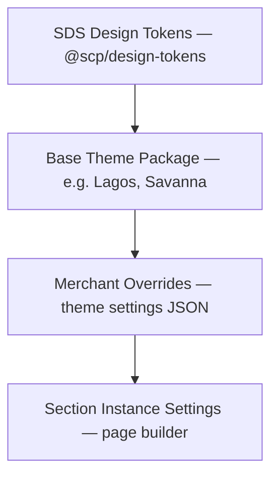
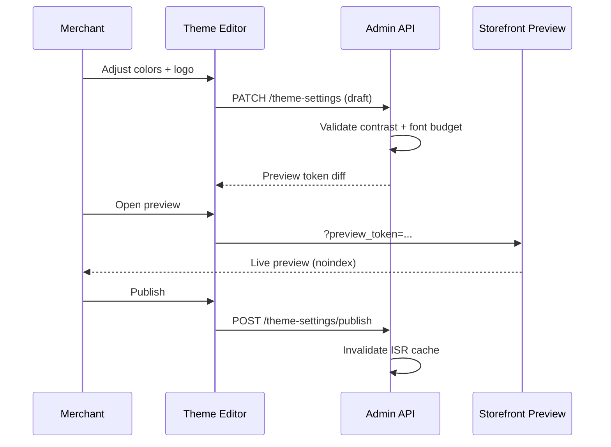

# Chapter 10: Theme Inheritance and Customization

**Document ID:** SCP-DS-001-10  
**Version:** 1.0.0  
**Status:** ✅ Active  
**Traceability:** ADR-003, NFR-047 – NFR-053, FR-THE-001 – FR-THE-008

---

## Purpose

Define how **merchant theme customization** inherits from the SAPPHITAL Design System (SDS) and Theme Engine without breaking accessibility, performance, or tenant isolation.

## Scope

- Theme inheritance hierarchy (platform → base theme → merchant overrides)
- Customizable vs locked design tokens
- Brand settings (logo, colors, fonts, favicon)
- Section-level merchant edits in theme editor
- Validation and guardrails
- Nigeria mobile-first constraints

## Out of Scope

- Theme SDK CLI implementation (Volume 6 Ch. 06)
- Theme Store review process (Volume 6 Ch. 07)
- Server-side theme rendering internals (Volume 6 Ch. 04)

---

## 1. Inheritance Hierarchy



| Layer | Owner | Mutable By |
|-------|-------|------------|
| SDS tokens | Platform | Platform design team only |
| Base theme | Platform / Theme Store author | Theme developer |
| Merchant overrides | Merchant | Merchant admin (theme settings) |
| Section settings | Merchant | Merchant admin (page builder) |

**Rule:** Merchants never edit raw CSS or inject arbitrary `<style>` blocks in Phase 1–3.

---

## 2. Customizable Theme Settings

### 2.1 Global Settings Schema

| Setting Key | Type | Constraints | Default Source |
|-------------|------|-------------|----------------|
| `colors.primary` | HEX | WCAG AA contrast vs `colors.on_primary` | Base theme |
| `colors.secondary` | HEX | Contrast validated | Base theme |
| `colors.background` | HEX | Light/dark mode pair required | Base theme |
| `typography.heading_font` | Font family | From allowlist (Google Fonts subset) | Base theme |
| `typography.body_font` | Font family | Allowlist; max 2 families | Base theme |
| `logo` | Media reference | SVG/PNG; max 500 KB | Merchant upload |
| `favicon` | Media reference | 32×32 / 180×180 | Merchant upload |
| `border_radius` | Enum | `none`, `sm`, `md`, `lg` | Base theme |
| `button_style` | Enum | `filled`, `outline`, `soft` | Base theme |

### 2.2 Locked Settings (Non-Customizable)

| Setting | Reason |
|---------|--------|
| Focus ring color/width | WCAG 2.4.11 Focus Appearance (NFR-051) |
| Minimum touch target (44×44 px) | WCAG 2.5.8; Nigeria mobile |
| Error/success semantic colors | Consistent checkout trust signals |
| Form field structure | PCI-adjacent UX; accessibility |
| Checkout layout grid | Conversion optimization; SAQ A flow |

---

## 3. Token Resolution Algorithm

```text
1. Load base theme `theme.json` defaults
2. Merge merchant `theme_settings` (validated)
3. Resolve SDS token references (e.g. `{token.color.primary}`)
4. Compute derived tokens (hover, focus, disabled)
5. Validate contrast pairs (APCA fallback for large text)
6. Emit CSS variables on `:root` at SSR time
```

### 3.1 CSS Variable Output

```css
:root {
  --color-primary: #0B5FFF;
  --color-on-primary: #FFFFFF;
  --font-heading: 'Inter', system-ui, sans-serif;
  --radius-md: 8px;
}
```

Variables are **scoped per storefront request** — no cross-tenant leakage in shared Next.js workers.

---

## 4. Font Loading Strategy

| Rule | Value |
|------|-------|
| Max font families | 2 (heading + body) |
| Max weight variants | 4 per family |
| Subset | Latin + common Nigerian name glyphs |
| Delivery | `next/font` self-hosted after fetch |
| Fallback | `system-ui, sans-serif` |
| Budget | ≤ 80 KB transfer (Volume 6 Ch. 08) |

**Nigeria note:** Avoid decorative fonts that inflate page weight on 3G; theme editor warns when selection exceeds budget.

---

## 5. Section-Level Customization

Merchants customize **content and approved style knobs** per section instance:

| Section | Merchant-Editable | Locked |
|---------|-------------------|--------|
| Hero | Heading, image, CTA label/link | Layout grid, heading hierarchy |
| Product grid | Collection, columns (2–4) | Card component structure |
| Rich text | BlockNote content | Typography scale mapping |
| Testimonials | Quotes, avatars | Carousel a11y behavior |
| Footer | Links, social URLs | Landmark roles, link min size |

Section schema enforces `maxLength`, `enum`, and `media` types — invalid JSON rejected at save.

---

## 6. Brand Preview and Publishing



Draft settings do not affect live storefront until published.

---

## 7. Guardrails and Validation

| Check | Failure Action |
|-------|----------------|
| Primary/background contrast < 4.5:1 | Block save; suggest adjusted shade |
| Font transfer > 80 KB | Warning → block publish |
| Logo > 500 KB | Reject upload |
| Custom CSS field (if ever enabled) | Strip `url()`, `expression()`, `@import` |
| Section schema violation | 422 with field errors |

Automated **axe-core** scan on preview before publish recommended; mandatory for Theme Store themes.

---

## 8. Built-In Base Themes (Phase 1)

| Theme | Aesthetic | Nigeria Fit |
|-------|-----------|-------------|
| **Lagos** | Bold, high-contrast, mobile-first | General retail, fashion |
| **Savanna** | Warm earth tones, editorial | Food, lifestyle, crafts |
| **Terminal** | Minimal, data-dense | B2B, electronics |

Each ships with pre-validated token pairs and Lighthouse mobile ≥ 90.

---

## 9. Architecture Impact

| Impact | Detail |
|--------|--------|
| Storefront SSR | Token merge runs per request; cache key includes `theme_settings_version` |
| CDN | ISR pages keyed by tenant + theme version |
| Database | `tenant_theme_settings` owned by Theme module |
| Events | `ThemeSettingsPublished` → cache purge, search reindex N/A |

---

## 10. Acceptance Criteria

- [ ] Inheritance hierarchy documented: SDS → base → merchant → section
- [ ] Customizable settings schema with contrast and font validation
- [ ] Locked checkout/focus/touch-target rules stated
- [ ] Draft vs publish workflow with ISR invalidation
- [ ] CSS variables scoped per tenant request
- [ ] Three Phase 1 base themes listed with Nigeria positioning
- [ ] No arbitrary merchant CSS in Phase 1–3

---

## References

- [ADR-003: Theme Engine](../00-meta/adr/003-theme-engine-react-json-schema.md)
- [Volume 6 — Theme Engine](../06-theme-engine/README.md)
- [Chapter 09 — Accessibility](./09-accessibility-wcag-22.md)
- [Chapter 12 — Performance Budgets](./12-performance-and-ux-budgets.md)
