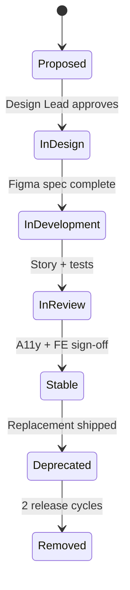

# Chapter 11: Design Governance (Figma & Storybook)

**Document ID:** SCP-DS-001-11  
**Version:** 1.0.0  
**Status:** ✅ Active  
**Traceability:** NFR-047 – NFR-053, Engineering Principles 1 (UX First)

---

## Purpose

Establish **design governance** for SDS — how Figma libraries, Storybook, and code stay synchronized so admin, storefront, and theme SDK surfaces remain visually and behaviorally consistent at Shopify-grade quality.

## Scope

- Figma library structure and naming
- Storybook architecture and deployment
- Token sync pipeline (Figma → code)
- Component review workflow
- Versioning and breaking change policy
- Nigeria localization in design artifacts

## Out of Scope

- Marketing brand guidelines outside product UI
- Merchant-created Figma files
- Automated visual regression vendor selection (Volume 13)

---

## 1. Governance Model

| Role | Responsibility |
|------|----------------|
| **Design Lead** | Figma library ownership, component specs, a11y review |
| **Frontend Lead** | Storybook + React implementation, token package |
| **Lead Architect** | Cross-volume alignment, ADR linkage |
| **QA / A11y** | axe manual audits, screen reader sign-off |

**Cadence:** Bi-weekly SDS sync (design + engineering). Monthly accessibility office hours.

---

## 2. Figma Library Structure

### 2.1 File Organization

```text
SCP-SDS-v1 (Team Library)
├── 00 — Foundations (color, type, spacing, elevation, motion)
├── 01 — Primitives (buttons, inputs, icons)
├── 02 — Patterns (forms, tables, modals, empty states)
├── 03 — Commerce (product card, cart line, checkout step)
├── 04 — Admin (sidebar, KPI cards, order timeline)
├── 05 — Nigeria Patterns (NGN currency, Paystack badges, WhatsApp CTA)
└── 99 — Archive (deprecated)
```

### 2.2 Naming Convention

```text
Component / Variant / State / Size
Example: Button / Primary / Hover / md
```

| Token Type | Figma Variable | Code Token |
|------------|----------------|------------|
| Color | `color/primary/default` | `--color-primary` |
| Space | `space/4` | `--space-4` (16px) |
| Radius | `radius/md` | `--radius-md` |
| Typography | `font/body/md` | `--font-body-md` |

### 2.3 Nigeria-Specific Patterns

| Pattern | Requirement |
|---------|-------------|
| Currency display | `₦1,234,567.00` — grouping, two decimals |
| Phone input | +234 default; validate 10-digit local |
| Payment badges | Paystack, Flutterwave, bank transfer icons |
| Trust signals | NDPA privacy link placement on forms |
| Network-aware | Skeleton loaders for slow connections |

---

## 3. Storybook Architecture

### 3.1 Deployment

| Attribute | Value |
|-----------|-------|
| URL | `https://design.sapphital.com/storybook` |
| Auth | Staff SSO; public read for Theme Store partners (Phase 3) |
| Build | CI on `design-system` package changes |
| Framework | Storybook 8 + React 19 + Vite |

### 3.2 Story Structure

```text
stories/
├── foundations/     # Tokens, typography swatches
├── primitives/      # Button, Input, Badge
├── patterns/        # DataTable, Dialog, Toast
├── commerce/        # ProductCard, CartDrawer
├── admin/           # OrderDetail, VendorKYC
└── templates/       # Checkout page, Dashboard layout
```

Each story includes:

- **Controls** for token-driven props
- **A11y** addon panel (zero violations target)
- **Docs** page with usage, do/don't, Nigeria notes
- **Design** addon linked to Figma node URL

### 3.3 Coverage Target

| Inventory | Phase 1 Target |
|-----------|----------------|
| Chapter 06 components | ≥ 90% documented in Storybook |
| Interactive states | Default, hover, focus, disabled, error |
| Dark mode | Admin surfaces Phase 2 |

---

## 4. Token Sync Pipeline

```mermaid
flowchart LR
    FIG[Figma Variables] --> EXP[Export JSON — Tokens Studio]
    EXP --> VAL[CI Validator]
    VAL --> PKG[@scp/design-tokens npm package]
    PKG --> ADMIN[Admin App]
    PKG --> SF[Storefront]
    PKG --> THEME[Theme SDK]
```

| Step | Tool | Gate |
|------|------|------|
| Export | Tokens Studio for Figma | Manual on release |
| Validate | Custom script: contrast, naming | CI blocking |
| Publish | Internal npm registry | Semver bump |
| Consume | Apps pin minor version | Renovate weekly |

**Breaking token changes** require minor SDS version bump and migration notes in Storybook docs.

---

## 5. Component Lifecycle



### 5.1 Definition of Done (Component)

- [ ] Figma component with all variants
- [ ] React implementation in `@scp/ui`
- [ ] Storybook docs + a11y addon pass
- [ ] Unit tests (Vitest) for logic
- [ ] Listed in Chapter 06 inventory
- [ ] Nigeria currency/locale example if commerce-related

---

## 6. Review Workflows

### 6.1 New Component Proposal

1. Engineer or designer opens SDS proposal issue.
2. Design Lead confirms no duplicate in inventory.
3. Figma spec merged → implementation PR.
4. PR requires: Storybook link, axe screenshot, design approval comment.

### 6.2 Theme Store UI Extensions

Third-party theme components **must** compose `@scp/ui` primitives — custom buttons that bypass SDS are rejected at Theme Store review (Volume 6 Ch. 07).

---

## 7. Versioning

| Artifact | Version Scheme | Breaking Change |
|----------|----------------|-----------------|
| Figma library | `SCP-SDS-v{major}` | New Figma file; archive old |
| `@scp/design-tokens` | Semver | Major: renamed/removed tokens |
| `@scp/ui` | Semver | Major: prop API changes |
| Storybook | Tracks `@scp/ui` | Deployed per release |

---

## 8. Tooling Access

| Tool | License | Users |
|------|---------|-------|
| Figma Organization | Design + PM + select engineers | 15 seats Phase 1 |
| Storybook | Open source | Unlimited viewers |
| Tokens Studio | Figma plugin | Design team |
| Chromatic (optional) | Visual regression Phase 2 | CI integration |

---

## 9. Acceptance Criteria

- [ ] Figma library structure documented with Nigeria patterns section
- [ ] Storybook URL and 90% Chapter 06 coverage target defined
- [ ] Token sync pipeline Figma → `@scp/design-tokens` documented
- [ ] Component lifecycle states and Definition of Done listed
- [ ] Theme Store rule: compose `@scp/ui` primitives
- [ ] Bi-weekly sync cadence assigned to Design Lead + Frontend Lead
- [ ] Semver policy for tokens and UI package

---

## References

- [Chapter 02 — Design Tokens](./02-design-tokens.md)
- [Chapter 06 — Component Inventory](./06-core-component-inventory.md)
- [Chapter 09 — Accessibility](./09-accessibility-wcag-22.md)
- [Volume 13 Ch. 08 — Accessibility Testing](../13-testing/08-accessibility-testing.md)
