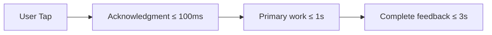

# Chapter 12: Performance and UX Budgets

**Document ID:** SCP-DS-001-12  
**Version:** 1.0.0  
**Status:** ✅ Active  
**Traceability:** NFR-001, NFR-002, NFR-006, NFR-009, NFR-010, NFR-052, Engineering Principles 2

---

## Purpose

Define **enforceable performance and UX budgets** for every SCP surface, with Nigeria mobile-first measurement profiles, CI gates, and merchant-facing guardrails.

## Scope

- Core Web Vitals targets
- Per-surface resource budgets (JS, CSS, images, fonts)
- UX timing budgets (interaction, navigation, checkout)
- Measurement methodology and tools
- Budget enforcement in CI and theme editor
- Degradation alerts for merchant customizations

## Out of Scope

- Backend API latency SLOs (Volume 10 Ch. 08 — covered by reference)
- Database query optimization (Volume 5)
- CDN cache rule configuration (Volume 10 Ch. 05)

---

## 1. Performance Philosophy

African shoppers — especially in Nigeria — often browse on **mid-range Android devices over 3G/4G**. Performance is a **conversion and trust requirement**, not a polish item.

| Principle | SCP Implementation |
|-----------|-------------------|
| Mobile-first budgets | Stricter limits than desktop |
| Perceived speed | Skeleton UI, optimistic updates in admin |
| Respect data costs | ≤ 800 KB first load on storefront |
| Fail visible | Budget breach warnings in theme editor |
| Measure real devices | Lighthouse + WebPageTest Nigeria profile |

---

## 2. Core Web Vitals Targets

| Metric | Mobile (Nigeria p75) | Desktop (p75) | NFR |
|--------|----------------------|---------------|-----|
| **LCP** | ≤ 2.0 s | ≤ 1.5 s | NFR-001, NFR-002 |
| **INP** | ≤ 100 ms | ≤ 100 ms | Engineering Principles |
| **CLS** | ≤ 0.05 | ≤ 0.05 | Engineering Principles |
| **TTFB** | ≤ 600 ms | ≤ 400 ms | NFR-006 |
| **FCP** | ≤ 1.5 s | ≤ 1.0 s | NFR-009 |

### 2.1 Measurement Profile

| Setting | Value |
|---------|-------|
| Tool | Lighthouse CI + WebPageTest |
| Location | Lagos, Nigeria |
| Connection | 3G Fast (1.6 Mbps down, 750 Kbps up, 150 ms RTT) |
| Device | Moto G Power emulation |
| Routes tested | Home, PLP, PDP, Cart, Checkout start |

---

## 3. Resource Budgets by Surface

### 3.1 Storefront (Theme)

| Resource | Budget (gzip) | Enforcement |
|----------|---------------|-------------|
| JavaScript (initial route) | ≤ 100 KB | Build analyzer gate |
| CSS | ≤ 50 KB | Build gate |
| Fonts | ≤ 80 KB | Theme settings validator |
| Hero image (LCP) | ≤ 200 KB WebP | Upload + CDN transform |
| Total page weight | ≤ 800 KB | Lighthouse + RUM |
| Third-party scripts | ≤ 2 (analytics, chat) | Theme manifest review |

### 3.2 Admin / Merchant Dashboard

| Resource | Budget | Notes |
|----------|--------|-------|
| JS initial | ≤ 200 KB | Code-split per route |
| API waterfall (dashboard home) | ≤ 6 requests | BFF aggregation |
| Time to interactive | ≤ 3.0 s mobile | Internal NFR |
| Table render (100 rows) | ≤ 100 ms | Virtualized lists |

### 3.3 Checkout

| Step | UX Budget |
|------|-----------|
| Cart → checkout redirect | ≤ 1.0 s |
| Checkout form interactive | ≤ 1.5 s after redirect |
| Paystack redirect init | ≤ 800 ms API (NFR-010) |
| Error recovery display | ≤ 200 ms after API response |

**Rule:** No third-party scripts on Paystack-hosted payment page (PSP controlled).

---

## 4. UX Timing Budgets



| Interaction | Acknowledgment | Completion | Pattern |
|-------------|----------------|------------|---------|
| Add to cart | Button loading state ≤ 50 ms | Toast ≤ 800 ms | Optimistic + reconcile |
| Search typeahead | Debounce 200 ms | Results ≤ 300 ms | Skeleton rows |
| Save product | Disable button | Success toast ≤ 1 s | Inline validation first |
| Page navigation (admin) | Progress bar | Route paint ≤ 1.5 s | Prefetch on hover |
| Image upload | Progress % | Thumbnail ≤ 3 s on 4G | Chunked upload |

### 4.1 Skeleton and Loading Rules

| Surface | Required |
|---------|----------|
| PLP | Product card skeletons match final layout (CLS) |
| PDP | Image placeholder with aspect ratio |
| Admin tables | 5-row skeleton, no layout shift |
| Checkout | Never blank screen > 300 ms |

`prefers-reduced-motion`: disable decorative animations (NFR-052).

---

## 5. Image and Media Guidelines

| Use | Format | Max Dimensions | Max Weight |
|-----|--------|----------------|------------|
| Product grid | WebP/AVIF | 600×600 | 40 KB |
| PDP gallery | WebP/AVIF | 1200×1200 | 120 KB |
| Hero banner | WebP | 1920×800 | 200 KB |
| Thumbnail | WebP | 150×150 | 10 KB |
| OG image | JPEG | 1200×630 | 300 KB |

Cloudflare Image Resizing transforms on upload; merchants cannot bypass size caps.

---

## 6. CI Enforcement

| Gate | Tool | Threshold | Blocking |
|------|------|-----------|----------|
| Lighthouse mobile | Lighthouse CI | Performance ≥ 85 on reference theme | PR (changed routes) |
| Bundle size | `@next/bundle-analyzer` | JS ≤ 100 KB storefront | PR |
| axe a11y | axe-core | 0 serious/critical | PR |
| k6 smoke | k6 | p95 < 500 ms health | Nightly |

```text
Budget file: performance-budgets.json
├── storefront/home
├── storefront/product
├── admin/dashboard
└── checkout/start
```

Regression > 5% on LCP opens automatic issue; > 10% blocks release (Volume 13 Ch. 10).

---

## 7. Merchant Budget Guardrails

| Event | System Response |
|-------|-----------------|
| Theme publish increases JS +20 KB | Warning in theme editor |
| LCP > 2.5 s on live store (RUM) | Email merchant + suggest image compression |
| LCP > 4.0 s for 7 days | Banner in admin; optional theme reset offer |
| Third-party script added | Theme Store rejection if not in allowlist |

Real User Monitoring (RUM) sampled at 10% Nigeria traffic via Cloudflare Web Analytics.

---

## 8. Nigeria-Specific Optimizations

| Technique | Benefit |
|-----------|---------|
| ISR + CDN for PLP/PDP | Reduces origin round trips |
| Self-hosted fonts | Eliminates Google Fonts DNS latency |
| Lazy-load below-fold images | Saves 3G bandwidth |
| Prefetch checkout on cart CTA hover | Faster funnel on 4G |
| NGN price in HTML (not JS render) | Faster meaningful paint |
| WhatsApp share links (no heavy SDK) | Zero SDK weight |

---

## 9. Acceptance Criteria

- [ ] CWV targets documented for mobile Nigeria and desktop
- [ ] Storefront JS ≤ 100 KB, total page ≤ 800 KB enforced
- [ ] Checkout UX timing budgets include Paystack redirect
- [ ] Lighthouse CI gate ≥ 85 on reference theme
- [ ] Skeleton loading rules prevent CLS > 0.05
- [ ] Merchant RUM alerting thresholds defined
- [ ] WebPageTest Lagos 3G Fast profile specified
- [ ] `prefers-reduced-motion` honored per NFR-052

---

## References

- [NFR-001 – NFR-012](../01-vision/09-non-functional-requirements.md)
- [Volume 6 Ch. 08 — Theme Assets](../06-theme-engine/08-assets-and-performance.md)
- [Volume 13 Ch. 06 — Performance Testing](../13-testing/06-performance-k6-lighthouse.md)
- [Volume 10 Ch. 08 — Observability](../10-infrastructure/08-monitoring-observability.md)
