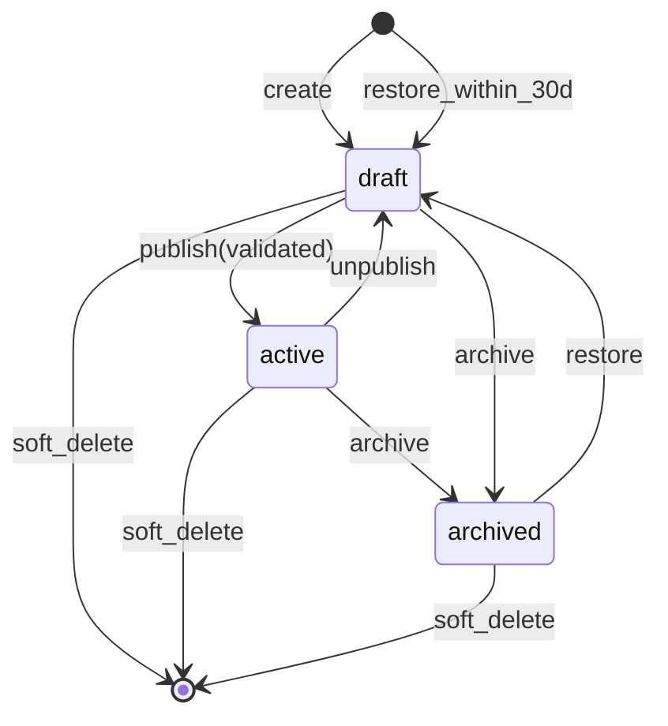

# Module: Catalog and Products

**Document ID:** SCP-COM-005-01  
**Version:** 1.0.0  
**Status:** ✅ Active  
**Traceability:** FR-020–025, NFR-015, NFR-040, NFR-074

---

## Document Control

| Field | Value |
|-------|-------|
| Bounded Context | Product Catalog |
| Aggregate Root | `Product` |
| Owner Module | `commerce.catalog` |

---

## Purpose

Define how merchants create, manage, publish, and retire sellable products across physical, digital, and service types. The catalog is the authoritative source for product metadata consumed by cart, checkout, search, themes, and marketplace modules.

## Scope

- Product CRUD, lifecycle, and publication
- Product types: `physical`, `digital`, `service`, `bundle` (Phase 1: physical + digital; **`service` purchasable Phase 1.5**; full **bookings/listings vertical Phase 3** via `Extensions/Bookings/`)
- SEO metadata, media associations, vendor attribution (marketplace-ready)
- Store-scoped catalog with tenant isolation

## Out of Scope

- Variant option matrices (Chapter 02)
- Category/collection merchandising (Chapter 03)
- Inventory quantities (Chapter 04)
- Product reviews UI (Volume 5 future chapter / storefront)
- **Standalone service listings module** (legacy parallel catalog) — use CMS pages + service product type until Bookings extension (Phase 3)

## User Personas

| Persona | Capability |
|---------|------------|
| Merchant Owner | Full catalog CRUD, publish, bulk import |
| Store Staff | CRUD within granted permissions |
| Vendor (marketplace) | CRUD own products only (Volume 8) |
| Customer | Read published products on storefront |
| API Integrator | REST CRUD via developer credentials |

## Business Capabilities

1. Create draft products with title, description, type, and base metadata
2. Attach media (images, videos) from Media service
3. Publish/unpublish with validation gates (variants, pricing)
4. Soft-delete with 30-day recovery (NFR-074)
5. Bulk import/export CSV for migration from WooCommerce, Shopify

## Domain Ownership

| Data | Owner | Consumers |
|------|-------|-----------|
| Product metadata | Catalog | Cart, Search, Theme, CMS |
| Publication state | Catalog | Storefront cache, Search index |
| SKU/price | Variant module (Ch.02) | Cart, Orders |

---

## Entities and Value Objects

### Entities

| Entity | Key Fields | Notes |
|--------|------------|-------|
| **Product** | `id`, `tenant_id`, `store_id`, `vendor_id?`, `title`, `slug`, `description_html`, `description_plain`, `type`, `status`, `published_at`, `seo_title`, `seo_description`, `tags[]`, `created_at`, `updated_at`, `deleted_at` | Aggregate root |
| **ProductMedia** | `id`, `product_id`, `media_id`, `position`, `alt_text` | Join to Media service |
| **ProductTag** | `id`, `product_id`, `tag` | Normalized tags for filtering |

### Value Objects

| Value Object | Attributes | Validation |
|--------------|------------|------------|
| **Slug** | `value` | Lowercase, URL-safe, unique per `store_id` |
| **ProductType** | enum | `physical`, `digital`, `service`, `bundle` |
| **ProductStatus** | enum | `draft`, `active`, `archived` |
| **SeoMetadata** | `title`, `description` | Title ≤ 70 chars recommended |

---

## Aggregate Roots

**Product Aggregate** — consistency boundary includes Product, ProductMedia, ProductTag. Variants are a separate aggregate (Chapter 02) linked by `product_id`.

**Invariants:**

1. A product cannot transition to `active` without at least one active variant with price > 0 (except free digital with explicit flag).
2. `slug` is immutable after first publish; redirects managed by CMS on change.
3. `tenant_id` and `store_id` are set at creation and never mutated.
4. Vendor-owned products require `vendor_id` when store operates in marketplace mode.

---

## Business Rules

| ID | Rule |
|----|------|
| BR-CAT-001 | Products are scoped to exactly one `store_id` within a tenant |
| BR-CAT-002 | Only `active` products appear on storefront and Storefront API |
| BR-CAT-003 | Draft products are visible in admin and preview URLs only |
| BR-CAT-004 | Soft-deleted products excluded from search; recoverable 30 days |
| BR-CAT-005 | `description_html` sanitized server-side (allowlist tags) |
| BR-CAT-006 | Maximum 250 media items per product (plan limit may reduce) |
| BR-CAT-007 | Bulk import max 5,000 rows per job; async processing |
| BR-CAT-008 | Product title required, 3–500 characters |
| BR-CAT-009 | Tags lowercase, deduplicated, max 50 per product |
| BR-CAT-010 | Marketplace products inherit vendor commission rules from Volume 8 |

---

## State Machines

### Product Lifecycle



| Transition | Preconditions |
|------------|---------------|
| `draft → active` | ≥1 active variant; store currency set; physical products have weight on default variant |
| `active → draft` | No pending checkout sessions referencing product (warn if cart items exist) |
| `* → soft_delete` | Product not in open orders; inventory adjustment job queued |

---

## User Journeys

1. **Merchant creates product** — Admin → Products → New → fill details → add variant → publish
2. **Customer browses** — Storefront listing → product detail → add to cart (Chapter 05)
3. **Bulk migration** — Import CSV → validation report → async create → email on completion

## Admin Views

- Product list (filter: status, type, vendor, tag)
- Product editor (tabs: General, Media, Variants, SEO, Inventory link)
- Bulk actions: publish, archive, tag, export

## Merchant Views

Same as admin for single-store merchants; multi-store tenants select store context.

## Customer Views

- Product listing grid/list (theme-controlled)
- Product detail page with variant selector, price, availability badge

## Vendor Views

Vendor portal subset: own products only, pending approval queue when marketplace moderation enabled.

## Mobile/POS Views

POS product search by title/SKU/barcode; catalog sync cache for offline (Volume 17).

## JavaScript/Frontend Behavior

- Storefront: hydrate variant/pricing from Storefront API; optimistic "Add to cart"
- Admin: autosave draft every 30s; slug preview; media drag-reorder
- No payment or PII fields on product pages

---

## API Contracts

Base path: `/api/v1/stores/{store_id}/products`  
Auth: Bearer (admin) or Storefront token (read published)

| Method | Path | Description | Auth |
|--------|------|-------------|------|
| GET | `/products` | List products (paginated, filterable) | Admin / Storefront |
| POST | `/products` | Create product | Admin |
| GET | `/products/{id}` | Get product by ID | Admin / Storefront |
| GET | `/products/slug/{slug}` | Get by slug | Storefront |
| PATCH | `/products/{id}` | Update product | Admin |
| POST | `/products/{id}/publish` | Publish | Admin |
| POST | `/products/{id}/unpublish` | Unpublish | Admin |
| POST | `/products/{id}/archive` | Archive | Admin |
| DELETE | `/products/{id}` | Soft delete | Admin |
| POST | `/products/{id}/restore` | Restore soft-deleted | Admin |
| POST | `/products/import` | Start CSV import job | Admin |
| GET | `/products/import/{job_id}` | Import status | Admin |

**Request (create):**

```json
{
  "title": "Ankara Print Dress",
  "slug": "ankara-print-dress",
  "type": "physical",
  "description_html": "<p>Handmade in Lagos</p>",
  "tags": ["fashion", "ankara"],
  "seo_title": "Ankara Print Dress | My Store",
  "seo_description": "Premium Ankara dress"
}
```

**Response:** `201` with full Product object including `status: "draft"`.

Rate limits: 120 req/min admin; 600 req/min storefront read (NFR-036).

---

## Domain Events

| Event | Payload (key fields) | Subscribers |
|-------|---------------------|-------------|
| `ProductCreated` | `tenant_id`, `store_id`, `product_id`, `type`, `vendor_id?` | Search, Analytics, Webhooks |
| `ProductUpdated` | `product_id`, `changed_fields[]` | Search, Cache invalidation |
| `ProductPublished` | `product_id`, `published_at` | Search, Storefront CDN, Webhooks |
| `ProductUnpublished` | `product_id` | Search, Cache |
| `ProductArchived` | `product_id` | Search, Promotions |
| `ProductDeleted` | `product_id`, `deleted_at` | Search, Inventory cleanup job |

All events include `event_id`, `occurred_at`, `tenant_id`, `correlation_id` (FR-022).

---

## Background Jobs

| Job | Trigger | Action |
|-----|---------|--------|
| `CatalogImportJob` | CSV upload | Validate rows, create products, report errors |
| `CatalogExportJob` | Admin export | Generate CSV to object storage, notify |
| `ProductSearchIndexJob` | ProductPublished/Updated | Upsert search document |
| `ProductCachePurgeJob` | ProductPublished/Unpublished | Purge CDN/storefront cache keys |
| `DeletedProductPurgeJob` | Daily cron | Hard-delete after 30-day soft-delete window |

---

## Data Model

```sql
-- Conceptual; full DDL in Volume 16
products (
  id UUID PK,
  tenant_id UUID NOT NULL,
  store_id UUID NOT NULL,
  vendor_id UUID NULL,
  title VARCHAR(500) NOT NULL,
  slug VARCHAR(255) NOT NULL,
  type VARCHAR(20) NOT NULL,
  status VARCHAR(20) NOT NULL DEFAULT 'draft',
  description_html TEXT,
  description_plain TEXT,
  seo_title VARCHAR(255),
  seo_description VARCHAR(500),
  published_at TIMESTAMPTZ,
  created_at, updated_at, deleted_at
);
UNIQUE (store_id, slug);
INDEX (tenant_id, store_id, status);
```

RLS policy: `tenant_id = current_setting('app.tenant_id')::uuid`

---

## Permissions and Authorization

| Permission | Roles |
|------------|-------|
| `catalog:read` | Staff, Owner, Vendor (own) |
| `catalog:write` | Staff, Owner, Vendor (own) |
| `catalog:publish` | Owner, Senior Staff |
| `catalog:delete` | Owner |
| `catalog:import` | Owner |

Vendor scope enforced: `vendor_id = auth.vendor_id`.

---

## Tenant Isolation

- All queries filter by `tenant_id` from JWT/session context
- RLS on `products`, `product_media`, `product_tags`
- Storefront API resolves store by domain; never accepts cross-tenant `store_id`
- Cache keys prefixed: `t:{tenant_id}:s:{store_id}:product:{id}`
- Isolation tests required on every PR (NFR-040)

---

## Security Threat Model

| Threat | Mitigation |
|--------|------------|
| XSS via product description | HTML sanitizer; CSP on storefront |
| IDOR on draft products | Storefront token cannot read `draft` status |
| Mass assignment | Allowlist PATCH fields |
| CSV import formula injection | Strip leading `=`, `@`, `+` in cells |
| Enumeration | Uniform 404 for missing/other-tenant slugs |

---

## Performance Requirements

| Target | Requirement |
|--------|-------------|
| Product list API p95 | ≤ 200ms (NFR-003) |
| Product detail p95 | ≤ 150ms (cached) |
| Products per store | 10,000 Phase 1 (NFR-015) |
| Import throughput | 500 products/minute |

---

## Caching Strategy

- Storefront product detail: CDN edge cache 60s; `Cache-Control: public, max-age=60`
- Admin: no cache
- Invalidation on `ProductPublished`, `ProductUpdated`, `ProductDeleted`

---

## Observability

- Metrics: `catalog.products.created`, `catalog.publish.count`, `catalog.import.duration`
- Traces: span per import row batch
- Logs: audit on publish/delete with `user_id`, `product_id`

---

## AI Opportunities

- Auto-generate SEO title/description from product images and title
- Tag suggestions from description
- Compliance scan for prohibited goods categories (Nigeria consumer protection)

---

## Extension Points

- `ProductTypePlugin` for custom types (Phase 2)
- Webhook topics: `products/create`, `products/update`, `products/publish`
- Metafields: `product.metafields` JSON schema (developer platform)

---

## Testing Strategy

- Unit: slug uniqueness, publish validation, state transitions
- Integration: RLS isolation, vendor scoping
- E2E: create → variant → publish → storefront visibility
- Load: 10k product list pagination

---

## Failure Modes

| Failure | Behavior |
|---------|----------|
| Search index lag | Storefront serves stale listing ≤ 5 min; alert if > 15 min |
| Import partial failure | Job completes with error report; no half-published batch |
| Publish without variant | 422 with actionable error message |

---

## Acceptance Criteria

1. Merchant creates physical product, adds variant, publishes; product visible on storefront within 60s.
2. Slug collision returns 409 with suggested alternative.
3. Soft-deleted product invisible on storefront; restored within 30 days reappears after publish.
4. Cross-tenant product access returns 404 (not 403) on storefront.
5. CSV import of 1,000 products completes with per-row error report.
6. HTML description with `<script>` stripped on save.
7. Vendor cannot PATCH another vendor's product (403).
8. `ProductPublished` event delivered to webhook within 30s (p95).

---

## ADRs

- ADR-004 (indirect — no payment data on catalog)
- Volume 3 multi-tenancy ADR (RLS)

---

## Sources

- Volume 1 Domain Model Overview
- OWASP ASVS 5.0 V5 (Validation)
- Shopify Product API patterns (E3 observation)
