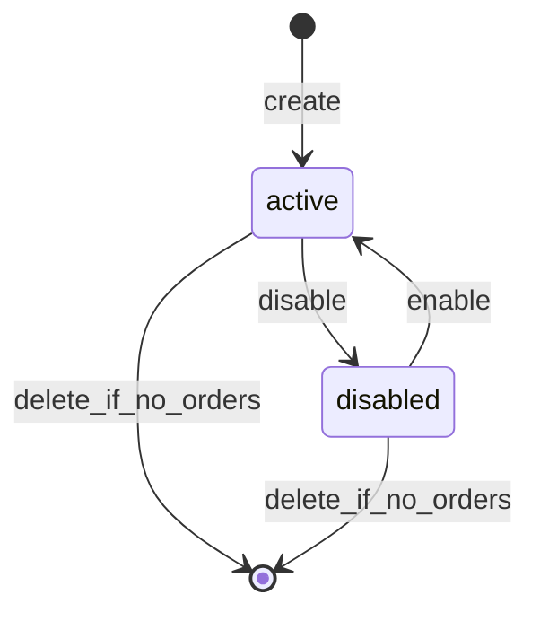

# Module: Variants, Attributes, and Pricing

**Document ID:** SCP-COM-005-02  
**Version:** 1.0.0  
**Status:** ✅ Active  
**Traceability:** FR-021–023, NFR-015, NFR-040

---

## Document Control

| Field | Value |
|-------|-------|
| Bounded Context | Product Catalog / Pricing |
| Aggregate Root | `Variant` (child of Product boundary for writes) |
| Owner Module | `commerce.catalog.variants` |

---

## Purpose

Model sellable SKUs with option combinations, list/compare-at pricing, cost tracking, and currency-safe Money values. Variants are what carts and orders actually purchase.

## Scope

- Product options (Size, Color) and option values
- Variant generation from option matrix
- Per-variant pricing, barcode, weight, dimensions
- Price lists and currency display rules (store base currency)

## Out of Scope

- Multi-currency checkout conversion (Payments Ch.08 — settlement in store currency Phase 1)
- Dynamic pricing / AI pricing (Phase 2)
- Marketplace vendor price overrides (Volume 8)

## User Personas

Merchant Owner, Store Staff, Customer (variant selector), API Integrator.

## Business Capabilities

1. Define up to 3 option dimensions per product (e.g., Size, Color, Material)
2. Auto-generate or manually manage variant matrix
3. Set list price, compare-at price, cost per variant
4. Assign SKU, barcode (EAN-13, UPC), weight for shipping
5. Enable/disable individual variants without unpublishing product

---

## Entities and Value Objects

### Entities

| Entity | Key Fields |
|--------|------------|
| **ProductOption** | `id`, `product_id`, `name`, `position` |
| **ProductOptionValue** | `id`, `option_id`, `value`, `position` |
| **Variant** | `id`, `tenant_id`, `store_id`, `product_id`, `sku`, `barcode`, `title`, `option_values[]`, `price_cents`, `compare_at_cents`, `cost_cents`, `currency`, `weight_grams`, `requires_shipping`, `taxable`, `status`, `position` |

### Value Objects

| Value Object | Attributes |
|--------------|------------|
| **Money** | `amount_cents` (bigint), `currency` (ISO 4217) |
| **SKU** | Unique per `store_id` |
| **Weight** | `grams` (integer) |
| **Dimensions** | `length_cm`, `width_cm`, `height_cm` |
| **VariantStatus** | `active`, `disabled` |

---

## Aggregate Roots

**Variant Aggregate** — Variant is the write boundary for SKU-level data. Product aggregate orchestrates bulk variant creation but each variant enforces its own invariants.

**Invariants:**

1. `price_cents >= 0`; `compare_at_cents` either null or ≥ `price_cents`
2. `sku` unique per store when present
3. Option value combination unique per product
4. `currency` must match store default currency Phase 1
5. Physical variants: `requires_shipping = true`, `weight_grams > 0` when product active

---

## Business Rules

| ID | Rule |
|----|------|
| BR-VAR-001 | Maximum 3 options × 100 values each; max 500 variants per product |
| BR-VAR-002 | Disabling last active variant blocks product publish |
| BR-VAR-003 | Price changes do not retroactively alter open carts (cart snapshots price) |
| BR-VAR-004 | Cost is admin-only; never exposed on Storefront API |
| BR-VAR-005 | Barcode optional; validated check digit for EAN-13 |
| BR-VAR-006 | Default variant: lowest `position`; used when product has single variant |
| BR-VAR-007 | Digital variants: `requires_shipping = false`, weight = 0 |
| BR-VAR-008 | Bundle variants (Phase 2) reference component variant IDs with quantities |

---

## State Machines

### Variant Status



Deletion blocked if variant appears in non-terminal orders (last 7 years retention).

---

## API Contracts

Base: `/api/v1/stores/{store_id}/products/{product_id}/variants`

| Method | Path | Description |
|--------|------|-------------|
| GET | `/variants` | List variants |
| POST | `/variants` | Create variant |
| POST | `/variants/generate` | Generate from option matrix |
| GET | `/variants/{id}` | Get variant |
| PATCH | `/variants/{id}` | Update variant |
| DELETE | `/variants/{id}` | Delete variant |
| POST | `/options` | Create product option |
| PATCH | `/options/{id}` | Update option |
| POST | `/options/{id}/values` | Add option value |

**Storefront read:** `/storefront/v1/products/{slug}/variants` — active only, no `cost_cents`.

**Pricing example:**

```json
{
  "sku": "ANK-RED-M",
  "option_values": [{"option": "Color", "value": "Red"}, {"option": "Size", "value": "M"}],
  "price_cents": 1850000,
  "compare_at_cents": 2200000,
  "currency": "NGN",
  "weight_grams": 450,
  "taxable": true
}
```

Display: ₦18,500.00 (NGN uses 2 decimal places; stored as kobo × 100).

---

## Domain Events

| Event | Subscribers |
|-------|-------------|
| `VariantCreated` | Inventory (init zero stock), Search |
| `VariantUpdated` | Search, Cart price refresh (display only) |
| `VariantPriceChanged` | Analytics, Promotions recalc |
| `VariantDisabled` | Storefront cache, Cart validation |
| `VariantDeleted` | Inventory cleanup |

---

## Background Jobs

| Job | Purpose |
|-----|---------|
| `VariantMatrixGenerateJob` | Bulk create variants from options |
| `VariantSearchSyncJob` | Update search index with SKU/barcode |
| `StaleCartVariantCheckJob` | Flag cart items referencing disabled variants |

---

## Permissions and Authorization

- `catalog:write` for variant CRUD
- Storefront: read-only active variants

## Tenant Isolation

Same RLS as products; `tenant_id` + `store_id` on all variant tables. SKU uniqueness scoped to store.

## Security Threat Model

- Price tampering: cart/checkout re-validates server-side price at checkout creation
- Negative prices rejected at API validation layer

## Performance Requirements

- Variant list for product p95 ≤ 100ms
- Matrix generate 500 variants ≤ 10s async

## Caching Strategy

Variant data embedded in product CDN cache; invalidate on `VariantUpdated`.

## Observability

Metric: `catalog.variant.price_changes`, `catalog.variant.matrix_generate.duration`

## AI Opportunities

- Suggest option structure from product category
- Detect anomalous pricing vs category benchmarks

## Extension Points

- Volume pricing tiers (Phase 2 metafield)
- B2B price lists per customer segment

## Testing Strategy

- Unit: Money arithmetic, SKU uniqueness, matrix combinatorics
- Integration: price snapshot in cart after variant price change

## Failure Modes

- Matrix explosion (>500): reject with 422 before job start

---

## Acceptance Criteria

1. Merchant defines Color × Size options; system generates 12 variants with distinct SKUs.
2. Duplicate SKU in same store returns 409.
3. Price stored as integer kobo; API never returns float amounts.
4. Disabled variant cannot be added to new cart lines; existing carts show "unavailable" at checkout.
5. Storefront API omits `cost_cents`.
6. Cross-tenant variant ID returns 404.
7. Physical variant without weight blocks product publish (validation error cites variant).

---

## ADRs

- FR-021 Money value object standard

## Sources

- ISO 4217 currency codes
- Volume 1 Domain Model — Variant entity
