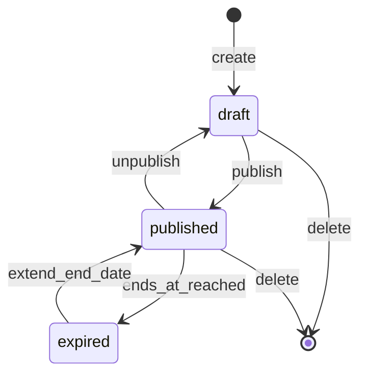
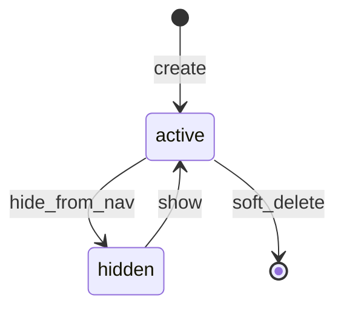

# Module: Collections and Categories

**Document ID:** SCP-COM-005-03  
**Version:** 1.0.0  
**Status:** ✅ Active  
**Traceability:** FR-020, NFR-003, NFR-040

---

## Document Control

| Field | Value |
|-------|-------|
| Bounded Context | Merchandising / Catalog Navigation |
| Aggregate Roots | `Category`, `Collection` |
| Owner Module | `commerce.merchandising` |

---

## Purpose

Organize products for discovery, navigation, and campaign merchandising through hierarchical categories and manual or rule-based collections.

## Scope

- Category tree (nested set, max depth 5)
- Manual collections (curated product lists)
- Smart collections (rule engine: tag, type, vendor, price range)
- Collection/category SEO and storefront visibility
- Product ↔ category many-to-many; product ↔ collection many-to-many

## Out of Scope

- Site navigation menus (Volume 7 CMS)
- Search facets implementation (Search service — consumes category IDs)
- Personalized collections (AI Phase 2)

## User Personas

Merchant Owner, Store Staff, Customer (browse), Theme developer (collection templates).

## Business Capabilities

1. Build category hierarchy for browse navigation
2. Create "Summer Sale" manual collection with drag-sort
3. Create smart collection: `tag = sale AND price < 500000` (NGN kobo)
4. Assign products to categories during product edit or bulk
5. Schedule collection visibility (start/end dates)

---

## Entities and Value Objects

### Entities

| Entity | Key Fields |
|--------|------------|
| **Category** | `id`, `tenant_id`, `store_id`, `name`, `slug`, `description`, `parent_id`, `position`, `image_media_id`, `seo_*`, `status` |
| **Collection** | `id`, `tenant_id`, `store_id`, `title`, `slug`, `description`, `type` (`manual`/`smart`), `rules_json`, `sort_order`, `published_at`, `ends_at`, `status` |
| **CollectionProduct** | `collection_id`, `product_id`, `position` |
| **CategoryProduct** | `category_id`, `product_id`, `position` |

### Value Objects

| Value Object | Usage |
|--------------|-------|
| **Slug** | Unique per store |
| **CollectionRule** | `{ field, operator, value }` — fields: `tag`, `type`, `vendor_id`, `price_cents`, `created_at` |
| **SortOrder** | `manual`, `best_selling`, `newest`, `price_asc`, `price_desc` |

---

## Aggregate Roots

**Category Aggregate** — Category tree node; moving nodes validates no cycles, max depth.

**Collection Aggregate** — Collection + membership (manual) or rules (smart). Smart collection membership is computed, not stored except cache.

---

## Business Rules

| ID | Rule |
|----|------|
| BR-MER-001 | Category max depth 5; max 500 categories per store |
| BR-MER-002 | Product may belong to multiple categories; at least one recommended for SEO |
| BR-MER-003 | Smart collection rules AND-combined; max 10 rules |
| BR-MER-004 | Smart collections refresh membership every 15 minutes or on `ProductUpdated` |
| BR-MER-005 | Unpublished collections hidden from storefront |
| BR-MER-006 | Scheduled collection auto-publishes/unpublishes via job |
| BR-MER-007 | Deleting category reassigns children to parent (or root) — merchant confirms |
| BR-MER-008 | Collection slug unique per store |

---

## State Machines

### Collection Lifecycle

### Category Status

---

## API Contracts

**Categories:** `/api/v1/stores/{store_id}/categories`

| Method | Path | Description |
|--------|------|-------------|
| GET | `/categories` | Tree or flat list |
| POST | `/categories` | Create |
| PATCH | `/categories/{id}` | Update / reparent |
| DELETE | `/categories/{id}` | Soft delete |
| POST | `/categories/{id}/products` | Bulk assign products |

**Collections:** `/api/v1/stores/{store_id}/collections`

| Method | Path | Description |
|--------|------|-------------|
| GET | `/collections` | List |
| POST | `/collections` | Create manual or smart |
| GET | `/collections/{id}/products` | Resolved product list |
| POST | `/collections/{id}/products` | Add (manual only) |
| DELETE | `/collections/{id}/products/{product_id}` | Remove (manual) |
| POST | `/collections/{id}/publish` | Publish |

**Storefront:** `/storefront/v1/collections/{slug}`, `/storefront/v1/categories/{slug}/products`

---

## Domain Events

| Event | Subscribers |
|-------|-------------|
| `CategoryCreated` | Search facets, Navigation cache |
| `CategoryUpdated` | Search, CDN |
| `CollectionPublished` | Storefront, Search, Webhooks |
| `CollectionMembershipChanged` | Cache, Analytics |
| `SmartCollectionEvaluated` | Internal metrics |

---

## Background Jobs

| Job | Schedule | Action |
|-----|----------|--------|
| `SmartCollectionRefreshJob` | Every 15 min + on product events | Re-evaluate rules, update cache |
| `CollectionScheduleJob` | Every 1 min | Publish/unpublish scheduled collections |
| `CategoryTreeRebuildJob` | On reparent | Recompute nested set indexes |

---

## Permissions and Authorization

- `merchandising:read`, `merchandising:write`, `merchandising:publish`

## Tenant Isolation

RLS on all merchandising tables; slug scoped to store. Storefront never leaks other stores' collection membership counts.

## Security Threat Model

- Rule injection in smart collections: allowlist fields/operators only
- Reparent category: verify no cycle (server-side graph check)

## Performance Requirements

- Category tree API p95 ≤ 150ms (cached)
- Smart collection product resolution ≤ 500ms for 10k catalog (indexed queries)

## Caching Strategy

- Storefront collection pages: CDN 120s
- Smart collection membership: Redis set `t:{tenant}:coll:{id}:products` TTL 900s

## Observability

Metrics: `merchandising.smart_collection.refresh.duration`, `merchandising.collection.product_count`

## AI Opportunities

- Auto-categorize products from title/description
- Smart collection rule suggestions from sales data

## Extension Points

- Custom rule operators via plugin (Phase 2)
- Collection templates in theme engine

## Testing Strategy

- Unit: rule evaluation, tree depth, cycle detection
- Integration: scheduled publish, smart refresh on tag change

## Failure Modes

- Smart rule references deleted tag: evaluate as empty match, log warning

---

## Acceptance Criteria

1. Merchant creates 3-level category tree; storefront breadcrumb renders correctly.
2. Smart collection "tag=sale" updates within 15 minutes of product tag change.
3. Manual collection drag-sort order preserved on storefront.
4. Scheduled collection publishes at `published_at` without manual action.
5. Category reparent rejecting cycle returns 422.
6. Cross-tenant collection slug access returns 404.
7. Collection with 500 products paginates storefront API at 24 per page.

---

## ADRs

None specific; follows catalog tenant model.

## Sources

- Volume 1 — Category, Collection entities
- Shopify Smart Collection patterns (E3)
