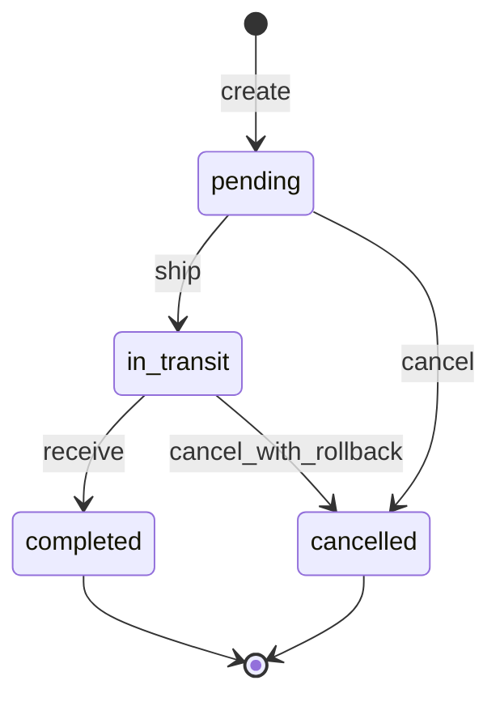
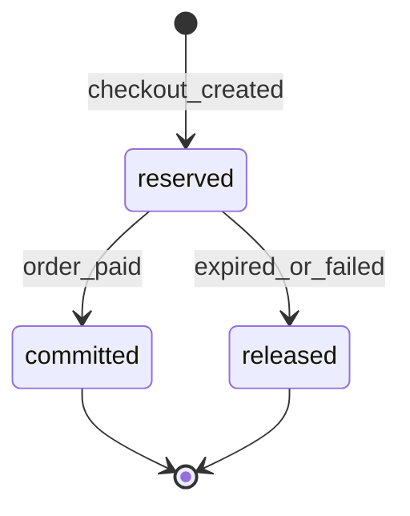

# Module: Inventory and Warehouses

**Document ID:** SCP-COM-005-04  
**Version:** 1.0.0  
**Status:** ✅ Active  
**Traceability:** FR-020, FR-023, NFR-008, NFR-040

---

## Document Control

| Field | Value |
|-------|-------|
| Bounded Context | Inventory |
| Aggregate Root | `InventoryLevel` |
| Owner Module | `commerce.inventory` |

---

## Purpose

Track stock quantities per variant per location, reserve inventory during checkout, decrement on payment confirmation, and support multi-warehouse fulfillment for Nigerian and African merchants with Lagos hub + regional stores.

## Scope

- Warehouse/location management
- Available, reserved, incoming quantities
- Inventory adjustments, transfers, low-stock alerts
- Oversell prevention at checkout
- POS inventory sync hooks

## Out of Scope

- Purchase orders / supplier management (Volume 18 ERP)
- Manufacturing BOM (Phase 3)
- Marketplace vendor-owned warehouse routing (Volume 8 extends)

## User Personas

Merchant Owner, Warehouse Staff, Store Staff, System (checkout reservation).

## Business Capabilities

1. Create warehouses (e.g., Lagos Main, Abuja Store, Nairobi KE)
2. Set stock levels per variant per location
3. Reserve stock when checkout session created; release on expiry/cancel
4. Commit decrement on `OrderPaid`
5. Transfer stock between locations with audit trail
6. Configure "continue selling when out of stock" per variant (default: false)

---

## Entities and Value Objects

### Entities

| Entity | Key Fields |
|--------|------------|
| **Warehouse** | `id`, `tenant_id`, `store_id`, `name`, `code`, `address`, `is_default`, `priority`, `status` |
| **InventoryLevel** | `id`, `tenant_id`, `variant_id`, `warehouse_id`, `available`, `reserved`, `incoming`, `updated_at` |
| **InventoryAdjustment** | `id`, `inventory_level_id`, `delta`, `reason`, `reference_type`, `reference_id`, `user_id`, `created_at` |
| **InventoryTransfer** | `id`, `from_warehouse_id`, `to_warehouse_id`, `variant_id`, `quantity`, `status` |

### Value Objects

| Value Object | Notes |
|--------------|-------|
| **Quantity** | Non-negative integer |
| **AdjustmentReason** | `restock`, `damage`, `correction`, `return`, `transfer`, `order_commit` |
| **StockPolicy** | `deny`, `continue` (oversell allowed flag on variant) |

---

## Aggregate Roots

**InventoryLevel Aggregate** — single variant × warehouse row is the consistency unit for reservations and commits.

**Invariants:**

1. `available >= 0` unless `StockPolicy = continue`
2. `reserved <= available + reserved` (reserved drawn from available pool)
3. `available - reserved >= 0` for fulfillable stock
4. One default warehouse per store

---

## Business Rules

| ID | Rule |
|----|------|
| BR-INV-001 | Reservation TTL matches checkout session (default 30 min) |
| BR-INV-002 | Reservation is idempotent per `checkout_session_id` |
| BR-INV-003 | Commit on payment is atomic per order line |
| BR-INV-004 | Release reservation on checkout expiry, cancel, or payment failure |
| BR-INV-005 | Transfers require `available >= quantity` at source |
| BR-INV-006 | Low-stock alert when `available <= threshold` (default 5, configurable) |
| BR-INV-007 | Digital products skip inventory tracking (infinite virtual stock) |
| BR-INV-008 | Multi-warehouse fulfillment picks highest-priority warehouse with stock |
| BR-INV-009 | Inventory adjustments require `inventory:adjust` permission + audit log |
| BR-INV-010 | Negative available only when merchant enables continue-selling |

---

## State Machines

### Inventory Transfer



### Reservation (logical)



---

## API Contracts

Base: `/api/v1/stores/{store_id}/inventory`

| Method | Path | Description |
|--------|------|-------------|
| GET | `/warehouses` | List warehouses |
| POST | `/warehouses` | Create warehouse |
| GET | `/levels` | Query by variant_id or warehouse_id |
| PATCH | `/levels/{id}` | Set available (creates adjustment) |
| POST | `/adjustments` | Record adjustment |
| POST | `/transfers` | Create transfer |
| POST | `/transfers/{id}/complete` | Complete transfer |
| POST | `/reserve` | Internal: checkout reservation |
| POST | `/release` | Internal: release reservation |
| POST | `/commit` | Internal: commit on payment |

**Internal APIs** (`/internal/inventory/*`) authenticated via service token; not exposed to merchant API keys.

**Adjust stock request:**

```json
{
  "variant_id": "uuid",
  "warehouse_id": "uuid",
  "delta": 50,
  "reason": "restock"
}
```

---

## Domain Events

| Event | Subscribers |
|-------|-------------|
| `InventoryChanged` | Catalog (availability badge), Search, Analytics |
| `InventoryLowStock` | Notifications, Admin alerts |
| `InventoryReserved` | Checkout (confirmation) |
| `InventoryCommitted` | Orders, Analytics |
| `InventoryTransferCompleted` | Analytics |
| `InventoryReleased` | Checkout |

---

## Background Jobs

| Job | Purpose |
|-----|---------|
| `ExpiredReservationReleaseJob` | Every 1 min — release stale reservations |
| `LowStockAlertJob` | Daily digest of low-stock SKUs |
| `InventoryReconciliationJob` | Nightly verify reserved sums vs checkout sessions |
| `DefaultWarehouseSeedJob` | On store creation — create default warehouse |

---

## Permissions and Authorization

| Permission | Action |
|------------|--------|
| `inventory:read` | View levels |
| `inventory:adjust` | Manual adjustments |
| `inventory:transfer` | Inter-warehouse transfers |
| `inventory:warehouses` | CRUD warehouses |

## Tenant Isolation

- RLS on warehouses, inventory_levels, adjustments
- Internal reserve/commit includes `tenant_id` validation from checkout context
- No cross-tenant warehouse IDs in transfer API

## Security Threat Model

- Race condition oversell: pessimistic row lock `SELECT FOR UPDATE` on inventory_levels during reserve/commit
- Manual adjustment fraud: audit log + optional dual approval Phase 2

## Performance Requirements

- Reserve API p95 ≤ 100ms (NFR-004 budget for checkout)
- Support 100 concurrent reservations per hot SKU (row-level locking)

## Caching Strategy

- Storefront availability: cache `in_stock` boolean 30s; invalidate on `InventoryChanged`
- Never cache reserved counts on storefront

## Observability

- Metrics: `inventory.reserve.conflicts`, `inventory.oversell.prevented`, `inventory.level.available` (gauge)
- Alert: reservation release backlog > 1000

## AI Opportunities

- Demand forecast for restock suggestions
- Optimal warehouse priority by delivery region (Lagos vs Abuja)

## Extension Points

- Webhook: `inventory/low_stock`
- External WMS sync adapter (Phase 2)

## Testing Strategy

- Concurrency: 50 parallel reserves on qty=10 → exactly 10 succeed
- Integration: checkout expiry releases stock

## Failure Modes

| Failure | Behavior |
|---------|----------|
| DB lock timeout | 503 retry on reserve; checkout shows "try again" |
| Commit after partial payment failure | Idempotent commit per order line |

---

## Acceptance Criteria

1. Creating checkout reserves exact line quantities; available decreases, reserved increases.
2. Payment success commits reservation; available permanently reduced.
3. Checkout expiry after 30 min releases reservation automatically.
4. Two simultaneous checkouts for last item: one succeeds, one gets "out of stock" at reserve.
5. Digital variant skips reservation calls entirely.
6. Transfer from Lagos to Abuja updates both location levels atomically on complete.
7. Cross-tenant inventory query returns empty (not error leakage).
8. Low-stock email sent when variant hits threshold.

---

## ADRs

- Checkout-inventory coupling via events (Volume 5 Ch.06)

## Sources

- Volume 1 — InventoryLevel entity
- Domain event `InventoryChanged` from domain model overview
