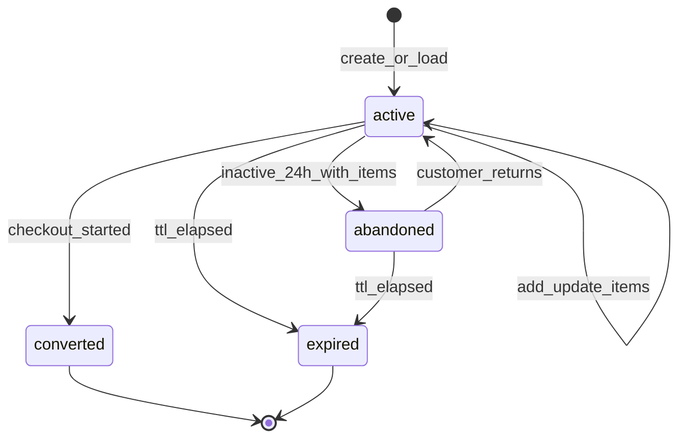

# Module: Cart and Session

**Document ID:** SCP-COM-005-05  
**Version:** 1.0.0  
**Status:** ✅ Active  
**Traceability:** FR-021–024, NFR-003, NFR-033, NFR-040, NFR-046

---

## Document Control

| Field | Value |
|-------|-------|
| Bounded Context | Cart |
| Aggregate Root | `Cart` |
| Owner Module | `commerce.cart` |

---

## Purpose

Persist shopping intent across anonymous and authenticated sessions, snapshot prices and promotions, and hand off a validated cart to checkout orchestration.

## Scope

- Guest and customer carts
- Cart line items with variant, quantity, price snapshot
- Cart merge on login
- Cart expiry and abandonment detection
- Storefront cart API and session cookie binding

## Out of Scope

- Payment collection (Ch.06–08)
- Shipping rate calculation (Ch.10 — estimates only in cart Phase 1)
- Tax finalization (Ch.09 — estimates in cart)

## User Personas

Guest Customer, Registered Customer, API client (headless storefront).

## Business Capabilities

1. Add/update/remove line items
2. Apply coupon codes (validated via Promotions module)
3. Show subtotal, estimated tax/shipping
4. Merge guest cart into customer cart on authentication
5. Detect abandoned carts for recovery campaigns

---

## Entities and Value Objects

### Entities

| Entity | Key Fields |
|--------|------------|
| **Cart** | `id`, `tenant_id`, `store_id`, `customer_id?`, `session_token`, `currency`, `status`, `expires_at`, `subtotal_cents`, `discount_cents`, `estimated_tax_cents`, `estimated_shipping_cents`, `total_cents`, `coupon_code?`, `metadata`, `created_at`, `updated_at` |
| **CartItem** | `id`, `cart_id`, `variant_id`, `product_id`, `quantity`, `unit_price_cents`, `line_total_cents`, `title_snapshot`, `variant_title_snapshot`, `requires_shipping`, `vendor_id?` |

### Value Objects

| Value Object | Usage |
|--------------|-------|
| **Money** | All monetary fields |
| **CartStatus** | `active`, `converted`, `abandoned`, `expired` |
| **SessionToken** | Cryptographically random, HttpOnly cookie |

---

## Aggregate Roots

**Cart Aggregate** — Cart + CartItems. All line mutations go through Cart root methods.

**Invariants:**

1. `quantity >= 1` and `quantity <= 999` per line
2. `unit_price_cents` captured at add/update time from variant list price (promotions recalc on cart refresh)
3. Sum of line totals + adjustments = cart totals
4. One active cart per customer per store; guest cart keyed by session token
5. Cart currency matches store currency

---

## Business Rules

| ID | Rule |
|----|------|
| BR-CART-001 | Guest cart TTL 14 days sliding; authenticated 90 days |
| BR-CART-002 | Max 100 line items per cart |
| BR-CART-003 | Adding disabled or deleted variant returns 422 |
| BR-CART-004 | Price snapshot refreshed on GET if older than 1 hour |
| BR-CART-005 | Coupon application validates via Promotions service synchronously |
| BR-CART-006 | Cart merge: higher quantity wins per variant; duplicates combined |
| BR-CART-007 | Converted cart immutable after checkout session created |
| BR-CART-008 | Marketplace lines carry `vendor_id` for split fulfillment |
| BR-CART-009 | Digital and physical items may coexist |
| BR-CART-010 | Bot protection (Turnstile) on cart create after rate threshold (NFR-046) |

---

## State Machines



---

## API Contracts

**Storefront:** `/storefront/v1/cart`

| Method | Path | Description |
|--------|------|-------------|
| GET | `/cart` | Get current cart (cookie/session) |
| POST | `/cart/items` | Add line item |
| PATCH | `/cart/items/{id}` | Update quantity |
| DELETE | `/cart/items/{id}` | Remove line |
| POST | `/cart/coupon` | Apply coupon |
| DELETE | `/cart/coupon` | Remove coupon |
| POST | `/cart/merge` | Merge guest into customer (auth required) |

**Admin (support):** `GET /api/v1/stores/{store_id}/carts/{id}` read-only

**Add item:**

```json
{
  "variant_id": "uuid",
  "quantity": 2
}
```

Response includes recalculated totals and per-line availability flags.

---

## Domain Events

| Event | Subscribers |
|-------|-------------|
| `CartCreated` | Analytics |
| `CartUpdated` | Analytics |
| `CartAbandoned` | Notifications, AI recovery, Webhooks |
| `CartConverted` | Analytics |
| `CartExpired` | Cleanup job |

---

## Background Jobs

| Job | Schedule | Action |
|-----|----------|--------|
| `CartAbandonmentDetectorJob` | Hourly | Mark inactive carts abandoned; emit events |
| `CartExpiryPurgeJob` | Daily | Delete expired cart data per retention |
| `CartPriceRefreshJob` | Optional batch | Refresh stale price snapshots |

---

## Permissions and Authorization

- Storefront: session cookie or customer JWT
- Admin read: `orders:read` for support diagnostics
- No admin write to customer cart contents (audit exception: support override Phase 2)

## Tenant Isolation

- Cart resolved via store domain → `store_id` → `tenant_id`
- Session token encoded with store scope; cross-store cart impossible
- RLS on carts and cart_items

## Security Threat Model

| Threat | Mitigation |
|--------|------------|
| Cart ID enumeration | Opaque UUID + session binding |
| Price manipulation | Server-side price from variant; ignore client price |
| Coupon brute force | Rate limit 10 attempts/hour/IP |
| Session fixation | Rotate session token on login merge |

## Performance Requirements

- Cart GET p95 ≤ 150ms including promotion recalc
- Add item p95 ≤ 200ms

## Caching Strategy

- Do not CDN-cache cart responses
- Redis optional for hot cart reads (TTL 5 min) with write-through invalidation

## Observability

- Metrics: `cart.abandoned.count`, `cart.items.avg`, `cart.coupon.apply.failures`
- Funnel: add_to_cart → checkout_started

## AI Opportunities

- Abandonment recovery message personalization
- Cross-sell recommendations in cart drawer

## Extension Points

- Cart metafields for headless customizations
- Webhook: `carts/abandon`

## Testing Strategy

- Unit: total calculation, merge logic
- E2E: guest → login → merge → checkout

## Failure Modes

- Promotion service down: cart works without discount; coupon returns 503 retry

---

## Acceptance Criteria

1. Guest adds 3 items; cart persists across browser sessions via cookie 14 days.
2. Login merges guest cart; duplicate variants summed correctly.
3. Disabled variant shows error on add and on cart refresh.
4. Abandoned cart event fires after 24h inactivity with items.
5. Checkout start marks cart `converted`; further item edits rejected.
6. Cross-store session token rejected (404).
7. Coupon apply validates minimum order value from Promotions module.
8. Cart totals use integer kobo only; no floating point in JSON.

---

## ADRs

- ADR-004 (cart precedes redirect checkout)

## Sources

- Volume 1 — Cart, CartItem entities
- NFR-033 session management
