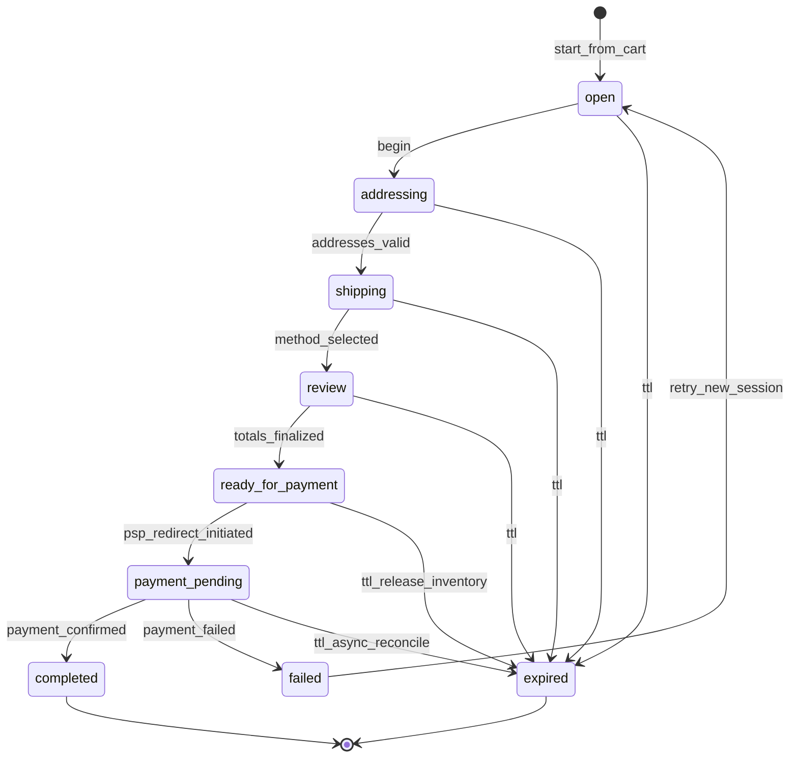
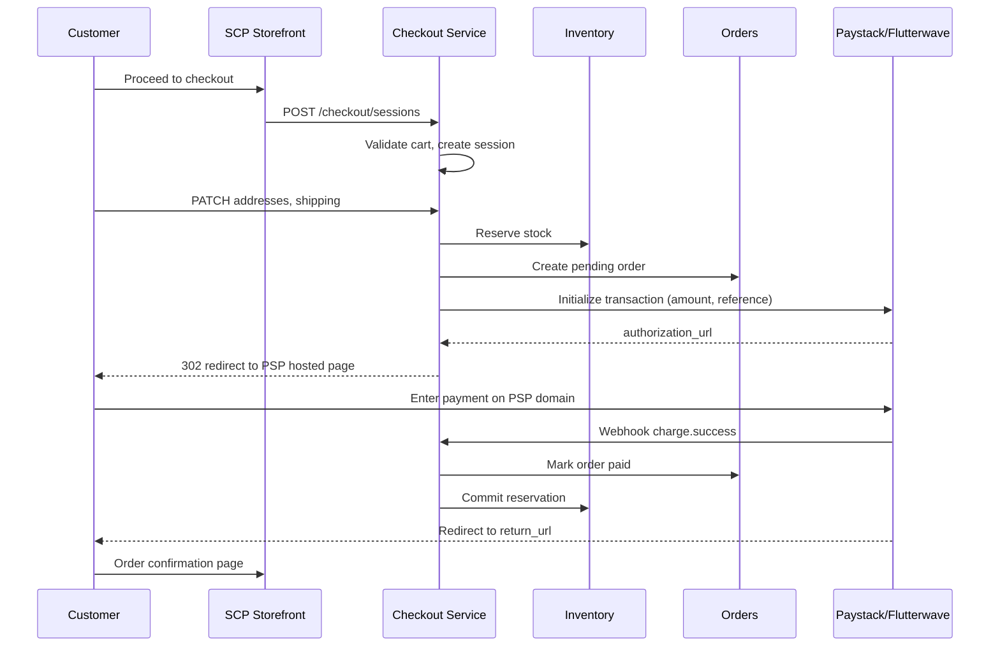

# Module: Checkout Architecture

**Document ID:** SCP-COM-005-06  
**Version:** 1.0.0  
**Status:** ✅ Active  
**Traceability:** NFR-012, NFR-044, NFR-049, NFR-083, ADR-004

---

## Document Control

| Field | Value |
|-------|-------|
| Bounded Context | Checkout (Orchestration) |
| Aggregate Root | `CheckoutSession` |
| Owner Module | `commerce.checkout` |

---

## Purpose

Orchestrate the path from cart to payable order: collect shipping and billing addresses, compute final tax and shipping, reserve inventory, create a pending order, and initiate PSP redirect checkout per **ADR-004** (SAQ A — no cardholder data on SCP).

## Scope

- Checkout session lifecycle
- Address collection and validation (Nigeria, Kenya formats)
- Order draft creation before payment
- PSP redirect initiation (Paystack, Flutterwave, M-Pesa)
- Return URL handling and idempotent payment confirmation
- Checkout privacy notice (NDPA contract basis)

## Out of Scope

- Embedded iframe/inline card fields (Phase 2, guarded template)
- Direct card API / SAQ D
- Subscription billing cycles (Ch.13)

## User Personas

Customer (shopper), Merchant (checkout settings), System (webhook handler).

## Business Capabilities

1. Start checkout from active cart
2. Collect email, phone (E.164), shipping address
3. Select shipping method and see final totals
4. Accept terms + privacy notice (NDPA lawful basis: contract)
5. Redirect to PSP hosted page or STK Push prompt
6. Return to SCP confirmation page on success

---

## Entities and Value Objects

### Entities

| Entity | Key Fields |
|--------|------------|
| **CheckoutSession** | `id`, `tenant_id`, `store_id`, `cart_id`, `customer_id?`, `status`, `email`, `phone`, `shipping_address`, `billing_address`, `shipping_method_id`, `payment_method`, `order_id?`, `psp_reference?`, `redirect_url?`, `expires_at`, `totals_snapshot`, `consent_checkout_at`, `consent_marketing?`, `ip_address`, `user_agent` |
| **CheckoutSessionLine** | Denormalized lines from cart at session start |

### Value Objects

| Value Object | Notes |
|--------------|-------|
| **Address** | Nigeria: state + LGA; Kenya: county |
| **CheckoutStatus** | See state machine |
| **TotalsSnapshot** | subtotal, discounts, tax, shipping, total (Money) |
| **PaymentMethodSelection** | `paystack`, `flutterwave`, `mpesa`, `bank_transfer` |

---

## Aggregate Roots

**CheckoutSession Aggregate** — owns session state, address snapshots, and PSP handoff tokens. Creates Order aggregate via domain service on `ready_for_payment`.

**Invariants:**

1. Session expires in 30 minutes (extend once by 15 min on user activity)
2. Totals recomputed before payment initiation; inventory reserved at `ready_for_payment`
3. No PAN, CVV, or card track data ever stored (NFR-044)
4. `consent_checkout_at` required before redirect
5. Marketing consent optional, separate checkbox (NDPA explicit consent)

---

## Business Rules

| ID | Rule |
|----|------|
| BR-CHK-001 | Checkout requires active cart with ≥1 fulfillable line |
| BR-CHK-002 | Email required; phone required for M-Pesa and SMS notifications |
| BR-CHK-003 | Re-validate inventory and prices at payment initiation |
| BR-CHK-004 | Single PSP attempt per session; new session if expired |
| BR-CHK-005 | Redirect URLs allowlisted per store domain + platform fallback |
| BR-CHK-006 | Webhook/callback is source of truth for payment; return URL is UX only |
| BR-CHK-007 | Failed payment releases inventory reservation |
| BR-CHK-008 | Turnstile on checkout start (NFR-046) |
| BR-CHK-009 | Checkout notice links Privacy Policy (NFR-083) |
| BR-CHK-010 | Guest checkout allowed if store setting enabled (default: true Nigeria) |

---

## State Machines



---

## Checkout Flow (Redirect Model)



---

## API Contracts

**Storefront:** `/storefront/v1/checkout`

| Method | Path | Description |
|--------|------|-------------|
| POST | `/sessions` | Start session from cart |
| GET | `/sessions/{id}` | Get session state |
| PATCH | `/sessions/{id}` | Update addresses, shipping, consent |
| POST | `/sessions/{id}/complete` | Finalize totals, create order, get redirect URL |
| GET | `/sessions/{id}/return` | Post-PSP landing (idempotent status poll) |

**Complete response:**

```json
{
  "checkout_session_id": "uuid",
  "order_id": "uuid",
  "payment": {
    "provider": "paystack",
    "redirect_url": "https://checkout.paystack.com/...",
    "reference": "SCP-ORD-20260712-ABC123"
  },
  "expires_at": "2026-07-12T10:30:00Z"
}
```

M-Pesa response uses `payment.action: "stk_push"` with `checkout_request_id` instead of redirect.

---

## Domain Events

| Event | Subscribers |
|-------|-------------|
| `CheckoutStarted` | Analytics |
| `CheckoutAddressUpdated` | Analytics |
| `CheckoutReadyForPayment` | Inventory, Orders |
| `CheckoutPaymentInitiated` | Payments, Analytics |
| `CheckoutCompleted` | Orders, Notifications, Webhooks |
| `CheckoutFailed` | Inventory, Notifications |
| `CheckoutExpired` | Inventory, Cart |

---

## Background Jobs

| Job | Purpose |
|-----|---------|
| `CheckoutExpiryJob` | Every 1 min — expire sessions, release inventory |
| `CheckoutReconciliationJob` | Poll PSP for stuck `payment_pending` > 2h |
| `AbandonedCheckoutJob` | Emit recovery notifications at 1h, 24h |

---

## Permissions and Authorization

- Public storefront with session binding
- Admin: read checkout sessions for support (`orders:read`)

## Tenant Isolation

- Checkout session scoped to store; PSP credentials per tenant/store encrypted
- Webhook endpoints include store identifier; signature verified per merchant PSP keys

## Security Threat Model

| Threat | Mitigation |
|--------|------------|
| Payment amount tampering | Amount sent to PSP from server totals only |
| Webhook spoofing | HMAC signature verification (Paystack x-paystack-signature) |
| Replay attacks | Idempotent webhook processing by PSP reference |
| MITM on redirect | HTTPS only; HSTS |
| Card data on SCP | Redirect model — SAQ A (ADR-004) |
| Order marked paid without webhook | Return URL never marks paid; only webhook handler |

## Performance Requirements

- Checkout complete (to redirect URL) p95 ≤ 500ms excluding PSP RTT
- End-user flow ≤ 60s on 4G (NFR-012)

## Caching Strategy

Not applicable — checkout is dynamic, no CDN cache.

## Observability

- Traces: full checkout funnel with `checkout_session_id`
- Metrics: `checkout.conversion.rate`, `checkout.psp.initiate.errors`
- Audit: payment initiation with order reference (no card data)

## AI Opportunities

- Address autocomplete for Nigerian LGAs
- Fraud score signal before PSP handoff (Phase 2)

## Extension Points

- Checkout UI extension blocks (theme Phase 2)
- Custom fields via metafields

## Testing Strategy

- Integration: full redirect sandbox Paystack + Flutterwave
- Security: forged webhook rejected; amount mismatch rejected
- Accessibility: checkout flow NVDA/VoiceOver (NFR-049)

## Failure Modes

| Failure | Behavior |
|---------|----------|
| PSP initialize timeout | 503; reservation held 5 min then release |
| Inventory race at complete | 409 out of stock; user returned to cart |
| Duplicate webhook | Idempotent — second delivery no-op |

---

## Acceptance Criteria

1. Customer completes NGN checkout via Paystack redirect; order marked paid only on webhook.
2. Return URL alone without webhook shows "payment processing" — not paid.
3. Expired session releases inventory within 2 minutes.
4. No request logs contain card numbers (log scrubbing verified).
5. Marketing checkbox unchecked by default; opt-in stored with timestamp.
6. M-Pesa STK Push completes order on Daraja callback (Kenya sandbox).
7. Checkout privacy notice link present and recorded in `consent_checkout_at`.
8. Turnstile blocks automated checkout session spam in load test.
9. Cross-tenant checkout session ID returns 404.

---

## ADRs

- **[ADR-004](../../00-meta/adr/004-checkout-psp-redirect-saq-a.md)** — PSP redirect, SAQ A

## Sources

- PCI SSC SAQ A r1 (March 2025)
- Volume 11 Ch.02 — NDPA checkout lawful basis
- Paystack Initialize Transaction API
