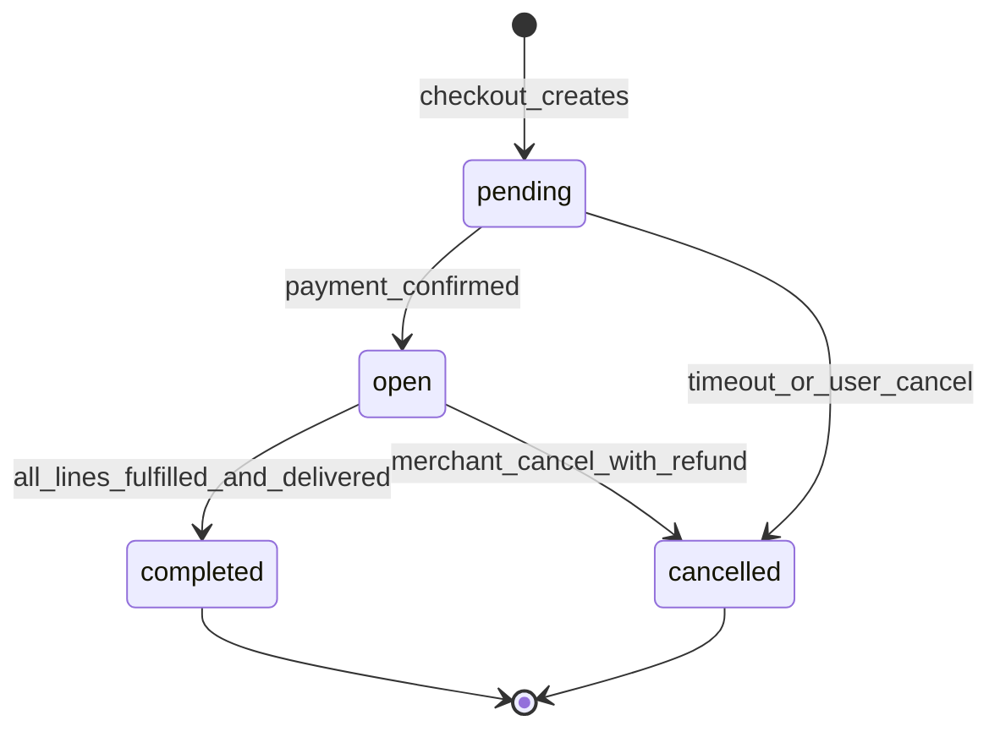
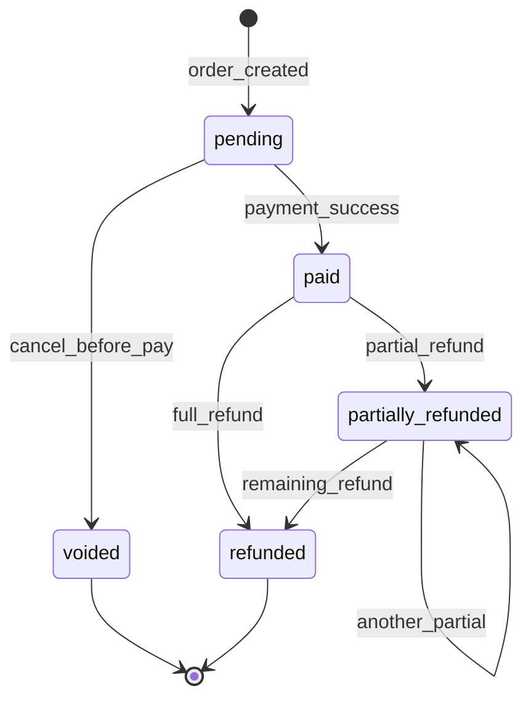
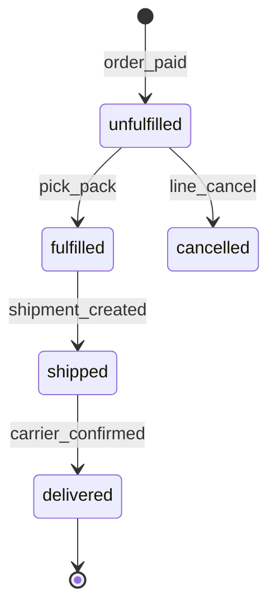

# Module: Orders and Fulfillment

**Document ID:** SCP-COM-005-07  
**Version:** 1.0.0  
**Status:** ✅ Active  
**Traceability:** FR-021–025, NFR-073, NFR-075, NFR-040

---

## Document Control

| Field | Value |
|-------|-------|
| Bounded Context | Orders |
| Aggregate Root | `Order` |
| Owner Module | `commerce.orders` |

---

## Purpose

Persist immutable commercial records of purchases, manage fulfillment workflow from payment through delivery, and emit events for payments, shipping, analytics, marketplace commissions, and webhooks.

## Scope

- Order and order line creation from checkout
- Order lifecycle: pending → paid → fulfilled → completed
- Partial fulfillment and split shipments
- Order editing rules (pre-fulfillment)
- Merchant admin order management
- Customer order history

## Out of Scope

- Payment capture mechanics (Ch.08)
- Carrier label generation detail (Ch.10)
- Marketplace commission calculation (Volume 8)

## User Personas

Customer, Merchant Staff, Warehouse Staff, Vendor (own order lines), API Integrator.

## Business Capabilities

1. Create pending order at checkout payment initiation
2. Transition to paid on payment confirmation
3. Fulfill lines via shipments (physical) or digital delivery (Ch.14)
4. Cancel unpaid orders; refund paid orders (Ch.12)
5. Export orders for accounting (7-year retention NFR-073)
6. Print packing slips and invoices

---

## Entities and Value Objects

### Entities

| Entity | Key Fields |
|--------|------------|
| **Order** | `id`, `tenant_id`, `store_id`, `order_number`, `customer_id?`, `email`, `phone`, `status`, `financial_status`, `fulfillment_status`, `currency`, `subtotal_cents`, `discount_cents`, `tax_cents`, `shipping_cents`, `total_cents`, `billing_address`, `shipping_address`, `notes`, `tags[]`, `source` (`web`, `pos`, `api`), `checkout_session_id`, `paid_at`, `cancelled_at`, `created_at` |
| **OrderItem** | `id`, `order_id`, `variant_id`, `product_id`, `vendor_id?`, `sku`, `title`, `quantity`, `unit_price_cents`, `discount_cents`, `tax_cents`, `total_cents`, `fulfillment_status`, `requires_shipping` |
| **OrderTimeline** | `id`, `order_id`, `event_type`, `message`, `user_id?`, `created_at` |

### Value Objects

| Value Object | Values |
|--------------|--------|
| **OrderStatus** | `pending`, `open`, `completed`, `cancelled` |
| **FinancialStatus** | `pending`, `paid`, `partially_refunded`, `refunded`, `voided` |
| **FulfillmentStatus** | `unfulfilled`, `partial`, `fulfilled`, `shipped`, `delivered` |
| **OrderNumber** | Human-readable `#{store_prefix}{sequential}` e.g. `#NG10042` |

---

## Aggregate Roots

**Order Aggregate** — Order + OrderItems + timeline entries. Payments are separate aggregate linked by `order_id`.

**Invariants:**

1. `total_cents = subtotal - discount + tax + shipping` (integer math)
2. Line snapshots immutable after `paid` (title, price, SKU)
3. Cannot cancel order with in-transit shipments without workflow
4. Order number unique per store
5. Pending orders auto-cancel after 48h if unpaid

---

## Business Rules

| ID | Rule |
|----|------|
| BR-ORD-001 | Order created at checkout `ready_for_payment` with status `pending` |
| BR-ORD-002 | Payment webhook transitions `financial_status` to `paid` |
| BR-ORD-003 | Inventory committed on paid transition |
| BR-ORD-004 | Digital lines auto-fulfill on paid (delivery job) |
| BR-ORD-005 | Physical lines require manual or integrated fulfillment |
| BR-ORD-006 | Partial fulfillment allowed; order `fulfillment_status = partial` |
| BR-ORD-007 | Merchant notes internal; customer notes from checkout |
| BR-ORD-008 | Order tags for ops (`fraud_review`, `vip`) |
| BR-ORD-009 | Cancel pending: no payment impact; release reservation |
| BR-ORD-010 | Cancel paid: triggers refund workflow (Ch.12) |
| BR-ORD-011 | Transaction data retained 7 years (NFR-073) |
| BR-ORD-012 | All financial transitions audit logged (NFR-075) |

---

## State Machines

### Order Lifecycle

### Financial Status

### Line Fulfillment

---

## API Contracts

**Admin:** `/api/v1/stores/{store_id}/orders`

| Method | Path | Description |
|--------|------|-------------|
| GET | `/orders` | List (filter status, date, customer) |
| GET | `/orders/{id}` | Detail with lines, timeline |
| GET | `/orders/number/{order_number}` | Lookup by number |
| POST | `/orders/{id}/cancel` | Cancel (rules apply) |
| POST | `/orders/{id}/fulfill` | Create fulfillment |
| PATCH | `/orders/{id}` | Tags, notes (limited fields) |
| GET | `/orders/{id}/invoice` | PDF invoice |

**Customer:** `/storefront/v1/account/orders` (authenticated)

**Webhook payload (OrderPlaced):** standard developer platform envelope.

---

## Domain Events

| Event | Subscribers |
|-------|-------------|
| `OrderPlaced` | Payments, Inventory, Notifications, Webhooks, Analytics |
| `OrderPaid` | Fulfillment, Digital delivery, Marketplace commission |
| `OrderFulfilled` | Shipping, Notifications |
| `OrderShipped` | Notifications, Webhooks |
| `OrderDelivered` | Analytics, Reviews prompt |
| `OrderCancelled` | Payments, Inventory, Notifications |
| `OrderCompleted` | Analytics, Loyalty (Phase 2) |

---

## Background Jobs

| Job | Purpose |
|-----|---------|
| `PendingOrderCancelJob` | Cancel unpaid > 48h |
| `OrderConfirmationEmailJob` | On OrderPaid |
| `OrderExportJob` | Merchant CSV export |
| `OrderArchiveJob` | Move completed orders > 2y to cold storage (queryable) |

---

## Permissions and Authorization

| Permission | Roles |
|------------|-------|
| `orders:read` | Staff, Owner, Vendor (own lines) |
| `orders:fulfill` | Staff, Warehouse |
| `orders:cancel` | Owner, Senior Staff |
| `orders:refund` | Owner (with Payments) |

## Tenant Isolation

- RLS on orders, order_items
- Customer account API returns only own orders for store
- Vendor sees orders containing their lines only

## Security Threat Model

- Order detail IDOR: verify customer_id or admin permission
- Invoice PDF: signed URL TTL 15 min

## Performance Requirements

- Order list p95 ≤ 200ms with 100k orders (indexed `store_id`, `created_at`)
- Order detail p95 ≤ 150ms

## Caching Strategy

- Customer order history: no cache
- Admin list: optional Redis count cache 60s

## Observability

- Metrics: `orders.placed`, `orders.paid`, `orders.fulfillment.duration`
- Audit: all status transitions

## AI Opportunities

- Fraud review scoring on OrderPlaced
- Predicted delivery date for customer comms

## Extension Points

- Order metafields
- Fulfillment service plugins (3PL)

## Testing Strategy

- State machine transition tests
- Marketplace split order visibility

## Failure Modes

- Duplicate OrderPaid event: idempotent status transition

---

## Acceptance Criteria

1. Checkout creates pending order with frozen line prices matching cart snapshot.
2. Paystack webhook transitions order to paid; confirmation email sent within 2 min.
3. Merchant fulfills partial quantity; fulfillment_status = partial.
4. Unpaid order auto-cancels at 48h; inventory released.
5. Customer sees only own orders on account page.
6. Order export includes all fields for 7-year audit sample.
7. Cancel paid order initiates refund record (Ch.12 integration).
8. Cross-tenant order ID returns 404.

---

## ADRs

- ADR-004 (order created before redirect payment)

## Sources

- Volume 1 — Order, OrderItem entities
- NFR-073 retention
