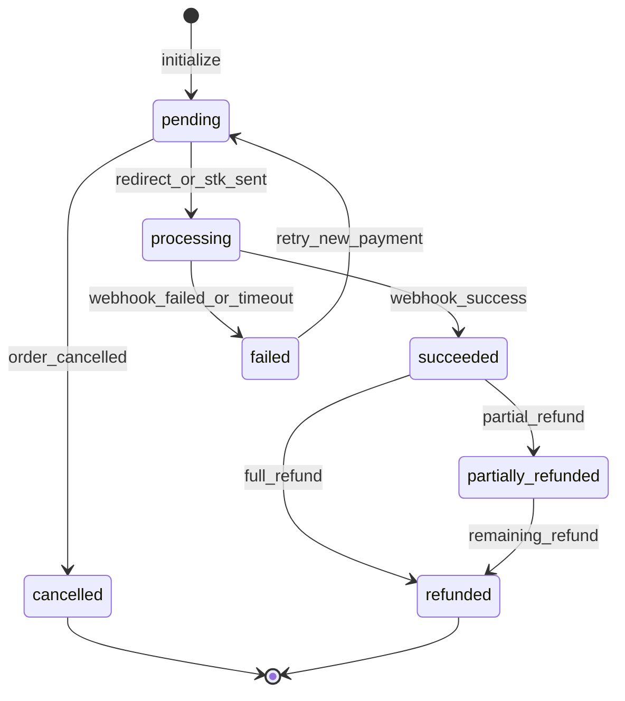
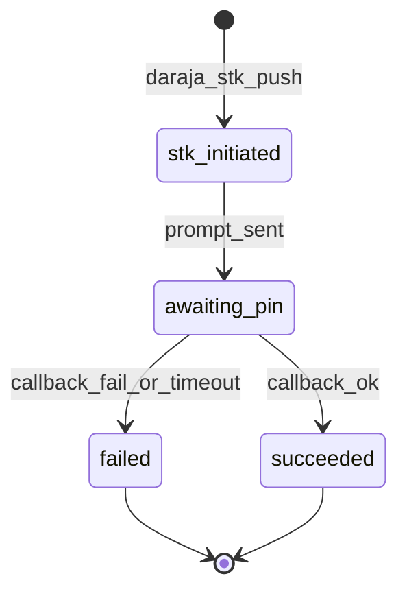

# Module: Payments — Nigeria and Africa

**Document ID:** SCP-COM-005-08  
**Version:** 1.1.0  
**Status:** ✅ Active (facade — see Ch. 16 Financial Services Layer)  
**Traceability:** ADR-019, ADR-004, NFR-044, NFR-071, NFR-083  

---

## Document Control

| Field | Value |
|-------|-------|
| Bounded Context | Financial Services (Payments facade) |
| Aggregate Root | `Payment` |
| Owner Module | `commerce.payments` → delegates to `financial_services` |

---

> **Architecture note (ADR-019):** Payment gateway logic lives in the **Financial Services Layer** ([Ch. 16](./16-financial-services-layer.md)). This chapter documents the commerce-facing payment entities and Nigeria/Africa provider behavior. Adapters and smart routing: [Ch. 17](./17-payment-gateway-adapters-africa.md).

## Purpose

Integrate African payment service providers with a unified payment abstraction, enforcing **redirect/hosted checkout (SAQ A)**, webhook-driven confirmation, and Nigeria-first provider support (Paystack, Flutterwave) plus Kenya M-Pesa.

## Scope

- Payment provider configuration per store
- Transaction initialization and webhook processing
- Payment methods: cards (via PSP), bank transfer, USSD (Nigeria), M-Pesa STK (Kenya)
- Refunds and partial refunds (Ch.12 coordination)
- Reconciliation and settlement reporting
- Multi-currency display; settlement in store currency Phase 1

## Out of Scope

- SCP holding merchant funds (marketplace escrow — Volume 8)
- Embedded card fields (Phase 2 per ADR-004)
- Cryptocurrency

## User Personas

Customer (payer), Merchant Owner (PSP keys), Finance Staff, System (webhook worker).

## Business Capabilities

1. Connect Paystack / Flutterwave with encrypted secret keys
2. Initialize NGN transactions with unique reference
3. Handle `charge.success`, `charge.failed` webhooks idempotently
4. Initiate M-Pesa STK Push for KES orders
5. Process full and partial refunds via provider API
6. Daily reconciliation report per store

---

## Entities and Value Objects

### Entities

| Entity | Key Fields |
|--------|------------|
| **PaymentProviderConfig** | `id`, `tenant_id`, `store_id`, `provider`, `public_key`, `secret_key_encrypted`, `webhook_secret_encrypted`, `enabled_methods[]`, `is_live`, `country` |
| **Payment** | `id`, `tenant_id`, `order_id`, `provider`, `method`, `amount_cents`, `currency`, `status`, `provider_reference`, `provider_transaction_id`, `authorization_url?`, `metadata`, `paid_at`, `failed_at`, `failure_reason` |
| **PaymentAttempt** | `id`, `payment_id`, `attempt_number`, `status`, `raw_response_hash`, `created_at` |
| **Refund** | `id`, `payment_id`, `amount_cents`, `status`, `provider_refund_id`, `reason` |

### Value Objects

| Value Object | Values |
|--------------|--------|
| **PaymentStatus** | `pending`, `processing`, `succeeded`, `failed`, `cancelled` |
| **PaymentProvider** | `paystack`, `flutterwave`, `mpesa`, `stripe`, `paypal` (global Phase 2) |
| **PaymentMethod** | `card`, `bank_transfer`, `ussd`, `mobile_money`, `qr` |

---

## Aggregate Roots

**Payment Aggregate** — Payment + PaymentAttempts + Refunds linked to single order payment intent.

**Invariants:**

1. `amount_cents` matches order total at initialization (±0)
2. Successful payment unique per order (one capture Phase 1)
3. Provider reference globally unique: `SCP-{store_code}-{order_number}-{nonce}`
4. Webhook processing idempotent on `provider_transaction_id`
5. Never persist PAN, CVV, expiry (NFR-044)

---

## Business Rules

| ID | Rule |
|----|------|
| BR-PAY-001 | Phase 1 Nigeria: Paystack and Flutterwave enabled by default in provider catalog |
| BR-PAY-002 | Kenya launch: M-Pesa via Safaricom Daraja + Paystack Kenya for cards |
| BR-PAY-003 | Merchant supplies own PSP keys (SCP is not merchant of record Phase 1) |
| BR-PAY-004 | Webhook signatures verified before state change |
| BR-PAY-005 | Amount mismatch webhook → reject, alert SEV2, never mark paid |
| BR-PAY-006 | Refund cannot exceed captured amount |
| BR-PAY-007 | Bank transfer: manual confirm flow with auto-expire 72h |
| BR-PAY-008 | USSD/transfer flows use PSP redirect pages only |
| BR-PAY-009 | Subprocessor register lists Paystack, Flutterwave, Safaricom (NDPA) |
| BR-PAY-010 | Test mode keys blocked on production store domains |

---

## State Machines

### Payment



### M-Pesa STK Push



---

## Provider Integration Matrix

| Provider | Market | Integration Model | Methods | Webhook |
|----------|--------|-------------------|---------|---------|
| **Paystack** | Nigeria (primary), Kenya | Redirect + hosted | Card, bank, USSD, transfer | `charge.success` |
| **Flutterwave** | Nigeria, Africa-wide | Hosted checkout redirect | Card, bank, mobile money | `charge.completed` |
| **M-Pesa (Daraja)** | Kenya | STK Push API | Mobile money | C2B callback |
| Stripe Checkout | Global Phase 2 | Hosted redirect | Card | `checkout.session.completed` |

All card entry occurs on PSP domains — **SAQ A eligible** (ADR-004).

---

## API Contracts

**Admin:** `/api/v1/stores/{store_id}/payments`

| Method | Path | Description |
|--------|------|-------------|
| GET | `/providers` | List available providers |
| PUT | `/providers/{provider}` | Configure keys |
| POST | `/providers/{provider}/test` | Verify credentials |
| GET | `/transactions` | List payments |
| GET | `/transactions/{id}` | Payment detail |
| POST | `/transactions/{id}/refund` | Initiate refund |

**Internal:** `/internal/payments/initialize` — called by Checkout  
**Webhooks:** `/webhooks/payments/{provider}/{store_id}` — public, signature verified

**Initialize (internal):**

```json
{
  "order_id": "uuid",
  "provider": "paystack",
  "method": "card",
  "return_url": "https://store.example.com/checkout/return",
  "email": "customer@example.com",
  "amount_cents": 2500000,
  "currency": "NGN"
}
```

---

## Domain Events

| Event | Subscribers |
|-------|-------------|
| `PaymentInitiated` | Analytics, Audit |
| `PaymentReceived` | Orders, Notifications, Webhooks, Billing |
| `PaymentFailed` | Orders, Notifications, Checkout |
| `RefundIssued` | Orders, Analytics, Webhooks |
| `PaymentReconciliationMismatch` | Finance alerts |

---

## Background Jobs

| Job | Schedule | Action |
|-----|----------|--------|
| `PaymentWebhookRetryJob` | Queue | Retry failed webhook processing |
| `PaymentReconciliationJob` | Daily 02:00 WAT | Compare PSP settlements vs SCP payments |
| `StkPushTimeoutJob` | Every 2 min | Fail M-Pesa sessions > 5 min |
| `BankTransferExpireJob` | Hourly | Cancel unpaid bank transfer orders > 72h |

---

## Permissions and Authorization

- `payments:configure` — Owner only (PSP secrets)
- `payments:read` — Owner, Finance staff
- `payments:refund` — Owner with optional staff approval Phase 2
- Webhooks: no auth header; HMAC only

## Tenant Isolation

- PSP keys encrypted per store (AES-256, NFR-031)
- Webhook URL includes `store_id`; handler loads keys in tenant context
- Payment records RLS by `tenant_id`

## Security Threat Model

| Threat | Mitigation |
|--------|------------|
| Webhook forgery | Provider HMAC verification |
| Secret key leak | Vault storage; rotate on admin update |
| Replay webhook | Idempotency store 90 days |
| Log PCI data | Scrubber on all payment logs |
| SSRF on return_url | Allowlist store domains |

## Performance Requirements

- Initialize payment p95 ≤ 300ms (excludes PSP)
- Webhook processing p95 ≤ 500ms

## Caching Strategy

Not applicable for writes; provider catalog cached 24h.

## Observability

- Metrics: `payments.success.rate`, `payments.webhook.latency`, `payments.refund.count`
- Alert: reconciliation mismatch > ₦1000 or > 0.1% transactions

## AI Opportunities

- Anomaly detection on failed payment spikes
- Smart routing between Paystack and Flutterwave on failure (Phase 2)

## Extension Points

- `PaymentProviderAdapter` interface for new PSPs
- Webhook topics: `payments/success`, `payments/failed`

## Testing Strategy

- Sandbox E2E: Paystack NGN, Flutterwave NGN, Daraja sandbox KES
- Webhook signature tamper tests
- Idempotency duplicate delivery tests

## Failure Modes

| Failure | Behavior |
|---------|----------|
| PSP down | Checkout shows alternate provider if configured |
| Webhook delay | Customer sees "processing"; reconciliation job resolves |
| Partial webhook amount | Reject; manual finance review |

---

## Acceptance Criteria

1. Paystack sandbox: initialize → redirect → webhook → order paid end-to-end.
2. Flutterwave sandbox: same flow with `charge.completed`.
3. M-Pesa sandbox: STK push → callback → order paid (Kenya test store).
4. Forged webhook without valid signature returns 401; order stays unpaid.
5. Duplicate success webhook does not double-fulfill or duplicate PaymentReceived.
6. Refund of ₦5,000 on ₦25,000 order sets `partially_refunded`; order financial status updated.
7. No PAN/CVV in application logs (automated scan passes).
8. PSP secrets not returned in any API GET response.
9. Reconciliation job flags intentional mismatch in test fixture.

---

## ADRs

- **[ADR-004](../../00-meta/adr/004-checkout-psp-redirect-saq-a.md)**

## Sources

- Paystack Docs: https://paystack.com/docs/payments/accept-payments/
- Flutterwave Standard Flow: https://developer.flutterwave.com/docs/collecting-payments/standard/
- Safaricom Daraja STK Push: https://developer.safaricom.co.ke/APIs/MpesaExpressSimulate
- PCI SSC SAQ A r1
