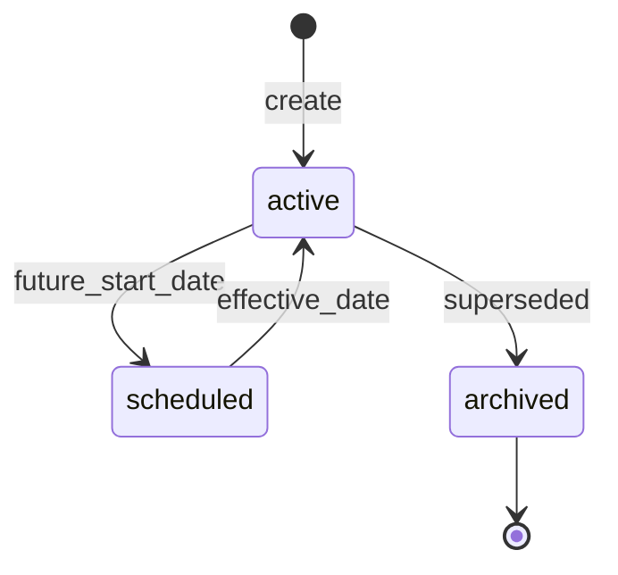

# Module: Taxes and Compliance

**Document ID:** SCP-COM-005-09  
**Version:** 1.0.0  
**Status:** ✅ Active  
**Traceability:** FR-021, NFR-083, NFR-085

---

## Document Control

| Field | Value |
|-------|-------|
| Bounded Context | Tax |
| Aggregate Root | `TaxConfiguration` (per store) |
| Owner Module | `commerce.tax` |

---

## Purpose

Calculate applicable sales taxes and VAT for Nigeria (VAT 7.5% on vatable goods), Kenya VAT, and configurable tax zones for merchant expansion — with audit-ready tax line snapshots on orders.

## Scope

- Tax registration settings per store
- Tax rates by country/state/product type
- Tax-inclusive vs exclusive display
- Tax line computation at checkout
- Tax reports for merchant filing

## Out of Scope

- Withholding tax on marketplace payouts (Volume 8)
- Automated FIRS e-invoicing integration (Phase 2 Nigeria)
- Professional tax advice

## User Personas

Merchant Owner, Finance Staff, Customer (sees tax breakdown at checkout).

## Business Capabilities

1. Configure Nigeria VAT 7.5% default for vatable products
2. Mark products/variants as taxable or exempt
3. Compute tax at checkout based on shipping address
4. Store tax breakdown per order line (immutable)
5. Export tax summary by period

---

## Entities and Value Objects

### Entities

| Entity | Key Fields |
|--------|------------|
| **TaxConfiguration** | `id`, `tenant_id`, `store_id`, `prices_include_tax`, `tax_registration_number`, `country`, `region` |
| **TaxZone** | `id`, `store_id`, `name`, `country`, `states[]`, `priority` |
| **TaxRate** | `id`, `tax_zone_id`, `name`, `rate_bps`, `applies_to` (`all`, `physical`, `digital`), `is_compound` |
| **OrderTaxLine** | `id`, `order_id`, `title`, `rate_bps`, `amount_cents` |

`rate_bps`: basis points (750 = 7.5%)

### Value Objects

| Value Object | Notes |
|--------------|-------|
| **TaxAmount** | Integer cents, rounded half-up per line |
| **VatRegistration** | Nigerian TIN format validation (basic) |

---

## Aggregate Roots

**TaxConfiguration Aggregate** — store tax settings + zones + rates. Order tax lines owned by Order aggregate but computed by Tax service.

---

## Business Rules

| ID | Rule |
|----|------|
| BR-TAX-001 | Nigeria default: 7.5% VAT on taxable physical goods shipped to Nigeria |
| BR-TAX-002 | Digital services to Nigerian consumers: VAT applicable per merchant configuration |
| BR-TAX-003 | Tax-exempt products pass `taxable=false` on variant |
| BR-TAX-004 | Tax computed on discounted line amount (after promotions) |
| BR-TAX-005 | Shipping may be taxable per zone configuration (Nigeria: configurable, default taxable) |
| BR-TAX-006 | Prices include tax: display gross; store net in reports |
| BR-TAX-007 | Kenya VAT 16% preset available for KE stores |
| BR-TAX-008 | Tax snapshot on order immutable after payment |
| BR-TAX-009 | Merchant responsible for registration; SCP collects TIN field only |
| BR-TAX-010 | Zero-rate export: shipping address outside Nigeria → 0% NG VAT if merchant enables export mode |

---

## State Machines

Tax rates do not use complex lifecycle. **TaxRate status:**



---

## API Contracts

**Admin:** `/api/v1/stores/{store_id}/tax`

| Method | Path | Description |
|--------|------|-------------|
| GET | `/settings` | Tax configuration |
| PUT | `/settings` | Update configuration |
| GET | `/zones` | List zones |
| POST | `/zones` | Create zone |
| POST | `/zones/{id}/rates` | Add rate |
| POST | `/calculate` | Preview tax for cart/checkout |
| GET | `/reports/summary` | Period tax summary |

**Calculate request:**

```json
{
  "lines": [{"variant_id": "uuid", "quantity": 2, "unit_price_cents": 1000000, "taxable": true}],
  "shipping_cents": 50000,
  "shipping_address": {"country": "NG", "state": "LA"}
}
```

---

## Domain Events

| Event | Subscribers |
|-------|-------------|
| `TaxConfigurationUpdated` | Checkout recalc |
| `TaxRateActivated` | Checkout, Reports |
| `OrderTaxComputed` | Orders (internal), Analytics |

---

## Background Jobs

| Job | Purpose |
|-----|---------|
| `TaxReportGenerateJob` | Monthly CSV/PDF for merchant |
| `ScheduledTaxRateActivationJob` | Activate future rates at midnight store TZ |

---

## Permissions and Authorization

- `tax:configure` — Owner
- `tax:read` — Finance staff

## Tenant Isolation

RLS on tax tables; tax calc requires store context.

## Security Threat Model

- Tax underreport via API tampering: server-side calc only; client display ignored

## Performance Requirements

- Tax calculate p95 ≤ 50ms for 50 lines

## Caching Strategy

- Active rates cached per store 5 min; invalidate on TaxRateActivated

## Observability

- Metrics: `tax.calculate.duration`, `tax.exempt.lines`

## AI Opportunities

- Classify product tax category from description (merchant review required)

## Extension Points

- Tax provider plugin (Avalara Phase 3 global)

## Testing Strategy

- Nigeria VAT 7.5% rounding edge cases (kobo)
- Tax-inclusive price back-calculation

## Failure Modes

- Missing zone for address: default 0% with warning in admin

---

## Acceptance Criteria

1. Lagos shipping address applies 7.5% VAT to taxable lines correctly.
2. Exempt variant produces zero tax line.
3. Order stores tax breakdown matching checkout preview to the kobo.
4. Kenya store preset applies 16% when configured.
5. Tax report export matches sum of order tax lines for period.
6. Cross-tenant tax settings inaccessible.

---

## ADRs

None specific.

## Sources

- Nigeria VAT Act (awareness — legal review for rates)
- Volume 11 Africa regulatory compliance
- FIRS VAT 7.5% (E2 — verify with merchant accountant)
