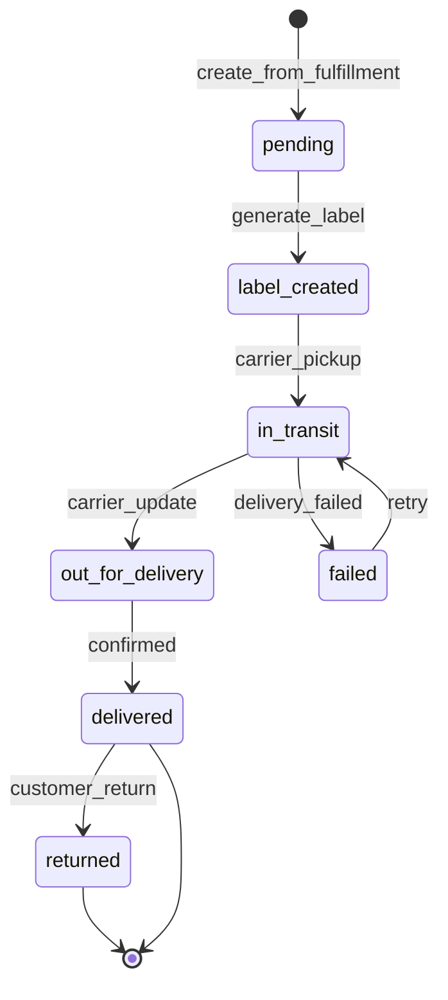

# Module: Shipping and Logistics

**Document ID:** SCP-COM-005-10  
**Version:** 1.0.0  
**Status:** ✅ Active  
**Traceability:** FR-020, NFR-003, NFR-012

---

## Document Control

| Field | Value |
|-------|-------|
| Bounded Context | Shipping |
| Aggregate Root | `Shipment` |
| Owner Module | `commerce.shipping` |

---

## Purpose

Define shipping zones, rates, and carrier integrations for Nigerian last-mile (GIG, Kwik, manual) and Kenya regional delivery, produce shipments from fulfilled orders, and track delivery status.

## Scope

- Shipping zones (geo-based)
- Flat-rate, weight-based, price-based shipping rules
- Pickup points and local delivery
- Shipment creation, tracking numbers, status updates
- Checkout shipping method selection

## Out of Scope

- Real-time carrier API rating for all carriers Phase 1 (manual rates + GIG API Phase 1.5)
- Customs/duty for cross-border (Phase 3)
- Fleet management

## User Personas

Merchant Owner, Warehouse Staff, Customer, Courier integration.

## Business Capabilities

1. Define Nigeria zones: Lagos, South-West, Other Nigeria, International
2. Set rates by weight tier in NGN
3. Offer pickup at store location
4. Generate shipment on fulfillment with tracking
5. Send tracking link via notification

---

## Entities and Value Objects

### Entities

| Entity | Key Fields |
|--------|------------|
| **ShippingZone** | `id`, `tenant_id`, `store_id`, `name`, `countries[]`, `states[]`, `postal_patterns[]` |
| **ShippingRate** | `id`, `zone_id`, `name`, `type` (`flat`, `weight`, `price`), `rules_json`, `min_days`, `max_days`, `carrier_code?` |
| **ShippingMethod** | Checkout-facing selection mapped to rate |
| **Shipment** | `id`, `tenant_id`, `order_id`, `status`, `carrier`, `tracking_number`, `tracking_url`, `weight_grams`, `lines[]`, `shipped_at`, `delivered_at` |
| **ShipmentLine** | `shipment_id`, `order_item_id`, `quantity` |

### Value Objects

| Value Object | Values |
|--------------|--------|
| **ShipmentStatus** | `pending`, `label_created`, `in_transit`, `out_for_delivery`, `delivered`, `failed`, `returned` |
| **CarrierCode** | `manual`, `gig`, `kwik`, `dhl`, `fedex` |

---

## Aggregate Roots

**Shipment Aggregate** — shipment + lines + tracking events.

**ShippingZone Aggregate** — zones + rates for configuration.

---

## Business Rules

| ID | Rule |
|----|------|
| BR-SHP-001 | Checkout must select shipping for physical-only orders |
| BR-SHP-002 | Digital-only orders skip shipping (₦0 method hidden) |
| BR-SHP-003 | Rate calculated from cart weight sum + destination zone |
| BR-SHP-004 | Free shipping threshold configurable per zone (e.g., orders > ₦50,000) |
| BR-SHP-005 | Lagos same-day premium rate optional flat fee |
| BR-SHP-006 | Tracking URL required when tracking_number set |
| BR-SHP-007 | Partial shipments supported; multiple shipments per order |
| BR-SHP-008 | Delivered status triggers OrderDelivered event |
| BR-SHP-009 | Kenya stores: Nairobi vs upcountry zones preset |
| BR-SHP-010 | M-Pesa orders use same shipping rules as card (payment agnostic) |

---

## State Machines

---

## API Contracts

**Admin:** `/api/v1/stores/{store_id}/shipping`

| Method | Path | Description |
|--------|------|-------------|
| GET/POST | `/zones` | Manage zones |
| GET/POST | `/zones/{id}/rates` | Manage rates |
| GET | `/shipments` | List shipments |
| POST | `/orders/{order_id}/shipments` | Create shipment |
| PATCH | `/shipments/{id}` | Update tracking |
| POST | `/shipments/{id}/delivered` | Mark delivered |

**Checkout:** `GET /storefront/v1/checkout/shipping-rates?session_id=`  
**Storefront tracking:** `GET /storefront/v1/orders/{id}/shipments`

---

## Logistics Connectors (`Connectors/`)

| Connector | Region | Phase | Notes |
|-----------|--------|-------|-------|
| **GIG** | Nigeria | 1.5 | Lagos last-mile |
| **Kwik** | Nigeria | 1.5 | Same-day Lagos |
| **Sendy** | Kenya | 2 | East Africa |
| **ShipRocket** | India/Global merchants | 2 | Legacy platform parity; auto label + AWB |
| **DHL** | International | 2 | Express |
| **FedEx** | International | 3 | |
| **manual** | All | 1 | Merchant enters tracking |

**ShipRocket adapter** (`Connectors/ShipRocket/`): implements `ShippingCarrierAdapter` — create shipment, fetch label PDF, poll tracking. Used when merchant enables in **Settings → Shipping → Carriers**.

Checkout still uses `Platform/Shipping/` rate engine; connector called at fulfillment time unless real-time rating API enabled.

---

| Event | Subscribers |
|-------|-------------|
| `ShippingRateUpdated` | Checkout cache |
| `ShipmentCreated` | Notifications |
| `OrderShipped` | Orders, Webhooks |
| `OrderDelivered` | Orders, Analytics, Reviews |
| `ShipmentFailed` | Notifications, Admin alerts |

---

## Background Jobs

| Job | Purpose |
|-----|---------|
| `CarrierTrackingPollJob` | Poll integrated carriers every 4h |
| `DeliverySlaAlertJob` | Alert if shipment in_transit > max_days |
| `ShippingLabelGenerateJob` | Async label PDF to storage |

---

## Permissions and Authorization

- `shipping:configure` — Owner
- `shipping:fulfill` — Warehouse staff

## Tenant Isolation

RLS on zones, shipments; tracking public page uses signed token scoped to order.

## Security Threat Model

- Tracking token guessing: high-entropy token, rate limited

## Performance Requirements

- Shipping rate quote at checkout p95 ≤ 200ms

## Caching Strategy

- Zone/rate config cached 10 min per store

## Observability

- Metrics: `shipping.rates.calculated`, `shipping.delivery.days`

## AI Opportunities

- Delivery ETA prediction by Lagos traffic patterns

## Extension Points

- Carrier adapter interface (`CarrierAdapter::createLabel`, `track`)

## Testing Strategy

- Weight tier boundary tests
- Free shipping threshold

## Failure Modes

- No matching zone: checkout shows "contact for shipping quote" fallback if enabled

---

## Acceptance Criteria

1. Lagos address receives correct flat rate at checkout.
2. Order > free shipping threshold shows ₦0 shipping.
3. Fulfillment creates shipment; customer receives tracking email.
4. Mark delivered fires OrderDelivered event.
5. Digital-only order hides shipping step in checkout.
6. Partial fulfillment creates shipment with subset of lines.
7. Cross-tenant shipment ID returns 404.

---

## ADRs

None specific.

## Sources

- Nigerian e-commerce logistics patterns (E3)
- Volume 1 Shipment entity
