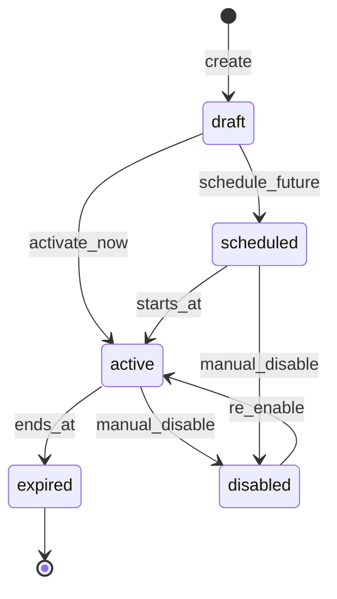
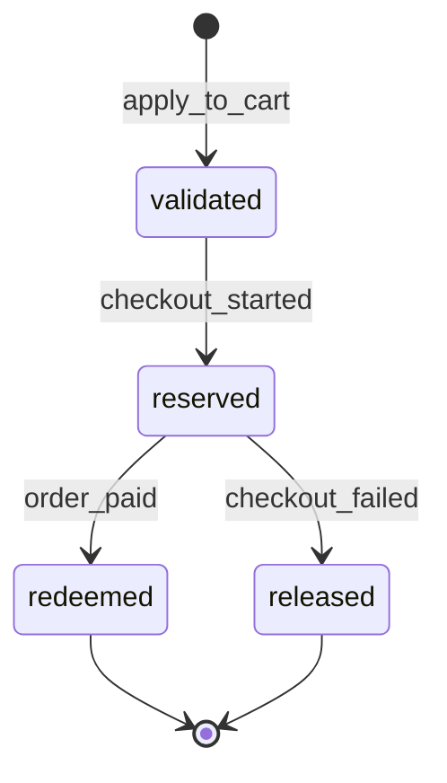

# Module: Promotions, Discounts, and Coupons

**Document ID:** SCP-COM-005-11  
**Version:** 1.0.0  
**Status:** ✅ Active  
**Traceability:** FR-021, NFR-040

---

## Document Control

| Field | Value |
|-------|-------|
| Bounded Context | Promotions |
| Aggregate Root | `Promotion`, `Coupon` |
| Owner Module | `commerce.promotions` |

---

## Purpose

Enable merchants to run discount campaigns via coupon codes and automatic promotions, applying rules at cart and checkout with auditable discount allocations per line.

## Scope

- Percentage and fixed amount discounts
- Buy X get Y, minimum purchase, first-order coupons
- Product/collection/customer eligibility
- Usage limits and scheduling
- Stack rules (one code per order Phase 1)

## Out of Scope

- Loyalty points (Phase 2)
- AI dynamic pricing
- Marketplace-funded promotions (Volume 8)

## User Personas

Merchant Marketer, Customer, System (cart recalc).

## Business Capabilities

1. Create coupon `LAGOS20` — 20% off, max ₦5,000 discount
2. Auto-apply "Free shipping over ₦30,000"
3. Limit to 100 redemptions or one per customer
4. Schedule Black Friday Nov 29–30
5. Report redemption counts and discounted revenue

---

## Entities and Value Objects

### Entities

| Entity | Key Fields |
|--------|------------|
| **Promotion** | `id`, `tenant_id`, `store_id`, `title`, `type`, `value`, `conditions_json`, `starts_at`, `ends_at`, `status`, `priority` |
| **Coupon** | `id`, `promotion_id`, `code`, `usage_limit`, `usage_count`, `once_per_customer` |
| **CouponRedemption** | `id`, `coupon_id`, `order_id`, `customer_id`, `discount_cents`, `redeemed_at` |
| **DiscountAllocation** | `order_item_id`, `discount_cents`, `promotion_id` |

### Value Objects

| Value Object | Values |
|--------------|--------|
| **DiscountType** | `percentage`, `fixed_amount`, `free_shipping` |
| **PromotionStatus** | `draft`, `scheduled`, `active`, `expired`, `disabled` |

---

## Aggregate Roots

**Coupon Aggregate** — coupon code + redemption tracking.  
**Promotion Aggregate** — rules and automatic application.

---

## Business Rules

| ID | Rule |
|----|------|
| BR-PRM-001 | One coupon code per cart/checkout Phase 1 |
| BR-PRM-002 | Coupon codes case-insensitive, unique per store |
| BR-PRM-003 | Percentage discounts capped by `max_discount_cents` if set |
| BR-PRM-004 | Fixed amount cannot exceed line subtotal |
| BR-PRM-005 | `once_per_customer` enforced by customer_id or email hash |
| BR-PRM-006 | Expired coupon returns clear error at apply |
| BR-PRM-007 | Automatic promotions apply highest priority eligible rule |
| BR-PRM-008 | Discount allocation stored on order lines at payment |
| BR-PRM-009 | Refund recalculates proportional discount (Ch.12) |
| BR-PRM-010 | Minimum purchase evaluated on subtotal after other discounts |

---

## State Machines

### Promotion

### Coupon Redemption (logical)

---

## API Contracts

**Admin:** `/api/v1/stores/{store_id}/promotions`

| Method | Path | Description |
|--------|------|-------------|
| GET/POST | `/promotions` | CRUD promotions |
| GET/POST | `/coupons` | CRUD coupons |
| POST | `/validate` | Validate code against cart snapshot |
| GET | `/reports/redemptions` | Redemption report |

**Internal:** `/internal/promotions/apply` — called by Cart service

---

## Domain Events

| Event | Subscribers |
|-------|-------------|
| `PromotionActivated` | Cache, Webhooks |
| `CouponApplied` | Analytics |
| `CouponRedeemed` | Analytics, Reports |
| `PromotionExpired` | Cache |

---

## Background Jobs

| Job | Purpose |
|-----|---------|
| `PromotionScheduleJob` | Activate/expire on datetime |
| `CouponUsageReconcileJob` | Fix drift vs paid orders |

---

## Permissions and Authorization

- `promotions:write` — Marketing role, Owner
- `promotions:read` — Staff

## Tenant Isolation

RLS; coupon codes unique per store only.

## Security Threat Model

- Coupon brute force: rate limit; no enumeration of valid codes via timing

## Performance Requirements

- Validate coupon p95 ≤ 80ms

## Caching Strategy

- Active promotions list cached 60s per store

## Observability

- Metrics: `promotions.redemptions`, `promotions.discount_amount`

## AI Opportunities

- Suggest promotion rules from slow-moving inventory

## Extension Points

- Stackable promotions Phase 2 via `stack_group`

## Testing Strategy

- Usage limit exhaustion
- once_per_customer with guest email

## Failure Modes

- Promotion service timeout: cart proceeds without auto promotions

---

## Acceptance Criteria

1. 20% coupon applies correctly with max cap on ₦100,000 cart.
2. Expired coupon rejected with message `COUPON_EXPIRED`.
3. Third redemption blocked when usage_limit=2.
4. Order paid increments usage_count exactly once (idempotent).
5. Automatic free shipping applies when threshold met.
6. Cross-tenant coupon validation fails closed.

---

## ADRs

None.

## Sources

- Volume 1 Coupon entity
