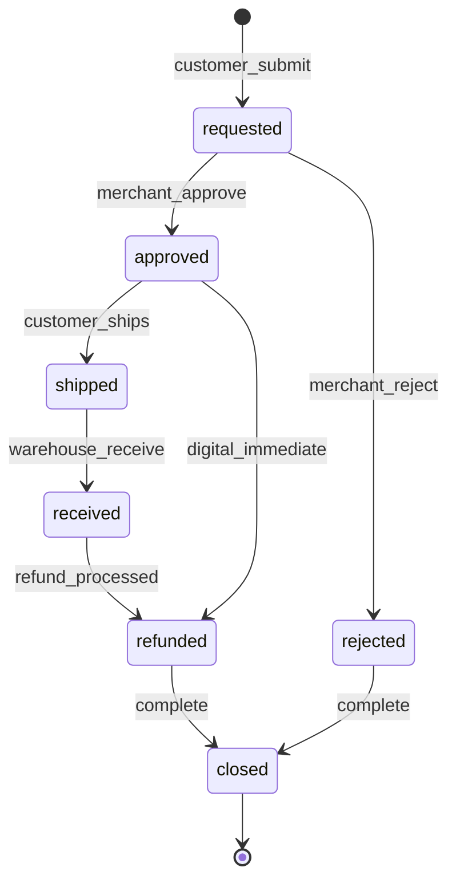
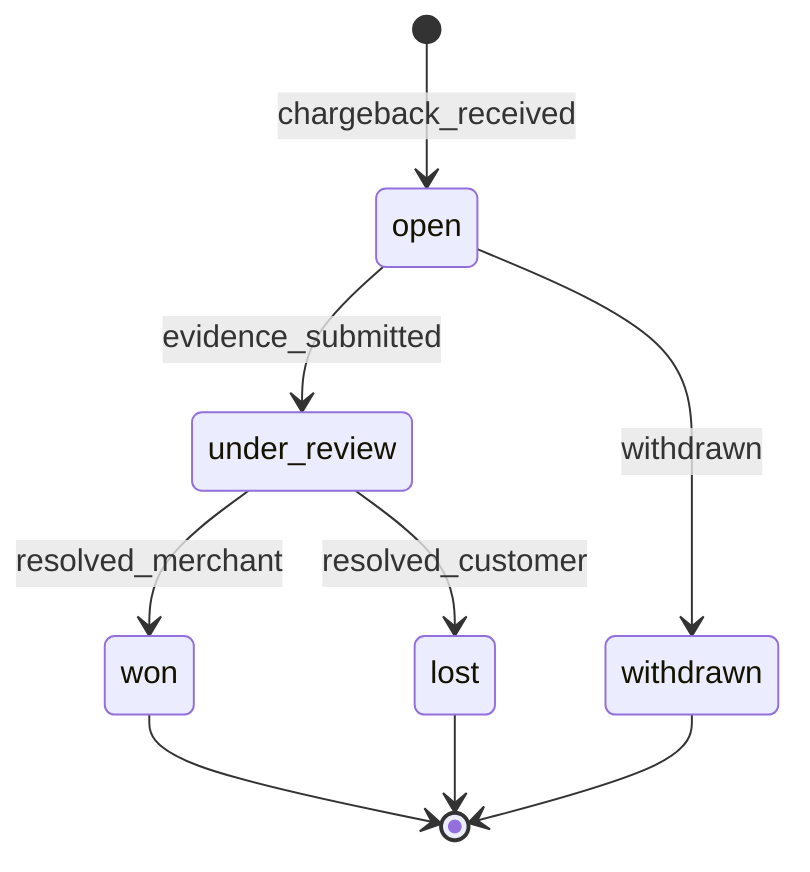

# Module: Returns, Refunds, and Disputes

**Document ID:** SCP-COM-005-12  
**Version:** 1.0.0  
**Status:** ✅ Active  
**Traceability:** FR-021, NFR-075, NFR-083

---

## Document Control

| Field | Value |
|-------|-------|
| Bounded Context | Returns / Post-Purchase |
| Aggregate Roots | `ReturnRequest`, `Refund` (with Payments) |
| Owner Module | `commerce.returns` |

---

## Purpose

Manage customer return requests, merchant approval workflows, inventory restocking, payment refunds via PSP APIs, and dispute records for chargebacks and marketplace mediation.

## Scope

- Return request creation (customer or admin)
- RMA approval, rejection, restock
- Full and partial refunds through Paystack/Flutterwave/M-Pesa reversal APIs
- Dispute case tracking (marketplace extends Volume 8)
- Return shipping labels (manual Phase 1)

## Out of Scope

- Legal arbitration
- Automated chargeback representment (Phase 2)

## User Personas

Customer, Merchant Staff, Finance, Vendor (marketplace returns).

## Business Capabilities

1. Customer requests return within merchant return window (default 14 days)
2. Merchant approves → customer ships back → restock on receive
3. Refund to original payment method
4. Partial refund for damaged partial quantity
5. Dispute log for PSP chargeback notifications

---

## Entities and Value Objects

### Entities

| Entity | Key Fields |
|--------|------------|
| **ReturnRequest** | `id`, `tenant_id`, `store_id`, `order_id`, `customer_id`, `status`, `reason`, `notes`, `requested_at`, `resolved_at` |
| **ReturnLine** | `id`, `return_request_id`, `order_item_id`, `quantity`, `condition`, `restock` |
| **Dispute** | `id`, `order_id`, `payment_id`, `type`, `status`, `provider_case_id`, `amount_cents`, `evidence[]`, `due_at` |
| **Refund** | (Payments Ch.08) linked to return |

### Value Objects

| Value Object | Values |
|--------------|--------|
| **ReturnStatus** | `requested`, `approved`, `rejected`, `shipped`, `received`, `refunded`, `closed` |
| **ReturnReason** | `defective`, `wrong_item`, `not_as_described`, `changed_mind`, `other` |
| **DisputeStatus** | `open`, `under_review`, `won`, `lost`, `withdrawn` |

---

## Aggregate Roots

**ReturnRequest Aggregate** — return + lines + status workflow.  
Refunds initiated through Payment aggregate API.

---

## Business Rules

| ID | Rule |
|----|------|
| BR-RET-001 | Return window default 14 days from delivery; merchant configurable 7–30 |
| BR-RET-002 | Digital products: return only if not downloaded (Ch.14) |
| BR-RET-003 | Approved return triggers refund only after receive (or immediate for digital) |
| BR-RET-004 | Refund amount ≤ line paid amount minus prior partial refunds |
| BR-RET-005 | Restock increments inventory if `restock=true` and condition good |
| BR-RET-006 | PSP refund uses original transaction reference |
| BR-RET-007 | M-Pesa reversals within 24h window per Safaricom rules; else manual |
| BR-RET-008 | Rejected return requires merchant reason visible to customer |
| BR-RET-009 | Dispute freezes auto-refund until case closed |
| BR-RET-010 | All refund actions audit logged (NFR-075) |

---

## State Machines

### Return Request

### Dispute

---

## API Contracts

**Customer:** `/storefront/v1/orders/{order_id}/returns`  
**Admin:** `/api/v1/stores/{store_id}/returns`

| Method | Path | Description |
|--------|------|-------------|
| POST | `/returns` | Create return request |
| GET | `/returns/{id}` | Detail |
| POST | `/returns/{id}/approve` | Approve |
| POST | `/returns/{id}/reject` | Reject |
| POST | `/returns/{id}/receive` | Mark received + restock |
| POST | `/returns/{id}/refund` | Trigger refund |
| GET/POST | `/disputes` | List/create dispute cases |

---

## Domain Events

| Event | Subscribers |
|-------|-------------|
| `ReturnRequested` | Notifications, Admin |
| `ReturnApproved` | Notifications |
| `ReturnReceived` | Inventory |
| `RefundIssued` | Payments, Orders, Webhooks |
| `DisputeOpened` | Finance alerts, Volume 8 |
| `DisputeResolved` | Analytics |

---

## Background Jobs

| Job | Purpose |
|-----|---------|
| `RefundProcessJob` | Async PSP refund with retry |
| `ReturnWindowExpireJob` | Close ineligible pending requests |
| `DisputeDeadlineAlertJob` | Alert 48h before evidence due |

---

## Permissions and Authorization

- Customer: create return for own orders
- `returns:manage` — Staff
- `returns:refund` — Owner, Finance

## Tenant Isolation

RLS on returns and disputes; customer scoped to own orders.

## Security Threat Model

- Refund fraud: return quantity ≤ order line quantity; payment ownership verified

## Performance Requirements

- Refund initiation p95 ≤ 500ms (async completion)

## Caching Strategy

Not applicable.

## Observability

- Metrics: `returns.requested`, `refunds.amount`, `disputes.open`

## AI Opportunities

- Return reason categorization for quality feedback

## Extension Points

- Marketplace dispute mediation (Volume 8)
- **Returns messaging** (§ Returns Thread below)

---

## Returns Thread (Merchant ↔ Customer)

**Extension:** `Modules/Extensions/ReturnsMessaging/` or embedded in Returns context.

Legacy refund-module chat — SCP adds threaded messages on `ReturnRequest`:

| Entity | Fields |
|--------|--------|
| **ReturnMessage** | `return_request_id`, `author_type` (customer/merchant/system), `body`, `attachments[]`, `created_at` |

**Rules:**

- Customer notified on merchant reply (email + optional SMS)
- Merchant notified on customer reply
- No external email content in thread — kept in platform for NDPA audit
- Attachments: images only, max 5MB, virus scan

**UI:** Customer portal return detail + merchant admin return queue side panel.

---

## Testing Strategy

- Partial refund math with promotions
- Idempotent refund job

## Failure Modes

- PSP refund failure: retry 3x; manual queue for finance

---

## Acceptance Criteria

1. Customer return within 14 days of delivery creates requested status.
2. Merchant approve → customer notified with return instructions.
3. Receive with restock=true increases inventory available count.
4. Paystack partial refund succeeds; order financial_status = partially_refunded.
5. Return after window rejected automatically.
6. Dispute open blocks duplicate refund on same lines.
7. Audit log contains refund actor and timestamp.

---

## ADRs

- ADR-004 (refunds via PSP APIs, no card storage)

## Sources

- Paystack Refund API
- Flutterwave Refund API
- Volume 1 Dispute entity (marketplace)
