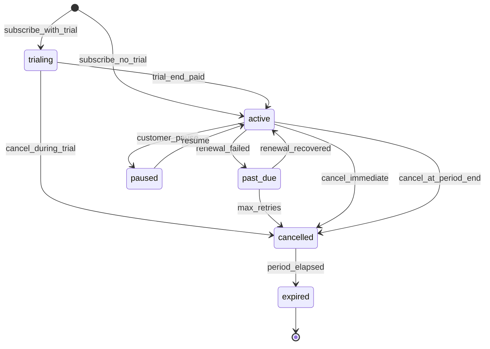
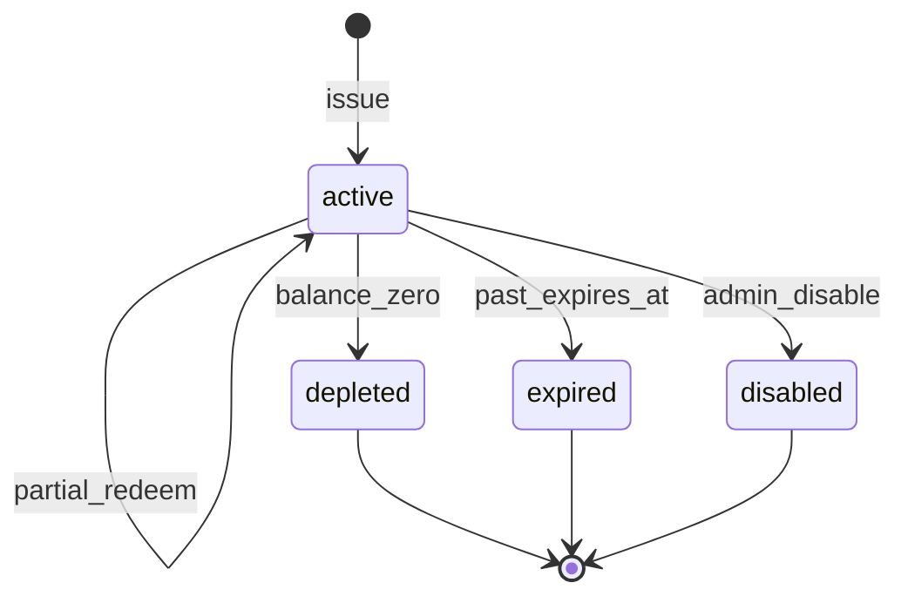

# Module: Subscriptions and Gift Cards

**Document ID:** SCP-COM-005-13  
**Version:** 1.0.0  
**Status:** ✅ Active  
**Traceability:** FR-021, NFR-044, ADR-004

---

## Document Control

| Field | Value |
|-------|-------|
| Bounded Context | Recurring Commerce / Stored Value |
| Aggregate Roots | `Subscription`, `GiftCard` |
| Owner Module | `commerce.subscriptions`, `commerce.gift_cards` |

---

## Purpose

Support recurring billing for subscription products (SaaS-style merchant offerings, membership boxes) and stored-value gift cards popular in Nigerian retail — using PSP redirect for initial and renewal charges per ADR-004.

## Scope

- Subscription plans linked to product variants
- Billing cycles: weekly, monthly, annual
- Subscription lifecycle: trial, active, paused, cancelled
- Gift card issuance, redemption, balance tracking
- Renewal payment via Paystack subscription API or manual invoice Phase 1

## Out of Scope

- SCP platform billing (tenant plans — Volume 7/SaaS)
- Complex usage-based metering (Phase 3)
- Gift card secondary marketplace

## User Personas

Merchant Owner, Subscriber Customer, Gift purchaser/recipient.

## Business Capabilities

1. Mark variant as subscription with interval and trial days
2. Customer subscribes at checkout; initial payment via redirect
3. Auto-renew with PSP authorization (Paystack subscription code)
4. Issue digital gift card with unique code and balance
5. Redeem gift card at checkout (partial or full payment)

---

## Entities and Value Objects

### Entities

| Entity | Key Fields |
|--------|------------|
| **SubscriptionPlan** | `id`, `variant_id`, `interval`, `interval_count`, `trial_days`, `renewal_price_cents` |
| **Subscription** | `id`, `tenant_id`, `store_id`, `customer_id`, `plan_id`, `status`, `current_period_start`, `current_period_end`, `psp_subscription_code`, `cancel_at_period_end`, `cancelled_at` |
| **SubscriptionInvoice** | `id`, `subscription_id`, `amount_cents`, `status`, `payment_id?`, `due_at`, `paid_at` |
| **GiftCard** | `id`, `tenant_id`, `store_id`, `code`, `initial_balance_cents`, `balance_cents`, `currency`, `status`, `expires_at`, `purchaser_email`, `recipient_email?` |
| **GiftCardTransaction** | `id`, `gift_card_id`, `order_id?`, `delta_cents`, `type`, `created_at` |

### Value Objects

| Value Object | Values |
|--------------|--------|
| **SubscriptionStatus** | `trialing`, `active`, `past_due`, `paused`, `cancelled`, `expired` |
| **BillingInterval** | `week`, `month`, `year` |
| **GiftCardStatus** | `active`, `depleted`, `expired`, `disabled` |

---

## Aggregate Roots

**Subscription Aggregate** — subscription + invoices + renewal state.  
**GiftCard Aggregate** — gift card + transaction ledger (balance = sum of transactions).

**Invariants:**

1. Gift card balance never negative
2. Subscription renewal amount matches plan unless grandfathered price flag set
3. One active subscription per customer per plan variant (configurable)

---

## Business Rules

| ID | Rule |
|----|------|
| BR-SUB-001 | Initial subscription charge uses same redirect checkout flow |
| BR-SUB-002 | Paystack Subscriptions API preferred for NGN renewals |
| BR-SUB-003 | Failed renewal → `past_due`; retry 3 times over 7 days |
| BR-SUB-004 | Cancel at period end: status active until `current_period_end` |
| BR-SUB-005 | Pause max 90 days; no delivery during pause |
| BR-SUB-006 | Gift card codes 16-char alphanumeric, unique per store |
| BR-SUB-007 | Gift card partial redemption allowed; remainder stays on card |
| BR-SUB-008 | Gift card + coupon: gift card applied after coupon (Phase 1 order) |
| BR-SUB-009 | Gift card purchase is standard order producing digital delivery |
| BR-SUB-010 | Expired gift cards reject redemption with clear error |

---

## State Machines

### Subscription

### Gift Card

---

## API Contracts

**Admin:** `/api/v1/stores/{store_id}/subscriptions`, `/gift-cards`

| Method | Path | Description |
|--------|------|-------------|
| POST | `/subscriptions/plans` | Attach plan to variant |
| GET | `/subscriptions` | List subscriptions |
| POST | `/subscriptions/{id}/cancel` | Cancel |
| POST | `/subscriptions/{id}/pause` | Pause |
| POST | `/gift-cards` | Issue card |
| GET | `/gift-cards/{code}` | Lookup balance (admin) |
| POST | `/gift-cards/{id}/disable` | Disable |

**Storefront:**  
- `POST /storefront/v1/subscriptions/subscribe` — creates checkout session  
- `POST /storefront/v1/checkout/gift-card` — apply gift card balance

---

## Domain Events

| Event | Subscribers |
|-------|-------------|
| `SubscriptionCreated` | Notifications, Analytics |
| `SubscriptionRenewed` | Orders, Inventory (if box), Notifications |
| `SubscriptionCancelled` | Notifications, Analytics |
| `SubscriptionPaymentFailed` | Notifications, Dunning job |
| `GiftCardIssued` | Notifications, Digital delivery |
| `GiftCardRedeemed` | Orders, Analytics |

---

## Background Jobs

| Job | Schedule | Action |
|-----|----------|--------|
| `SubscriptionRenewalJob` | Daily | Bill due subscriptions |
| `SubscriptionDunningJob` | Daily | Retry failed payments |
| `GiftCardExpiryJob` | Daily | Mark expired cards |
| `SubscriptionPeriodRollJob` | Hourly | Advance billing periods on payment |

---

## Permissions and Authorization

- `subscriptions:manage` — Owner, Staff
- `gift_cards:issue` — Owner
- Customer: manage own subscriptions

## Tenant Isolation

RLS on subscriptions and gift cards; gift card codes unique per store.

## Security Threat Model

- Gift card code guessing: rate limit 5 attempts/hour/IP; lockout 24h
- Subscription webhook tampering: same HMAC rules as Payments

## Performance Requirements

- Gift card balance check p95 ≤ 50ms

## Caching Strategy

- Do not cache gift card balances publicly

## Observability

- Metrics: `subscriptions.active`, `subscriptions.churn`, `gift_cards.redeemed`

## AI Opportunities

- Churn prediction on past_due patterns

## Extension Points

- Dunning email templates
- Webhook: `subscriptions/renewed`

## Testing Strategy

- Renewal idempotency
- Partial gift card redemption at checkout

## Failure Modes

- PSP subscription API down: queue renewal, notify merchant

---

## Acceptance Criteria

1. Monthly subscription checkout creates active subscription after Paystack webhook.
2. Failed renewal moves to past_due; recovery payment restores active.
3. Cancel at period end remains active until period end date.
4. Gift card ₦10,000 redeems ₦3,000; balance ₦7,000 persists.
5. Depleted gift card rejected at checkout.
6. Gift card code brute force triggers rate limit.
7. Cross-tenant subscription data inaccessible.

---

## ADRs

- ADR-004 (renewals via PSP, no card on SCP)

## Sources

- Paystack Subscriptions: https://paystack.com/docs/payments/subscriptions/
- Volume 1 Billing context (platform vs commerce distinction)
